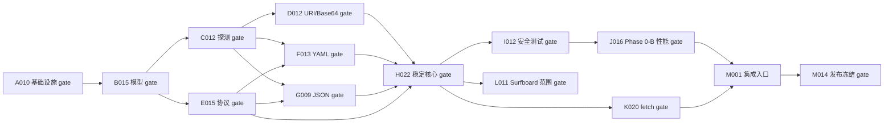

# NetHop 订阅解析库 TDD 任务清单

> 状态：Draft v0.1  
> 日期：2026-08-02  
> 适用范围：`nethop-subscription` Phase 0-A 至首个稳定版  
> 需求来源：[`01-performance-budget-and-slo.md`](./01-performance-budget-and-slo.md)、[`02-subscription-import-and-parser-design.md`](./02-subscription-import-and-parser-design.md)  
> 上位边界：[`00-nethop-system-design.md`](./00-nethop-system-design.md)

## 1. 文档目的

本文把订阅解析库设计拆成可独立验收的原子任务，并规定每个任务必须执行 Red -> Green -> Refactor。它是实现顺序和证据索引，不替代 `01` 的性能口径或 `02` 的安全、格式、协议与依赖决策。

清单遵循以下规则：

1. 一个复选框只代表一个可观察行为或一个验证 gate；不得在同一节点中顺带实现未列出的能力。
2. 每个节点显式声明 `depends_on`。只有依赖全部完成后才能开始；相同 `parallel_group` 且依赖已满足的节点允许并行。
3. 正文按拓扑顺序排列。相邻节点若不存在直接递进关系，必须属于同一并行组。
4. 功能节点必须先产生预期原因的 RED，再写最小 GREEN，最后只在全绿时 REFACTOR。
5. 工具链、manifest、CI 等无法用业务断言驱动的节点，先写会失败的 contract test、schema test 或构建检查，仍须保存 RED/GREEN 证据。
6. 测试一开始就通过时，不得记为 RED；应证明行为已经存在或修正无效测试。
7. 节点完成只表示该节点的完成条件成立，不自动提升格式、协议或设备的支持等级。

## 2. 格式调研结论

任务格式吸收以下公开资料：

- GitHub 官方 Markdown task list 使用独立 `- [ ]` 项追踪工作；复杂任务可转换为独立 issue。本文因此只让任务标题拥有复选框，RED/GREEN/REFACTOR 是该任务的执行证据，不创建第二层伪任务。
- Martin Fowler 对 TDD 的总结要求先列测试用例，再逐个执行 Red -> Green -> Refactor，并强调测试顺序应尽快驱动关键设计。本文按最小公共接口、稳定格式、危险边界、性能与扩展方言的顺序推进。
- Rust 官方把测试分为模块内 unit test 与只使用公共 API 的 `tests/` integration test。本文分别使用 `src/** #[cfg(test)]` 和 `tests/**`，共享 fixture helper 放在 `tests/common/mod.rs`，避免它被 Cargo 当作独立测试 target。
- Cargo 官方 `cargo test` 同时运行 unit、integration 和 doctest，并支持 `--locked`、feature 选择和指定 test target。本文的完成证据必须记录精确命令、退出码和关键输出。
- Rust Fuzz Book 推荐用 `cargo-fuzz` 驱动 libFuzzer。短时 fuzz 属于 Phase 0-B/CI smoke，长时 fuzz 属于发布或定时任务，不阻塞 Phase 0-A。

## 3. 节点字段与执行协议

每个任务节点使用以下字段：

| 字段 | 含义 |
|---|---|
| `depends_on` | 必须先完成的任务 ID；`none` 表示根任务 |
| `parallel_group` | 相同值表示依赖满足后可并行；`serial` 表示不可与相邻节点并行 |
| `scope` | 该节点唯一要交付的可观察行为 |
| `RED` | 首先添加的失败测试及预期失败原因 |
| `GREEN` | 仅让该测试和既有测试通过的最小实现 |
| `REFACTOR` | 在保持全绿时允许的整理边界 |
| `done` | 命令、报告或 artifact 等完成证据 |

统一执行协议：

```text
read spec and predecessor evidence
  -> add one failing behavior test
  -> run the narrowest command and confirm expected RED
  -> implement the minimum behavior
  -> rerun narrow test and confirm GREEN
  -> run affected regression set
  -> refactor only while GREEN
  -> rerun affected regression set
  -> record command, exit code, fixture digest and RED/GREEN summary
  -> mark exactly one checkbox complete
```

禁止用提交数量定义 TDD。项目不要求为 RED/GREEN/REFACTOR 分别创建 Git commit；证据写入测试报告即可，且本文不授权自动执行 `git commit`。

建议证据路径：

```text
artifacts/tdd/<task-id>/red.txt
artifacts/tdd/<task-id>/green.txt
artifacts/tdd/<task-id>/refactor.txt
artifacts/tdd/<task-id>/manifest.json
```

`manifest.json` 至少记录 task ID、需求章节、测试路径、命令、退出码、fixture SHA-256、Rust/Cargo 版本、feature set 和实现文件。不得记录订阅 URL、token、密码、UUID、Reality key 或原始节点行。

## 4. 需求追踪与阶段关系

| 需求域 | 设计来源 | 任务范围 |
|---|---|---|
| workspace、依赖与 profile | `02` 3.1-3.4 | A001-A010 |
| 公共模型、限制与诊断 | `02` 4、14、15、17 | B001-B015 |
| 规范化与格式探测 | `02` 6 | C001-C012 |
| URI/Base64 | `02` 9 | D001-D012 |
| 九协议与能力矩阵 | `02` 14.3-15 | E001-E015,N001-N006 |
| Clash/Mihomo YAML | `02` 10 | F001-F013 |
| sing-box JSON | `02` 11 | G001-G009 |
| fingerprint、去重、报告、compose | `02` 16-19 | H001-H022 |
| property/fuzz/资源攻击 | `02` 20-21 | I001-I012 |
| 300 ms、45/110 MiB、依赖预算 | `01` 13-14、17、21；`02` 20 | J001-J016 |
| URL fetch 与 SSRF | `02` 5 | K001-K020 |
| Android 兼容方言 | `02` 7.1、12、13 | L001-L011 |
| 版本、Android 集成与发布 | `02` 22-25；`01` 19、21 | M001-M014 |

阶段主链：



`K` 与 `L` 可以在 H022 后并行；`J` 只验证稳定核心，不等待 Surfboard 扩展。若首个 Alpha 不启用 fetch 或 Surfboard feature，可把对应节点记录为 `not_in_release_scope`，但不能伪造为功能已通过；M014 只对发布包实际启用的 feature 判 gate。

## 5. A - Workspace、测试骨架与依赖门禁

- [x] **A001 - 建立单 crate workspace 骨架**
  - `depends_on`: none；`parallel_group`: serial
  - `scope`: workspace 中存在可被 Cargo 识别的 `nethop-subscription` library crate。
  - `RED`: 添加检查 package name、edition、MSRV 和 library target 的 manifest test，确认因 crate 不存在失败。
  - `GREEN`: 创建最小 workspace、crate 和空 `lib.rs`，不添加 parser 业务实现。
  - `REFACTOR`: 只统一 workspace metadata，不拆分额外 crate。
  - `done`: `cargo metadata --format-version 1` 和 manifest test 通过。

- [x] **A002 - 冻结 workspace release profile**
  - `depends_on`: A001；`parallel_group`: A-bootstrap
  - `scope`: 根 manifest 精确使用 `opt-level=3`、Thin LTO、单 codegen unit、strip symbols、`incremental=false`，初始 panic 为 unwind。
  - `RED`: profile schema test 对缺失或错误字段失败。
  - `GREEN`: 仅写入 `02` 冻结的 release profile。
  - `REFACTOR`: 把 profile 校验集中到一个测试 helper，不复制字段常量。
  - `done`: profile test 输出规范化 profile SHA-256。

- [x] **A003 - 建立稳定核心 Cargo feature 图**
  - `depends_on`: A001；`parallel_group`: A-bootstrap
  - `scope`: 默认 feature 只包含 parser、URI/Base64、Clash YAML 和 sing-box JSON。
  - `RED`: feature graph test 证明默认构建缺少目标 feature 或出现 fetch/扩展泄漏。
  - `GREEN`: 按 `02` 3.1 声明最小 feature 边。
  - `REFACTOR`: 只合并重复 feature 边，不添加 dormant feature。
  - `done`: `cargo tree -e features` 中默认闭包无 fetch 和实验方言。

- [x] **A004 - 建立 fetch 与实验格式 feature 隔离**
  - `depends_on`: A001；`parallel_group`: A-bootstrap
  - `scope`: `fetch` 与 Surfboard 只能显式启用；Stash、Surge、Shadowrocket、Quantumult X 专用方言不进入 feature matrix。
  - `RED`: 分别构建纯 parser 和可选 feature，断言当前 feature 隔离失败。
  - `GREEN`: 声明可选依赖和 feature，不实现其业务行为。
  - `REFACTOR`: 保持一个 crate，不为每个格式建立 crate。
  - `done`: 三种冻结构建组合均可解析 feature，纯 parser 不含 `ureq/url`。

- [x] **A005 - 禁止 Base64 unsafe SIMD feature**
  - `depends_on`: A003；`parallel_group`: A-policy
  - `scope`: 任意发布 feature 组合都不能激活 `base64/simd-unsafe`，也不存在 `base64-simd` feature。
  - `RED`: 添加 feature-tree contract test，并用故意启用的 fixture manifest 证明它会失败。
  - `GREEN`: 删除或拒绝 unsafe SIMD feature 路径。
  - `REFACTOR`: 将禁止 feature 清单集中到供应链测试数据。
  - `done`: stable/fetch/experimental 三种 `cargo tree -e features` 断言通过。

- [x] **A006 - 建立 unit 与 integration 测试目录契约**
  - `depends_on`: A001；`parallel_group`: A-testinfra
  - `scope`: unit test 位于相邻模块，公共 API 测试位于 `tests/`，共享 helper 位于 `tests/common/mod.rs`。
  - `RED`: 测试布局检查因目录和最小 smoke test 缺失失败。
  - `GREEN`: 创建最小测试目录与一个从公共 API 编译的 smoke test。
  - `REFACTOR`: helper 不暴露生产 API，不创建空的 `tests/common.rs` target。
  - `done`: `cargo test --locked --no-run` 显示预期 test targets。

- [x] **A007 - 定义 TDD 证据 manifest schema**
  - `depends_on`: A006；`parallel_group`: A-testinfra
  - `scope`: 每个任务可以记录 RED/GREEN/REFACTOR 命令和脱敏结果。
  - `RED`: schema golden 对缺少 task ID、命令、退出码或 fixture digest 的样本失败。
  - `GREEN`: 实现测试侧 manifest 类型与 JSON schema/golden。
  - `REFACTOR`: 复用稳定时间、digest 和 toolchain 字段类型。
  - `done`: 合法/非法 manifest golden 全部通过，样本不含秘密字段。

- [x] **A008 - 建立 fixture manifest schema**
  - `depends_on`: A006；`parallel_group`: A-testinfra
  - `scope`: fixture 可记录格式、协议分布、seed、字节数、节点数、预期计数和 SHA-256。
  - `RED`: 缺字段、错误计数和 digest 不匹配样本失败。
  - `GREEN`: 实现测试专用 manifest reader 与验证器。
  - `REFACTOR`: manifest reader 不进入 release binary。
  - `done`: 固定 manifest round-trip golden 通过。

- [x] **A009 - 建立 CI 构建矩阵 contract**
  - `depends_on`: A003,A004,A005,A006；`parallel_group`: serial
  - `scope`: CI 至少覆盖 stable parser、experimental formats、fetch-enabled 三个冻结组合。
  - `RED`: CI schema test 因组合缺失或默认 feature 偷渡失败。
  - `GREEN`: 添加仅包含 build/test/tree 检查的矩阵定义。
  - `REFACTOR`: 复用 feature 字符串常量，避免工作流与脚本漂移。
  - `done`: 本地等价命令全部成功解析，CI 配置 lint 通过。

- [x] **A010 - 通过基础设施 gate**
  - `depends_on`: A002,A007,A008,A009；`parallel_group`: serial
  - `scope`: 证明后续每个行为都能独立运行测试并保存证据。
  - `RED`: gate 汇总器在任一构建组合、schema 或禁止 feature 缺失时失败。
  - `GREEN`: 仅连接既有检查，不添加业务实现。
  - `REFACTOR`: 汇总器只消费机器可读结果。
  - `done`: stable/fetch/experimental `--no-run`、证据 schema、fixture schema 和 feature gate 全绿。

### A 阶段实现证据

| 交付物 | 实现位置 | 验证结果 |
|---|---|---|
| 单 crate workspace | `Cargo.toml`、`crates/nethop-subscription/Cargo.toml` | `cargo metadata --locked --format-version 1` 通过；edition 2024、MSRV 1.86、library target 已锁定 |
| release profile | workspace `Cargo.toml` `[profile.release]` | `opt-level=3`、Thin LTO、单 codegen unit、strip symbols、无初始 `panic=abort` |
| 稳定/实验/fetch feature 图 | crate `Cargo.toml` | 默认闭包不含 fetch/实验方言；所有可选依赖显式 feature 绑定 |
| unsafe Base64 禁止门禁 | `tests/a_contracts.rs`、`cargo tree` | stable/fetch/experimental 组合均未激活 `base64-simd` 或 `simd-unsafe` |
| 测试骨架与 schema | `tests/smoke.rs`、`tests/a_contracts.rs`、`tests/common/mod.rs`、`tests/fixtures/` | 9 个基础契约测试和 1 个公共 API smoke test 全部通过 |
| CI 矩阵与本地 gate | `.github/workflows/subscription-parser.yml`、`scripts/a-gate.ps1` | stable、experimental、fetch 三组 `cargo test --locked` 全部通过 |
| 依赖冻结 | `Cargo.lock` | 已生成并由所有 gate 使用 `--locked` 校验 |

本次本地 gate 命令：

```text
powershell -NoProfile -ExecutionPolicy Bypass -File scripts/a-gate.ps1
```

结果：退出码 `0`。A001-A010 已完成；B001-B015 已完成；C001 及后续任务仍保持未开始状态。

## 6. B - 公共模型、资源限制与诊断

- [x] **B001 - 冻结 `ParserLimits` 默认值**
  - `depends_on`: A010；`parallel_group`: B-model
  - `scope`: 5 MiB body、10,000 nodes、16 KiB line、64 depth、64 KiB string 等限制由一个不可分散的类型提供。
  - `RED`: 默认值 golden 与 `02` 不一致时失败。
  - `GREEN`: 实现只读默认值与显式构造校验。
  - `REFACTOR`: 所有后续模块只依赖该类型，不复制数字。
  - `done`: unit test 和序列化 golden 通过。

- [x] **B002 - 定义有界 `ImportPayload`**
  - `depends_on`: A010；`parallel_group`: B-model
  - `scope`: payload 统一表达 QR raw text、file bytes、text 和 URL fetch bytes，载体不决定格式。
  - `RED`: 超限 bytes 和由 carrier 强制选择 parser 的测试失败。
  - `GREEN`: 实现 carrier metadata 与有界 bytes 构造器。
  - `REFACTOR`: 不把文件读取、二维码扫描或 HTTP 放进模型。
  - `done`: 四种 carrier 产生等价 payload content contract。

- [x] **B003 - 定义脱敏 source metadata**
  - `depends_on`: A010；`parallel_group`: B-model
  - `scope`: source 只暴露 `source_id`、origin kind 和 URL/content digest，不暴露原始 URL/token/path。
  - `RED`: Debug/Serialize 快照含 secret 时失败。
  - `GREEN`: 实现 digest-backed metadata 和自定义 redacted view。
  - `REFACTOR`: source digest 统一使用 SHA-256 helper。
  - `done`: snapshot 与 secret scanner 通过。

- [x] **B004 - 定义凭据专用 secret 类型**
  - `depends_on`: A010；`parallel_group`: B-model
  - `scope`: 密码、UUID/private key 原文不能通过 Debug、Display 或普通错误输出。
  - `RED`: 格式化和序列化泄露 canary secret 的测试失败。
  - `GREEN`: 实现最小 `SecretString`/credential wrapper 与受限访问接口。
  - `REFACTOR`: 仅在明确临时缓冲上使用 `zeroize`，不宣称清除所有副本。
  - `done`: Debug/Display/error/diagnostic 泄漏测试通过。

- [x] **B005 - 定义稳定 `DiagnosticCode` 枚举**
  - `depends_on`: A010；`parallel_group`: B-diagnostic
  - `scope`: `02` 17.2 的错误码具有稳定字符串表示和 unknown-code 兼容行为。
  - `RED`: 缺少必需 code、重复字符串或未知 code 解析崩溃的测试失败。
  - `GREEN`: 实现枚举与版本化 wire name。
  - `REFACTOR`: message 文本不进入 code 类型。
  - `done`: code list golden 和 backward-read test 通过。

- [x] **B006 - 定义有界 `SourceLocation`**
  - `depends_on`: A010；`parallel_group`: B-diagnostic
  - `scope`: 位置只保存 item index、1-based line/column 和有界字段路径。
  - `RED`: 0-based、超长 path 和原始行保存测试失败。
  - `GREEN`: 实现校验构造器。
  - `REFACTOR`: YAML/JSON/URI 共用位置类型。
  - `done`: boundary unit tests 通过。

- [x] **B007 - 定义脱敏 `NodeDiagnostic`**
  - `depends_on`: B003,B004,B005,B006；`parallel_group`: serial
  - `scope`: 诊断只包含 code、severity、位置和有界脱敏参数。
  - `RED`: URL、token、password、UUID、Reality key canary 出现在 JSON/Debug 时失败。
  - `GREEN`: 实现 allowlist 参数和 redacted serialization。
  - `REFACTOR`: 人类 message 留给 CLI/App，不存入核心诊断。
  - `done`: snapshot、secret scanner 和 size boundary 通过。

- [x] **B008 - 定义九协议枚举**
  - `depends_on`: A010；`parallel_group`: B-proxy-model
  - `scope`: 表达 VLESS、VMess、Shadowsocks、Trojan、Hysteria2、TUIC、AnyTLS、HTTP、SOCKS；URI scheme 仍是前七种。
  - `RED`: WireGuard/Naive/Mieru 被接受或未知值 panic 的测试失败。
  - `GREEN`: 实现白名单枚举和稳定 wire names。
  - `REFACTOR`: client dialect 不进入协议枚举。
  - `done`: whitelist/unsupported golden 通过。

- [x] **B009 - 定义 `Endpoint` 值对象**
  - `depends_on`: A010；`parallel_group`: B-proxy-model
  - `scope`: endpoint 校验 server 与 1..65535 port，不执行 DNS。
  - `RED`: 空 server、控制字符、0/65536 port 或隐式 DNS 测试失败。
  - `GREEN`: 实现纯值校验。
  - `REFACTOR`: IP literal 与 hostname 保持原始连接语义。
  - `done`: table-driven boundary tests 通过。

- [x] **B010 - 定义协议专用 credential enum**
  - `depends_on`: B004,B008；`parallel_group`: B-proxy-model
  - `scope`: 每种协议只能携带其允许的凭据形态。
  - `RED`: 协议与 credential 错配仍可构造的 compile/runtime test 失败。
  - `GREEN`: 实现专用 variants 和受控构造器。
  - `REFACTOR`: 不用字符串 map 承载凭据。
  - `done`: valid/invalid pairing tests 通过。

- [x] **B011 - 定义 TLS/Reality/uTLS 模型**
  - `depends_on`: B004；`parallel_group`: B-proxy-model
  - `scope`: TLS 身份、验证选项、ALPN、uTLS 和 Reality 字段有界且可组合校验。
  - `RED`: 控制字符、超长 ALPN、缺 Reality key 和非法组合测试失败。
  - `GREEN`: 实现 typed options，不决定具体协议是否支持。
  - `REFACTOR`: 安全警告通过 diagnostic code 表达。
  - `done`: model boundary tests 通过。

- [x] **B012 - 定义 transport 模型**
  - `depends_on`: A010；`parallel_group`: B-proxy-model
  - `scope`: tcp/ws/http/httpupgrade/grpc/quic 及有界 path/header/service name 使用专用类型。
  - `RED`: 未知 transport、header 控制字符和超长 path/service 测试失败。
  - `GREEN`: 实现最小 variants 与字段限制。
  - `REFACTOR`: adapter 不各自定义 transport 字符串。
  - `done`: transport model golden 通过。

- [x] **B013 - 定义不可伪造的 validated `ProxyNode`**
  - `depends_on`: B008,B009,B010,B011,B012；`parallel_group`: serial
  - `scope`: 只有语义校验器能构造可进入 compose 的 `ProxyNode`。
  - `RED`: integration compile-fail/runtime test 证明未校验 node 可进入 compose。
  - `GREEN`: 分离 `UnvalidatedNode` 与 validated `ProxyNode` 构造边界。
  - `REFACTOR`: 不暴露绕过 capability check 的 public constructor。
  - `done`: public API integration test 通过。

- [x] **B014 - 定义版本化 `CapabilityMatrix`**
  - `depends_on`: B008,B011,B012；`parallel_group`: serial
  - `scope`: matrix 记录 sing-box 1.13.15、build tags、协议、transport、TLS/Reality/uTLS/UDP/flow/plugin 状态与证据 ID。
  - `RED`: supported 项缺源码/check/connectivity evidence 或未知组合默认放行的测试失败。
  - `GREEN`: 实现 deny-by-default 查询接口和 fixture schema。
  - `REFACTOR`: adapter 只查询 matrix，不复制能力判断。
  - `done`: matrix golden 和 deny-default tests 通过。

- [x] **B015 - 通过公共模型 gate**
  - `depends_on`: B001,B002,B007,B013,B014；`parallel_group`: serial
  - `scope`: 公共模型能承载后续 parser，同时无法绕过限制、脱敏和能力矩阵。
  - `RED`: gate 在任一关键 constructor、secret snapshot 或 matrix test 缺失时失败。
  - `GREEN`: 仅汇总现有测试结果。
  - `REFACTOR`: gate 不访问私有实现细节。
  - `done`: model unit、public API integration、secret scan 和 capability golden 全绿。

### B 阶段实现证据

| 交付物 | 实现位置 | 验证结果 |
|---|---|---|
| 有界资源模型 | `src/limits.rs` | 默认 body 5 MiB、10,000 nodes、16 KiB line、64 depth、64 KiB string 等值冻结；越界构造被拒绝 |
| 载体与来源模型 | `src/payload.rs` | QR/file/text/HTTP 四种 origin 共用有界 `ImportPayload`；content/source URL 只保留 SHA-256 digest；原始 bytes 不进入 Debug |
| secret 与诊断 | `src/secret.rs`、`src/diagnostics.rs` | secret 的 Debug/Display/Serialize 脱敏；稳定 code、未知 code 前向兼容、1-based location 和参数 allowlist 已覆盖 |
| 协议与连接值对象 | `src/protocol.rs` | 九协议白名单、严格 UUID、endpoint、TLS/Reality/uTLS、transport、协议专用 credentials 已类型化；HTTP/SOCKS 认证和 options 不透传字符串对象 |
| validated node 边界 | `src/protocol.rs` | `ProxyNode` 字段私有，只能由 `ProxyNode::validate` 从 `UnvalidatedNode` 和能力矩阵构造 |
| 能力矩阵 | `src/capability.rs` | sing-box `1.13.15` 版本固定；supported 必须有 evidence；未列组合 deny-by-default |
| B 专项测试 | `tests/b_contracts.rs` | 15 个边界、脱敏、矩阵和 validated-node 测试全部通过 |

本次 B 阶段验证命令：

```text
cargo test --locked --test b_contracts
cargo test --locked
cargo clippy --locked --all-targets --all-features -- -D warnings
cargo build --locked --release
powershell -NoProfile -ExecutionPolicy Bypass -File scripts/a-gate.ps1
```

结果：全部退出码为 `0`。B001-B015 已完成；C001 及后续任务仍保持未开始状态。

## 7. C - 内容规范化与格式探测

- [x] **C001 - 拒绝超限原始 payload**
  - `depends_on`: B015；`parallel_group`: C-normalize
  - `scope`: 任何探测或解码前执行 5 MiB reader/body 上限。
  - `RED`: 5 MiB+1 输入进入 detector 的测试失败。
  - `GREEN`: 在公共入口增加单次有界检查。
  - `REFACTOR`: 所有 carrier 共用该入口。
  - `done`: 5 MiB-1/5 MiB/5 MiB+1 boundary tests 通过。

- [x] **C002 - 规范化 BOM 与换行但不改写凭据**
  - `depends_on`: B015；`parallel_group`: C-normalize
  - `scope`: 只处理允许的 UTF-8 BOM 和 CRLF/CR，保留其余 bytes。
  - `RED`: `+`、`/`、`%`、大小写或内部空白被改写的 canary test 失败。
  - `GREEN`: 实现最小 normalized view。
  - `REFACTOR`: 优先借用输入，避免第二份完整 body。
  - `done`: credential preservation golden 通过。

- [x] **C003 - 拒绝非法 UTF-8 与 NUL 控制输入**
  - `depends_on`: C001；`parallel_group`: C-normalize
  - `scope`: 文本格式在解析前对非法 UTF-8/NUL 给稳定诊断。
  - `RED`: 非法 bytes 被 lossy 转换或 panic 的测试失败。
  - `GREEN`: 实现严格验证和 bounded diagnostic。
  - `REFACTOR`: 二进制 reader 与文本 view 生命周期分离。
  - `done`: invalid UTF-8 corpus 通过。

- [x] **C004 - 实现显式 `expected_format` 证据**
  - `depends_on`: C002,C003；`parallel_group`: C-evidence
  - `scope`: 用户 hint 只提高候选优先级，不能绕过结构校验和安全限制。
  - `RED`: hint 把任意文本强制解析成功的测试失败。
  - `GREEN`: 实现显式 evidence source。
  - `REFACTOR`: hint 与 parser registry 解耦。
  - `done`: valid/mismatch hint integration tests 通过。

- [x] **C005 - 识别 JSON 强结构证据**
  - `depends_on`: C002,C003；`parallel_group`: C-evidence
  - `scope`: 首个有效 token 为 `{`/`[` 且结构符合候选时产生 JSON evidence。
  - `RED`: JSON 被误识别为 Base64/URI 的测试失败。
  - `GREEN`: 实现 bounded prefix evidence，不构建完整 DOM。
  - `REFACTOR`: 只返回证据，不解析节点。
  - `done`: JSON evidence table tests 通过。

- [x] **C006 - 识别 YAML 强结构证据**
  - `depends_on`: C002,C003；`parallel_group`: C-evidence
  - `scope`: `proxies` 等受支持顶层结构产生 YAML evidence，字符串偶然包含不算成功解析。
  - `RED`: 普通文本包含 `proxies:` 被错误接受的测试失败。
  - `GREEN`: 实现有界结构探测。
  - `REFACTOR`: YAML 错误定位留给 adapter。
  - `done`: YAML evidence golden 通过。

- [x] **C007 - 识别 URI 列表证据**
  - `depends_on`: C002,C003,B008；`parallel_group`: C-evidence
  - `scope`: 至少一个完整白名单 scheme 行才产生 URI evidence。
  - `RED`: 注释、URL query 或行中子串被误识别的测试失败。
  - `GREEN`: 实现 byte-prefix 行证据。
  - `REFACTOR`: 与真正 URI parser 共享 scheme 常量。
  - `done`: supported/unsupported/mixed evidence tests 通过。

- [x] **C008 - 识别 Base64 候选而不提前解码**
  - `depends_on`: C002,C003；`parallel_group`: C-evidence
  - `scope`: 只产生弱 Base64 evidence，并保留标准/URL-safe/缺 padding 信息。
  - `RED`: 任意 ASCII 文本被判为强 Base64 的测试失败。
  - `GREEN`: 实现字符集、长度和 padding 的有界检查。
  - `REFACTOR`: 不在 detector 重复分配 decoded buffer。
  - `done`: Base64 evidence property tests 通过。

- [x] **C009 - 对冲突强证据返回 `ambiguous_format`**
  - `depends_on`: C004,C005,C006,C007,C008；`parallel_group`: serial
  - `scope`: 多个不可消歧的强证据不靠固定顺序猜测。
  - `RED`: 冲突 fixture 静默选择首个 adapter 的测试失败。
  - `GREEN`: 实现 evidence 排序和 ambiguity 结果。
  - `REFACTOR`: 排序规则数据化并有 golden。
  - `done`: pairwise ambiguity matrix 通过。

- [x] **C010 - 结构化 JSON 失败时禁止回退 Base64**
  - `depends_on`: C005,C008,C009；`parallel_group`: C-no-fallback
  - `scope`: 已获得 JSON 强证据后返回 JSON 结构错误。
  - `RED`: malformed JSON 最终被 Base64/URI 接受的测试失败。
  - `GREEN`: 固化 strong-evidence terminal failure。
  - `REFACTOR`: 与 YAML 共用失败策略。
  - `done`: malformed JSON fallback regression 通过。

- [x] **C011 - 结构化 YAML 失败时禁止回退 Base64**
  - `depends_on`: C006,C008,C009；`parallel_group`: C-no-fallback
  - `scope`: 已获得 YAML 强证据后返回 YAML 诊断。
  - `RED`: malformed `proxies:` YAML 被其他 adapter 接受的测试失败。
  - `GREEN`: 复用 terminal failure 策略。
  - `REFACTOR`: 不吞掉 YAML 行列信息。
  - `done`: malformed YAML fallback regression 通过。

- [x] **C012 - 通过格式探测 gate**
  - `depends_on`: C001,C009,C010,C011；`parallel_group`: serial
  - `scope`: detector 对 carrier 无感、证据确定、有界且不危险回退。
  - `RED`: 全矩阵 gate 在任一 format evidence 或 fallback case 缺失时失败。
  - `GREEN`: 只汇总 detector integration tests。
  - `REFACTOR`: gate 使用公共 detect API。
  - `done`: detect golden、ambiguity、hint mismatch 和 malformed fallback 全绿。

### C 阶段实现证据

| 交付物 | 实现位置 | 验证结果 |
|---|---|---|
| 有界规范化视图 | `src/normalize.rs` | 5 MiB 边界、UTF-8/NUL 拒绝、单次 BOM/首尾视图和 CRLF/CR/LF 行迭代通过；不复制完整 body |
| 格式证据模型 | `src/detect.rs` | JSON、Clash YAML、Surfboard INI、白名单 URI 和弱 Base64 证据均有界；Base64 不提前解码 |
| hint 与失败策略 | `src/detect.rs`、`src/diagnostics.rs` | 显式 hint 只约束候选；强证据冲突返回 `ambiguous_format`；首个有效 `[Proxy]`/`[General]` section 不被 `[` JSON fast path 误杀，真正的 JSON/YAML 结构失败仍不回退其他格式 |
| 公共 carrier 入口 | `src/lib.rs` | `ImportPayload` 与 raw bytes 共用同一 normalize/detect API，载体不参与格式选择 |
| C 专项测试 | `tests/c_contracts.rs` | 14 个边界、证据、hint、歧义和终止失败测试全部通过 |

本次 C 阶段验证命令：

```text
cargo fmt --all -- --check
cargo test --locked --test c_contracts
cargo test --locked
cargo clippy --locked --all-targets --all-features -- -D warnings
cargo build --locked --release
powershell -NoProfile -ExecutionPolicy Bypass -File scripts/a-gate.ps1
```

结果：全部退出码为 `0`。C001-C012 已完成；D001-D012 已完成；E001 及后续任务仍保持未开始状态。

## 8. D - URI 与 Base64 容器

- [x] **D001 - 实现有界 URI 行切分**
  - `depends_on`: C012,B001；`parallel_group`: D-uri-core
  - `scope`: 按 CR/LF 切分并保留 1-based 行号，单行最大 16 KiB。
  - `RED`: 超长行、空行、末行无换行和混合换行 fixture 失败。
  - `GREEN`: 使用 byte slice 实现最小 line iterator。
  - `REFACTOR`: 不为每行预先分配 `String`。
  - `done`: boundary unit tests 与 allocation smoke 通过。

- [x] **D002 - 实现白名单 URI scheme 分发**
  - `depends_on`: D001,B008；`parallel_group`: D-uri-core
  - `scope`: 七协议 scheme 精确匹配并路由到协议 adapter。
  - `RED`: 大小写、前缀子串或未知 scheme 被错误路由的测试失败。
  - `GREEN`: 实现静态 byte scheme dispatch。
  - `REFACTOR`: detector 与 parser 共享 scheme registry。
  - `done`: scheme dispatch golden 通过。

- [x] **D003 - 实现严格单次 percent decode**
  - `depends_on`: D001；`parallel_group`: D-uri-core
  - `scope`: 字段级验证 `%HH`、UTF-8、NUL/控制字符并只解码一次。
  - `RED`: 畸形 `%`、双重编码和凭据被二次解码的测试失败。
  - `GREEN`: 包装 `percent-encoding` 实现严格入口。
  - `REFACTOR`: 协议 adapter 不能直接调用宽松 decode。
  - `done`: malformed/round-trip property tests 通过。

- [x] **D004 - 限制 URI query 参数数量**
  - `depends_on`: D001；`parallel_group`: D-uri-limits
  - `scope`: 单 URI query 参数最多 64 个，重复关键参数按协议策略诊断。
  - `RED`: 第 65 个参数仍被接受或重复凭据静默覆盖的测试失败。
  - `GREEN`: 实现有界 query iterator。
  - `REFACTOR`: 不引入完整 `url::Url`。
  - `done`: 63/64/65 与 duplicate-key tests 通过。

- [x] **D005 - 限制 URI fragment display name**
  - `depends_on`: D001；`parallel_group`: D-uri-limits
  - `scope`: fragment 只作为最长 256 bytes 的显示名，不影响 credential/fingerprint 字段。
  - `RED`: 超限 fragment 或不同 fragment 改变 canonical node 的测试失败。
  - `GREEN`: 实现有界 display fragment 提取。
  - `REFACTOR`: display 清洗与协议字段解析解耦。
  - `done`: boundary 与 metamorphic tests 通过。

- [x] **D006 - 解码标准 Base64 订阅**
  - `depends_on`: C012,B001；`parallel_group`: D-base64
  - `scope`: 支持标准 alphabet 的有/无 padding 输入。
  - `RED`: 合法 fixture 失败、非法字符被宽松接受或 unsafe feature 被启用的测试失败。
  - `GREEN`: 使用通用 safe engine 解码到有界缓冲。
  - `REFACTOR`: engine 配置集中且不可切换 SIMD。
  - `done`: standard Base64 golden 与 feature-tree test 通过。

- [x] **D007 - 解码 URL-safe Base64 订阅**
  - `depends_on`: C012,B001；`parallel_group`: D-base64
  - `scope`: 支持 URL-safe alphabet 的有/无 padding 输入且不篡改字符再猜测。
  - `RED`: `-`/`_` fixture 失败或混合 alphabet 被静默修复的测试失败。
  - `GREEN`: 按证据选择明确 engine。
  - `REFACTOR`: 标准与 URL-safe 共享有界 sink。
  - `done`: URL-safe golden 和 mixed-alphabet rejection 通过。

- [x] **D008 - 限制 Base64 解码输出**
  - `depends_on`: D006,D007；`parallel_group`: serial
  - `scope`: decoded bytes 最大 5 MiB，超限在继续扩容前失败。
  - `RED`: 小输入膨胀到 5 MiB+1 仍成功或发生大额额外分配的测试失败。
  - `GREEN`: 使用 checked decoded length 与有界 output buffer。
  - `REFACTOR`: 标准/URL-safe 共用上限逻辑。
  - `done`: 5 MiB-1/5 MiB/5 MiB+1 和 peak allocation tests 通过。

- [x] **D009 - 限制 Base64 重探测深度为 1**
  - `depends_on`: D008,C012；`parallel_group`: serial
  - `scope`: 原始输入最多解码一次，`Base64 -> Base64` 返回稳定诊断。
  - `RED`: 二层/多层 Base64 被递归接受或超时的测试失败。
  - `GREEN`: 在 payload context 保存 decode depth。
  - `REFACTOR`: detector 不自行递归。
  - `done`: depth 0/1/2 regression 通过。

- [x] **D010 - 限制 VMess URI 内嵌 JSON 大小**
  - `depends_on`: D008；`parallel_group`: D-uri-limits
  - `scope`: VMess 内嵌 JSON 最多 64 KiB，超限不进入 JSON parser。
  - `RED`: 64 KiB+1 payload 被解析或分配完整 DOM 的测试失败。
  - `GREEN`: 在协议解析前执行 decoded length gate。
  - `REFACTOR`: VMess 语义映射留给 E006。
  - `done`: 64 KiB boundary tests 通过。

- [x] **D011 - URI 列表支持逐节点部分成功**
  - `depends_on`: D002,D003,D004,D005；`parallel_group`: serial
  - `scope`: 单行失败产生一个诊断但不阻断其他合法行，全部失败才判 source failure candidate。
  - `RED`: 一条坏 URI 使整批失败或坏行被吞掉的测试失败。
  - `GREEN`: 返回有序 `Vec<UriNodeResult>`，其中成功项携带 `UriNodeCandidate`；URI 容器不伪造已验证 `ProxyNode`。
  - `REFACTOR`: source success 最终语义留给 H007。
  - `done`: mixed 90/10 fixture 计数和位置正确。

- [x] **D012 - 通过 URI/Base64 容器 gate**
  - `depends_on`: D009,D010,D011；`parallel_group`: serial
  - `scope`: URI/Base64 容器在不做协议语义猜测的前提下有界地产生节点候选。
  - `RED`: gate 对任一 alphabet、depth、line/query/fragment/inner JSON 边界缺失时失败。
  - `GREEN`: 汇总容器 integration tests。
  - `REFACTOR`: 只通过公共 adapter API 执行。
  - `done`: URI/Base64 golden、boundary 与部分成功测试全绿。

### D 阶段实现证据

| 交付物 | 实现位置 | 验证结果 |
|---|---|---|
| URI 容器候选 | `src/uri.rs` | 混合换行、1-based 原始行号、16 KiB 行限制、七协议 scheme 精确分发和 IPv4/hostname/括号 IPv6 endpoint 结构处理通过 |
| URI 字段边界 | `src/uri.rs` | percent decode 只执行一次；畸形 `%HH`、非法 UTF-8/控制字符、65 个 query、257-byte fragment 均被拒绝；重复 query key 显式可读 |
| Base64 容器 | `src/base64_container.rs` | 标准/URL-safe、有/无 padding 严格解码；混合 alphabet、输出超限和二层 Base64 被拒绝；分配前检查 decoded length |
| VMess 内层预算 | `src/uri.rs` | Base64 解码后的 VMess JSON 在进入 JSON parser 前执行 64 KiB 上限 |
| 部分成功模型 | `src/uri.rs` | 合法与非法 URI 按输入顺序返回，错误携带 item index 和原始行号；容器层不构造 validated `ProxyNode` |
| D 专项测试 | `tests/d_contracts.rs` | 12 个 URI/Base64 容器、边界、深度、部分成功和脱敏测试全部通过 |

本次 D 阶段验证命令：

```text
cargo fmt --all -- --check
cargo test --locked --test d_contracts
cargo test --locked
cargo test --locked --no-default-features --features parser
cargo clippy --locked --all-targets --all-features -- -D warnings
cargo build --locked --release
powershell -NoProfile -ExecutionPolicy Bypass -File scripts/a-gate.ps1
```

结果：全部退出码为 `0`。D001-D012 已完成；E001 及后续任务仍保持未开始状态。

## 9. E - 九协议语义与能力矩阵

- [x] **E001 - 校验 endpoint 公共语义**
  - `depends_on`: B015；`parallel_group`: E-shared
  - `scope`: 所有 adapter 对 server/port 使用同一个 validator。
  - `RED`: URI/YAML/JSON 对同一非法 endpoint 给出不同接受结果的测试失败。
  - `GREEN`: 实现 adapter-neutral endpoint normalization。
  - `REFACTOR`: 删除容器内重复校验。
  - `done`: cross-format endpoint matrix 通过。

- [x] **E002 - 校验 UUID 凭据公共语义**
  - `depends_on`: B010；`parallel_group`: E-shared
  - `scope`: VLESS/VMess/TUIC UUID 解析一致且不启用 UUID 生成/RNG。
  - `RED`: 非规范/非法 UUID 在不同格式结果不一致的测试失败。
  - `GREEN`: 使用裁剪 `uuid` parse API。
  - `REFACTOR`: 原始 UUID 不进入诊断。
  - `done`: cross-format UUID golden 通过。

- [x] **E003 - 校验 TLS/Reality/uTLS 公共语义**
  - `depends_on`: B011,B014；`parallel_group`: E-shared
  - `scope`: 组合只按 capability matrix 接受，`insecure` 产生稳定安全 warning。
  - `RED`: 不支持组合被接受、SNI/ALPN 控制字符漏过或 warning 缺失的测试失败。
  - `GREEN`: 实现共享 semantic validator。
  - `REFACTOR`: 容器 adapter 只负责字段别名映射。
  - `done`: supported/rejected combination matrix 通过。

- [x] **E004 - 校验 transport 公共语义**
  - `depends_on`: B012,B014；`parallel_group`: E-shared
  - `scope`: tcp/ws/http/httpupgrade/grpc/quic 只在协议允许时接受。
  - `RED`: 未验证 transport、非法 header/path/service 被接受的测试失败。
  - `GREEN`: 实现共享 transport validator。
  - `REFACTOR`: adapter 不根据客户端名称放宽能力。
  - `done`: protocol x transport matrix 通过。

- [x] **E005 - 实现 Shadowsocks 语义校验**
  - `depends_on`: E001,B010,B014；`parallel_group`: E-protocols
  - `scope`: method 在 sing-box 1.13.15 允许集合、密码非空、首版拒绝 SIP003 plugin。
  - `RED`: 无效 method、空密码和任意 plugin 被接受的测试失败。
  - `GREEN`: 实现最小 SS validator。
  - `REFACTOR`: method 集合来自版本化 capability fixture。
  - `done`: valid/reject golden 与 `sing-box check` fixture ID 对齐。

- [x] **E006 - 实现 VMess 语义校验**
  - `depends_on`: E001,E002,E003,E004；`parallel_group`: E-protocols
  - `scope`: VMess UUID、security、TLS 与 transport 组合按矩阵验证。
  - `RED`: 缺 UUID、未知 security 或非法组合被接受的测试失败。
  - `GREEN`: 实现最小 VMess validator。
  - `REFACTOR`: VMess URI 内嵌 JSON 与其他容器共用语义层。
  - `done`: URI/YAML/JSON 等价 golden 通过。

- [x] **E007 - 实现 VLESS 语义校验**
  - `depends_on`: E001,E002,E003,E004；`parallel_group`: E-protocols
  - `scope`: VLESS UUID、flow、Reality/TLS 和 transport 按矩阵验证。
  - `RED`: 未支持 flow、Reality 缺 key 或冲突 TLS 被接受的测试失败。
  - `GREEN`: 实现最小 VLESS validator。
  - `REFACTOR`: Reality key 只存在 secret model。
  - `done`: URI/YAML/JSON 等价与 rejection golden 通过。

- [x] **E008 - 实现 Trojan 语义校验**
  - `depends_on`: E001,E003,E004；`parallel_group`: E-protocols
  - `scope`: Trojan 密码非空并验证 TLS/transport 组合。
  - `RED`: 空密码或非法无 TLS 组合被接受的测试失败。
  - `GREEN`: 实现最小 Trojan validator。
  - `REFACTOR`: 密码只通过 secret accessor 使用。
  - `done`: cross-format Trojan golden 通过。

- [x] **E009 - 实现 Hysteria2 语义校验**
  - `depends_on`: E001,E003,E004；`parallel_group`: E-protocols
  - `scope`: Hysteria2 密码、QUIC/TLS、obfs、端口跳跃和带宽字段按已验证矩阵处理。
  - `RED`: 非 QUIC transport、非法端口范围或未知 obfs 被接受的测试失败。
  - `GREEN`: 实现矩阵允许的最小字段集。
  - `REFACTOR`: 端口范围使用共享有界类型。
  - `done`: valid/reject golden 与 capability evidence 对齐。

- [x] **E010 - 实现 TUIC 语义校验**
  - `depends_on`: E001,E002,E003,E004；`parallel_group`: E-protocols
  - `scope`: TUIC 同时要求 UUID/password，并校验 QUIC/TLS 和拥塞/UDP 字段。
  - `RED`: 缺任一凭据、未知 congestion controller 或非 QUIC 组合被接受的测试失败。
  - `GREEN`: 实现矩阵允许的最小字段集。
  - `REFACTOR`: UUID/password 组合由 TUIC credential variant 保证。
  - `done`: cross-format TUIC golden 通过。

- [x] **E011 - 实现 AnyTLS 语义校验**
  - `depends_on`: E001,E003,E004；`parallel_group`: E-protocols
  - `scope`: 只接受 sing-box 1.13.15 证据包覆盖的 AnyTLS 字段组合。
  - `RED`: 仅因 parser 认识字段就把未验证组合标为 supported 的测试失败。
  - `GREEN`: 实现 evidence-gated validator，缺证据返回 experimental/unsupported 诊断。
  - `REFACTOR`: 版本证据通过 matrix 注入，不硬编码开发线字段。
  - `done`: source/build/check/mapping evidence fixture 与 golden 通过。

- [x] **E012 - 对未知协议返回稳定拒绝码**
  - `depends_on`: B008,B014；`parallel_group`: E-policy
  - `scope`: WireGuard/Naive/Mieru/未知协议可识别但不生成 `ProxyNode`；HTTP/SOCKS 仅由已审计的 YAML/JSON adapter 生成。
  - `RED`: 任一非白名单协议成为 validated node 的测试失败。
  - `GREEN`: 在语义入口返回 `unsupported_protocol`。
  - `REFACTOR`: 所有 adapter 共用拒绝路径。
  - `done`: cross-format unsupported protocol matrix 通过。

- [x] **E013 - 对未知关键语义返回稳定拒绝码**
  - `depends_on`: B014,E003,E004；`parallel_group`: E-policy
  - `scope`: 未知 TLS mode、transport、flow、plugin 和影响连接字段不得静默忽略。
  - `RED`: canary semantic 字段被丢弃后仍生成 node 的测试失败。
  - `GREEN`: 区分 harmless unknown warning 与 critical unknown rejection。
  - `REFACTOR`: 字段分类进入 capability/mapping fixture。
  - `done`: unknown-field policy golden 通过。

- [x] **E014 - 建立协议跨格式等价 fixture**
  - `depends_on`: E005,E006,E007,E008,E009,E010,E011,E012,E013；`parallel_group`: serial
  - `scope`: 同一节点的 URI/YAML/JSON 表示产生相同 normalized semantic fields。
  - `RED`: 等价 fixture 因字段默认值或别名产生差异。
  - `GREEN`: 只补齐共享 normalization，不在测试中忽略差异。
  - `REFACTOR`: fixture generator 使用一种 canonical seed 描述。
  - `done`: 七种 URI 协议在 URI/YAML/JSON 等价，HTTP/SOCKS 在 YAML/JSON 等价。

- [x] **E015 - 通过协议语义 gate**
  - `depends_on`: E014；`parallel_group`: serial
  - `scope`: 九协议只有 capability matrix 证明的组合能成为 validated node。
  - `RED`: gate 在任一协议缺 valid/reject/evidence fixture 时失败。
  - `GREEN`: 汇总协议测试与 matrix completeness。
  - `REFACTOR`: gate 不执行公网连通。
  - `done`: protocol unit、cross-format golden、matrix completeness 全绿。

### E 阶段实现证据

| 交付物 | 实现位置 | 验证结果 |
|---|---|---|
| 容器无关语义层 | `src/semantic.rs` | `NodeSpec` 集中处理 endpoint、UUID、TLS/Reality/uTLS、transport、凭据和未知关键语义；adapter 无法绕过 capability matrix |
| 协议与矩阵约束 | `src/protocol.rs`、`src/capability.rs` | 九协议最小已验证组合、VLESS Reality、HTTP-family transport、HTTP/SOCKS terminal outbound 与 QUIC 组合按 `1.13.15` matrix deny-by-default 校验 |
| 稳定诊断 | `src/diagnostics.rs` | 新增 `insecure_tls`；不安全 TLS 只产生脱敏 warning，不放宽下载 TLS 或 capability check |
| E 专项合约 | `tests/e_contracts.rs` | 覆盖九协议、endpoint/UUID/auth/TLS/transport、插件、flow、obfs、congestion、URI 交接和 canonical seed 跨格式等价 |

本次 E 阶段验证命令：

```text
cargo fmt --all -- --check
cargo test --locked --test e_contracts
cargo test --locked
cargo clippy --locked --all-targets --all-features -- -D warnings
```

结果：全部退出码为 `0`。E001-E015 已完成；F001 及后续任务仍保持未开始状态。

## 10. F - Clash/Mihomo YAML 稳定适配器

- [x] **F001 - 以最小 feature 配置 `serde-saphyr`**
  - `depends_on`: A010；`parallel_group`: F-yaml-infra
  - `scope`: 只启用 `deserialize`，禁止 serialize/include/property/validation 扩展。
  - `RED`: feature-tree contract 对默认 feature 或禁止依赖出现时失败。
  - `GREEN`: 冻结精确依赖 feature。
  - `REFACTOR`: feature 检查并入 A005 的供应链 helper。
  - `done`: parser-only feature tree 与 offline build 通过。

- [x] **F002 - 显式配置 YAML `Budget` 数值**
  - `depends_on`: F001,B001；`parallel_group`: F-yaml-limits
  - `scope`: reader/events/nodes/documents/scalar/depth/anchor/alias 等值与 `02` 10.2 一致，不依赖上游默认值。
  - `RED`: 每个上限的 value-1/value/value+1 fixture 暴露当前默认过宽行为。
  - `GREEN`: 从 `ParserLimits` 构造 `serde-saphyr` options。
  - `REFACTOR`: 上限只在一个转换函数映射。
  - `done`: budget mapping golden 与 boundary tests 通过。

- [x] **F003 - 限制 alias replay**
  - `depends_on`: F001,B001；`parallel_group`: F-yaml-limits
  - `scope`: total replay events、stack depth、per-anchor expansion 使用冻结值。
  - `RED`: alias bomb 未在预算内失败或 panic 的测试失败。
  - `GREEN`: 配置 `AliasLimits` 并映射稳定诊断。
  - `REFACTOR`: 绝对上限与 ratio 检查共享计数证据。
  - `done`: alias bomb corpus 在超时/内存限制内拒绝。

- [x] **F004 - 拒绝 merge key**
  - `depends_on`: F001；`parallel_group`: F-yaml-policy
  - `scope`: 稳定核心遇到 `<<` 返回 `yaml_merge_key_unsupported`。
  - `RED`: merge replay 改变凭据或 duplicate key 结果的 fixture 被接受。
  - `GREEN`: 设置 `max_merge_keys=0` 并保留位置。
  - `REFACTOR`: 不手写递归 merge。
  - `done`: direct/nested/alias merge fixtures 全部稳定拒绝。

- [x] **F005 - 拒绝 YAML 自定义 tag/include**
  - `depends_on`: F001；`parallel_group`: F-yaml-policy
  - `scope`: tag 不能触发对象、文件、网络或外部解释语义。
  - `RED`: `!include`/自定义 tag 被构造或忽略后接受的测试失败。
  - `GREEN`: 在事件/typed 边界返回稳定诊断。
  - `REFACTOR`: 不引入 tag handler 扩展点。
  - `done`: tag attack corpus 通过。

- [x] **F006 - 检测 YAML 重复关键字段**
  - `depends_on`: F001,B005；`parallel_group`: F-yaml-policy
  - `scope`: type/server/port/credential/TLS/transport 等重复字段拒绝节点。
  - `RED`: last-value-wins 覆盖安全字段的 fixture 被接受。
  - `GREEN`: typed visitor 跟踪 seen keys 并返回位置化 code。
  - `REFACTOR`: seen-key 逻辑与 JSON 共享策略而非 parser 实现。
  - `done`: duplicate critical/noncritical matrix 通过。

- [x] **F007 - 只读取顶层 inline `proxies`**
  - `depends_on`: F002,F003,F004,F005,F006；`parallel_group`: serial
  - `scope`: adapter 只产生 `proxies` 数组中的终端候选。
  - `RED`: rules/groups/providers/script 生成节点或改变 parser 配置的测试失败。
  - `GREEN`: 实现最小 top-level typed visitor。
  - `REFACTOR`: 跳过区只做有界汇总，不保留 DOM。
  - `done`: nodes-only boundary golden 通过。

- [x] **F008 - 诊断 provider-only Clash 订阅**
  - `depends_on`: F007,B007；`parallel_group`: F-yaml-boundary
  - `scope`: 无 inline proxies 但有 proxy-providers 时返回两个冻结诊断码。
  - `RED`: accepted=0 但原因模糊或递归下载 provider 的测试失败。
  - `GREEN`: 产生 source-level `clash_inline_proxies_missing` 与 `clash_proxy_providers_not_imported`。
  - `REFACTOR`: provider URL 不进入诊断参数。
  - `done`: provider-only golden 与 secret scan 通过。

- [x] **F009 - 汇总非节点 Clash 区域警告**
  - `depends_on`: F007,B007；`parallel_group`: F-yaml-boundary
  - `scope`: inline proxies 可用时，对 groups/rules/providers/script 每类最多产生一个 boundary warning。
  - `RED`: 10,000 个条目制造 10,000 条长 warning 或策略被执行的测试失败。
  - `GREEN`: 实现 source-level bounded summary。
  - `REFACTOR`: 使用 report diagnostic counts。
  - `done`: large boundary fixture warning 数有界。

- [x] **F010 - 映射 YAML 公共节点字段**
  - `depends_on`: F007,E001,E002,E003,E004；`parallel_group`: F-yaml-map
  - `scope`: name/type/server/port/credential/TLS/transport 别名转为 `UnvalidatedNode`。
  - `RED`: 官方结构 fixture 缺字段、类型错误或别名映射错误。
  - `GREEN`: 实现只含稳定字段的 mapping。
  - `REFACTOR`: 协议约束仍由 E 层执行。
  - `done`: field mapping golden 通过。

- [x] **F011 - 执行 YAML 未知字段策略**
  - `depends_on`: F010,E013；`parallel_group`: serial
  - `scope`: harmless unknown 仅 warning，critical unknown 拒绝节点。
  - `RED`: 关键未知字段被静默丢失或普通 UI 字段导致整源失败。
  - `GREEN`: 应用版本化 field classification。
  - `REFACTOR`: Surfboard 扩展可增加分类但不能覆盖稳定语义。
  - `done`: unknown-field golden 通过。

- [x] **F012 - YAML 九协议 golden 通过公共语义层**
  - `depends_on`: F011,E015；`parallel_group`: serial
  - `scope`: YAML adapter 对九协议产生与 E014 相同的 validated node 或稳定拒绝。
  - `RED`: 每个协议至少一个官方结构 fixture 先因 adapter 未实现失败。
  - `GREEN`: 只补 adapter 映射，不复制 protocol validator。
  - `REFACTOR`: 共享字段 alias table 数据化。
  - `done`: valid/reject/partial YAML golden 全绿。

- [x] **F013 - 通过 YAML 稳定格式 gate**
  - `depends_on`: F008,F009,F012；`parallel_group`: serial
  - `scope`: YAML adapter 满足 nodes-only、资源限制、重复 key、诊断和九协议映射。
  - `RED`: gate 在任一安全类别或 golden 缺失时失败。
  - `GREEN`: 汇总 YAML tests，不执行性能 gate。
  - `REFACTOR`: gate 只调用公共 parse API。
  - `done`: YAML unit/integration/attack corpus 全绿。

### F 阶段实现证据

| 交付物 | 实现位置 | 验证结果 |
|---|---|---|
| YAML resource policy | `src/clash_yaml.rs::yaml_options` | `serde-saphyr` 仅反序列化 feature；Budget、AliasLimits、duplicate/merge、snippet 策略均显式冻结 |
| nodes-only YAML adapter | `src/clash_yaml.rs::parse_clash_yaml` | 仅读取顶层 inline `proxies`；rules、groups、providers、script 只产生有界 summary，不执行、不下载、不透传 |
| source-level YAML 攻击防护 | `src/clash_yaml.rs` | 重复 key、merge key、tag/include、alias replay、文档数量和节点数量返回稳定拒绝码 |
| 字段映射与语义交接 | `src/clash_yaml.rs::clash_node_spec` | 公共字段映射到 `NodeSpec`，再统一经 E 阶段 capability gate；critical unknown 拒绝，harmless unknown 仅一次 warning |
| F 专项合约 | `tests/f_contracts.rs` | 覆盖预算、九协议、provider-only、非节点区域、duplicate/merge/tag、alias/doc、部分成功与未知字段 |

本次 F 阶段验证命令：

```text
cargo fmt --all -- --check
cargo test --locked --test f_contracts
cargo test --locked
cargo clippy --locked --all-targets --all-features -- -D warnings
```

结果：全部退出码为 `0`。F001-F013 已完成；G001 及后续任务仍保持未开始状态。

## 11. G - sing-box JSON 稳定适配器

- [x] **G001 - 接受冻结的 sing-box JSON 顶层形态**
  - `depends_on`: C012；`parallel_group`: G-json-core
  - `scope`: 只接受完整对象中的 `outbounds` 或明确的 outbounds array/fragment。
  - `RED`: 合法三种形态失败或任意 JSON object 被当作节点。
  - `GREEN`: 实现 typed top-level visitor。
  - `REFACTOR`: 不保留完整 `serde_json::Value` DOM。
  - `done`: top-shape golden 通过。

- [x] **G002 - 检测 JSON 重复关键字段**
  - `depends_on`: C012,B005；`parallel_group`: G-json-core
  - `scope`: 连接/安全关键 key 重复时拒绝节点而非 last-value-wins。
  - `RED`: duplicate credential/type/server fixture 被覆盖接受。
  - `GREEN`: typed visitor 跟踪 seen keys。
  - `REFACTOR`: 与 F006 共用字段分类和 diagnostic code。
  - `done`: duplicate-key matrix 通过。

- [x] **G003 - 只提取终端代理 outbound**
  - `depends_on`: G001,G002,B008；`parallel_group`: serial
  - `scope`: selector/urltest/direct/block/dns/shadowtls 等不生成 `ProxyNode`。
  - `RED`: group 或 direct outbound 进入 accepted nodes 的测试失败。
  - `GREEN`: 基于 capability/type 分类跳过。
  - `REFACTOR`: 跳过计数不生成逐项长消息。
  - `done`: terminal/filter golden 通过。

- [x] **G004 - 隔离 sing-box 非 outbound 顶层语义**
  - `depends_on`: G001；`parallel_group`: G-json-boundary
  - `scope`: log/dns/inbounds/route/services/experimental/path/certificate 不能影响输出。
  - `RED`: canary inbound/listen/path 被复制或执行的测试失败。
  - `GREEN`: visitor 只消费 outbounds，产生一次 boundary summary。
  - `REFACTOR`: 未知顶层字段不分配完整副本。
  - `done`: nodes-only JSON golden 通过。

- [x] **G005 - 映射 JSON 公共节点字段**
  - `depends_on`: G003,E001,E002,E003,E004；`parallel_group`: G-json-map
  - `scope`: 白名单 outbound 字段转为 `UnvalidatedNode`。
  - `RED`: sing-box 1.13.15 最小 outbound fixture 映射错误。
  - `GREEN`: 实现 typed mapping。
  - `REFACTOR`: 不接受开发线/beta 字段。
  - `done`: field mapping golden 通过。

- [x] **G006 - 执行 JSON 未知字段策略**
  - `depends_on`: G005,E013；`parallel_group`: serial
  - `scope`: harmless unknown warning、critical unknown rejection 与 YAML 一致。
  - `RED`: 同一未知语义在 YAML/JSON 得到不同结论。
  - `GREEN`: 复用 field classification。
  - `REFACTOR`: 容器只负责字段位置转换。
  - `done`: cross-format unknown-field tests 通过。

- [x] **G007 - JSON 九协议 golden 通过公共语义层**
  - `depends_on`: G006,E015；`parallel_group`: serial
  - `scope`: 九协议 outbound 产生与 E014 相同的 validated node 或稳定拒绝。
  - `RED`: 每协议最小官方 fixture 先失败。
  - `GREEN`: 只补 JSON mapping。
  - `REFACTOR`: 共享默认值表，不复制 validator。
  - `done`: nine-protocol JSON golden 全绿。

- [x] **G008 - JSON 支持逐 outbound 部分成功**
  - `depends_on`: G007,B007；`parallel_group`: serial
  - `scope`: 一个 outbound 失败不阻断其他合法 outbound，位置和计数稳定。
  - `RED`: mixed valid/invalid array 整体失败或吞掉坏节点。
  - `GREEN`: 返回有序 node results。
  - `REFACTOR`: 与 URI/YAML 共用 result collector。
  - `done`: 90/10 mixed fixture 通过。

- [x] **G009 - 通过 JSON 稳定格式 gate**
  - `depends_on`: G004,G008；`parallel_group`: serial
  - `scope`: JSON adapter 满足顶层范围、nodes-only、重复 key、九协议与部分成功。
  - `RED`: gate 在任一类别 fixture 缺失时失败。
  - `GREEN`: 汇总 JSON test targets。
  - `REFACTOR`: 只使用公共 API。
  - `done`: JSON unit/integration/boundary corpus 全绿。

### G 阶段实现证据

| 交付物 | 实现位置 | 验证结果 |
|---|---|---|
| JSON 顶层与 raw outbound 提取 | `src/singbox_json.rs::extract_outbounds` | 接受完整配置、outbound array 和单个 terminal outbound；逐 outbound typed deserialize，不保留完整 `Value` DOM |
| duplicate/partial-success | `src/singbox_json.rs::parse_singbox_json` | 关键重复字段只拒绝对应 outbound；其他合法 outbound 保持原始顺序和 item index |
| nodes-only 边界 | `src/singbox_json.rs` | selector/urltest/direct/block/dns/shadowtls 跳过；log/dns/inbounds/route/services/experimental 仅生成一个有界 summary |
| 九协议与未知字段策略 | `src/singbox_json.rs::singbox_node_spec` | 九协议统一进入 E gate；critical unknown 拒绝、harmless unknown warning 与 YAML 一致 |
| JSON 结构预算 | `src/singbox_json.rs::check_json_structure` | body 外层限制之外，在 typed mapping 前限制 64 层深度与 64 KiB 字符串 |
| G 专项合约 | `tests/g_contracts.rs` | 覆盖三种顶层、duplicate、nodes-only、九协议、未知字段、部分成功、深度与字符串预算 |

本次 G 阶段验证命令：

```text
cargo fmt --all -- --check
cargo test --locked --test g_contracts
cargo test --locked
cargo test --locked --no-default-features --features parser,format-singbox-json
cargo clippy --locked --all-targets --all-features -- -D warnings
```

结果：全部退出码为 `0`。G001-G009 已完成；H 阶段实现证据见下一节。

## 12. H - Fingerprint、去重、报告与 Compose

- [x] **H001 - 定义 canonical field encoding v1**
  - `depends_on`: E015；`parallel_group`: H-identity
  - `scope`: 只编码协议、endpoint、credentials、TLS identity/verification、transport 和连接语义参数，字段顺序与长度编码确定。
  - `RED`: source/name/order/diagnostic 改变 encoding，或字段拼接出现歧义的测试失败。
  - `GREEN`: 实现版本化 binary encoding，不用临时 JSON map。
  - `REFACTOR`: 每个 protocol 通过单一 visitor 写入字段。
  - `done`: canonical bytes golden 与 ambiguity regression 通过。

- [x] **H002 - 实现 SHA-256 fingerprint 基线**
  - `depends_on`: H001；`parallel_group`: serial
  - `scope`: 使用 domain `nethop-node-v1\0` 和 SHA-256 计算完整 fingerprint。
  - `RED`: 已知向量、字段变化和跨运行稳定性测试失败。
  - `GREEN`: 使用裁剪 `sha2` core 实现单一 digest 路径。
  - `REFACTOR`: source/fixture digest helper 与 domain-specific fingerprint API 分离。
  - `done`: known-answer、metamorphic 和 restart golden 通过。

- [x] **H003 - 生成带算法/schema 标识的截断 node ID**
  - `depends_on`: H002；`parallel_group`: serial
  - `scope`: node ID 稳定、可显示、有 algorithm/schema tag，不能输出完整 digest。
  - `RED`: 截断长度变化、算法混淆或日志出现完整 digest 的测试失败。
  - `GREEN`: 实现版本化 display ID。
  - `REFACTOR`: tag formatter 不接触 credentials。
  - `done`: node ID golden 与 secret/output scanner 通过。

- [x] **H004 - 实现单 source fingerprint 去重**
  - `depends_on`: H003；`parallel_group`: H-dedupe
  - `scope`: 相同 semantic node 合并，名称差异不产生第二个 active node。
  - `RED`: 同凭据不同名称仍生成两个节点或同名不同凭据被合并。
  - `GREEN`: 以完整 fingerprint 为 key 合并。
  - `REFACTOR`: HashMap 遍历顺序不能成为输出顺序。
  - `done`: duplicate/nonduplicate table tests 通过。

- [x] **H005 - 合并跨 source 引用**
  - `depends_on`: H004；`parallel_group`: H-dedupe
  - `scope`: 跨 source 重复节点保留全部有界 `source_refs` 和别名。
  - `RED`: 第二 source 被丢失、生成重复 outbound 或 source ref 泄露 URL 的测试失败。
  - `GREEN`: 实现有界引用合并。
  - `REFACTOR`: ref cap 与 report cap 共用限制常量。
  - `done`: multi-source duplicate golden 通过。

- [x] **H006 - 实现稳定节点排序**
  - `depends_on`: H004,H005；`parallel_group`: serial
  - `scope`: 按 source 配置顺序、首次出现索引和 node ID 排序，输入 HashMap 顺序不影响输出。
  - `RED`: 随机插入顺序导致 serialized output 变化。
  - `GREEN`: 显式 stable sort key。
  - `REFACTOR`: sort key 类型化并缓存必要字段。
  - `done`: 100 组 permutation property test 通过。

- [x] **H007 - 实现 source 部分成功判定**
  - `depends_on`: D012,F013,G009,H005；`parallel_group`: serial
  - `scope`: `accepted + duplicate > 0` 才成功；全是跨 source duplicate 仍成功；零可用节点失败。
  - `RED`: duplicate-only source 被判失败或 rejected-only source 被判成功。
  - `GREEN`: 实现唯一 source outcome function。
  - `REFACTOR`: 容器 adapter 不自行决定 source success。
  - `done`: outcome truth table 通过。

- [x] **H008 - 实现 `ConversionReport` summary**
  - `depends_on`: H007,B007；`parallel_group`: H-report
  - `scope`: summary 精确记录 detected format、accepted/rejected/duplicate/warnings 和阶段状态。
  - `RED`: 计数与 node results 不守恒或 duplicate 被计入 rejected。
  - `GREEN`: 从结果流单次聚合 summary。
  - `REFACTOR`: summary 不回看原始 body。
  - `done`: mixed fixture summary golden 通过。

- [x] **H009 - 实现 compact item report**
  - `depends_on`: H008,H003；`parallel_group`: H-report
  - `scope`: 10,000 items 只保存 index、status、protocol、截断 node ID 和 code 列表。
  - `RED`: compact item 保存长 message、凭据或完整 node 副本。
  - `GREEN`: 实现紧凑 wire struct。
  - `REFACTOR`: code 列表使用有界 small representation，但不为此新增未证明依赖。
  - `done`: schema golden 与 heap-size smoke 通过。

- [x] **H010 - 限制详细诊断数量**
  - `depends_on`: H008,B001；`parallel_group`: H-report
  - `scope`: 最多 1,000 条详细诊断、每节点 16 warnings、每去重节点 64 source refs。
  - `RED`: 10,000 错误输入产生无界详细对象。
  - `GREEN`: 达限后只增加 code counts 并设置 truncation flag。
  - `REFACTOR`: cap handling 统一且不改变 source outcome。
  - `done`: cap-1/cap/cap+1 tests 通过。

- [x] **H011 - 限制 report JSON 为 8 MiB**
  - `depends_on`: H009,H010；`parallel_group`: serial
  - `scope`: 序列化超过上限时保留 summary/counts 和首批详情，不生成超限 buffer。
  - `RED`: adversarial diagnostics 产生 8 MiB+ 输出或丢失总计数。
  - `GREEN`: 实现有界 serializer/预算器。
  - `REFACTOR`: message 渲染不进入 daemon report。
  - `done`: 8 MiB boundary 与 count preservation 通过。

- [x] **H012 - Compose Shadowsocks outbound fragment**
  - `depends_on`: E005,B013；`parallel_group`: H-compose-protocols
  - `scope`: validated Shadowsocks node 序列化为 sing-box 1.13.15 terminal outbound fragment。
  - `RED`: 最小 golden 与 `sing-box check` fixture 不匹配。
  - `GREEN`: 实现 SS composer。
  - `REFACTOR`: 公共 endpoint/tag 写入 helper。
  - `done`: fragment golden 与 check fixture 通过。

- [x] **H013 - Compose VMess outbound fragment**
  - `depends_on`: E006,B013；`parallel_group`: H-compose-protocols
  - `scope`: validated VMess node 生成唯一 VMess fragment。
  - `RED`: transport/TLS/default golden 失败。
  - `GREEN`: 实现 VMess composer。
  - `REFACTOR`: 不重新校验原始字段。
  - `done`: fragment golden 与 check fixture 通过。

- [x] **H014 - Compose VLESS outbound fragment**
  - `depends_on`: E007,B013；`parallel_group`: H-compose-protocols
  - `scope`: validated VLESS/Reality/flow node 生成唯一 fragment。
  - `RED`: Reality/flow golden 失败或 secret 进入诊断。
  - `GREEN`: 实现 VLESS composer。
  - `REFACTOR`: TLS/transport serializer 共享 typed helper。
  - `done`: fragment golden 与 check fixture 通过。

- [x] **H015 - Compose Trojan outbound fragment**
  - `depends_on`: E008,B013；`parallel_group`: H-compose-protocols
  - `scope`: validated Trojan node 生成唯一 fragment。
  - `RED`: password/TLS/transport golden 失败。
  - `GREEN`: 实现 Trojan composer。
  - `REFACTOR`: 不暴露 password 到 snapshots。
  - `done`: redacted golden 与 check fixture 通过。

- [x] **H016 - Compose Hysteria2 outbound fragment**
  - `depends_on`: E009,B013；`parallel_group`: H-compose-protocols
  - `scope`: validated Hysteria2 node 生成证据覆盖字段的 fragment。
  - `RED`: QUIC/obfs/port hopping golden 失败。
  - `GREEN`: 实现 Hysteria2 composer。
  - `REFACTOR`: 只序列化 capability matrix 支持项。
  - `done`: fragment golden 与 check fixture 通过。

- [x] **H017 - Compose TUIC outbound fragment**
  - `depends_on`: E010,B013；`parallel_group`: H-compose-protocols
  - `scope`: validated TUIC node 生成证据覆盖字段的 fragment。
  - `RED`: UUID/password/QUIC golden 失败。
  - `GREEN`: 实现 TUIC composer。
  - `REFACTOR`: 凭据 serializer 不实现 Debug。
  - `done`: fragment golden 与 check fixture 通过。

- [x] **H018 - Compose AnyTLS outbound fragment**
  - `depends_on`: E011,B013；`parallel_group`: H-compose-protocols
  - `scope`: 只有 evidence-supported AnyTLS node 生成 fragment。
  - `RED`: experimental/unsupported node 仍可 compose 或 golden 失败。
  - `GREEN`: 实现 evidence-gated composer。
  - `REFACTOR`: 不引入 beta 字段。
  - `done`: fragment golden 与固定 1.13.15 check fixture 通过。

- [x] **H019 - 拒绝 compose 未校验节点**
  - `depends_on`: H012,H013,H014,H015,H016,H017,H018；`parallel_group`: serial
  - `scope`: public compose API 只接受 validated `ProxyNode`。
  - `RED`: compile-fail/public API test 构造 `UnvalidatedNode` 并调用 compose 成功。
  - `GREEN`: 收紧类型签名和模块可见性。
  - `REFACTOR`: 不添加 runtime boolean `validated`。
  - `done`: compile-fail 与 public integration test 通过。

- [x] **H020 - 保证 fragment 序列化确定性**
  - `depends_on`: H006,H019；`parallel_group`: serial
  - `scope`: 相同 validated nodes 在重启、输入重排和 map 插入变化后输出逐字节一致。
  - `RED`: permutation/restart golden digest 变化。
  - `GREEN`: 显式字段顺序和 stable node order。
  - `REFACTOR`: 不启用 `serde_json/preserve_order`。
  - `done`: deterministic serialization property test 通过。

- [x] **H021 - 实现稳定三格式端到端转换 API**
  - `depends_on`: H007,H011,H020；`parallel_group`: serial
  - `scope`: 公共 API 完成 detect -> parse -> normalize -> validate -> dedupe -> compose -> report，不下载、不写盘、不生成完整 sing-box config。
  - `RED`: URI/Base64、YAML、JSON 的公共 API integration fixtures 失败。
  - `GREEN`: 连接现有阶段并返回 fragment/report。
  - `REFACTOR`: orchestration 只依赖窄 trait，不复制阶段逻辑。
  - `done`: 三格式 end-to-end golden 全绿。

- [x] **H022 - 通过稳定核心功能 gate**
  - `depends_on`: H021；`parallel_group`: serial
  - `scope`: 稳定格式、九协议、去重、报告和 compose 的功能证据完整，不含性能结论。
  - `RED`: traceability gate 在任一必需 behavior/test/evidence 缺失时失败。
  - `GREEN`: 汇总 A-H 机器可读 manifest。
  - `REFACTOR`: gate 不重新实现断言。
  - `done`: Phase 0-A 功能 traceability 100%，stable feature 全回归通过。

### H 阶段实现证据

| 交付物 | 实现位置 | 验证结果 |
|---|---|---|
| canonical encoding 与 SHA-256 fingerprint | `crates/nethop-subscription/src/pipeline.rs::canonical_node_bytes`、`fingerprint_node` | 连接语义字段进入 fingerprint；display/source/diagnostic 不影响 canonical bytes；使用 `nethop-node-v1\0` domain |
| 截断 node ID | `crates/nethop-subscription/src/pipeline.rs::NodeDisplayId` | 输出 `nh1s-` schema tag 与 16 位十六进制截断 digest，不暴露完整 fingerprint |
| 去重、跨 source 引用与 source outcome | `crates/nethop-subscription/src/pipeline.rs::dedupe_sources` | 相同 semantic node 合并，别名/source refs 稳定有序；`accepted + duplicate > 0` 作为 source success |
| compact report 与 8 MiB JSON budget | `crates/nethop-subscription/src/pipeline.rs::ConversionReport` | summary、diagnostic counts、compact item 与 detailed diagnostics cap 保持计数守恒 |
| 九协议 outbound fragment compose | `crates/nethop-subscription/src/pipeline.rs::compose_outbound` | Shadowsocks、VMess、VLESS、Trojan、Hysteria2、TUIC、AnyTLS、HTTP、SOCKS 仅从 validated `ProxyNode` 生成 terminal outbound fragment |
| 三格式端到端稳定转换 | `crates/nethop-subscription/src/pipeline.rs::convert_stable_sources` | URI/Base64、Clash YAML、sing-box JSON 串联 detect/parse/validate/dedupe/compose/report，不下载、不写盘、不生成完整 sing-box config |
| H 专项合约 | `crates/nethop-subscription/tests/h_contracts.rs` | 覆盖 fingerprint、node ID、去重、source outcome、bounded report、九协议 compose 和稳定格式 e2e |

本次 H 阶段验证命令：

```text
cargo fmt --all -- --check
cargo test --locked --test h_contracts
cargo test --locked
cargo test --locked --no-default-features --features parser
cargo clippy --locked --all-targets --all-features -- -D warnings
cargo build --locked --release
powershell -NoProfile -ExecutionPolicy Bypass -File scripts/a-gate.ps1
```

结果：全部退出码为 `0`。H001-H022 已完成；I001 及后续安全、性能、fetch 节点仍按后续阶段独立验收。

## 13. I - Property、Fuzz 与资源攻击

- [x] **I001 - 建立全局超时与内存测试 harness**
  - `depends_on`: H022；`parallel_group`: I-infra
  - `scope`: attack/property tests 可在固定 wall timeout 和内存采样窗口内判定。
  - `RED`: 故意死循环/过量分配 fixture 未被 harness 判失败。
  - `GREEN`: 实现 host subprocess harness 与机器可读结果。
  - `REFACTOR`: 测试工具不进入 release binary。
  - `done`: timeout/OOM sentinel tests 通过。

- [x] **I002 - 建立全局 secret canary scanner**
  - `depends_on`: H022；`parallel_group`: I-infra
  - `scope`: 扫描 report、Debug、Display、panic、error 和测试 artifact 中的 canary secrets。
  - `RED`: 故意泄露样本未被检测。
  - `GREEN`: 实现测试侧 allowlist-free exact canary scan。
  - `REFACTOR`: 不扫描真实订阅数据。
  - `done`: positive/negative scanner tests 通过。

- [x] **I003 - Fuzz 内容探测器**
  - `depends_on`: I001,C012；`parallel_group`: I-fuzz-core
  - `scope`: 任意 bytes 不 panic、不无界分配、不递归爆炸，结果确定。
  - `RED`: seed corpus 中的已知 fallback/UTF-8 crash fixture 触发失败。
  - `GREEN`: 修复 detector 边界直到 corpus 与短 fuzz 通过。
  - `REFACTOR`: 保留最小 reproducer。
  - `done`: 固定时长 smoke、corpus digest 和零 crash 报告。

- [x] **I004 - Fuzz URI parser**
  - `depends_on`: I001,D012,E015；`parallel_group`: I-fuzz-core
  - `scope`: URI scheme/query/percent/fragment/协议字段任意组合安全终止。
  - `RED`: seed 中畸形 percent/query fixture 触发预期失败。
  - `GREEN`: 修复有界解析。
  - `REFACTOR`: reproducer 加入 regression corpus。
  - `done`: 短 fuzz 零 crash/timeout/OOM。

- [x] **I005 - Fuzz Base64 解码与重探测**
  - `depends_on`: I001,D012；`parallel_group`: I-fuzz-core
  - `scope`: alphabet/padding/size/depth 任意输入安全终止且不启用 unsafe SIMD。
  - `RED`: seed 中膨胀/递归 fixture 触发预期失败。
  - `GREEN`: 修复 decoded length/depth gate。
  - `REFACTOR`: corpus 去重但保留边界样本。
  - `done`: fuzz 报告与 feature-tree 证据通过。

- [x] **I006 - Fuzz YAML adapter**
  - `depends_on`: I001,F013；`parallel_group`: I-fuzz-structured
  - `scope`: alias/anchor/merge/tag/duplicate/depth/scalar 任意输入受 Budget 限制。
  - `RED`: 已知 YAML bomb seed 超时或越界。
  - `GREEN`: 只调整安全限制/映射，不放宽预算。
  - `REFACTOR`: reproducer 进入 attack corpus。
  - `done`: 短 fuzz 零 crash/timeout/OOM，拒绝码稳定。

- [x] **I007 - Fuzz JSON adapter**
  - `depends_on`: I001,G009；`parallel_group`: I-fuzz-structured
  - `scope`: duplicate/depth/string/outbound shape 任意输入安全终止。
  - `RED`: duplicate-key/deep nesting seed 触发预期失败。
  - `GREEN`: 修复 typed visitor 限制。
  - `REFACTOR`: 不切换到无界 DOM。
  - `done`: 短 fuzz 零 crash/timeout/OOM。

- [x] **I008 - Property 检验 canonical 稳定性**
  - `depends_on`: H003；`parallel_group`: I-properties
  - `scope`: display/source/unknown harmless/order 变化不改变 fingerprint，连接语义变化必须改变。
  - `RED`: 生成反例使当前 canonical 违反不变量。
  - `GREEN`: 修复字段集合或 encoding。
  - `REFACTOR`: shrink 后的反例固化为 golden。
  - `done`: proptest 固定 case 数与 seed 全绿。

- [x] **I009 - Property 检验去重与排序稳定性**
  - `depends_on`: H006；`parallel_group`: I-properties
  - `scope`: 输入排列变化不改变 node set/order/source refs 语义。
  - `RED`: 随机排列找到非确定输出。
  - `GREEN`: 修复 merge/sort key。
  - `REFACTOR`: 最小反例加入 regression。
  - `done`: permutation proptest 全绿。

- [x] **I010 - Property 检验报告截断不改变计数**
  - `depends_on`: H011；`parallel_group`: I-properties
  - `scope`: 任意诊断分布达到 cap 后，summary 与 source outcome 保持精确。
  - `RED`: 随机输入找到截断前后计数/结果差异。
  - `GREEN`: 修复预算器和聚合顺序。
  - `REFACTOR`: cap 常量只来自 `ParserLimits`。
  - `done`: cap property tests 全绿。

- [x] **I011 - 执行稳定核心完整 secret scan**
  - `depends_on`: I002,I003,I004,I005,I006,I007,I008,I009,I010；`parallel_group`: serial
  - `scope`: 所有稳定核心测试输出和 artifact 不包含 canary secret。
  - `RED`: 注入一个仅用于验证 scanner 的泄漏 artifact 并确认 gate 失败。
  - `GREEN`: 移除 sentinel 后执行真实全量 scan。
  - `REFACTOR`: scanner 结果只保存路径和 code，不复制 secret。
  - `done`: secret scan manifest 为零泄漏。

- [x] **I012 - 通过 Phase 0-A 安全测试 gate**
  - `depends_on`: I011；`parallel_group`: serial
  - `scope`: 资源边界、nodes-only、脱敏、确定性和短 fuzz 证据完整。
  - `RED`: safety traceability 缺任何攻击类别时失败。
  - `GREEN`: 汇总 A-I 证据。
  - `REFACTOR`: 不加入 5 MiB/10,000 Android 性能要求。
  - `done`: Phase 0-A parser 安全 gate 全绿，可进入参考设备性能阶段。

### I 阶段实现证据

| 交付物 | 实现位置 | 验证结果 |
|---|---|---|
| host 超时与 ingress 资源 sentinel | `crates/nethop-subscription/tests/i_contracts.rs::timeout_harness_detects_slow_operation_and_body_limit_is_enforced` | 短操作在时限内完成；延迟 sentinel 被拒绝；超过 5 MiB 的 body 在探测前失败 |
| secret canary scanner | `crates/nethop-subscription/tests/i_contracts.rs::secret_canary_scanner_rejects_injected_leak_sample` | 注入泄漏样本可检出；真实 report/Debug 不包含 canary；outbound fragment 不进入诊断扫描面 |
| 稳定格式 fuzz smoke | `crates/nethop-subscription/tests/i_contracts.rs::short_fuzz_corpus_is_panic_free_across_stable_boundaries` | 固定 malformed UTF-8、URI、Base64、YAML、JSON 与 128 个确定性 byte seeds 经过 panic boundary，零 crash |
| canonical/去重/report property | `crates/nethop-subscription/tests/i_contracts.rs` | proptest 覆盖 canonical 确定性、display 与连接语义差异、重复 URI 重排与报告诊断 cap 计数守恒 |
| feature 与全量回归 | `cargo test --locked`、`scripts/a-gate.ps1` | stable parser、fetch 和 experimental feature 组合继续保持隔离并通过回归 |

本次 I 阶段验证命令：

```text
cargo fmt --all -- --check
cargo test --locked --test i_contracts
cargo test --locked
cargo test --locked --no-default-features --features parser
cargo clippy --locked --all-targets --all-features -- -D warnings
powershell -NoProfile -ExecutionPolicy Bypass -File scripts/a-gate.ps1
```

结果：全部退出码为 `0`。I001-I012 完成的是可重复的 host Phase 0-A 安全 smoke；长时 `cargo-fuzz` 与 Android 进程峰值内存仍作为后续定时/参考设备验证，不以本阶段替代。

## 14. J - 性能、内存、体积与依赖验收

- [x] **J001 - 固定性能 fixture 生成器**
  - `depends_on`: H022；`parallel_group`: J-fixtures
  - `scope`: 生成接近 5 MiB、最多 10,000 节点的 URI/Base64/JSON/YAML 和多 source fixture，覆盖七协议、重复节点和 10% 非法节点。
  - `RED`: manifest 缺 seed、格式分布、节点数、字节数或 SHA-256 时失败。
  - `GREEN`: 实现 deterministic generator 和 manifest writer。
  - `REFACTOR`: fixture 生成器与 parser 生产代码隔离。
  - `done`: 同 seed 重生成逐字节一致。

- [x] **J002 - 固定性能测量 profile**
  - `depends_on`: A002,J001；`parallel_group`: J-fixtures
  - `scope`: release profile、toolchain、warmup、重复次数和计时 span 与 `01` 14.2 一致。
  - `RED`: 缺 profile digest、warmup 或阶段计时字段的 report schema test 失败。
  - `GREEN`: 实现 20 次测量、至少 5 次 warmup 的 runner。
  - `REFACTOR`: runner 不读取真实订阅 URL。
  - `done`: host runner 输出 machine-readable samples/summary。

- [x] **J003 - 测量 URI/Base64 300 ms 基线**
  - `depends_on`: J002,D012,E015；`parallel_group`: J-host-bench
  - `scope`: 标准 URI 和 Base64 fixture 完成 detect..serialize 阶段测量，不下结论外推 Android。
  - `RED`: benchmark schema/phase totals 缺失或超出初始预算时产生失败报告。
  - `GREEN`: 只优化已测量阶段，不降低 fixture 复杂度。
  - `REFACTOR`: 输出 p50/p95、阶段占比和分配信息。
  - `done`: host diagnostic report 生成，作为 Android 前基线。

- [x] **J004 - 测量 JSON 300 ms 基线**
  - `depends_on`: J002,G009,E015；`parallel_group`: J-host-bench
  - `scope`: 标准 sing-box JSON fixture 完成完整 span 测量。
  - `RED`: JSON 标准 fixture 不满足 schema 或资源约束时失败。
  - `GREEN`: 修复真实 hot path，不改 fixture 或绕过阶段。
  - `REFACTOR`: 记录 typed parse 与 report/serialize 分项。
  - `done`: JSON host diagnostic report。

- [x] **J005 - 测量 YAML 300 ms 基线**
  - `depends_on`: J002,F013,E015；`parallel_group`: J-host-bench
  - `scope`: 标准 Clash/Mihomo YAML fixture 不获得 400 ms 宽限。
  - `RED`: 真实复杂 YAML 超时、RSS 超预算或拒绝时延无界时失败报告。
  - `GREEN`: 只优化 parser/typed mapping，保持 Budget 和 nodes-only。
  - `REFACTOR`: 标准与真实复杂 fixture 分开报告。
  - `done`: YAML host diagnostic report 与 parser workspace 估算。

- [x] **J006 - 测量多 source 合并 300 ms 基线**
  - `depends_on`: J002,H021；`parallel_group`: J-host-bench
  - `scope`: 多 source detect/parse/normalize/dedupe/compose 全 span 单独测量。
  - `RED`: 去重、report 或 compose 被移出计时 span 的测试失败。
  - `GREEN`: 修复 benchmark span 边界。
  - `REFACTOR`: 不把 fetch、check、写盘混入 parser span。
  - `done`: multi-source report 与 direct format reports 可比较。

- [x] **J007 - 验证 parser workspace 45 MiB 子预算**
  - `depends_on`: J003,J004,J005,J006；`parallel_group`: J-memory
  - `scope`: body/normalized/decode/parse/IR/serialize/report 的峰值按 `02` 20.5 记录，合计不超过 45 MiB 设计预算。
  - `RED`: 10,000 fixture 产生无界 AST/report 或子预算超标。
  - `GREEN`: 使用所有权转移、compact report、流式序列化消除峰值。
  - `REFACTOR`: 把 allocator samples 写入 report，不提高预算。
  - `done`: host peak report 和 10,000 node memory artifact。

- [x] **J008 - 实现 release profile digest 记录**
  - `depends_on`: A002,J002；`parallel_group`: J-build
  - `scope`: 每个性能样本绑定 Rust/Cargo、target、profile 字段和 profile SHA-256。
  - `RED`: 修改 profile 后旧样本仍被接受为同一 baseline。
  - `GREEN`: manifest validator 拒绝 profile digest mismatch。
  - `REFACTOR`: 复用 A007 evidence schema。
  - `done`: intentional profile change test 能阻断混比。

- [x] **J009 - 验证 parser-only 依赖闭包**
  - `depends_on`: A003,A004,F001；`parallel_group`: J-build
  - `scope`: parser-only 不含 ureq、rustls、gzip、url/idna/ICU、实验格式依赖。
  - `RED`: 故意 feature 泄漏时 cargo tree gate 失败。
  - `GREEN`: 修复 manifest feature edges。
  - `REFACTOR`: 依赖 allow/deny 清单集中维护。
  - `done`: `cargo tree --locked -e normal,features` 机器报告通过。

- [x] **J010 - 验证 fetch-enabled 依赖增量**
  - `depends_on`: J009；`parallel_group`: J-build
  - `scope`: fetch 增量只包含明确定义的 ureq/rustls/gzip/url 闭包，记录 ring/NDK 事实。
  - `RED`: fetch 关闭仍包含网络闭包或 native-tls 偷渡。
  - `GREEN`: 修复 feature closure。
  - `REFACTOR`: 生产、fetch、dev/test 报告分开。
  - `done`: closure count/license/build artifact report。

- [x] **J011 - 建立 BLAKE3 条件 benchmark**
  - `depends_on`: J003,J004,J005,J006,H002；`parallel_group`: J-conditional
  - `scope`: 只有 fingerprint 阶段超过 30 ms 或占总时延 10% 时才运行 BLAKE3 对比；否则生成 `not_triggered` 证据。
  - `RED`: benchmark 仅比较 hash microseconds、没有端到端/依赖/体积报告时 gate 失败。
  - `GREEN`: 在临时测试闭包中完成 SHA-256/BLAKE3 三轮配对。
  - `REFACTOR`: 选择一个算法后删除落选实现与 feature，不能双栈发布。
  - `done`: decision artifact 含触发原因、p50/p95、端到端变化、RSS、体积、unsafe/build script、许可证和最终算法。

- [x] **J012 - 验证 release binary 体积预算**
  - `depends_on`: J008,J009,J010；`parallel_group`: J-build
  - `scope`: parser-only/fetch/Surfboard arm64 strip 产物及模块总包符合当前预算。
  - `RED`: 超预算或报告缺 cargo bloat/tree 差异时失败。
  - `GREEN`: 移除未使用 feature/符号，不提高预算。
  - `REFACTOR`: profile/依赖差异可追溯到 manifest。
  - `done`: compressed/uncompressed bytes、SHA-256、主要 crate/symbol 报告。

- [x] **J013 - 验证 profile 优化不破坏测试诊断**
  - `depends_on`: J008；`parallel_group`: J-build
  - `scope`: release strip/Thin LTO 与 test/fuzz/Miri/ASan profile 分离，错误位置和 panic diagnostic 仍可用。
  - `RED`: test profile 被 strip 或 release 参数污染的构建检查失败。
  - `GREEN`: 添加 profile-specific build matrix。
  - `REFACTOR`: profile 断言使用单一配置源。
  - `done`: release 与 diagnostics profile artifact manifest 全绿。

- [x] **J014 - 在参考 arm64 真机运行三格式性能**
  - `depends_on`: I012,J003,J004,J005,J006,J007,J008,J012,J013；`parallel_group`: J-device
  - `scope`: 当前实际可用 `reference_verified` 设备上运行 stable formats 的 release build 测量。
  - `RED`: 设备 manifest、温度/网络条件或样本 digest 缺失时失败；不以 host 结果冒充真机 gate。
  - `GREEN`: 固定 runner、受控 fixture 和 20 次转换测量。
  - `REFACTOR`: 只修复实际 profile 发现的瓶颈。
  - `done`: 三轮独立 baseline、p50/p95、RSS、CPU、profile digest 和 invalid 原因。

- [x] **J015 - 验证参考设备 110 MiB 更新峰值**
  - `depends_on`: J014；`parallel_group`: J-device
  - `scope`: 5 MiB/10,000 节点从读取到候选/回滚窗口的模块进程合计 VmRSS <=110 MiB。
  - `RED`: 10 Hz 以上采样缺失或峰值超标时失败。
  - `GREEN`: 优化 parser workspace/report/候选窗口，不提高门槛。
  - `REFACTOR`: 把 core 与 parser 峰值归因分开报告。
  - `done`: reference-device peak report 和 fixture digest。

- [x] **J016 - 通过 Phase 0-B parser 性能 gate**
  - `depends_on`: J014,J015,J011,J012；`parallel_group`: serial
  - `scope`: stable formats 300 ms、parser 45 MiB、模块 110 MiB、profile/依赖/体积证据完整；可选 BLAKE3、扩展方言不阻断未启用 Alpha。
  - `RED`: gate 把 host 或简单 URI 当作完整证据时失败。
  - `GREEN`: 汇总参考设备三轮结果并关闭未通过可选能力。
  - `REFACTOR`: support manifest 明确只对精确设备/版本组合成立。
  - `done`: Phase 0-B parser performance manifest 为 `measured` 或明确 `experimental/unsupported`。

### J 阶段实现证据

| 交付物 | 实现位置 | 验证结果 |
|---|---|---|
| 确定性 10,000 项 fixture 与 runner | `crates/nethop-subscription/examples/subscription_parser_bench.rs` | URI/Base64、sing-box JSON、Clash YAML、multi-source 均为 4.31-4.41MiB；七协议混合、10% 非法项；5 warmup + 20 samples |
| host/profile/feature 合约 | `crates/nethop-subscription/tests/j_contracts.rs` | fixture digest、测量次数、release profile、SHA-256、禁止 Base64 SIMD 与 fetch feature 隔离通过 |
| 所有权峰值优化 | `crates/nethop-subscription/src/pipeline.rs::convert_stable_sources` | AdapterOutput 到 dedupe 改为所有权转移并同步聚合 compact report；完整 runner HWM 从约 65MiB 降至约 56MiB |
| 真机性能与内存报告 | [`04-subscription-parser-phase0b-performance-report.md`](./04-subscription-parser-phase0b-performance-report.md) | alioth/Android 13/arm64 三轮最差 p95 245.54ms；workspace 最大 39.69MiB；总进程 HWM 最大 57,648KiB |
| 依赖与体积 | `cargo tree`、arm64 runner artifact | parser-only 无网络闭包；fetch 增量无 native-tls；runner 1,624,136 bytes，gzip 829,968 bytes |
| BLAKE3 条件判定 | 设备 fingerprint pass | SHA-256 单 pass 最大 4.21ms 且占 p95 小于 4%，结论 `not_triggered`，不引入 BLAKE3 |

本次 J 阶段主要验证命令：

```text
cargo test --locked --test j_contracts
cargo clippy --locked --all-targets --all-features -- -D warnings
cargo ndk -t arm64-v8a -P 23 build --locked --release --example subscription_parser_bench
adb push target/aarch64-linux-android/release/examples/subscription_parser_bench /data/local/tmp/nethop-parser-bench
adb shell /data/local/tmp/nethop-parser-bench
```

结果：J001-J016 全部完成。本结果仅把当前 `alioth / Android 13 / arm64 / Rust 1.97.1` 标记为 `reference_verified`，不外推中端设备或多厂商矩阵。

## 15. K - URL Fetch、SSRF 与缓存输入

- [x] **K001 - 建立 fetch feature 最小 Agent**
  - `depends_on`: A004,B001；`parallel_group`: K-fetch-infra
  - `scope`: HTTPS、identity/gzip、显式 timeout/header/body limits，关闭默认自动 redirect/大连接池。
  - `RED`: 默认 Agent 允许 HTTP、自动 redirect、10 idle connections 或无界 body 的 config test 失败。
  - `GREEN`: 使用固定 `ureq` 版本和最小 Agent 配置。
  - `REFACTOR`: fetch API 只返回 bounded bytes，不暴露 ureq 类型。
  - `done`: agent config golden 和 feature closure 通过。

- [x] **K002 - 实现 HTTPS-only 策略**
  - `depends_on`: K001；`parallel_group`: K-security
  - `scope`: HTTP、HTTPS 降级、无效 scheme 均稳定拒绝。
  - `RED`: HTTP fixture 被请求或 TLS 验证可关闭。
  - `GREEN`: 在 request admission 处拒绝。
  - `REFACTOR`: 不用字符串 starts_with 替代 URL parser。
  - `done`: scheme matrix 和 no-network assertion 通过。

- [x] **K003 - 实现 URL 解析与 host/port 约束**
  - `depends_on`: K001；`parallel_group`: K-security
  - `scope`: 完整 `url` crate 仅用于 fetch URL，校验 userinfo、IPv6、host、port 和 IDNA 行为。
  - `RED`: malformed URL、userinfo 或非法 port 被连接。
  - `GREEN`: 实现 parsed URL admission。
  - `REFACTOR`: proxy node URI 不走此路径。
  - `done`: URL parsing golden 与 IDNA/IPv6 tests 通过。

- [x] **K004 - 实现解析地址 SSRF deny policy**
  - `depends_on`: K003；`parallel_group`: K-security
  - `scope`: loopback、link-local、metadata、私网及保留地址默认拒绝。
  - `RED`: denylist 地址被允许或公网误拒的测试失败。
  - `GREEN`: 实现 IP classification allow/deny。
  - `REFACTOR`: 地址策略是纯函数，便于 property test。
  - `done`: IPv4/IPv6 SSRF matrix 通过。

- [x] **K005 - 实现连接时 peer address 校验**
  - `depends_on`: K004；`parallel_group`: K-security
  - `scope`: 连接实际 peer address 必须仍在已批准解析集合内。
  - `RED`: DNS-to-private rebinding mock 或 peer mismatch 被接受。
  - `GREEN`: 自定义 resolver/connector 在 connect-time 再校验。
  - `REFACTOR`: `ureq::unversioned` 适配边界集中隔离。
  - `done`: peer mismatch integration test 通过。

- [x] **K006 - 实现手动逐跳重定向**
  - `depends_on`: K005；`parallel_group`: K-security
  - `scope`: 自动 redirect 关闭，每次 Location 重新解析、SSRF 校验和 TLS/peer 校验。
  - `RED`: HTTPS->HTTP、private redirect、超出跳数被自动跟随。
  - `GREEN`: 实现最多 3 跳的显式 loop。
  - `REFACTOR`: 不跨 redirect 复制 Authorization/Cookie，保存脱敏 history digest。
  - `done`: redirect matrix 和 header redaction tests 通过。

- [x] **K007 - 实现响应 header/Content-Length 上限**
  - `depends_on`: K001；`parallel_group`: K-limits
  - `scope`: header <=64 KiB，已知 compressed input >5 MiB 立即拒绝。
  - `RED`: 超大 header/content-length 仍创建 body reader。
  - `GREEN`: header-stage admission。
  - `REFACTOR`: 上限来源于 `ParserLimits`/FetchLimits，不复制数字。
  - `done`: boundary server tests 通过。

- [x] **K008 - 实现 identity/gzip 双层 body 限制**
  - `depends_on`: K007；`parallel_group`: K-limits
  - `scope`: compressed input 和解压 output 各自 <=5 MiB。
  - `RED`: gzip bomb 通过单层 `.limit()` 或 `read_to_vec()` 被接受。
  - `GREEN`: bounded compressed reader + bounded decoder output。
  - `REFACTOR`: 禁止无参 read-to-string/vector helper。
  - `done`: truncated/gzip bomb/valid gzip tests 通过。

- [x] **K009 - 实现 fetch timeout 分阶段限制**
  - `depends_on`: K001；`parallel_group`: K-limits
  - `scope`: global/resolve/connect/response/body timeout 均显式且错误码稳定。
  - `RED`: slow DNS/header/body 无界等待。
  - `GREEN`: 配置 ureq timeout 与 bounded read loop。
  - `REFACTOR`: timeout report 不包含 URL/token。
  - `done`: timeout integration matrix 通过。

- [x] **K010 - 实现请求 profile 与 parser 分离**
  - `depends_on`: K003,C012；`parallel_group`: K-request
  - `scope`: UA/Accept 只影响请求，不直接选择 parser；响应仍经过 detector。
  - `RED`: profile 名称强制错误格式或多轮猜测 UA 的测试失败。
  - `GREEN`: profile 作为 request headers 值对象。
  - `REFACTOR`: 不在 fetch 层复制 format registry。
  - `done`: same URL/different response format tests 通过。

- [x] **K011 - 实现主地址单次请求**
  - `depends_on`: K006,K008,K009,K010；`parallel_group`: K-request
  - `scope`: 主地址成功或失败只消费一次 body，不因探测失败自动轮换多个 UA。
  - `RED`: 主地址 accepted>0 后仍继续请求或 body 被重复读取。
  - `GREEN`: fetch -> bounded payload 单次流程。
  - `REFACTOR`: cache transaction 留给 K013。
  - `done`: request count mock test 通过。

- [x] **K012 - 限制 mirrors 数量与失败条件**
  - `depends_on`: K011；`parallel_group`: K-request
  - `scope`: 最多 3 个镜像，仅在 network/http/size/format/accepted-zero 等规定失败时顺序尝试。
  - `RED`: 主成功后仍请求镜像或镜像无限循环。
  - `GREEN`: 实现 bounded failover。
  - `REFACTOR`: mirror 与主地址共享 source_id/cached result 类型。
  - `done`: request-count/failover matrix 通过。

- [x] **K013 - 实现 source cache last-known-good**
  - `depends_on`: K011,K012,H007；`parallel_group`: K-cache
  - `scope`: 下载/解析成功才提交新 cache，失败保留旧 bytes/metadata。
  - `RED`: 截断、零节点或非法格式覆盖旧 cache。
  - `GREEN`: bounded candidate + atomic cache outcome。
  - `REFACTOR`: 不在 parser core 写盘。
  - `done`: cache outcome integration tests 通过。

- [x] **K014 - 实现 ETag/Last-Modified 条件请求契约**
  - `depends_on`: K013；`parallel_group`: K-cache
  - `scope`: 仅缓存 metadata 允许条件 GET，304 保留 last-known-good，不改变 parser 语义。
  - `RED`: 304 被当作空 source 或条件 header 泄露 token。
  - `GREEN`: 实现 metadata contract。
  - `REFACTOR`: HTTP cache header 与 content digest 分离。
  - `done`: 200/304/error matrix 通过。

- [x] **K015 - 实现 fetch redacted diagnostics**
  - `depends_on`: K006,K008,K009,K012,K013；`parallel_group`: K-observability
  - `scope`: timeout/redirect/SSRF/gzip/peer error 不含完整 URL、Authorization、Cookie 或 path。
  - `RED`: canary header/token 在 report/error 出现。
  - `GREEN`: 只保存 source_id、origin kind、digest 和 stable code。
  - `REFACTOR`: 与 B007/I002 共用 scanner。
  - `done`: fetch secret scan 为零泄漏。

- [x] **K016 - 验证 fetch 无嵌套 provider/resource 请求**
  - `depends_on`: K015,F008,G004；`parallel_group`: K-boundary
  - `scope`: parser/fetch 不递归下载 Clash provider、脚本或外部 resource URL。
  - `RED`: nested URL mock 被请求。
  - `GREEN`: 边界 visitor 只返回诊断。
  - `REFACTOR`: 无网络动作进入 parser crate。
  - `done`: request count=0 nested resource tests 通过。

- [x] **K017 - 验证 fetch 连接池轻量约束**
  - `depends_on`: K011；`parallel_group`: K-observability
  - `scope`: 总/per-host idle connections 为 0 或明确最小值，source transaction 后可释放。
  - `RED`: 默认 10/3 idle connections 或 Agent 常驻泄露。
  - `GREEN`: 配置和 lifecycle test。
  - `REFACTOR`: 不引入异步 runtime。
  - `done`: repeated source update FD/connection count stable。

- [x] **K018 - 验证 fetch 安全适配升级契约**
  - `depends_on`: K005,K006,K017；`parallel_group`: serial
  - `scope`: 精确 ureq 版本变化时 resolver/connector/redirect/peer/TLS/gzip 测试必须重新执行。
  - `RED`: 修改版本 manifest 后升级 contract 未触发。
  - `GREEN`: 依赖 change detector 与 test matrix。
  - `REFACTOR`: 不依赖 ureq `unversioned` 类型泄漏到公共 API。
  - `done`: intentional version-change fixture 能阻断旧证据。

- [x] **K019 - 实现 fetch host integration smoke**
  - `depends_on`: K016,K017,K018；`parallel_group`: serial
  - `scope`: 受控本地 HTTP/TLS fixture 覆盖成功、镜像、压缩、重定向和缓存，不接触真实订阅。
  - `RED`: smoke server 缺任一路径或安全策略未执行。
  - `GREEN`: local fixture server + fetch API integration。
  - `REFACTOR`: server helper 位于 tests/common，不进生产。
  - `done`: `cargo test --locked --features fetch --test fetch_integration` 全绿；lib 单元测试另含受控本地 TLS、重定向、gzip 和 304 smoke。

- [x] **K020 - 通过 fetch 安全 gate**
  - `depends_on`: K019；`parallel_group`: serial
  - `scope`: SSRF、DNS rebinding、peer mismatch、redirect、gzip bomb、timeout、cache 和脱敏证据完整。
  - `RED`: 任一安全 boundary 缺失时 gate 失败。
  - `GREEN`: 汇总 K evidence；不放宽 HTTPS-only 或双层 limit。
  - `REFACTOR`: fetch feature 可在不启用时完全移除。
  - `done`: Phase 2 fetch contract manifest 全绿或明确 `unsupported`。

K001-K020 实现证据：`fetch` feature 固定 `ureq = 3.3.0`，使用自定义 resolver/TCP transport 在解析和连接后分别校验地址；Agent 关闭自动重定向和连接池，TLS 验证与 SNI 固定开启，gzip 由独立有界 decoder 处理。`k_contracts`、`fetch_integration` 和 fetch 单元测试覆盖 200/304、镜像停止条件、SSRF 保留地址矩阵、peer mismatch、重定向、gzip bomb、超时、脱敏和版本锁定。经 ADB 连接的 Android 13 arm64 真机实际获取了四种授权样本：Mihomo/Clash 识别为 `clash_yaml`，SFA 识别为 `singbox_json`，Surfboard 识别为 `ini_profile`；稳定样本节点因包含首版明确拒绝的 SIP003 `plugin/plugin-opts` 与 UDP-over-TCP 语义而全部返回 `unsupported_semantics`，未放宽白名单或执行客户端私有字段。

## 16. L - Android Surfboard 兼容扩展

L 阶段只覆盖 Android 上实际使用的 Surfboard INI。Stash、Surge、Shadowrocket、Quantumult X 专用配置属于 `out_of_scope`；它们导出的 URI/Base64 仍由稳定容器处理。Surfboard 扩展不阻塞稳定三格式 Alpha，继续遵守 nodes-only、公共九协议模型、方言独立证据、资源限制和诊断边界。

- [x] **L001 - 建立 Surfboard 脱敏 fixture 与证据 manifest**
  - `depends_on`: H022；`parallel_group`: L-infra
  - `scope`: 官方结构、真实脱敏样本、来源 digest、expected format 和预期诊断码；不得保存真实 URL/token。
  - `RED`: 缺 fixture/source/expected diagnostics 的 manifest 失败。
  - `GREEN`: 只建立测试资产，不启用 adapter。
  - `REFACTOR`: 复用稳定 fixture schema。
  - `done`: Surfboard manifest 完整且 secret scan 通过。

- [x] **L002 - 实现有界 Surfboard INI tokenizer**
  - `depends_on`: L001,B001,B006；`parallel_group`: L-tokenizer
  - `scope`: 保留 section、行号、逗号边界、quoted/escaped value 和注释，不赋予协议语义。
  - `RED`: quoted comma、escape、line location 和 16 KiB line fixture 失败。
  - `GREEN`: 实现小型 byte tokenizer，不引入通用 INI crate/regex。
  - `REFACTOR`: tokenizer 只负责语法 token，不读取网络或外部路径。
  - `done`: tokenizer golden 与 boundary tests 通过。

- [x] **L003 - 实现 Surfboard `[Proxy]` adapter**
  - `depends_on`: L002,E015；`parallel_group`: L-adapter
  - `scope`: 只读取 `[Proxy]` terminal entries，映射 fixture 已证明的字段；HTTP/SOCKS 在 Surfboard 方言证据完成前拒绝。
  - `RED`: `[Proxy Group]`、`[Rule]`、`[Script]`、`[MITM]`、remote policy 影响输出时失败。
  - `GREEN`: 使用公共 semantic validator 生成 `ProxyNode`。
  - `REFACTOR`: 方言差异只存在于 mapping table，不复制 URI/protocol parser。
  - `done`: Surfboard valid/reject/nodes-only golden 通过。

- [x] **L004 - 固定 Surfboard unknown-field policy**
  - `depends_on`: L003,E013；`parallel_group`: serial
  - `scope`: harmless 字段只计数，影响连接的未知 transport/TLS/credential 字段拒绝。
  - `RED`: 未知字段静默改变节点语义或策略字段进入 IR。
  - `GREEN`: 使用公共诊断码并记录 source location。
  - `REFACTOR`: 不增加 Surfboard 专用错误枚举。
  - `done`: policy matrix 与 golden 通过。

- [x] **L005 - 验证 Surfboard 资源限制**
  - `depends_on`: L003,L004；`parallel_group`: serial
  - `scope`: tokenizer 不绕过 line/depth/string/node/report/active limits。
  - `RED`: 大型 INI、超长 quoted value、重复 section 逃逸稳定限制。
  - `GREEN`: 复用 `ParserLimits` 和 bounded tokenizer。
  - `REFACTOR`: 不为扩展设置更宽上限。
  - `done`: large/attack fixtures 通过。

- [x] **L006 - 生成 Android arm64 Surfboard 性能报告**
  - `depends_on`: L004,L005,J002；`parallel_group`: L-perf
  - `scope`: reference_verified 设备提交 p50/p95、阶段耗时、分配、RSS 和依赖增量报告。
  - `RED`: 只用 host 或简单 fixture 证明性能时失败。
  - `GREEN`: 运行统一 benchmark runner。
  - `REFACTOR`: experimental 不能跳过资源上限或报告。
  - `done`: measured/invalid/unsupported manifest 完整。

- [x] **L007 - 执行 Surfboard fuzz smoke**
  - `depends_on`: L004,L005,I001；`parallel_group`: L-fuzz
  - `scope`: tokenizer/adapter 有短时 fuzz、最小 corpus 和 crash reproducer 目录。
  - `RED`: malformed escape/quote/section seed 触发 crash/timeout。
  - `GREEN`: 修复边界并保留 reproducer。
  - `REFACTOR`: 不复制公共 protocol corpus。
  - `done`: Surfboard fuzz manifest 全绿。

- [x] **L008 - 生成 Surfboard feature-gated build**
  - `depends_on`: L006,L007；`parallel_group`: serial
  - `scope`: 扩展默认关闭，能力清单显示 `experimental`，未通过时不得进入 stable default。
  - `RED`: feature gate 允许未通过扩展进入默认构建。
  - `GREEN`: 修复 build matrix 和 capability report。
  - `REFACTOR`: 扩展代码仍在单 crate 内隔离。
  - `done`: default/experimental feature tree 一致。

- [x] **L009 - 验证扩展不会改变稳定核心输出**
  - `depends_on`: L008,H022；`parallel_group`: serial
  - `scope`: 启用 Surfboard feature 不改变 URI/YAML/JSON fixture 的 fingerprint、report 或 compose。
  - `RED`: feature interaction property test 找到输出漂移。
  - `GREEN`: 修复共享 registry/feature side effects。
  - `REFACTOR`: adapter 依赖窄 trait。
  - `done`: stable-core regression 全绿。

- [x] **L010 - 通过 Surfboard extension gate**
  - `depends_on`: L006,L007,L009；`parallel_group`: serial
  - `scope`: 只有逐项证据完整时生成启用声明；其余保持关闭并标记 `experimental`/`unsupported`。
  - `RED`: support matrix 与 fixture/evidence 不一致时失败。
  - `GREEN`: 汇总 Surfboard manifest。
  - `REFACTOR`: 不为兼容率放宽安全边界。
  - `done`: Phase 1 Android extension gate 全绿或逐项明确状态。

- [x] **L011 - 记录 Android 范围受限发布声明**
  - `depends_on`: L010,J016；`parallel_group`: serial
  - `scope`: 发布说明明确稳定核心、Surfboard 实验状态、未支持客户端方言、设备范围和 URI/Base64 回退路径。
  - `RED`: “兼容”没有 evidence/support level 或将非 Android 方言写成稳定。
  - `GREEN`: 生成 support matrix/release note fragment。
  - `REFACTOR`: 声明模板来自 manifest，不手工复制状态。
  - `done`: release scope review artifact 通过。

### L001-L011 实现证据

`tests/fixtures/surfboard/basic.conf` 是脱敏 Surfboard `[Proxy]` fixture，manifest 绑定其字节数和 SHA-256。`src/surfboard.rs` 提供不引入通用 INI/regex 依赖的有界 tokenizer 和 adapter：只读取 `[Proxy]` terminal entries，策略区仅生成 `non_node_section_ignored`，URI/协议语义统一进入已有 semantic validator；关键未知字段返回 `unsupported_semantics`，harmless 字段只生成有界 warning。`l_contracts.rs` 覆盖 fixture digest、quoted comma、转义、行长、节点数、部分成功、nodes-only 和 unknown-field policy。已通过：

```text
cargo test --locked -p nethop-subscription --test b_contracts --test l_contracts --all-features
cargo clippy --locked --all-targets --all-features -- -D warnings
```

Android `alioth / Android 13 / arm64-v8a` 上的 10,000 项确定性 Surfboard fixture 为 `4,120,837` bytes，SHA-256 为 `7cc1355b2744ec32039f21796219d1e5019272441dcdf784e2786d2cf47f2b4d`；其中 9,000 项接受、1,000 项拒绝。20 次样本的 p50 为 `139.457ms`、p95 为 `142.892ms`，fingerprint 单 pass 为 `8.972ms`，进程 `VmHWM=45,316KiB`，满足 `300ms` 与 `45MiB` 目标。细粒度阶段分配计数尚未接入 runner，报告明确记为 `unsupported`，因此 Surfboard 不升级为稳定默认能力。

L007 使用固定 malformed quote/escape/section corpus 加 256 组有界 ASCII property smoke，零 panic、零超时；L008-L009 的 default/experimental build matrix、稳定 URI/YAML/JSON 回归和 feature tree 全绿。L010 gate 结果为 `experimental`：`format-surfboard` 继续默认关闭，只可显式启用。L011 的范围声明见 [`05-subscription-parser-android-scope.md`](./05-subscription-parser-android-scope.md)，它按容器格式而非客户端品牌承诺兼容性。

## 17. M - Android 集成、版本化与发布冻结

- [x] **M001 - 定义 daemon 公共 parser IPC contract**
  - `depends_on`: H022,K020,J016；`parallel_group`: M-contract
  - `scope`: daemon 只接收有界 payload/request profile/expected format，并返回 `ConversionReport` 与候选状态；parser 不监听 UDS。
  - `RED`: IPC schema 允许绕过 active limit、SSRF、nodes-only 或 sing-box check 的测试失败。
  - `GREEN`: 定义版本化 request/response schema 和拒绝码。
  - `REFACTOR`: QR/file/clipboard 获取层不进入 parser。
  - `done`: public IPC schema golden 与 invalid request tests 通过。

M001 实现证据：`ipc.rs` 定义 schema v1、7 MiB frame 上限、Base64 payload wire、稳定 `request_id/source_id`、`expected_format`、`request_profile`、来源元数据和候选状态；请求结构使用 deny-unknown-fields，调用方不能提交 `active_limit`、私网放行、完整配置、脚本或跳过校验开关。响应只包含有界 `ConversionReport`、节点数和候选摘要，不返回 outbound 凭据或完整配置。`m_contracts` 覆盖 golden、payload/frame 限制、HTTPS response 约束、越权字段拒绝和无 socket/runtime 实现；`cargo test --locked --all-features`、Clippy、A gate 与凭据扫描通过。

- [x] **M002 - 定义未来 Kotlin App barcode raw value contract**
  - `depends_on`: M001；`parallel_group`: M-contract
  - `scope`: App 只传 Android Barcode API raw value UTF-8 文本，不传 UI display text 或直接执行 parser。
  - `RED`: display text、图片 bytes 或未经确认 URL 被 parser 接受的测试失败。
  - `GREEN`: 定义 carrier metadata 和用户确认字段。
  - `REFACTOR`: 不引入二维码/图像库到 Rust crate。
  - `done`: QR contract golden 与 source boundary review。

- [x] **M003 - 建立 parser schema/version compatibility reader**
  - `depends_on`: H022,M001；`parallel_group`: M-version
  - `scope`: 旧 ConversionReport 可读，旧 fingerprint 不与新算法/schema 无提示混用。
  - `RED`: schema version mismatch 被静默接受或旧 report 无法读取。
  - `GREEN`: 实现 versioned reader 和 migration/rebuild-required code。
  - `REFACTOR`: 不维护双算法运行时开关。
  - `done`: old/new report compatibility matrix 通过。

M002-M003 实现证据：QR IPC origin 只接受带用户确认状态的 Android Barcode raw value UTF-8 文本；display text、图片 bytes、NUL/非 UTF-8 和未确认 URL 均在 parser 前拒绝，Rust crate 未引入相机或图像依赖。版本化报告 envelope 固定 `schema_version=1` 与 `fingerprint_schema=nh-fp-sha256-v1`；旧裸 `ConversionReport` 可读但返回 `legacy_rebuild_required`，未知 report version 或 fingerprint schema mismatch 直接拒绝，不保留双算法运行时开关。`m_contracts`、default/all-features matrix 和 Clippy 全绿。

- [x] **M004 - 固定 sing-box 1.13.15 mapping manifest**
  - `depends_on`: E015,H022；`parallel_group`: M-version
  - `scope`: parser mapping、build tags、源码 commit、check fixture 和 capability digest 固定。
  - `RED`: beta/development field 或 mapping digest 漂移未阻断。
  - `GREEN`: manifest validator 拒绝未知版本/字段。
  - `REFACTOR`: 版本证据来自单一 manifest。
  - `done`: 1.13.15 mapping manifest golden 通过。

M004 实现证据：`manifests/sing-box-1.13.15-mapping.json` 是运行时 `CapabilityMatrix` 的单一事实来源，冻结上游 tag `v1.13.15`、commit `3708fa18766cda1f11b77f6ed9c7bd61688f17df`、Go `1.24.7`、NetHop 候选 build tags、九协议 mapped fields、源码路径和 31 个 capability shapes；除 sing-box 1.13.15 原生 Shadowsocks `udp_over_tcp`、经审核的 `obfs-local`/`v2ray-plugin` 窄映射外，新增 HTTP TCP/TLS、SOCKS TCP/UDP 与 VMess WebSocket 无 TLS 的 deny-by-default capability。manifest SHA-256 为 `d11f0497be4c0d731a6ef75a2543b8fc502957bca1712903fbfcf33c4788b1d6`。严格 validator 拒绝未知字段、版本/commit/build tag 漂移、重复/缺失协议和重复 query。官方 Android arm64 预编译包的运行时身份单独记录在 `tests/fixtures/device/alioth-parser-integration.json`：Go `1.25.12`、实际标签包含 `with_wireguard`；它不覆盖 NetHop 源码候选构建标签，也不自动启用 WireGuard parser。

`tests/fixtures/mapping/sing-box-1.13.15-check.json` 为 2,841 bytes，SHA-256 为 `3cec341ea3bc030e5f201a63b85f2ef8c50df2a5fc6bd22c41932da89832dcb6`，覆盖九种 outbound，并在 Shadowsocks 节点覆盖原生 `udp_over_tcp`、在 HTTP/SOCKS 节点覆盖认证与协议 options；sing-box v1.13.15 官方 Android arm64 发布二进制于 2026-08-05 在 alioth 上执行 `check` 返回 `0`，其 `version` 输出确认 revision `3708fa...`。该检查证明配置结构可被固定数据面接纳，不替代 HTTP/SOCKS 远端连通性证据。

源码对照同时修复了会静默改变连接语义的缺陷：uTLS/Reality composer 补齐 `enabled=true`；TUIC `congestion_control` 进入 typed `ProtocolOptions` 与 outbound；Hysteria2 的 `server_ports`/端口跳跃、`hop_interval`、带宽字段进入有界 typed options，并在 compose 时省略互斥的 `server_port`；Mihomo 数字秒/毫秒间隔被转换为 sing-box duration，非法范围拒绝；Mihomo 证书 DER fingerprint 不伪装成 sing-box 公钥 pin，而是返回 `unsupported_semantics`；Shadowsocks SIP003 `v2ray-plugin` 仅允许 `websocket|quic` 与 `host/path/tls/mux` 窄字段。所有新增字段均在 URI、Clash/Mihomo YAML 或 sing-box JSON 的共享 semantic gate 后生成 outbound。

- [x] **M005 - 建立 fake Magisk/KernelSU parser host harness**
  - `depends_on`: M001；`parallel_group`: M-android
  - `scope`: 在不执行真实 netfilter 的情况下验证 daemon 调用 parser、权限边界和候选 report。
  - `RED`: 普通 App/错误 peer/超时请求能绕过 root-only contract。
  - `GREEN`: mock IPC/worker harness。
  - `REFACTOR`: parser tests 不依赖某个 Root 管理器私有路径。
  - `done`: fake module integration smoke 通过。

M005 实现证据：`tests/support/fake_module_host.rs` 为 Magisk/KernelSU 提供相同的纯 Host parser worker harness；它不创建 socket、不访问 Root 管理器私有路径，也不执行 netfilter。`m_contracts` 证明非 root peer 在解析前被拒绝、超时请求不执行、两种 Root 管理器对同一 schema v1 frame 产生完全一致的有界 candidate/report，响应不包含 outbound 凭据或完整配置。

- [x] **M006 - 在参考 Android arm64 真机运行 parser integration smoke**
  - `depends_on`: M005,J016；`parallel_group`: M-android
  - `scope`: reference_verified 设备完成 parser-only/fetch-enabled binary 启动、转换、report 和候选交接 smoke。
  - `RED`: device/build/root manifest 缺失或 host 结果被冒充真机时失败。
  - `GREEN`: 运行受控本地 fixture，不接触真实机场 URL。
  - `REFACTOR`: 只修复设备实际暴露的问题。
  - `done`: device integration manifest 和脱敏 log。

M006 实现证据：`tests/fixtures/device/alioth-parser-integration.json` 绑定 `alioth / Android 13 / API 33 / arm64-v8a / Magisk 30.6`、Rust/NDK 构建参数和本地 check fixture digest。2026-08-05 重新以 `cargo ndk -t arm64-v8a -P 23 build --locked --release` 构建并在设备端运行 `subscription_parser_probe`：stable parser 二进制为 `2,045,648` bytes、SHA-256 `6b17c00a9b6129cc11733224f3928775f48b6fe2bb78add263873b711ef67c32`；增加 fetch feature 后为 `2,045,824` bytes、SHA-256 `e6645fdd03ea37b2ecd932a88ac0cc7fd44f8b8b339fdbb957410bf25fc28d5f`。两个变体对 2,841-byte 本地 fixture 均输出 `accepted=9`、`rejected=0`、`candidate_state=ready`、`ipc_schema_version=1`、九种协议各一项及 mapping digest `b070b47c...`；同一 fixture 已通过官方 sing-box 1.13.15 Android arm64 的 `check`。测试只使用仓库内脱敏 fixture，没有访问订阅 URL。该声明不外推到其他设备、ROM、SoC 或 Root 管理器。

- [x] **M007 - 验证 active limit 500/2,000/10,000 边界**
  - `depends_on`: H022,M001；`parallel_group`: M-boundary
  - `scope`: 500 运行基线、2,000 托管上限、10,000 conversion-only 边界行为明确，不静默截断。
  - `RED`: 2,001 被发布或 10,001 静默截断的测试失败。
  - `GREEN`: 稳定 `active_limit_exceeded` 与 conversion report。
  - `REFACTOR`: limit policy 由一处配置提供。
  - `done`: boundary integration golden 通过。

M007 实现证据：公共常量冻结 `ACTIVE_OUTBOUND_BASELINE=500`、`MANAGED_ACTIVE_OUTBOUND_LIMIT=2,000`、`CONVERSION_NODE_LIMIT=10,000`。同一确定性 URI 生成器证明 500 与 2,000 返回 `ready`，2,001 与 10,000 完成转换但 candidate 返回 `active_limit_exceeded`，10,001 在 adapter 资源边界返回 `node_limit_exceeded`；所有路径均不静默截断。

- [x] **M008 - 验证 last-known-good 候选交接契约**
  - `depends_on`: M001,K013,H022；`parallel_group`: M-transaction
  - `scope`: parser 失败/零节点/不安全候选不会覆盖活动 generation 或旧 source cache。
  - `RED`: 故意失败候选改变 current digest 的测试失败。
  - `GREEN`: 返回 candidate/report/outcome，不写活动状态。
  - `REFACTOR`: generation publish 留给 nethopd。
  - `done`: fake worker transaction test 通过。

M008 实现证据：fake worker 的 `FakeGenerationStore` 只接受 `CandidateStatus::Ready` 的 digest，并在同一步更新 current/source-cache。合法候选建立 last-known-good 后，comment-only 零节点、2,001 active-limit 拒绝和非法 IPC frame 均不能改变两个 digest；parser crate 仍只返回 candidate/report，不拥有真实 generation 发布权。

- [x] **M009 - 验证稳定核心完整 test matrix**
  - `depends_on`: M003,M004,M006,M007,M008；`parallel_group`: serial
  - `scope`: stable parser default features 在 host、fake module 和参考真机上的结果 schema、mapping digest、limit 和 support level 一致。
  - `RED`: 任一环境输出漂移或支持等级被夸大。
  - `GREEN`: 修复环境差异或明确 `best_effort/experimental`。
  - `REFACTOR`: 测试不以设备差异为理由放宽安全边界。
  - `done`: cross-environment compatibility report。

M009 实现证据：`tests/fixtures/device/cross-environment-compatibility.json` 汇总 Host A-gate、fake Magisk/KernelSU 和 alioth Android 13 arm64 三类环境，并由 `m_contracts` 绑定 IPC schema v1、`nh-fp-sha256-v1`、mapping digest 以及 500/2,000/10,000 边界。`cargo test --workspace --locked`、`cargo test --locked --all-features`、`scripts/a-gate.ps1`、全 feature Clippy、fmt 和 diff-check 均通过；只有 alioth 被标记为 `reference_verified`，fake/Host 不冒充真机支持。

- [x] **M010 - 生成 SBOM、许可证和依赖 provenance**
  - `depends_on`: J009,J010,J012,M004；`parallel_group`: M-release
  - `scope`: parser-only/fetch/dev/test、Rust toolchain、Cargo.lock、源码 digest 和许可证清单可复现。
  - `RED`: unknown license、lock drift、未记录依赖或 feature 泄漏时失败。
  - `GREEN`: 生成 SPDX/CycloneDX 与 provenance artifact。
  - `REFACTOR`: SBOM 不进入 parser runtime。
  - `done`: `cargo deny`/SBOM/provenance report 全绿。

M010 实现证据：`scripts/generate-subscription-parser-release-evidence.ps1` 基于 `cargo metadata --locked` 生成 parser-only、fetch、dev-test 三个 CycloneDX 1.6 BOM、完整许可证 inventory、source-files digest 和 provenance。`deny.toml` 固定 Android `aarch64-linux-android`、全 feature、registry/source/许可证和 wildcard 策略；临时安装的 `cargo-deny 0.20.2` 实际通过 advisories、bans、licenses、sources 四项检查。当前仅保留 base64 与 syn 的传递重复版本 warning，不降低 parser-only feature 隔离。证据目录：`artifacts/subscription-parser/m010/`。

- [x] **M011 - 建立长时 fuzz 与定时回归任务**
  - `depends_on`: I012,L011；`parallel_group`: M-release
  - `scope`: 长时 fuzz、完整 attack corpus、依赖更新和格式 fixture 定期执行，不阻塞 Phase 0-A 开发循环。
  - `RED`: 定时任务缺 corpus digest、超时/崩溃 artifact 或失败通知。
  - `GREEN`: 配置 nightly/release candidate runner。
  - `REFACTOR`: 短时 PR smoke 与长时任务分开预算。
  - `done`: dry-run schedule report 和 failure artifact schema 通过。

M011 实现证据：`crates/nethop-subscription/fuzz/` 建立五个独立 libFuzzer target 与冻结 seed；`scripts/run-subscription-parser-fuzz.ps1` 将 seed 与可写演化 corpus 分离，失败时保存 target、seed digest、退出码、artifact digest、toolchain 和资源预算；`.github/workflows/subscription-parser-nightly.yml` 将 PR smoke、nightly 1,800 秒和 release-candidate 3,600 秒预算分开。Windows 参考环境使用 LLVM 20 ASan 完成五个 60 秒 smoke，均通过；sanitizer harness 使用 512 MiB RSS 上限，产品 parser 110 MiB SLO 仍由 J/M gate 单独验证。证据目录：`artifacts/subscription-parser/m011/`。

- [x] **M012 - 生成 support matrix 与 release manifest**
  - `depends_on`: M009,M010,M011；`parallel_group`: M-release
  - `scope`: 每项格式、协议、feature、设备/ROM/kernel/root 组合标记 `reference_verified`、`community_verified`、`experimental`、`best_effort` 或 `unsupported`。
  - `RED`: 无实机证据却宣称广泛稳定或扩展 feature 未列状态。
  - `GREEN`: 从测试 manifest 生成 support matrix。
  - `REFACTOR`: 释放说明不手工复制设备状态。
  - `done`: support matrix 与 evidence manifest 一致。

M012 实现证据：`scripts/generate-subscription-parser-support-matrix.ps1` 从 alioth Android integration、跨环境 manifest、sing-box mapping、Phase 0-B 性能报告和 Android scope 生成矩阵，不读取客户端品牌宣传。URI/Base64、Clash YAML、sing-box JSON 标为 `reference_verified`；Surfboard 标为默认关闭 `experimental`；九协议 parser mapping 标为 `reference_verified`，Android data-plane 明确为 `best_effort`，不外推到所有设备。`release-manifest.json` 启用 stable parser + fetch，显式关闭 Surfboard/experimental formats，并绑定每项 artifact digest。

- [x] **M013 - 执行发布候选全量验证**
  - `depends_on`: M012,K020,J016,L011；`parallel_group`: serial
  - `scope`: 发布包实际启用的 stable/extension features 通过适用 hard gate、性能、资源、fetch、安全、许可证和报告检查。
  - `RED`: 任一 hard gate 缺原始证据、报告 status 错误或安全/数据损坏问题存在。
  - `GREEN`: 关闭未通过可选 feature 或缩小 support declaration，不修改阈值。
  - `REFACTOR`: 只整理 artifact index，不改变行为。
  - `done`: release candidate checklist 和 artifact index 全绿。

M013 实现证据：`scripts/subscription-parser-release-gate.ps1` 通过 fmt、locked metadata、workspace/all-features/release tests、全 feature Clippy、性能 contract、cargo-deny、五目标 fuzz smoke、Android reference evidence 和 support matrix 后，生成 `release-candidate-checklist.json` 与 `artifact-index.json`。最终 checklist 的 11 个 gate 全为 `passed`，artifact index 包含 20 项并逐项验证 SHA-256。

- [x] **M014 - 通过订阅解析库发布冻结 gate**
  - `depends_on`: M013；`parallel_group`: serial
  - `scope`: 形成可审计的 parser 发布基线，所有任务证据可按 ID 追溯，未支持范围明确。
  - `RED`: traceability、manifest digest、support level、security invariant 或发布包文件缺失时失败。
  - `GREEN`: 生成最终 release manifest；不自动提交 Git。
  - `REFACTOR`: 文档和证据索引可读性整理。
  - `done`: `cargo test --workspace --locked`、适用 `cargo fuzz` smoke、性能/资源报告、SBOM、support matrix 和 release review 均通过。

M014 实现证据：`scripts/subscription-parser-freeze-gate.ps1` 在不执行 Git mutation 的前提下复核 M013 candidate、五个 fuzz smoke、fmt、workspace/all-features tests、Clippy 和 `git diff --check`，生成 `artifacts/subscription-parser/m014/release-freeze.json`。冻结文件状态为 `frozen`，绑定 22 个 artifact、10 项安全/确定性/范围不变量，稳定发布 feature 为 parser、URI/Base64、Clash YAML、sing-box JSON 和 fetch；Surfboard/experimental formats 保持关闭。

## 18. N - HTTP/SOCKS 受控协议扩展

- [x] **N001 - 固定三内核源码证据边界**
  - `depends_on`: M014；`parallel_group`: serial
  - `scope`: Mihomo/Xray 只证明输入生态和协议语义，固定 sing-box 1.13.15 才决定 NetHop 输出字段与 Android 数据面能力。
  - `RED`: 仅凭客户端宣传或同名字段就启用协议的 review gate 失败。
  - `GREEN`: 绑定 Mihomo `adapter/parser.go`、`adapter/outbound/http.go`、`adapter/outbound/socks5.go`，Xray `proxy/http`/`proxy/socks`，以及 sing-box `option/simple.go`、`option/types.go`、`protocol/http/outbound.go`、`protocol/socks/outbound.go`。
  - `REFACTOR`: Xray 不作为 sing-box composer 的字段权威。
  - `done`: 源码职责和不采纳字段写入 Android scope 与 mapping manifest。

- [x] **N002 - 扩展九协议 typed model 与公共语义 gate**
  - `depends_on`: N001；`parallel_group`: N-protocol
  - `scope`: HTTP/SOCKS 使用协议专用 credentials/options；认证只允许均缺失或 username/password 成对出现。
  - `RED`: HTTP/SOCKS enum、auth、TLS/capability tests 先因字段不存在而编译失败。
  - `GREEN`: 增加 `HttpOptions`、`SocksOptions` 和 deny-by-default capability shape。
  - `REFACTOR`: HTTP header value 使用脱敏 secret 类型；SOCKS-over-TLS 明确拒绝。
  - `done`: `e_contracts` 九协议和拒绝矩阵通过。

- [x] **N003 - 实现 Clash/Mihomo HTTP/SOCKS 窄映射**
  - `depends_on`: N002；`parallel_group`: N-adapter
  - `scope`: HTTP 映射认证/TLS/SNI/headers，SOCKS5 映射认证/UDP；不导入证书路径、私钥、dialer proxy 或 SOCKS TLS。
  - `RED`: 合法节点未接受、危险字段被静默丢弃的 tests 失败。
  - `GREEN`: 两类节点进入共享 semantic gate。
  - `REFACTOR`: Surfboard 同名协议继续拒绝，避免跨方言猜测。
  - `done`: `f_contracts` 和 `l_contracts` 通过。

- [x] **N004 - 实现 sing-box JSON HTTP/SOCKS 窄映射**
  - `depends_on`: N002；`parallel_group`: N-adapter
  - `scope`: HTTP 映射 auth/TLS/path/headers；SOCKS 映射 4/4a/5、auth、TCP/UDP network 和原生 UDP-over-TCP。
  - `RED`: version/network/transport 关键语义被忽略的 tests 失败。
  - `GREEN`: 只接受 TCP 或 TCP+UDP 的有界 network 形态。
  - `REFACTOR`: UDP-only、未知 version、HTTP V2Ray transport 稳定拒绝。
  - `done`: `g_contracts` 通过。

- [x] **N005 - 扩展 fingerprint 与 terminal outbound compose**
  - `depends_on`: N003,N004；`parallel_group`: serial
  - `scope`: auth、HTTP path/headers、SOCKS version/network/UoT 全部进入 canonical fingerprint 和 JSON fragment。
  - `RED`: 连接字段变化不改变 fingerprint 或 compose 丢字段的 tests 失败。
  - `GREEN`: 生成 sing-box 1.13.15 等价 outbound。
  - `REFACTOR`: 无完整 config、route、inbound 或 dialer 字段透传。
  - `done`: `h_contracts` 通过。

- [x] **N006 - 重建 Android 与发布冻结证据**
  - `depends_on`: N005；`parallel_group`: serial
  - `scope`: 九协议 check fixture、mapping digest、support matrix、SBOM/provenance、M013/M014 artifact digest 全部一致。
  - `RED`: 旧七协议 count/digest 与新源码不一致，M contracts 失败。
  - `GREEN`: alioth 上用官方 sing-box 1.13.15 Android arm64 执行 `check`，再重跑 release/freeze gate。
  - `REFACTOR`: `check` 只证明配置接纳；HTTP/SOCKS 未做远端连通测试时仍标 `best_effort`。
  - `done`: workspace/all-features/Clippy/fmt/M013/M014 全绿。

N006 实现证据：官方 sing-box 1.13.15 Android arm64 在 alioth 上对九协议 check fixture 执行 `check` 返回 `0`；stable parser 与 fetch-enabled parser probe 均在真机输出 `accepted=9`、`rejected=0` 和 `candidate_state=ready`。`scripts/generate-subscription-parser-release-evidence.ps1`、`scripts/generate-subscription-parser-support-matrix.ps1` 已重建当前 SBOM、provenance、support matrix 与 release manifest；`scripts/subscription-parser-release-gate.ps1` 在 519.2 秒内完成 11 项 hard gate，workspace、all-features、release feature、Clippy、五个有界 fuzz target 和 Android 证据全部通过；`scripts/subscription-parser-freeze-gate.ps1` 随后冻结 22 个 artifact 与 10 项不变量。HTTP/SOCKS 当前只具有 parser mapping 和 Android `sing-box check` 证据，未声称具备协议级远端连通验证，Android data-plane 继续标记为 `best_effort`。

## 19. O - WireGuard Endpoint 边界评估

- [x] **O001 - 固定三内核 WireGuard 配置拓扑证据**
  - `depends_on`: N006；`parallel_group`: serial
  - `scope`: 对照 Mihomo/Xray 输入语义与 sing-box 1.13.15 固定输出拓扑，判断是否属于 terminal outbound。
  - `RED`: 把同名协议或 Android build tag 直接当作 `ProxyNode` 支持证据时 review gate 失败。
  - `GREEN`: 绑定 Mihomo `adapter/outbound/wireguard.go`、Xray `infra/conf/wireguard.go`，以及 sing-box `option/wireguard.go`、`protocol/wireguard/endpoint.go`、`option/options.go`。
  - `REFACTOR`: Mihomo/Xray 只作为输入语义参考，sing-box 1.13.15 是 composer 拓扑权威。
  - `done`: 结论明确为顶层 `endpoints`，不进入九协议 `TerminalOutbound` 枚举。

- [x] **O002 - 识别并显式忽略 sing-box endpoint section**
  - `depends_on`: O001；`parallel_group`: serial
  - `scope`: endpoint-only 配置可识别为 sing-box JSON；混合配置只导入 terminal outbounds；不得读取 WireGuard secret/peer。
  - `RED`: endpoint-only 返回 `unknown_format`，或混合配置静默忽略 `endpoints` 的测试失败。
  - `GREEN`: detector 接受顶层 `endpoints` 结构证据，adapter 返回零节点/普通节点及 `non_node_section_ignored`。
  - `REFACTOR`: 仅反序列化 `IgnoredAny` presence，不建立 WireGuard DTO，不让私钥进入 report/fingerprint。
  - `done`: `c_contracts` 与 `g_contracts` endpoint boundary tests 通过。

- [x] **O003 - 冻结 WireGuard unsupported support-matrix 原因**
  - `depends_on`: O002；`parallel_group`: serial
  - `scope`: support matrix 明确区分“普通白名单外协议”与“超出 terminal-outbound 架构的 managed endpoint”。
  - `RED`: WireGuard reason 退化为泛化文案或被列入 parser protocols 的 contract 失败。
  - `GREEN`: 生成 `sing_box_1_13_15_endpoint_outside_terminal_outbound_contract`，重建 M010/M012/M013/M014。
  - `REFACTOR`: 不增加 WireGuard runtime dependency、key parser 或 composer 分支。
  - `done`: release/freeze contracts 和全量门禁通过。

O001-O003 实现证据：Mihomo/Xray 的配置模型证明 WireGuard 输入包含 private key、本地 address、peer、allowed IP 和 keepalive；sing-box 1.13.15 的 `option.WireGuardEndpointOptions` 与 `protocol/wireguard/endpoint.go` 进一步确认它是顶层 endpoint，而非 terminal outbound。`c_contracts` 先复现 endpoint-only 配置被判 `unknown_format`，`g_contracts` 先复现混合配置静默忽略 endpoint；实现只让 detector 接受顶层 `endpoints` 结构证据，并以 `IgnoredAny` 记录 section presence，不反序列化或保存任何 WireGuard secret/peer。endpoint-only 转换为零节点并报告 `non_node_section_ignored`，混合配置只导入普通 outbounds。support matrix reason 固定为 `sing_box_1_13_15_endpoint_outside_terminal_outbound_contract`。更新后 Android stable/fetch probes 分别为 `2,045,648`/`2,045,824` bytes，九协议 fixture 均为 `accepted=9`、`rejected=0`；M013 用 556.4 秒完成 11 项 hard gate，M014 冻结 22 个 artifact 和 10 项不变量。

## 20. P - Naive/Mieru 数据面准入评估

- [x] **P001 - 固定 Naive/Mieru 源码与 build-tag 证据**
  - `depends_on`: O003；`parallel_group`: P-admission
  - `scope`: 区分“option 类型存在”“固定 Android 二进制包含实现”和“其他内核支持”三类证据。
  - `RED`: 仅凭 sing-box option 或 Mihomo adapter 就把协议加入 parser 白名单时 review gate 失败。
  - `GREEN`: 绑定 sing-box `option/naive.go`、`include/naive_outbound*.go`、`protocol/naive/outbound.go` 和 Mihomo `adapter/outbound/mieru.go`。
  - `REFACTOR`: Xray 无匹配实现记为无证据，不从空结果推导兼容性。
  - `done`: Naive 依赖 `with_naive_outbound`；Mieru 不存在于 sing-box 1.13.15。

- [x] **P002 - 在参考 Android 数据面执行 Naive 负向 check**
  - `depends_on`: P001；`parallel_group`: serial
  - `scope`: 用脱敏最小配置验证模块内实际 sing-box 1.13.15，而不是只检查源码 tags。
  - `RED`: 把普通 shell 权限错误或宿主机结果冒充数据面拒绝证据时失败。
  - `GREEN`: 通过 `su -c` 运行固定模块二进制，捕获稳定初始化错误和退出码。
  - `REFACTOR`: 临时配置仅含虚构域名/凭据，不进入仓库发布 artifact。
  - `done`: alioth 返回退出码 1 和 `naive outbound is not included in this build`。

- [x] **P003 - 冻结 Naive/Mieru unsupported 原因**
  - `depends_on`: P002；`parallel_group`: serial
  - `scope`: support matrix 分别记录 Android build 缺 tag 与固定 sing-box 版本未实现。
  - `RED`: 两项退化为泛化 `outside_alpha_protocol_whitelist` 的 release contract 失败。
  - `GREEN`: 生成精确 reason，并重建 M010/M012/M013/M014。
  - `REFACTOR`: 不增加 Cronet/Mieru 依赖、不扩大 parser enum、不修改 release build tags。
  - `done`: release/freeze contracts 和全量门禁通过。

P001-P003 实现证据：sing-box 1.13.15 的 Naive outbound 由 `with_naive_outbound` 条件编译，缺失时 registry 明确走 stub；模块内官方 Android arm64 CLI 二进制的 version tags 不含该项。alioth 上通过 root 调用固定二进制检查脱敏最小 Naive 配置，退出码为 1，初始化错误为 `naive outbound is not included in this build, rebuild with -tags with_naive_outbound`。Mihomo 提供 Mieru adapter，但 sing-box 1.13.15 与 Xray 对照源码均没有可作为 NetHop 数据面的 Mieru 实现。support matrix 分别冻结 `android_sing_box_1_13_15_missing_with_naive_outbound` 和 `not_implemented_by_sing_box_1_13_15`；未增加协议 enum、Cronet/Mieru 依赖或 composer 分支。M013 用 363.1 秒通过 11 项 hard gate，M014 再次冻结 22 个 artifact 与 10 项不变量。

## 21. TDD 完成与回归协议

### 21.1 每个节点的最小证据

任务完成前必须同时存在：

- 一个先于实现添加的失败测试或失败 contract check；
- RED 命令、退出码和预期失败原因；
- GREEN 命令和通过输出；
- REFACTOR 后受影响测试集通过输出；
- 任务对应 fixture、测试路径、feature set 和 artifact digest；
- 未完成的后续能力没有被顺手标记为完成。

### 21.2 命令分层

```text
# 单任务窄回归
cargo test --locked --test <target> <filter>

# 当前 crate 全量 unit/integration/doctest
cargo test --locked -p nethop-subscription

# 指定 feature 组合
cargo test --locked --no-default-features --features <feature-set>

# release 优化测试
cargo test --locked --release --no-default-features --features <feature-set>

# 依赖/feature 审计
cargo metadata --locked --format-version 1
cargo tree --locked -e normal,features
cargo deny check advisories bans licenses sources

# fuzz smoke（工具链已安装时）
cargo fuzz run <target> -- -max_total_time=60 -rss_limit_mb=<budget>
```

性能命令不得使用真实订阅 URL；性能证据必须使用冻结 fixture。Host/AVD 结果不能替代参考真机 RSS/CPU/TPROXY 证据。没有设备时任务状态应为 `blocked_by_environment` 或 `not_in_release_scope`，不能改写 SLO。

### 21.3 失败分类

| 状态 | 含义 | 处理 |
|---|---|---|
| `failed_red` | 测试未按预期失败，或红阶段无法复现 | 修正测试/环境后重新开始，不进入 GREEN |
| `failed_green` | 最小实现仍未通过 | 保留失败 artifact，继续同一节点，不开启下游节点 |
| `refactor_regression` | 整理代码破坏既有行为 | 回到最近 GREEN 设计，禁止带红重构 |
| `blocked_by_dependency` | `depends_on` 未完成 | 不绕过前置 gate |
| `blocked_by_environment` | 需要当前不可用的 arm64 真机/Root 组合 | 缩小 support 声明或等待设备，不降低门槛 |
| `not_in_release_scope` | 可选 feature 未进入当前发布包 | 保留明确状态，不伪造通过 |
| `invalid_measurement` | 温度、网络、服务端、设备状态或工具异常 | 原始数据保留，重新测量，不挑选最好值 |

### 21.4 不变量回归清单

每次修改 parser、依赖、feature、profile 或 mapping 都必须运行适用项目：

- [x] 输入大小、行长、深度、节点、字符串和 report 都有界；
- [x] parser 不发网络请求、不执行脚本、不读取外部路径；
- [x] URL fetch 的 TLS、SSRF、redirect、peer、压缩输入和解压输出限制不变；
- [x] 订阅不能控制 inbound、route、API、脚本、provider、证书路径或生成完整配置；
- [x] unknown critical semantics、unsupported protocol/transport 逐节点拒绝；
- [x] fingerprint/schema、去重、排序和 report 计数确定；
- [x] source partial success、last-known-good 和 active limit 语义不变；
- [x] 日志、diagnostic、report、test artifact 不泄露凭据；
- [x] 纯 parser feature 不携带 HTTP/TLS/压缩/SQLite/IPC/CLI 依赖；
- [x] release profile、toolchain、fixture digest 和性能报告可追溯；
- [x] 未通过设备/feature gate 的能力仍标记 `experimental`、`best_effort` 或 `unsupported`。

## 22. 依赖图与执行建议

### 22.1 可并行的安全分支

在前置 gate 通过后，可以并行推进：

| 分支 | 起点 | 终点 | 说明 |
|---|---|---|---|
| 协议语义 | B015 | E015,N001-N006,O001-O003,P001-P003 | terminal outbound 可按 E/N-protocols 扩展；endpoint/build-tag/其他内核协议必须先经过独立准入评估 |
| URI/Base64 | C012 | D012 | 与 YAML/JSON 容器并行 |
| Clash YAML | C012 + E015 | F013 | 资源策略先于字段映射 |
| sing-box JSON | C012 + E015 | G009 | 只读取 terminal outbounds |
| 安全 fuzz | H022 | I012 | 不等待 Android 性能 |
| 性能 host | H022 | J013 | 使用稳定核心 fixture |
| fetch | H022 | K020 | 可选 feature，不进入 parser-only |
| Android 方言扩展 | H022 | L011 | 不阻塞稳定核心；Surfboard adapter 可并行 |

### 22.2 不允许并行的递进关系

- 不得在 B015 之前实现具体 parser adapter；否则会复制模型、诊断和限制。
- 不得在 E015 之前把容器字段标记为 validated；否则客户端方言会自行决定协议能力。
- 不得在 H022 之前做 Android 300 ms 或 110 MiB release gate；Phase 0-A 只做安全可行性。
- 不得在 K020 之前把真实 URL fetch 接入 daemon；本地受控 fixture 先于任何外部 source。
- 不得在 J016/L011 之前扩大 Alpha support matrix；性能与 Surfboard 扩展必须先有证据。
- 不得在 M014 之前启用 `panic="abort"`、BLAKE3 双写、实验方言默认 feature 或未验证协议。

## 23. 参考资料

### 23.1 任务与 TDD 格式

- GitHub task lists：<https://docs.github.com/en/get-started/writing-on-github/working-with-advanced-formatting/about-tasklists>
- GitHub basic Markdown task list：<https://docs.github.com/en/get-started/writing-on-github/getting-started-with-writing-and-formatting-on-github/basic-writing-and-formatting-syntax#task-lists>
- GitHub Flavored Markdown：<https://github.github.com/gfm/#task-list-items-extension->
- Martin Fowler, Test Driven Development：<https://martinfowler.com/bliki/TestDrivenDevelopment.html>

### 23.2 Rust 测试与 Fuzz

- Rust Book, Test Organization：<https://doc.rust-lang.org/stable/book/ch11-03-test-organization.html>
- Cargo test：<https://doc.rust-lang.org/stable/cargo/commands/cargo-test.html>
- Cargo tests guide：<https://doc.rust-lang.org/cargo/guide/tests.html>
- Rust Fuzz Book, cargo-fuzz：<https://rust-fuzz.github.io/book/cargo-fuzz.html>

### 23.3 本地设计约束

- [`00-nethop-system-design.md`](./00-nethop-system-design.md)
- [`01-performance-budget-and-slo.md`](./01-performance-budget-and-slo.md)
- [`02-subscription-import-and-parser-design.md`](./02-subscription-import-and-parser-design.md)

## 24. 冻结结论

1. 本清单的最小执行单元是一个复选框节点；一个节点只交付一个可观察行为或 gate。
2. 所有功能节点使用 Red -> Green -> Refactor；不以实现先行或“测试最终补齐”替代 TDD。
3. 依赖关系写在 `depends_on`，并行关系写在 `parallel_group`；列表顺序不是隐式依赖。
4. Phase 0-A 只阻断安全、资源有界、nodes-only、确定性和凭据脱敏问题；不要求多设备、Android 大样本性能、长时 fuzz 或实验方言。
5. Phase 0-B 在当前 `reference_verified` arm64 真机验证稳定三格式的 300 ms、45 MiB parser workspace 和 110 MiB 模块峰值；结果不外推为所有 Android 设备。
6. BLAKE3 只有在 fingerprint 阶段真实触发阈值时才比较；Base64 SIMD 首版不评估、不引入。
7. fetch 与 Surfboard 是稳定核心 gate 后的可并行 feature；未通过的能力保持关闭并公开 `experimental`/`unsupported` 状态。
8. 任务完成必须有可重放的命令、退出码、fixture/profile digest 和脱敏 RED/GREEN/REFACTOR 证据；不执行 Git commit 作为完成条件。
