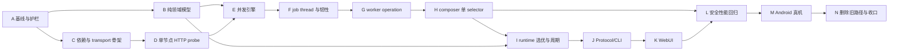

# NetHop Rust 节点测速与自动选优引擎 TDD 任务清单

> 状态：主机实现、release-mode fake-core SLA/资源/后处理证据、逐节点反馈及快速选优/同轮后台续测确定性测试完成；Android 真机已通过 Protocol v5 快速选择、单次 selector mutation、同轮后台续测与代理闭环验收
> 日期：2026-08-15
> 目标平台：Android arm64 Root 模块
> 设计依据：[`13-rust-node-benchmark-engine-design.md`](./13-rust-node-benchmark-engine-design.md)
> 前置实现：[`12-subscription-selection-and-node-optimization-tdd-task-list.md`](./12-subscription-selection-and-node-optimization-tdd-task-list.md) 阶段 A-M
> 影响范围：`nethop-core`、`nethopd`、`nethop-protocol`、`nethopctl`、WebUI、模块构建、Android 真机证据
> 兼容策略：项目未发布，不保留旧 group delay、`nethop-auto`、旧 timeout 或旧 wire 兼容层

> D16 覆盖说明：本文完成的测速调度和选优证据继续有效；任务正文中的 `active_node_id` 是 Protocol v3 before 术语。当前消费者统一使用 Protocol v5、generation registry v3 与 selection snapshot v2 typed `active_terminal`，不得恢复旧 wire。

> 证据摘要（2026-08-13）：除既有 workspace/WebUI/module/真实 sing-box check 外，`scripts/node-benchmark-host-release-gate.ps1` 已在 release profile 运行 1/16/27/64 success（各 20 样本）、64 mixed/timeout（各 3 样本）与 100 次 bootstrap；64 success wall p95 约 8ms，mixed/timeout 三轮均约 4.5s，engine peak 为 64 task/64 socket、结束残留 0、受控 heap 增量约 1.95MiB；`node_benchmark_postprocess_evidence` 的 decision+membership GET+PUT+final snapshot p95 约 4ms。`android-size-comparison.json` 证明 nethopd 增量 378552 bytes 小于 750KiB；整 ZIP 不可比较，因为 before/after 的 sing-box 与 WebUI 输入不同。Android 基线 `android-alioth-a13-arm64-20260813-d14`（Android 13/API 33、arm64-v8a、kernel 4.19.157、Magisk 30.6）已验证 27 candidates 多轮 operation 均在 4.511 秒内；本轮三次为 4.494/4.503/4.502 秒，结果分别为 27/27、21/27、24/27 success。Windows ADB+CLI wall 分别约 4.991/5.027/5.085 秒，其中包含 ADB 进程启动与 CLI 25ms polling，不计入设备内引擎 SLA。自动选择模式的 613 秒只读窗口内恰好新增一轮周期 operation：27 candidates、4.506 秒、20 success/7 timeout；worker CPU 增加 127 ticks（设备 `CLK_TCK=100`，约 1.27 CPU 秒，占单核窗口约 0.21%），线程 4→5→4、采样 FD 19→29→19、RSS 9756→10132→9788KiB。同期整机 `wlan0` 增量约 1.10MiB/303KiB，包含其他应用流量，只作为上界，不归因成 daemon 独占流量。capture 回归覆盖 generation 10/14 的 TPROXY 与 generation 11/13 的 TUN：TUN 使用 `nethop0`、table 2022 和 `auto_route=true`，27 candidates 测速为 4.503 秒且 23/27 success；回切后 `nethop0` 被回收，table 100、`NH_OUT_A`/`NH_PRE_A` 与 TPROXY 恢复。普通应用口径使用 UID 2000 验证 Google/YouTube 为 HTTP 204、Bilibili 为 HTTP 200；UID 0 由 `applications.exclude_uids` 明确排除，不能作为代理联网测试主体。2026-08-14 在 38 candidates 的真实订阅上复验：engine report 为 4.504 秒，设备内完整 CLI 墙钟为 5.12 秒。按用户确认的 7 秒 CLI 上限判定合格，继续保留 4.5 秒有效探测窗口与 4.9 秒内部 deadline。
>
> Protocol v5 快速选择真机补充证据（2026-08-15）：设备端二进制摘要与本地最新 arm64 模块一致，generation 6 的 64-candidate auto pool 连续三轮完整事件采样在 2021/2236/2371ms 产生快速选择里程碑，分别基于 45/43/43 个已完成候选；里程碑后原 operation 继续产生 11/12/11 个进度事件，最终均覆盖 64 candidates，设备内 operation 分别为 4525/4527/4533ms。三轮均保持当前最优节点，快速阶段和终态 selector PUT 都为 0。另以正常 CLI 临时选择已测得的高延迟节点并立即恢复 auto intent，切换轮在 2155ms 发布 `selection`，下一帧即为 `node_active`，之后同轮继续产生 14 个进度事件并在 4513ms 覆盖 64 candidates；快速阶段仅一次 selector PUT（约 10.4ms），terminal PUT 为 0。完整 CLI/ADB 墙钟为 4.96-5.10 秒，低于用户确认的 7 秒上限；worker 完成后恢复 5 threads/20 FD，RSS 回落至约 8.4MiB。每轮 generation 均保持 6，runtime/capture/core API 持续健康；普通应用 UID 2000 访问 Google/YouTube 返回 HTTP 204、Bilibili 返回 HTTP 200。证据不记录节点名称、stable ID、internal tag、订阅 URL、token、API secret 或设备 serial。

> 未完成原因：M001 需要 clean revision 的可复现 release；L006 的整 ZIP 体积需要相同 sing-box/WebUI 输入；当前订阅只有 27 candidates，不能伪造 M006 的 64 candidates 设备证据；M013 需要启用第二个真实订阅源并完成多订阅公平性回归。因此 N001-N005/N009-N010 只能完成代码/静态审计，不能签署依赖 M016 的正式 release gate。

### 当前执行矩阵

下表是本轮实施状态的权威摘要。后续保留的逐节点 checkbox 是 TDD 执行模板；在依赖 gate 未满足前，不通过机械勾选伪造完成状态。

| 阶段 | 状态 | 已取得证据 | 剩余门禁 |
|---|---|---|---|
| A | 完成（host） | 复用 D12 before fixture；host release report、size A/B 与 evidence manifest 已生成 | 完整 Android before/after A/B 未采集 |
| B | 完成 | typed trigger/outcome/status/report、固定预算、tolerance 纯函数与边界测试 | 无 |
| C | 完成 | Tokio/Hyper 最小 feature、loopback endpoint、认证请求、响应上限与 fake server | 无 |
| D | 完成 | current-thread runtime、同 task 驱动 Hyper Connection、keep-alive/close/status/limit/cutoff 测试 | 无 |
| E | 完成（host + 27 真机） | 1/16/27/64 host 同时提交；27 真机共享 cutoff、timeout 和回收成立 | 64 candidates 真机证据未采集 |
| F | 完成（host + 27 真机） | 真机峰值 5 threads/49 FD/约 6.8MiB RSS，完成后恢复 4 threads/19 FD；bootstrap 0-1ms | 64 candidates 真机资源峰值未采集 |
| G | 完成 | 快速 ACK、single-flight、shared wake、deadline fallback、非阻塞收割、generation/intent fence、shutdown | 无 |
| H | 完成 | 单 selector golden、删除 URLTest group/concurrency、registry auto_pool、真实 sing-box v1.13.15 single/merge check | 无 |
| I | 完成（host + 选择真机） | stable ID、manual no-PUT、周期 auto 超过 tolerance 切换、tolerance 内保持、final snapshot、绝对 deadline、连接保持语义 | 无 |
| J | 完成 | strict Protocol DTO、operation query/event、CLI 25ms query + 6s budget、旧同步 shape 删除 | 无 |
| K | 完成 | strict WebUI ACK/progress/report、7s watchdog、逐节点回填、失败清旧延迟、daemon active、双向延迟排序 | 无 |
| L | 完成（host，部分 Android） | host 全门禁；Android 27 candidates 的 thread/FD/RSS 与完成后回收通过 | 相同输入整 ZIP、64 candidates Android 资源、空闲 CPU/wakeup |
| M | 部分完成 | M003-M005、M007-M012、M014-M015 已取得真机证据；TPROXY/TUN 测速与回切期间代理闭环成立；模块静态门禁通过 | M001 clean reproducible、M006、M013、M016 |
| N | 代码完成、发布 gate 待定 | group delay、`nethop-auto`、旧 timeout、TOML concurrency 已从生产路径删除；D00/D06/D10/D12 已同步 | 依赖 M016 的正式删除签核与 clean release readiness |
| O | 完成（host） | FlClash 调用链复核；有界 progress channel、generation fence、WebUI 逐节点回填、延迟升降序；nethopd、protocol 与 WebUI host gate 全绿 | Android 实时回填视觉与事件时序仍待下次模块真机回归 |
| P | 完成（host） | Protocol v5 强制微秒级 engine/control/terminal timing；真实成功/timeout/control 测试、CLI fixture 与 WebUI strict DTO 全绿 | Android terminal timing 样本尚未采集，不据此提出优化结论 |
| Q | 完成（host + Android） | 2.0/2.8/3.0 秒 strict checkpoint、稳定部分结果槽、单次 selector mutation、同轮后台续测、v5 milestone/ACK/terminal、WebUI 即时切换与最终收敛均通过；64-candidate 真机三轮保持及一轮强制切换通过 | 无 |

## 1. 目的与完成边界

本清单把 D13 转换为可逐节点执行的 TDD 工作图。目标不是在 Rust 中重新实现代理协议，而是：

1. 使用最小 Tokio current-thread + Hyper HTTP/1 并发调度 sing-box 单 terminal delay API；
2. 让最多 64 个 auto candidates 在同一 4.5 秒 probe cutoff 内获得探测机会；
3. 在 4.9 秒 daemon deadline 内完成汇总、tolerance 选优、selector ACK 和最终快照；
4. 将 `NodeTestAll` 改为不阻塞 worker 的异步 operation；
5. 破坏性删除 `nethop-auto` URLTest group、两阶段 group delay、伪 `concurrency = 10` 和 25/30 秒旧超时；
6. 用重构前后测试证明多订阅 fair pool、manual/auto、连接保持、TPROXY/TUN、应用范围、路由、DNS、LKG 与 generation 回滚不退化。

D12 已完成的多订阅解析、合并去重、来源 attribution、round-robin fair pool、完整 manual pool 和有界 auto pool是本清单的输入，不重复实现。D12 阶段 N 的最终真机/发布 gate 必须在本清单完成后按新架构重新执行。

## 2. 被替代契约

实现 D14 后，下列 D10/D12 结论只保留为历史 before evidence：

| 旧契约 | 新契约 |
|---|---|
| `nethop-select -> nethop-auto -> terminal` | `nethop-select -> terminal` |
| selector group delay + URLTest group delay | Rust 并发单 terminal delay |
| sing-box URLTest 内部 active child | daemon auto intent + selector terminal |
| 固定 `concurrency = 10` TOML | 删除配置字段；候选上限固定 64 |
| CLI 25 秒、WebUI 30 秒 | 启动请求普通超时；CLI 等待 6 秒、WebUI watchdog 7 秒 |
| 同步 `NodeTestAll` 完整结果 | 快速 operation ACK + typed 完成事件/查询 |
| D12 N010 的 URLTest 周期证据 | daemon 周期 benchmark 的功耗与选优证据 |

不得把旧 tag、旧 HTTP 请求顺序或旧 timeout 当作升级兼容要求。必须冻结的是用户行为，而不是即将删除的内部形状。

## 3. TDD 节点规则

每个任务严格按以下顺序：

```text
RED       添加一个只因目标行为缺失而失败的最小测试
GREEN     实现让该测试通过的最小生产代码
REFACTOR  消除本任务引入的重复，保持窄接口和单一职责
VERIFY    运行本任务、直接前驱和指定回归门禁
```

任务字段：

- `depends_on`：全部完成后才能开始；
- `parallel_with`：前置满足后可并行；
- `scope`：本节点唯一交付物；
- `RED/GREEN/REFACTOR/VERIFY`：同一行为的 TDD 步骤；
- `done`：可客观判断的结束条件。

约束：

1. 一个节点只完成一个任务，不把生产实现、消费层和真机验收混成一个节点；
2. 删除旧代码必须等待新路径 gate 通过；
3. RED 不得因路径、拼写、fixture 缺失或环境错误失败；
4. benchmark 和公网真机不能替代确定性 fake-core 测试；
5. 不记录真实订阅 URL、token、节点凭据、API secret、完整 outbound 或设备完整包列表；
6. 本清单不授权 `git commit`、`git push`、删除无关文件或重置工作树。

## 4. 测试分层

| 层级 | 工具 | 只负责 |
|---|---|---|
| Rust 单元 | 相邻 `#[cfg(test)]` / crate tests | outcome、deadline、tolerance、operation 状态机 |
| fake Clash API | `TcpListener` + 受控响应脚本 | HTTP 分片、Connection 生命周期、并发、取消、响应上限 |
| daemon 契约 | `crates/nethopd/tests` | worker wake、thread、channel、generation fence、selector 事务 |
| composer golden | `nethop-core/tests` | 单 selector 配置、registry 和真实 `sing-box check` |
| Protocol/CLI | `nethop-protocol` / `nethopctl` tests | operation ACK/report/event、超时与脱敏 |
| WebUI | Vitest Node/Browser + Playwright | operation 消费、逐节点 progress、terminal 收敛、双向延迟排序与视觉回归 |
| 静态依赖 | manifest/lock/cargo tree 契约 | Tokio/Hyper 最小 feature 与禁入项 |
| release A/B | Android arm64 release 构建 | 二进制、ZIP、RSS、FD、thread、task、bootstrap |
| Android 真机 | ADB + 脱敏报告 | 5 秒 SLA、代理闭环、切换、功耗与回滚 |

建议证据目录：

```text
artifacts/tdd-node-benchmark/<task-id>/
  red.txt
  green.txt
  refactor.txt
  verify.txt
  manifest.json
```

`manifest.json` 记录 task ID、设计章节、命令、退出码、fixture SHA-256、worktree revision、Rust/Cargo/Node 版本、target、feature set 和设备摘要；不得记录敏感配置。

## 5. 需求追踪

| 需求 | D13 | 阶段 |
|---|---|---|
| before 行为与旧耗时基线 | 2、12.1 | A |
| outcome/deadline/tolerance 纯模型 | 3、5.2、6.2 | B |
| 最小依赖与 HTTP 边界 | 4、6.4 | C |
| Hyper Connection 同 task 驱动 | 6.3 | D |
| 64 并发与共同 cutoff | 3.2、6.3 | E |
| thread/panic/channel/bootstrap | 6.1、9、11 | F |
| worker async operation/wake/fence | 6.1、7 | G |
| 单 selector composer 重构 | 5.1 | H |
| auto/manual 与周期 controller | 5.2、5.3、7 | I |
| Protocol/CLI typed contract | 8.1 | J |
| WebUI operation 消费 | 8.2 | K |
| 安全、性能、回归 | 9-12 | L |
| Android 真机与发布门禁 | 12.4、15 | M |
| 删除旧路径、同步文档、最终 gate | 13-16 | N |

## 6. 依赖总图与推荐顺序



- A 的 fixture、耗时和资源快照可并行，A gate 串行收口；
- B 与 C 在 A 后可并行；D 依赖 C，E 同时依赖 B 与 D；
- auto 纯选择算法在 B 阶段完成，可与 transport/F/G 并行；
- H 必须等待 worker operation 可用，避免删除 group 后没有运行时替代；
- J、K 按消费链串行；L 内安全、性能和回归可并行；
- M 使用最终代码和 release 产物，N 最后删除 remaining compatibility 并更新 D12。

## 7. 阶段 A：重构前基线与护栏

- [ ] **A001 - 冻结当前两阶段 NodeTestAll HTTP fixture**
  - `depends_on`: none；`parallel_with`: A002,A003,A004,A005
  - `scope`: 保存 selector group delay、URLTest group delay、最终 `/proxies` 的脱敏 before fixture。
  - `RED`: 完整性测试因缺少请求顺序与响应摘要失败。
  - `GREEN`: 只补 fixture、SHA-256 和现有行为断言，不改生产代码。
  - `REFACTOR/VERIFY`: 复用 fake Clash API builder；运行 clash/operational control tests。
  - `done`: fixture 能证明当前两阶段行为且不含 secret/tag 之外的凭据。

- [ ] **A002 - 冻结 manual 测速不切换行为**
  - `depends_on`: none；`parallel_with`: A001,A003,A004,A005
  - `scope`: 保存 manual intent 下 test-all 只更新延迟、不改变 requested/active 的 before 行为。
  - `RED`: 缺少 manual 保持样本时测试失败。
  - `GREEN`: 添加最小 fake API 和 selection store fixture。
  - `REFACTOR/VERIFY`: 共享 stable node builder；运行 selection/operational tests。
  - `done`: before fixture 同时记录 intent、requested、active 和延迟结果。

- [ ] **A003 - 冻结 auto tolerance 与连接保持行为**
  - `depends_on`: none；`parallel_with`: A001,A002,A004,A005
  - `scope`: 保存 tolerance 内保持、超过 tolerance 切换及旧连接不被中断三个行为。
  - `RED`: 任一行为缺少 before evidence 时失败。
  - `GREEN`: 只补受控历史和连接 chain fixture。
  - `REFACTOR/VERIFY`: 统一时间与延迟 builder；运行 D12 B04/B05 回归。
  - `done`: 不依赖 `nethop-auto` 字符串也能描述用户行为。

- [ ] **A004 - 冻结多订阅 fair pool 与 generation registry**
  - `depends_on`: none；`parallel_with`: A001,A002,A003,A005
  - `scope`: 保存 merge round-robin、跨源去重、attribution、完整 manual pool 与 64 auto pool。
  - `RED`: baseline 缺任一 pool/registry digest 时失败。
  - `GREEN`: 绑定现有 D12 golden 与 property fixture。
  - `REFACTOR/VERIFY`: 不复制 fair pool 算法；运行 candidate/composer registry tests。
  - `done`: D14 后可证明多订阅能力没有被测速重构改变。

- [ ] **A005 - 记录当前 host 与真机耗时基线**
  - `depends_on`: none；`parallel_with`: A001,A002,A003,A004
  - `scope`: 记录 1/16/27/64 candidates 的 wall-clock、请求数和当前 27 节点约 14 秒样本。
  - `RED`: 报告 schema 因缺少样本、环境或有效性字段失败。
  - `GREEN`: 使用 fake core；真机历史样本只作 report，不作测试输入。
  - `REFACTOR/VERIFY`: 统一 monotonic timing；验证报告脱敏。
  - `done`: before performance report 可与 after A/B 配对。

- [ ] **A006 - 记录当前 Android release 资源快照**
  - `depends_on`: A005；`parallel_with`: A007
  - `scope`: 冻结 nethopd、模块 ZIP、空闲 RSS/thread/FD 与测速峰值基线。
  - `RED`: manifest 缺 target、build flags 或度量单位时失败。
  - `GREEN`: 采集或引用最新有效 arm64 release evidence。
  - `REFACTOR/VERIFY`: 统一 KiB/MiB 与进程归属；校验 SHA-256。
  - `done`: 可计算 Tokio/Hyper 引入后的增量。

- [ ] **A007 - 建立 D14 evidence manifest validator**
  - `depends_on`: A005；`parallel_with`: A006
  - `scope`: 校验 D14 每个任务的 red/green/refactor/verify 证据元数据。
  - `RED`: 空 task、路径逃逸、敏感字段或缺 digest 的 manifest 被接受。
  - `GREEN`: 实现最小 schema validator 和脱敏字段拒绝。
  - `REFACTOR/VERIFY`: 复用 D12 evidence 规则；加入独立 contract test。
  - `done`: 非法 evidence fail closed。

- [ ] **A008 - 通过 D14 baseline gate**
  - `depends_on`: A001,A002,A003,A004,A005,A006,A007；`parallel_with`: none
  - `scope`: 聚合验证 A001-A007，不修改业务代码。
  - `RED`: 任一基线缺失时 gate 失败。
  - `GREEN`: 只补 gate wiring 与命令清单。
  - `REFACTOR/VERIFY`: 单一入口执行所有 before tests 和 secret canary。
  - `done`: 后续破坏性任务有完整 before 对照。

## 8. 阶段 B：纯领域模型与选优算法

- [ ] **B001 - 定义 `BenchmarkTrigger`**
  - `depends_on`: A008；`parallel_with`: B002,B003,B004
  - `scope`: 仅定义 `manual | periodic` 枚举及严格 serde。
  - `RED`: 未知值被接受或序列化不稳定。
  - `GREEN`: 实现最小枚举。
  - `REFACTOR/VERIFY`: 无字符串散落；运行 round-trip tests。
  - `done`: trigger wire 稳定且拒绝未知值。

- [ ] **B002 - 定义 `NodeProbeState`**
  - `depends_on`: A008；`parallel_with`: B001,B003,B004
  - `scope`: 仅定义 success/timeout/unavailable/protocol_error。
  - `RED`: 非 success 携带 delay 或 success 缺 delay 未被拒绝。
  - `GREEN`: 建立受控 constructor。
  - `REFACTOR/VERIFY`: 状态不包含网络错误原文；运行边界测试。
  - `done`: outcome 状态与 delay 不变量成立。

- [ ] **B003 - 定义整轮 `BenchmarkStatus`**
  - `depends_on`: A008；`parallel_with`: B001,B002,B004
  - `scope`: 仅定义 success/partial/failed/internal_error/superseded/running。
  - `RED`: outcome 汇总得到错误状态。
  - `GREEN`: 实现纯汇总函数。
  - `REFACTOR/VERIFY`: busy 作为启动错误/加入语义，不混入完成状态。
  - `done`: 所有 outcome 组合有确定状态。

- [ ] **B004 - 定义 operation 时间预算值对象**
  - `depends_on`: A008；`parallel_with`: B001,B002,B003
  - `scope`: 固定 probe cutoff 4500ms、internal deadline 4900ms、设备内完整 CLI wall SLA 7000ms。
  - `RED`: 0、倒序或超出 5 秒预算被接受。
  - `GREEN`: 实现单一 `BenchmarkBudget`。
  - `REFACTOR/VERIFY`: 所有剩余时间计算复用该对象；用 monotonic Instant 测试。
  - `done`: 不存在第二套魔法 timeout 常量。

- [ ] **B005 - 定义有界 `BenchmarkCandidate`**
  - `depends_on`: B002；`parallel_with`: B006,B007
  - `scope`: 仅承载 stable node ID 与 daemon-owned internal tag。
  - `RED`: 非 registry tag、重复 node ID、控制字符未被拒绝。
  - `GREEN`: 实现窄 constructor 与集合 validator。
  - `REFACTOR/VERIFY`: internal tag 不实现 Serialize 到公共 DTO。
  - `done`: 最多 64 个唯一候选且来源只能是 registry。

- [ ] **B006 - 定义 `BenchmarkReport` 不变量**
  - `depends_on`: B001,B002,B003,B004；`parallel_with`: B005,B007
  - `scope`: 验证 generation、trigger、bootstrap、elapsed、outcomes 一致性。
  - `RED`: elapsed 超 deadline、重复 node 或计数不一致被接受。
  - `GREEN`: 实现 report constructor。
  - `REFACTOR/VERIFY`: public/private report 分层；运行 serde size tests。
  - `done`: 无法构造内部矛盾 report。

- [ ] **B007 - 实现当前节点有效时的 tolerance 选择**
  - `depends_on`: B002,B005；`parallel_with`: B006,B008
  - `scope`: 只实现 `current > candidate + tolerance` 的稳定扫描。
  - `RED`: 等于 tolerance 时错误切换，或扫描顺序不稳定。
  - `GREEN`: 实现纯函数，不发 API 请求。
  - `REFACTOR/VERIFY`: 使用 checked/saturating 比较防溢出；property test。
  - `done`: 与 sing-box v1.13.15 严格大于语义一致。

- [ ] **B008 - 实现当前节点无有效结果时的 tolerance 选择**
  - `depends_on`: B002,B005；`parallel_with`: B006,B007
  - `scope`: 第一个有效候选建基准，后续只接受超 tolerance 改善。
  - `RED`: 简单全局最小或 HashMap 顺序导致结果漂移。
  - `GREEN`: 按 auto pool 稳定顺序扫描。
  - `REFACTOR/VERIFY`: 复用 B007 比较 helper；property test permutation boundary。
  - `done`: 结果确定且处于最低延迟 tolerance 区间。

- [ ] **B009 - 实现 manual/无结果选优保护**
  - `depends_on`: B007,B008；`parallel_with`: none
  - `scope`: manual 永不选新 target；auto 无成功保持 active。
  - `RED`: manual 或全失败时产生 selector target。
  - `GREEN`: 在纯 decision 函数加入 intent/empty gate。
  - `REFACTOR/VERIFY`: 返回 typed decision reason；覆盖 current missing。
  - `done`: 失败不会误切节点。

- [ ] **B010 - 通过领域模型 gate**
  - `depends_on`: B001,B002,B003,B004,B005,B006,B007,B008,B009；`parallel_with`: none
  - `scope`: 聚合执行 B 阶段纯测试。
  - `RED`: 任一模型、边界或 property test 缺失时失败。
  - `GREEN`: 只补 gate wiring。
  - `REFACTOR/VERIFY`: 确认 nethop-core/protocol 未引入 HTTP/runtime 依赖。
  - `done`: 选优与时间语义可脱离 I/O 独立验证。

## 9. 阶段 C：依赖门禁与 transport 骨架

- [ ] **C001 - 冻结新增依赖 allowlist**
  - `depends_on`: A008；`parallel_with`: C002,C003
  - `scope`: 只允许 Tokio、Hyper、hyper-util、http-body-util 四项。
  - `RED`: 加入 reqwest/smol/futures/async-net 时测试仍通过。
  - `GREEN`: 增加 manifest/cargo-tree 契约。
  - `REFACTOR/VERIFY`: 版本由 lockfile 固定；输出 direct/transitive diff。
  - `done`: 未批准 async/HTTP 依赖 fail closed。

- [ ] **C002 - 冻结 Tokio 最小 feature**
  - `depends_on`: A008；`parallel_with`: C001,C003
  - `scope`: 只允许 `rt/net/time/sync/macros`。
  - `RED`: `full`、`rt-multi-thread`、fs/process/signal 被接受。
  - `GREEN`: 添加静态 Cargo.toml/metadata assertion。
  - `REFACTOR/VERIFY`: 禁止默认 features；运行 feature tree。
  - `done`: current-thread runtime 是唯一构建路径。

- [ ] **C003 - 冻结 Hyper 最小 feature**
  - `depends_on`: A008；`parallel_with`: C001,C002
  - `scope`: Hyper 仅 client/http1，hyper-util 仅 tokio adapter。
  - `RED`: HTTP/2、TLS、legacy client、pool 被接受。
  - `GREEN`: 添加静态依赖契约。
  - `REFACTOR/VERIFY`: 检查 lockfile 无 h2/tower client path。
  - `done`: transport 无 DNS/TLS/pool 能力。

- [ ] **C004 - 实现受控 loopback endpoint 值对象**
  - `depends_on`: C001,C002,C003；`parallel_with`: C005,C006
  - `scope`: 仅接受 `127.0.0.1` 与非零端口。
  - `RED`: hostname、IPv6、0 端口、非 loopback 被接受。
  - `GREEN`: 复用/抽取现有 Clash endpoint validator。
  - `REFACTOR/VERIFY`: 单一实现供同步控制与 async probe 使用。
  - `done`: transport 无 SSRF 目标自由度。

- [ ] **C005 - 实现 probe request builder**
  - `depends_on`: C001,C003,B004,B005；`parallel_with`: C004,C006
  - `scope`: 构造固定 GET path、Bearer header、剩余 timeout 与固定 probe URL。
  - `RED`: tag 未编码、用户 URL 可注入、secret 进入 Debug。
  - `GREEN`: 复用安全 path encoder 与 redacted secret wrapper。
  - `REFACTOR/VERIFY`: golden 比较 request target/header；禁止 redirect/body。
  - `done`: 请求字节完全由受控输入决定。

- [ ] **C006 - 定义 HTTP probe 响应限制**
  - `depends_on`: C001,C003；`parallel_with`: C004,C005
  - `scope`: header 8KiB、body 4KiB、status mapping 与 JSON shape。
  - `RED`: 超限 header/body、0 delay、超 u16 delay 被接受。
  - `GREEN`: 实现纯 response mapper 与 `Limited` 配置。
  - `REFACTOR/VERIFY`: 错误不携带原 body；table-driven tests。
  - `done`: 响应解析有界且脱敏。

- [ ] **C007 - 建立可脚本化 fake Clash HTTP server**
  - `depends_on`: C004,C005,C006；`parallel_with`: none
  - `scope`: 支持慢 accept/header/body、分片、keep-alive、close、畸形和状态码。
  - `RED`: fake server 无法表达任一 D13 失败矩阵场景。
  - `GREEN`: 只实现测试基础设施，不放入生产 crate API。
  - `REFACTOR/VERIFY`: 每个脚本有确定 barrier 和 monotonic timestamp。
  - `done`: 后续 transport 测试不使用 sleep 猜竞态。

- [ ] **C008 - 通过依赖与 transport 骨架 gate**
  - `depends_on`: C001,C002,C003,C004,C005,C006,C007；`parallel_with`: none
  - `scope`: 聚合验证 C 阶段，不发送真实网络请求。
  - `RED`: 任一禁入 feature 或响应边界缺失时失败。
  - `GREEN`: 只补 gate command。
  - `REFACTOR/VERIFY`: cargo tree、lock diff 和 fake server tests 一次执行。
  - `done`: D 阶段可在安全骨架上实现 I/O。

## 10. 阶段 D：单节点 Hyper HTTP/1 probe

- [ ] **D001 - 建立 current-thread runtime builder**
  - `depends_on`: C008；`parallel_with`: D002
  - `scope`: 只创建启用 I/O/time 的 current-thread runtime。
  - `RED`: 多线程 runtime 或未启用 driver 的实现通过测试。
  - `GREEN`: 实现私有 runtime builder。
  - `REFACTOR/VERIFY`: 无 `#[tokio::main]`；检查 runtime metrics/thread count。
  - `done`: runtime 本身不创建 worker thread pool。

- [ ] **D002 - 实现 TCP connect 与 Hyper HTTP/1 handshake**
  - `depends_on`: C008；`parallel_with`: D001
  - `scope`: 连接受控 endpoint并返回 sender/Connection 对。
  - `RED`: fake server accept 后 handshake 不推进或超时失控。
  - `GREEN`: 使用 `TokioIo` 和 low-level handshake。
  - `REFACTOR/VERIFY`: connect 继承 shared cutoff；无连接池。
  - `done`: 单连接握手可在受控 deadline 内完成。

- [ ] **D003 - 在同一 task 驱动 request/body 与 Connection**
  - `depends_on`: D001,D002,C005,C006；`parallel_with`: none
  - `scope`: 使用 `tokio::select! { biased; }` 完成一次 probe。
  - `RED`: 不 poll Connection 时请求卡死；正常 close 被误报错误。
  - `GREEN`: request/body 分支优先，Connection 提前结束映射 protocol_error。
  - `REFACTOR/VERIFY`: 禁止内部 `tokio::spawn`；测试 task 数为 1。
  - `done`: 一个 candidate 对应一个 probe task 和一个 socket。

- [ ] **D004 - 支持正常 keep-alive 响应**
  - `depends_on`: D003；`parallel_with`: D005,D006,D007
  - `scope`: 只验证完整响应后主动 drop connection。
  - `RED`: keep-alive 导致等待 EOF 或 task 泄漏。
  - `GREEN`: body 完整即返回，不依赖连接关闭。
  - `REFACTOR/VERIFY`: fake server 观察 client close；检查 FD 回收。
  - `done`: keep-alive 不延长整轮时间。

- [ ] **D005 - 支持正常 `Connection: close` 响应**
  - `depends_on`: D003；`parallel_with`: D004,D006,D007
  - `scope`: 只处理 response 与 connection 同轮 ready 的竞态。
  - `RED`: 合法 delay 被误映射 protocol_error。
  - `GREEN`: biased request/body 分支优先。
  - `REFACTOR/VERIFY`: 重复运行竞态 fixture；禁止概率性断言。
  - `done`: 正常 close 稳定返回 success。

- [ ] **D006 - 映射 Connection 提前失败**
  - `depends_on`: D003；`parallel_with`: D004,D005,D007
  - `scope`: response 完整前 EOF/reset/error -> protocol_error。
  - `RED`: task 卡死或错误原文泄露。
  - `GREEN`: 返回稳定 state/code。
  - `REFACTOR/VERIFY`: 覆盖 header 前、header 中、body 中断连。
  - `done`: 单节点失败不影响其他 future。

- [ ] **D007 - 强制 header/body 上限**
  - `depends_on`: D003；`parallel_with`: D004,D005,D006
  - `scope`: 8KiB header、4KiB decoded body fail closed。
  - `RED`: chunked 或分片响应绕过上限。
  - `GREEN`: 配置 Hyper header 限制并用 `Limited` 包 body。
  - `REFACTOR/VERIFY`: 测试精确边界与 +1 byte。
  - `done`: 内存不随响应增长。

- [ ] **D008 - 映射 HTTP status 与 delay JSON**
  - `depends_on`: D004,D005,D006,D007；`parallel_with`: D009
  - `scope`: 200/success、504/timeout、503/unavailable、其他/protocol_error。
  - `RED`: 401 被当单节点普通失败重试或畸形 delay 被接受。
  - `GREEN`: 实现严格 mapper。
  - `REFACTOR/VERIFY`: unauthorized 提升为整轮错误的标记单独返回。
  - `done`: 所有状态码有稳定语义。

- [ ] **D009 - 实现单 probe shared cutoff 取消**
  - `depends_on`: D004,D005,D006,D007,B004；`parallel_with`: D008
  - `scope`: connect/handshake/request/body 共用一个绝对 cutoff。
  - `RED`: 每阶段重新获得 4.5 秒或取消后 socket 残留。
  - `GREEN`: 用 `timeout_at` 包完整 candidate future。
  - `REFACTOR/VERIFY`: fake clock/受控 barrier；检查 FD/task 归零。
  - `done`: 单 probe 不延长 wall-clock 预算。

- [ ] **D010 - 通过单节点 transport gate**
  - `depends_on`: D001,D002,D003,D004,D005,D006,D007,D008,D009；`parallel_with`: none
  - `scope`: 聚合 D 阶段全部 fake HTTP 契约。
  - `RED`: Connection 未驱动、边界或取消任一回归时失败。
  - `GREEN`: 只补 gate wiring。
  - `REFACTOR/VERIFY`: 重复运行竞态测试并执行 leak check。
  - `done`: 单节点 probe 可作为 E 阶段并发原语。

## 11. 阶段 E：64 候选并发引擎

- [ ] **E001 - 验证候选集合上限**
  - `depends_on`: B010,D010；`parallel_with`: E002,E003
  - `scope`: 接受 1..64 唯一 auto candidates，拒绝 0、65 和重复项。
  - `RED`: 非法集合被静默截断或去重。
  - `GREEN`: 在 engine 入口显式验证。
  - `REFACTOR/VERIFY`: 复用 `BenchmarkCandidate` validator；边界 table test。
  - `done`: “全部节点”严格等于当前完整 auto pool。

- [ ] **E002 - 同时提交全部 candidate task**
  - `depends_on`: B010,D010；`parallel_with`: E001,E003
  - `scope`: 在开始 drain 前把最多 64 个 future 加入同一 JoinSet。
  - `RED`: batch=5/10 或串行提交无法通过 64-way barrier。
  - `GREEN`: 一次性 spawn 全部 candidate future。
  - `REFACTOR/VERIFY`: 禁止批次 sleep；记录 accepted timestamp。
  - `done`: fake core 看到 64 个请求在 250ms 窗口内到达。

- [ ] **E003 - 建立稳定 outcome 槽位**
  - `depends_on`: B010,D010；`parallel_with`: E001,E002
  - `scope`: task 完成顺序不改变 report 中 auto pool 顺序。
  - `RED`: 网络快慢改变 nodes 数组顺序。
  - `GREEN`: 预分配按 candidate index 写回的 outcome slots。
  - `REFACTOR/VERIFY`: 不用 tag 排序重建身份；随机完成顺序 property test。
  - `done`: report 可确定重放。

- [ ] **E004 - 实现 shared probe cutoff**
  - `depends_on`: E001,E002,E003,B004；`parallel_with`: E005,E006
  - `scope`: 所有任务共享 start+4500ms，不能按任务创建相对 timeout。
  - `RED`: 后提交/慢任务获得额外时间。
  - `GREEN`: 将同一 `Instant` 传入全部 probe。
  - `REFACTOR/VERIFY`: 受控 barrier 验证最长 wall time。
  - `done`: 64 个永不响应任务在 cutoff 收敛。

- [ ] **E005 - 使用 `JoinSet::shutdown()` 回收 cutoff 任务**
  - `depends_on`: E001,E002,E003；`parallel_with`: E004,E006
  - `scope`: cutoff 后统一 abort 并排空 JoinSet。
  - `RED`: 残留 task 或自研 drain 漏掉 panic/cancel。
  - `GREEN`: 调用官方 `shutdown()`。
  - `REFACTOR/VERIFY`: shutdown 后 `is_empty()`；task counter 归零。
  - `done`: engine 返回前 JoinSet 为空。

- [ ] **E006 - 将未完成槽位映射为 timeout**
  - `depends_on`: E001,E002,E003；`parallel_with`: E004,E005
  - `scope`: cutoff 后每个缺失 candidate 产生一个 timeout outcome。
  - `RED`: 节点从 report 消失或保留上轮延迟。
  - `GREEN`: 按稳定槽位补 timeout。
  - `REFACTOR/VERIFY`: tested 始终等于 candidate_count。
  - `done`: partial report 完整覆盖所有候选。

- [ ] **E007 - 处理整轮 unauthorized 快速失败**
  - `depends_on`: E004,E005,E006,D008；`parallel_with`: E008
  - `scope`: 任一明确 401 触发整轮取消，不对其他节点继续重试。
  - `RED`: 64 个请求持续到 cutoff 或返回普通 partial。
  - `GREEN`: engine 收到 fatal auth marker 后 shutdown JoinSet。
  - `REFACTOR/VERIFY`: secret 不进入错误文本；请求数有界。
  - `done`: unauthorized 快速、稳定、脱敏。

- [ ] **E008 - 汇总 success/partial/failed report**
  - `depends_on`: E004,E005,E006,B006；`parallel_with`: E007
  - `scope`: 根据完整 slots 生成计数、状态和 elapsed。
  - `RED`: mixed outcome 计数或状态错误。
  - `GREEN`: 调用 B 阶段 report constructor。
  - `REFACTOR/VERIFY`: 不在 engine 复制状态规则。
  - `done`: report 内部一致。

- [ ] **E009 - 测量 64 候选 host SLA**
  - `depends_on`: E007,E008；`parallel_with`: E010
  - `scope`: fake core p95 <=5s，覆盖 success/timeout/mixed。
  - `RED`: 旧串行/批次实现超过门槛。
  - `GREEN`: 建立 release-mode benchmark harness。
  - `REFACTOR/VERIFY`: warmup、至少 20 样本、报告原始值与 p50/p95/p99。
  - `done`: 门槛可重复而非单次最好值。

- [ ] **E010 - 验证 task 与 FD 峰值**
  - `depends_on`: E007,E008；`parallel_with`: E009
  - `scope`: probe task <=64、新增 FD <=70、完成 1 秒后残留 0。
  - `RED`: 每 candidate 第二层 task 或 socket 泄漏未被发现。
  - `GREEN`: 加入测试计数器与 OS FD probe。
  - `REFACTOR/VERIFY`: task/FD 分开报告，不互相推断。
  - `done`: 满足 D13 资源上限。

- [ ] **E011 - 通过并发引擎 gate**
  - `depends_on`: E001,E002,E003,E004,E005,E006,E007,E008,E009,E010；`parallel_with`: none
  - `scope`: 聚合 E 阶段正确性、SLA 与资源测试。
  - `RED`: 任一性能或 leak 门禁失败即阻断。
  - `GREEN`: 只补 gate wiring。
  - `REFACTOR/VERIFY`: release/debug 结果分域，不用 debug 证明 SLA。
  - `done`: engine 可交给 job thread 管理。

## 12. 阶段 F：benchmark job 线程与故障韧性

- [ ] **F001 - 定义 `NodeBenchmarkJobs` 单飞状态机**
  - `depends_on`: E011；`parallel_with`: F002,F003
  - `scope`: idle/running/completed/cancelling 四态和唯一 operation ID。
  - `RED`: running 时启动第二轮或非法状态跳转。
  - `GREEN`: 实现纯状态机。
  - `REFACTOR/VERIFY`: 状态迁移不执行 I/O；model tests。
  - `done`: 同时最多一个 job。

- [ ] **F002 - 创建命名短生命周期线程**
  - `depends_on`: E011；`parallel_with`: F001,F003
  - `scope`: 每轮最多一个 `nethop-node-bench` 线程。
  - `RED`: detached、未命名或创建多个线程未被发现。
  - `GREEN`: 使用 `thread::Builder` 返回并保存 JoinHandle。
  - `REFACTOR/VERIFY`: thread create failure -> internal_error。
  - `done`: 测速期间线程增量 <=1，空闲增量 0。

- [ ] **F003 - 建立容量 1 的 result channel**
  - `depends_on`: E011；`parallel_with`: F001,F002
  - `scope`: benchmark 线程只能发送一个终局 report。
  - `RED`: 多 report、无界积压或 worker 阻塞 recv。
  - `GREEN`: 使用 bounded/sync channel 与 `try_recv`。
  - `REFACTOR/VERIFY`: sender/receiver 所有权清晰；断开测试。
  - `done`: worker 收割路径非阻塞。

- [ ] **F004 - 在线程内创建并运行 current-thread runtime**
  - `depends_on`: F002,D001；`parallel_with`: F005,F006
  - `scope`: 线程 build runtime 后 block_on 一次 E 引擎。
  - `RED`: runtime 泄漏到 worker 或创建多线程 executor。
  - `GREEN`: 组装最小 job body。
  - `REFACTOR/VERIFY`: runtime 生命周期完全在线程内。
  - `done`: job 完成后 runtime drop。

- [ ] **F005 - 记录 bootstrap_ms**
  - `depends_on`: F002,D001；`parallel_with`: F004,F006
  - `scope`: 从 thread spawn 前到首个 probe future poll 的时长。
  - `RED`: bootstrap 混入后处理或无法独立报告。
  - `GREEN`: 在首个 poll barrier 记录 monotonic timestamp。
  - `REFACTOR/VERIFY`: p50/p95/p99 report schema；不使用 wall clock。
  - `done`: 可区分 bootstrap 与网络探测长尾。

- [ ] **F006 - 建立跨线程取消信号**
  - `depends_on`: F002,C002；`parallel_with`: F004,F005
  - `scope`: worker 可请求 job 在 shared cutoff 前取消。
  - `RED`: daemon shutdown/generation change 后线程继续到 4.5s。
  - `GREEN`: 使用 Tokio sync 原语并在 engine 顶层 select。
  - `REFACTOR/VERIFY`: cancel 幂等；取消后 JoinSet shutdown。
  - `done`: 取消路径无 detached task/thread。

- [ ] **F007 - 用 catch_unwind 封装线程边界**
  - `depends_on`: F003,F004,F006；`parallel_with`: F008,F009
  - `scope`: unwind panic -> 脱敏 internal_error report。
  - `RED`: 注入 panic 后 channel 静默且 operation 永久 running。
  - `GREEN`: 只在线程最外层 catch；常规错误仍用 Result。
  - `REFACTOR/VERIFY`: 不提交 partial outcomes；panic payload 不输出。
  - `done`: unwind build 下 panic 可控收敛。

- [ ] **F008 - 处理 result channel disconnect**
  - `depends_on`: F003,F004,F006；`parallel_with`: F007,F009
  - `scope`: sender 消失且无 report -> internal_error。
  - `RED`: worker 保持 running。
  - `GREEN`: 状态机观察 disconnected/JoinHandle。
  - `REFACTOR/VERIFY`: 不把 disconnect 映射网络 timeout。
  - `done`: channel 不是唯一可信完成信号。

- [ ] **F009 - 统一 JoinHandle reap**
  - `depends_on`: F002,F004,F006；`parallel_with`: F007,F008
  - `scope`: success/panic/cancel/shutdown 走同一 join helper。
  - `RED`: drop handle 导致线程 detach。
  - `GREEN`: `is_finished` 后实际 `join()` 并检查结果。
  - `REFACTOR/VERIFY`: join 只在已结束时执行，worker 不阻塞。
  - `done`: 所有终局路径无遗留线程。

- [ ] **F010 - 明确 panic=abort 构建门禁**
  - `depends_on`: F007,F009；`parallel_with`: F011
  - `scope`: 检测 release panic strategy并选择正确测试声明。
  - `RED`: `panic=abort` 仍宣称 catch_unwind 覆盖。
  - `GREEN`: 构建契约区分 unwind 与 abort；abort 跑进程恢复测试。
  - `REFACTOR/VERIFY`: 不为测试修改正式 profile。
  - `done`: panic 安全声明与产物一致。

- [ ] **F011 - 测量 bootstrap 与线程资源**
  - `depends_on`: F005,F009；`parallel_with`: F010
  - `scope`: host release 报告 bootstrap p50/p95/p99、线程/RSS 增量。
  - `RED`: 报告把 bootstrap 混入 probe 或缺原始样本。
  - `GREEN`: 建立独立 benchmark 输出。
  - `REFACTOR/VERIFY`: 与 A006 before 快照可配对。
  - `done`: 资源增量可归因。

- [ ] **F012 - 通过 benchmark job gate**
  - `depends_on`: F001,F002,F003,F004,F005,F006,F007,F008,F009,F010,F011；`parallel_with`: none
  - `scope`: 聚合线程生命周期、故障和资源测试。
  - `RED`: 任一终局路径无法 join 或永久 running 时失败。
  - `GREEN`: 只补 gate wiring。
  - `REFACTOR/VERIFY`: 重复 panic/cancel race fixture。
  - `done`: job 可安全接入 worker。

## 13. 阶段 G：worker 异步 operation 与唤醒

- [ ] **G001 - 建立 worker-owned 共享 wake channel**
  - `depends_on`: F012；`parallel_with`: G002,G003
  - `scope`: worker 创建 sender/receiver，config watcher 与 benchmark 各持 clone sender。
  - `RED`: benchmark 完成只能等待 1 秒 idle poll。
  - `GREEN`: 重构 SystemWorkerServiceDriver wiring，不改信号语义。
  - `REFACTOR/VERIFY`: 单一 receiver；无 eventfd/pipe/新轮询线程。
  - `done`: 两类 producer 均可立即唤醒 driver。

- [ ] **G002 - 定义 operation ACK 模型**
  - `depends_on`: F012,B010；`parallel_with`: G001,G003
  - `scope`: operation_id/running/generation/trigger/joined/candidate_count/cutoff/deadline。
  - `RED`: internal tag/secret 可序列化或时间字段矛盾。
  - `GREEN`: 实现严格 constructor。
  - `REFACTOR/VERIFY`: ACK 不包含 outcomes。
  - `done`: NodeTestAll 可快速返回。

- [ ] **G003 - 定义 operation 完成快照 store**
  - `depends_on`: F012,B010；`parallel_with`: G001,G002
  - `scope`: 保存当前 running 与最近一个 bounded terminal report。
  - `RED`: 无界历史或重启后误当 running。
  - `GREEN`: 内存有界 store；持久化仅在现有需求明确时禁止提前增加。
  - `REFACTOR/VERIFY`: operation ID 唯一；size test。
  - `done`: event 丢失可通过查询恢复最近结果。

- [ ] **G004 - NodeTestAll 启动请求快速返回 ACK**
  - `depends_on`: G001,G002,G003；`parallel_with`: none
  - `scope`: request handler 只验证、启动 job、返回 ACK。
  - `RED`: handler block_on 直到测速完成。
  - `GREEN`: 接入 NodeBenchmarkJobs::start。
  - `REFACTOR/VERIFY`: fake job barrier 证明 status 请求可并行响应。
  - `done`: UDS handler 不等待网络。

- [ ] **G005 - 实现 in-flight operation joining**
  - `depends_on`: G004,F001；`parallel_with`: G006,G007
  - `scope`: 重复请求返回同 operation ID 与 `joined_existing=true`。
  - `RED`: 第二次点击启动第二轮。
  - `GREEN`: single-flight 查询已有 ACK。
  - `REFACTOR/VERIFY`: 保留创建时 trigger；manual join periodic 测试。
  - `done`: 不叠加探测。

- [ ] **G006 - benchmark report 发送完成 wake**
  - `depends_on`: G004,G001；`parallel_with`: G005,G007
  - `scope`: result send 后发送一次 worker wake。
  - `RED`: report 已到 channel 但 worker 晚 1 秒收割。
  - `GREEN`: clone wake sender 注入 job。
  - `REFACTOR/VERIFY`: wake send 失败由 deadline 兜底，不 panic。
  - `done`: 正常完成立即推进选优。

- [ ] **G007 - 将 operation deadline 纳入 next_wakeup_in**
  - `depends_on`: G004,G001；`parallel_with`: G005,G006
  - `scope`: 在途时返回 min(existing, deadline-now)。
  - `RED`: 完成 wake 丢失后超过 5 秒仍 running。
  - `GREEN`: 注册单次 deadline wake。
  - `REFACTOR/VERIFY`: idle 时不提高轮询频率。
  - `done`: wake 丢失仍在 4.9 秒收敛。

- [ ] **G008 - worker non-blocking 收割 report**
  - `depends_on`: G005,G006,G007；`parallel_with`: G009,G010
  - `scope`: `run_ready` 通过 try_recv 更新 operation store。
  - `RED`: recv 阻塞 worker 或 report 未发布。
  - `GREEN`: 实现最小 collector。
  - `REFACTOR/VERIFY`: 收割与 selector 提交分离为两个步骤。
  - `done`: status/core observe/reconcile 持续运行。

- [ ] **G009 - generation fence**
  - `depends_on`: G005,G006,G007；`parallel_with`: G008,G010
  - `scope`: report generation 与当前 generation 不同 -> superseded。
  - `RED`: 旧 report 对新 core 执行 selector PUT。
  - `GREEN`: 提交前二次比较 generation。
  - `REFACTOR/VERIFY`: config publish 优先并触发 cancel。
  - `done`: 跨 generation 无陈旧写入。

- [ ] **G010 - intent fence**
  - `depends_on`: G005,G006,G007；`parallel_with`: G008,G009
  - `scope`: 测速期间 auto/manual 改变时遵守最新 intent。
  - `RED`: 用户切 manual 后 report 又自动改选。
  - `GREEN`: 提交前重读 selection store。
  - `REFACTOR/VERIFY`: report 可保存延迟但不覆盖选择。
  - `done`: 用户操作优先。

- [ ] **G011 - 处理 panic/channel/wake 丢失终局**
  - `depends_on`: G008,G009,G010,F007,F008,F009；`parallel_with`: G012
  - `scope`: worker 将内部故障收敛为 internal_error、active 不变并 reap。
  - `RED`: 任一注入使 operation 永久 running。
  - `GREEN`: 汇聚统一 finalize helper。
  - `REFACTOR/VERIFY`: 稳定诊断码，不含 panic payload。
  - `done`: 4.9 秒内必有终局。

- [ ] **G012 - daemon shutdown 取消并 join benchmark**
  - `depends_on`: G008,G009,G010,F006,F009；`parallel_with`: G011
  - `scope`: shutdown 顺序为 cancel -> engine shutdown -> thread join。
  - `RED`: daemon 退出留下线程/socket。
  - `GREEN`: 接入 WorkerServiceTasks::shutdown。
  - `REFACTOR/VERIFY`: shutdown 幂等；超时 fail closed。
  - `done`: 无 detached 资源。

- [ ] **G013 - 通过 worker operation gate**
  - `depends_on`: G001,G002,G003,G004,G005,G006,G007,G008,G009,G010,G011,G012；`parallel_with`: none
  - `scope`: 聚合 async ACK、wake、fence、故障与 shutdown。
  - `RED`: worker 阻塞或终局失效时 gate 失败。
  - `GREEN`: 只补 gate wiring。
  - `REFACTOR/VERIFY`: core exit/reconcile/status 并发测试。
  - `done`: 可在不阻塞 worker 前提下完成 probe report。

## 14. 阶段 H：composer 单 selector 破坏性重构

- [ ] **H001 - 冻结新单 selector golden**
  - `depends_on`: G013,A004；`parallel_with`: H002,H003
  - `scope`: 定义 `nethop-select` 直接包含全部 manual terminal 的期望 JSON。
  - `RED`: 当前 composer 因存在 `nethop-auto` 与嵌套成员失败。
  - `GREEN`: 只添加 after golden，不先改 composer。
  - `REFACTOR/VERIFY`: golden 绑定 auto_pool/registry digest。
  - `done`: 新结构差异可审查。

- [ ] **H002 - 从 ManagedProfile 删除 URLTest group 模型**
  - `depends_on`: G013,A004；`parallel_with`: H001,H003
  - `scope`: 领域模型不再表示 `nethop-auto` outbound。
  - `RED`: API 仍要求 URLTest child 才能构造 profile。
  - `GREEN`: 收窄模型为 terminal pool + selector。
  - `REFACTOR/VERIFY`: fair auto pool 仍作为 registry/controller 输入，不丢失。
  - `done`: nethop-core 不拥有自动测速 group。

- [ ] **H003 - 从配置模型删除 `urltest.concurrency`**
  - `depends_on`: G013,A004；`parallel_with`: H001,H002
  - `scope`: TOML、wire、effective config、schema metadata 移除该字段。
  - `RED`: 新 canonical TOML 仍生成 concurrency 或用户输入仍被接受。
  - `GREEN`: 破坏性删除字段与默认函数。
  - `REFACTOR/VERIFY`: 未知字段按 strict TOML 拒绝；不写迁移。
  - `done`: 不再暴露无法控制的参数。

- [ ] **H004 - composer 只生成 terminal 与 selector**
  - `depends_on`: H001,H002,H003；`parallel_with`: H005,H006
  - `scope`: 删除 `nethop-auto` outbound，selector members 只含 terminal tags。
  - `RED`: H001 golden 不匹配。
  - `GREEN`: 最小修改 composer。
  - `REFACTOR/VERIFY`: `interrupt_exist_connections=false` 保持；route/dns detour 不变。
  - `done`: canonical JSON 只有一个受控 group。

- [ ] **H005 - registry 显式保存 auto pool 顺序**
  - `depends_on`: H001,H002,H003；`parallel_with`: H004,H006
  - `scope`: generation sealed registry 为 controller 提供稳定 auto candidate IDs。
  - `RED`: 只能从 selector 全成员反推 auto pool。
  - `GREEN`: 增加有界、校验、digest-covered 字段或现有等价投影。
  - `REFACTOR/VERIFY`: 不复制节点凭据；single/merge golden。
  - `done`: daemon 无需猜候选池。

- [ ] **H006 - 简化 active terminal 解析**
  - `depends_on`: H001,H002,H003；`parallel_with`: H004,H005
  - `scope`: selector `now` 直接映射 terminal registry。
  - `RED`: 解析仍依赖递归 `nethop-auto` group。
  - `GREEN`: 实现直接解析并保留 unknown/direct degraded。
  - `REFACTOR/VERIFY`: cycle/depth fixture 转历史删除候选，不留死代码。
  - `done`: active resolution 无递归 group。

- [ ] **H007 - 用真实 sing-box v1.13.15 check 验证单 selector**
  - `depends_on`: H004,H005,H006；`parallel_with`: H008
  - `scope`: single/merge after golden 通过真实固定 binary/source check。
  - `RED`: 非法 selector/terminal 配置被 fake parser 漏过。
  - `GREEN`: 接入现有 CandidateChecker fixture。
  - `REFACTOR/VERIFY`: 记录 core version/sha256，不记录节点凭据。
  - `done`: 新结构是核心真实可加载配置。

- [ ] **H008 - 回归多订阅 fair/manual pool**
  - `depends_on`: H004,H005,H006；`parallel_with`: H007
  - `scope`: composer 重构前后 auto pool、manual pool、attribution 完全一致。
  - `RED`: 任一 node ID/source attribution/顺序变化未被发现。
  - `GREEN`: 建立 before-after projection comparison。
  - `REFACTOR/VERIFY`: 忽略仅应删除的 `nethop-auto` shape。
  - `done`: D12 多订阅合并不退化。

- [ ] **H009 - 通过单 selector composer gate**
  - `depends_on`: H001,H002,H003,H004,H005,H006,H007,H008；`parallel_with`: none
  - `scope`: 聚合模型、golden、真实 check 与 pool 回归。
  - `RED`: 新 core config 或 registry 不完整时失败。
  - `GREEN`: 只补 gate wiring。
  - `REFACTOR/VERIFY`: 确认不再生成 `nethop-auto`。
  - `done`: runtime controller 可接管 auto。

## 15. 阶段 I：auto/manual controller 与周期调度

- [ ] **I001 - 将 engine outcomes 映射到 stable node IDs**
  - `depends_on`: H009,B010；`parallel_with`: I002,I003
  - `scope`: internal tag 只在 daemon 内映射，report 使用 stable node ID。
  - `RED`: unknown/duplicate tag 或 internal tag 泄露到 DTO。
  - `GREEN`: 通过 generation registry join。
  - `REFACTOR/VERIFY`: 一次映射供 report 与 decision 复用。
  - `done`: 公共结果无 sing-box tag。

- [ ] **I002 - manual report 提交不执行 selector PUT**
  - `depends_on`: H009,B009；`parallel_with`: I001,I003
  - `scope`: manual intent 下只更新延迟与完成事件。
  - `RED`: 最快节点导致 requested/active 改变。
  - `GREEN`: controller 在 decision 前检查 intent。
  - `REFACTOR/VERIFY`: A002 before-after 比较。
  - `done`: manual 行为保持。

- [ ] **I003 - auto report 计算 tolerance target**
  - `depends_on`: H009,B009；`parallel_with`: I001,I002
  - `scope`: 调用唯一纯 decision 函数产生 keep/switch。
  - `RED`: controller 自行取绝对最小或复制算法。
  - `GREEN`: 注入 current active、auto order、outcomes、tolerance。
  - `REFACTOR/VERIFY`: A003 tolerance fixture。
  - `done`: 选优语义单一来源。

- [ ] **I004 - auto target 变化时执行一次 selector PUT**
  - `depends_on`: I001,I002,I003；`parallel_with`: I005,I006
  - `scope`: 仅 switch decision 发一次 `PUT /proxies/nethop-select`。
  - `RED`: keep 也 PUT、重复 PUT 或 target 非成员。
  - `GREEN`: 使用 registry 映射和现有安全 client。
  - `REFACTOR/VERIFY`: ACK 前不发布 changed=true。
  - `done`: 无二次测速和多次切换。

- [ ] **I005 - selector PUT 失败保持 active**
  - `depends_on`: I001,I002,I003；`parallel_with`: I004,I006
  - `scope`: probe report 保留，selection 标记失败，active 不伪造。
  - `RED`: 前端看到虚假新 active。
  - `GREEN`: 读取 ACK/错误后构造 terminal status。
  - `REFACTOR/VERIFY`: 稳定诊断码；不回滚延迟结果。
  - `done`: 半成功状态可解释。

- [ ] **I006 - selector ACK 后读取最终快照**
  - `depends_on`: I001,I002,I003；`parallel_with`: I004,I005
  - `scope`: changed/active 以 core 最终 `/proxies` 为准。
  - `RED`: 仅根据请求 target 推断 active。
  - `GREEN`: 在剩余 400ms 后处理预算内读取一次。
  - `REFACTOR/VERIFY`: snapshot failure -> partial，不伪造。
  - `done`: report 反映核心事实。

- [ ] **I007 - 完整 operation 遵守 4.9 秒 deadline**
  - `depends_on`: I004,I005,I006,G007；`parallel_with`: I008
  - `scope`: probe+mapping+decision+PUT+snapshot 总时长受内部 deadline。
  - `RED`: probe 用满 4.5s 后 ACK 阶段无限延长。
  - `GREEN`: 后处理每步使用剩余 absolute deadline。
  - `REFACTOR/VERIFY`: slow PUT/snapshot fake API。
  - `done`: daemon 内部在 4.9s 收敛。

- [ ] **I008 - 发布 typed NodeTest 完成事件**
  - `depends_on`: I004,I005,I006；`parallel_with`: I007
  - `scope`: 每个已完成 candidate 发布一个 bounded progress event，整轮只发布一个 bounded terminal event。
  - `RED`: progress 泄漏 internal tag、计数不单调，或缺 terminal 导致 operation 无法收敛。
  - `GREEN`: worker 先排空有界 progress channel，再发布完整 terminal report。
  - `REFACTOR/VERIFY`: event size/secret canary。
  - `done`: 快节点即时可见，terminal 仍是唯一完整终态。

- [ ] **I009 - 周期调度仅在 auto intent 启动**
  - `depends_on`: I007,I008；`parallel_with`: I010,I011
  - `scope`: manual 不执行周期全量测速。
  - `RED`: manual 仍产生周期请求。
  - `GREEN`: scheduler admission 检查 intent/core state。
  - `REFACTOR/VERIFY`: 不影响用户即时 manual 测速。
  - `done`: 移动端无无意义周期探测。

- [ ] **I010 - 周期调度复用同一 benchmark engine**
  - `depends_on`: I007,I008；`parallel_with`: I009,I011
  - `scope`: periodic 不拥有第二套 transport/选优实现。
  - `RED`: scheduler 仍调用 group delay 或复制 HTTP client。
  - `GREEN`: 构造 trigger=periodic 的同一 start request。
  - `REFACTOR/VERIFY`: 静态路径断言。
  - `done`: 即时与周期行为一致。

- [ ] **I011 - periodic/manual 冲突加入同一 operation**
  - `depends_on`: I007,I008,G005；`parallel_with`: I009,I010
  - `scope`: manual 加入 periodic 时保留 trigger=periodic、joined_existing=true。
  - `RED`: trigger 被篡改或启动第二轮。
  - `GREEN`: 使用 G005 single-flight ACK。
  - `REFACTOR/VERIFY`: 反向 periodic 命中 manual 同理。
  - `done`: 来源可追溯且不重复探测。

- [ ] **I012 - 保持旧连接不被主动中断**
  - `depends_on`: I004,I005,I006,H004；`parallel_with`: I013
  - `scope`: selector 仍 `interrupt_exist_connections=false`。
  - `RED`: composer 或切换路径中断已有连接 fixture。
  - `GREEN`: 只修正生成/控制契约。
  - `REFACTOR/VERIFY`: 区分旧连接与切换后新连接。
  - `done`: A003/B05 行为保持。

- [ ] **I013 - 通过 runtime auto/manual gate**
  - `depends_on`: I001,I002,I003,I004,I005,I006,I007,I008,I009,I010,I011,I012；`parallel_with`: none
  - `scope`: 聚合选择、周期、deadline、事件和连接保持。
  - `RED`: 任一 intent/fence/active 行为回归时失败。
  - `GREEN`: 只补 gate wiring。
  - `REFACTOR/VERIFY`: fake core full operation E2E。
  - `done`: 后端新架构行为闭环。

## 16. 阶段 J：Protocol 与 CLI

- [ ] **J001 - 定义 NodeTest operation ACK DTO**
  - `depends_on`: I013；`parallel_with`: J002,J003
  - `scope`: operation_id、running、generation、trigger、joined、count、cutoff、deadline。
  - `RED`: 未知字段/状态或内部 tag 被接受。
  - `GREEN`: 增加严格 typed DTO。
  - `REFACTOR/VERIFY`: 大小边界与 golden。
  - `done`: ACK 可跨 UDS 稳定传输。

- [ ] **J002 - 定义 NodeTest terminal report DTO**
  - `depends_on`: I013；`parallel_with`: J001,J003
  - `scope`: status、bootstrap、elapsed、计数、selection、nodes。
  - `RED`: 计数矛盾、超时状态含 delay 或敏感字段被接受。
  - `GREEN`: 映射 daemon public report。
  - `REFACTOR/VERIFY`: typed constructor 与 size limit。
  - `done`: success/partial/failed/internal/superseded 完整表达。

- [ ] **J003 - 增加 NodeTest operation 查询方法**
  - `depends_on`: I013；`parallel_with`: J001,J002
  - `scope`: event 丢失后按 operation ID 查询 running/terminal。
  - `RED`: WebUI/CLI 只能永久等待 event。
  - `GREEN`: 增加最小 protocol method 和 worker route。
  - `REFACTOR/VERIFY`: 只查询当前/最近 bounded store。
  - `done`: watchdog 可恢复真实状态。

- [ ] **J004 - 更新 NodeTest 事件 contract**
  - `depends_on`: J001,J002,J003；`parallel_with`: J005,J006
  - `scope`: 同一 `EventKind::NodeTest` 承载严格 progress 或 terminal report，不增加第二套订阅主题。
  - `RED`: event reducer 无法按 phase 校验，或 progress 缺 operation/generation/completed/candidate_count。
  - `GREEN`: 增加严格 progress DTO，并保留 terminal report validator。
  - `REFACTOR/VERIFY`: 事件大小与 secret canary。
  - `done`: 每个候选最多一个 progress，一轮恰有一个 terminal event。

- [ ] **J005 - CLI NodeTestAll 等待 operation 完成**
  - `depends_on`: J001,J002,J003；`parallel_with`: J004,J006
  - `scope`: CLI 启动后等待事件/查询并输出最终 JSON。
  - `RED`: CLI 只输出 running ACK 或仍同步阻塞旧请求。
  - `GREEN`: 复用事件订阅，丢失时 query。
  - `REFACTOR/VERIFY`: Ctrl-C 只退出 CLI，不取消 daemon operation。
  - `done`: 用户命令保持“一次调用得到最终报告”体验。

- [ ] **J006 - 收紧 CLI 等待预算为 6 秒**
  - `depends_on`: J001,J002,J003；`parallel_with`: J004,J005
  - `scope`: 只对 NodeTestAll 等待设 6 秒，普通请求保持原预算。
  - `RED`: 25 秒旧特例仍存在或其他命令被放宽。
  - `GREEN`: 更新 timeout planner。
  - `REFACTOR/VERIFY`: exact duration contract。
  - `done`: CLI 超时与 5 秒 SLA 对齐。

- [ ] **J007 - CLI 输出 trigger/bootstrap/partial 语义**
  - `depends_on`: J004,J005,J006；`parallel_with`: J008
  - `scope`: human/JSON 输出新增字段和稳定状态文本。
  - `RED`: periodic joined 被描述为用户新建或 partial 返回成功假象。
  - `GREEN`: 更新 presenter。
  - `REFACTOR/VERIFY`: 不输出 internal tag/error body。
  - `done`: 输出可诊断且脱敏。

- [ ] **J008 - 删除 Protocol/CLI 旧同步结果 shape**
  - `depends_on`: J004,J005,J006；`parallel_with`: J007
  - `scope`: 删除只返回 delay array 的旧 NodeTestAll wire 与 parser。
  - `RED`: 旧 fixture 仍被接受。
  - `GREEN`: 破坏性移除 enum/DTO/helper。
  - `REFACTOR/VERIFY`: 不保留 compatibility branch。
  - `done`: 新 contract 是唯一入口。

- [ ] **J009 - 通过 Protocol/CLI gate**
  - `depends_on`: J001,J002,J003,J004,J005,J006,J007,J008；`parallel_with`: none
  - `scope`: 聚合 golden、timeout、event、query、CLI 与 canary。
  - `RED`: 任一旧 wire 或敏感字段通过时失败。
  - `GREEN`: 只补 gate wiring。
  - `REFACTOR/VERIFY`: 全 nethop-protocol/nethopctl tests。
  - `done`: 消费契约稳定。

## 17. 阶段 K：WebUI operation 消费

- [ ] **K001 - 增加 NodeTest operation ACK 校验器**
  - `depends_on`: J009；`parallel_with`: K002
  - `scope`: 校验 operation ID、running、generation、trigger、joined、candidate count、cutoff 与 deadline。
  - `RED`: 缺字段、非法 trigger、负数时间或超出 64 candidates 的 ACK 被接受。
  - `GREEN`: 增加窄 DTO 与运行时 validator。
  - `REFACTOR/VERIFY`: 复用现有整数、枚举和 opaque ID validator。
  - `done`: WebUI 不直接信任 bridge payload。

- [ ] **K002 - 增加 NodeTest terminal report 校验器**
  - `depends_on`: J009；`parallel_with`: K001
  - `scope`: 校验终态、计数、outcome、selection 和节点结果的一致性。
  - `RED`: timeout 带 delay、总计不守恒或 success 缺 delay 的 report 被接受。
  - `GREEN`: 实现严格 terminal DTO validator。
  - `REFACTOR/VERIFY`: 与 ACK 共享 trigger/generation 类型，不复制业务选优。
  - `done`: malformed report 进入稳定 bridge error，不污染 store。

- [ ] **K003 - 实现测速 operation bridge**
  - `depends_on`: K001,K002；`parallel_with`: none
  - `scope`: 启动 NodeTestAll，并能按 operation ID 查询终态。
  - `RED`: bridge 仍等待同步 delay array 或无法恢复丢失事件。
  - `GREEN`: 接入快速 ACK 和 operation get。
  - `REFACTOR/VERIFY`: 复用统一 IPC request，不增加 Clash API 直连。
  - `done`: bridge 只暴露 typed start/get。

- [ ] **K004 - 将测速按钮绑定单一 pending operation**
  - `depends_on`: K003；`parallel_with`: K005
  - `scope`: 同一 operation pending 时仅禁用闪电按钮并保存 operation ID。
  - `RED`: 连点启动第二轮或锁住整个节点页。
  - `GREEN`: store 按 operation ID 管理 pending。
  - `REFACTOR/VERIFY`: 组件不自行维护第二份 pending 状态。
  - `done`: single-flight UI 行为与 daemon 一致。

- [ ] **K005 - 展示 trigger 与 joined_existing 状态**
  - `depends_on`: K003；`parallel_with`: K004
  - `scope`: 区分手动新建、周期新建和加入既有轮次。
  - `RED`: 用户加入 periodic operation 时 UI 显示为新建手动轮次。
  - `GREEN`: 从 ACK 原样投影 trigger/joined。
  - `REFACTOR/VERIFY`: 文案映射集中在 presenter。
  - `done`: UI 不伪造 operation 来源。

- [ ] **K006 - 增加 7 秒 WebUI watchdog**
  - `depends_on`: K003,K004；`parallel_with`: K007
  - `scope`: 事件未到时查询 operation，终态后退出 pending。
  - `RED`: completion event 丢失导致按钮永久 pending。
  - `GREEN`: 7 秒触发一次 get，并以 daemon 状态收敛。
  - `REFACTOR/VERIFY`: watchdog 不将本地超时伪造成 daemon success/failed。
  - `done`: 丢事件时 UI 最迟 7 秒恢复可操作。

- [ ] **K007 - 增量提交节点测速结果并由 terminal 收敛**
  - `depends_on`: K002,K004；`parallel_with`: K006
  - `scope`: progress 只 patch 对应 stable node；terminal report 对全部 outcome 做最终一致性覆盖。
  - `RED`: WebUI 等待整轮才显示首个结果，或失败节点继续展示旧延迟。
  - `GREEN`: runtime store 维护本轮 probe state，event reducer 按 phase 分发。
  - `REFACTOR/VERIFY`: 64 节点上限下验证节点顺序表不重建、未知 ID 被忽略。
  - `done`: 快节点立即显示，terminal 后 store 与完整 report 一致。

- [ ] **K008 - 映射节点失败状态且禁止复用旧延迟**
  - `depends_on`: K002,K007；`parallel_with`: K009
  - `scope`: 分别显示超时、不可用、协议错误和内部错误。
  - `RED`: 本轮失败节点仍显示上轮毫秒值。
  - `GREEN`: 本轮 outcome 覆盖 stale delay 展示。
  - `REFACTOR/VERIFY`: 状态文案与样式使用统一映射表。
  - `done`: 用户能区分本轮四类非成功结果。

- [ ] **K009 - 由 daemon report 更新 auto active 节点**
  - `depends_on`: K002,K007；`parallel_with`: K008
  - `scope`: 只在 terminal selection snapshot 确认后更新 active。
  - `RED`: 前端选择最小 delay 并乐观切换卡片。
  - `GREEN`: 消费 selection.changed/active_node_id。
  - `REFACTOR/VERIFY`: 删除前端选优与第二次切换命令。
  - `done`: active 节点以 core 最终事实为准。

- [ ] **K010 - 页面卸载不取消 daemon operation**
  - `depends_on`: K003,K004,K006；`parallel_with`: K008,K009
  - `scope`: 卸载仅释放 UI listener、timer 和本地引用。
  - `RED`: 路由离开导致 daemon probe 被 cancel。
  - `GREEN`: lifecycle cleanup 不发送 cancel operation。
  - `REFACTOR/VERIFY`: 返回页面后可 query 最近 operation。
  - `done`: 消费端生命周期不改变 daemon 工作语义。

- [ ] **K011 - 增加节点页浏览器与视觉回归**
  - `depends_on`: K005,K006,K007,K008,K009,K010；`parallel_with`: none
  - `scope`: 覆盖 pending、partial、全失败、auto changed 和窄屏布局。
  - `RED`: 任一状态缺少可观察断言或控件发生重叠。
  - `GREEN`: 增加 Playwright 场景和稳定截图 fixture。
  - `REFACTOR/VERIFY`: 固定 fake clock、viewport 和 bridge payload。
  - `done`: 手机与桌面 viewport 均无跳动、遮挡和永久 pending。

- [ ] **K012 - 通过 WebUI gate**
  - `depends_on`: K001,K002,K003,K004,K005,K006,K007,K008,K009,K010,K011；`parallel_with`: none
  - `scope`: 聚合 unit、browser、bundle 和旧节点选择回归。
  - `RED`: 旧同步 wire、未校验 progress、terminal 不收敛或前端选优存在时失败。
  - `GREEN`: 只补 gate wiring。
  - `REFACTOR/VERIFY`: 执行 WebUI lint、typecheck、unit、browser 和 build。
  - `done`: WebUI 新消费链完整通过。

## 18. 阶段 L：安全、性能与系统回归

- [ ] **L001 - 门禁 loopback endpoint 与候选来源**
  - `depends_on`: I013,J009；`parallel_with`: L002,L003
  - `scope`: endpoint 仅允许 daemon 生成的 IPv4 loopback，candidate 仅来自 sealed registry。
  - `RED`: CLI/WebUI 输入 host、port、tag 或 registry 外 candidate 能触发请求。
  - `GREEN`: 在 protocol admission 和 benchmark start 边界拒绝。
  - `REFACTOR/VERIFY`: table-driven SSRF 与 stale generation cases。
  - `done`: 外部输入不能把引擎变成任意 HTTP client。

- [ ] **L002 - 门禁请求认证与有界响应**
  - `depends_on`: D010,J009；`parallel_with`: L001,L003
  - `scope`: 验证 secret header、status/header/body/JSON 上限和日志脱敏。
  - `RED`: 401 被逐节点重试、超大 body 被完整分配或 secret 出现在日志。
  - `GREEN`: 增加整轮 unauthorized 短路和有界读取。
  - `REFACTOR/VERIFY`: fuzz/property cases 覆盖分片与畸形长度。
  - `done`: 不可信 loopback response 不扩大资源和信息暴露。

- [ ] **L003 - 门禁最小 Tokio/Hyper feature 集**
  - `depends_on`: C006；`parallel_with`: L001,L002
  - `scope`: 只允许设计批准的 feature 和传递依赖。
  - `RED`: `full`、`rt-multi-thread`、HTTP/2、TLS、reqwest 或 smol 进入依赖树时失败。
  - `GREEN`: 收紧 workspace manifest 与 lock contract。
  - `REFACTOR/VERIFY`: 保存 Android target `cargo tree -e features` 摘要。
  - `done`: 依赖面与 D13 选型一致。

- [ ] **L004 - 建立 64 candidate 受控 5 秒 SLA 门禁**
  - `depends_on`: E010,I013；`parallel_with`: L005,L006,L007,L008
  - `scope`: host fake core 三轮完整 operation wall clock 均不超过 5 秒。
  - `RED`: 旧批次/两阶段路径超过门槛。
  - `GREEN`: 使用新并发引擎和 4.9 秒 deadline。
  - `REFACTOR/VERIFY`: 同时覆盖成功、混合 timeout 和全 timeout 场景。
  - `done`: 不删除失败轮次，三轮原始结果全部留证。

- [ ] **L005 - 门禁后处理 p95 不超过 100ms**
  - `depends_on`: I013；`parallel_with`: L004,L006,L007,L008
  - `scope`: 仅测汇总、mapping、decision、PUT ACK 与 snapshot 的本地阶段。
  - `RED`: 后处理混入 probe 时间或超过预算无告警。
  - `GREEN`: 增加 phase timestamps 与基准门禁。
  - `REFACTOR/VERIFY`: fake API 固定低延迟，报告 p50/p95/p99。
  - `done`: 400ms 尾部预算有可解释余量。

- [ ] **L006 - 比较 Android release 二进制与 ZIP 体积**
  - `depends_on`: L003；`parallel_with`: L004,L005,L007,L008
  - `scope`: 与 A006 before artifact 比较 nethopd 和模块 ZIP。
  - `RED`: 增量无报告或超过 750/350 KiB。
  - `GREEN`: 保持最小 feature、release profile 和资源打包。
  - `REFACTOR/VERIFY`: 同 toolchain、target 和压缩参数复测。
  - `done`: 两项体积门禁均通过并保存 SHA-256。

- [ ] **L007 - 门禁 thread、task、FD 与 RSS**
  - `depends_on`: F010,L004；`parallel_with`: L005,L006,L008
  - `scope`: 冻结空闲/测速峰值/结束 1 秒后的资源差值。
  - `RED`: 多于 1 个新增线程、64 probe task、70 FD、4 MiB RSS 或存在残留。
  - `GREEN`: 修正生命周期和有界分配。
  - `REFACTOR/VERIFY`: 分开报告 task 与 FD，不用 task 数推断 FD。
  - `done`: D13 资源表全部满足。

- [ ] **L008 - 记录 bootstrap 延迟分位数**
  - `depends_on`: F010；`parallel_with`: L004,L005,L006,L007
  - `scope`: 记录线程创建至首个 probe future poll 的 p50/p95/p99。
  - `RED`: bootstrap 只能从整体 elapsed 反推。
  - `GREEN`: 使用 F002 单调时间点汇总。
  - `REFACTOR/VERIFY`: 至少 100 次受控样本，不记录 wall clock。
  - `done`: bootstrap 可独立定位且仍计入整体 SLA。

- [ ] **L009 - 验证 worker 空闲 CPU 与 wakeup 不退化**
  - `depends_on`: G010,I013；`parallel_with`: L010,L011,L012
  - `scope`: 比较重构前后空闲 CPU、线程和周期 wakeup。
  - `RED`: 新 runtime 常驻或 polling 加密导致基线增长。
  - `GREEN`: 保持短生命周期 runtime 和共享 wake channel。
  - `REFACTOR/VERIFY`: 固定 10 分钟观测窗口与设备状态。
  - `done`: daemon 空闲线程增量 0、RSS 增量不超过 256 KiB，wakeup 无新增轮询源。

- [ ] **L010 - 回归多订阅合并与节点选择 B01-B10**
  - `depends_on`: H009,I013；`parallel_with`: L009,L011,L012
  - `scope`: 重放 D12 多源、公平池、去重、attribution、manual/auto 与 LKG 行为。
  - `RED`: 新 benchmark 改变 pool 顺序、node ID 或来源映射。
  - `GREEN`: 只修复边界 wiring，不复制 D12 算法。
  - `REFACTOR/VERIFY`: 对比 A004 digest 和 property fixture。
  - `done`: D12 用户功能在新引擎下等价或增强。

- [ ] **L011 - 回归代理网络与配置事务**
  - `depends_on`: I013；`parallel_with`: L009,L010,L012
  - `scope`: 回归 TPROXY、TUN、应用范围、路由、DNS、generation、LKG 和回滚。
  - `RED`: benchmark 期间 status/reconcile/core-exit 或 config publish 被阻塞。
  - `GREEN`: 修正 worker ownership 和 generation fence。
  - `REFACTOR/VERIFY`: 复用既有集成 gate，不复制 runner。
  - `done`: 测速能力不改变代理数据面契约。

- [ ] **L012 - 执行全链路敏感信息 canary**
  - `depends_on`: J009,K012,L002；`parallel_with`: L009,L010,L011
  - `scope`: 检查 report、event、CLI、WebUI、日志和 artifact。
  - `RED`: canary secret、URL query、完整 outbound 或 API secret 任一泄漏。
  - `GREEN`: 在模型边界改为 stable ID/归类错误。
  - `REFACTOR/VERIFY`: 静态扫描与运行时输出双门禁。
  - `done`: 所有用户可见和留存证据均脱敏。

- [ ] **L013 - 通过完整 host gate**
  - `depends_on`: L001,L002,L003,L004,L005,L006,L007,L008,L009,L010,L011,L012；`parallel_with`: none
  - `scope`: 聚合 workspace、WebUI、依赖、安全、资源、性能和回归结果。
  - `RED`: 任一门禁缺证据或被 skip 时失败。
  - `GREEN`: 只补统一 gate 与 manifest。
  - `REFACTOR/VERIFY`: 干净环境重复一次完整 host gate。
  - `done`: 进入真机阶段前无已知 host 阻塞项。

## 19. 阶段 M：Android arm64 真机与模块验收

- [ ] **M001 - 生成可复现 Android arm64 release 产物**
  - `depends_on`: L013；`parallel_with`: none
  - `scope`: 固定 revision、toolchain、sing-box pin 和 WebUI bundle 构建 ZIP。
  - `RED`: 同输入二次构建 manifest/内容摘要不可比。
  - `GREEN`: 使用现有 release pipeline 生成产物。
  - `REFACTOR/VERIFY`: 比较文件清单、权限和可解释时间戳差异。
  - `done`: ZIP、manifest 和 SHA-256 可追溯。

- [ ] **M002 - 验证模块结构、校验和、许可证与 SBOM**
  - `depends_on`: M001；`parallel_with`: none
  - `scope`: 对安装 ZIP 执行静态 module contract。
  - `RED`: 缺文件、额外 checksum target、权限错误或许可证缺失。
  - `GREEN`: 只修复打包输入/manifest。
  - `REFACTOR/VERIFY`: 对解包产物重新计算 checksums。
  - `done`: 模块可交由用户安装且静态门禁通过。

- [x] **M003 - 验证覆盖安装保留用户配置**
  - `depends_on`: M002；`parallel_with`: none
  - `scope`: 安装新 ZIP 后持久 TOML、daemon-owned source ID 和 selection intent 保留。
  - `RED`: 安装脚本用 defaults 覆盖有效用户配置。
  - `GREEN`: 修正安装迁移/持久目录边界。
  - `REFACTOR/VERIFY`: 同时验证首次安装生成默认配置。
  - `done`: 安装前后配置 digest 符合预期且不记录 URL。
  - `evidence`: 覆盖安装保留 schema v3 TOML、daemon-owned `src_94838e...` 和 auto selection intent；旧 generation v1 派生缓存不作兼容解析，由订阅重建为 generation 10 / nodes v2。

- [x] **M004 - 记录设备与 capability 基线**
  - `depends_on`: M003；`parallel_with`: none
  - `scope`: 记录 Android、root provider、kernel、ABI、capture capability 和模块版本摘要。
  - `RED`: 真机性能报告无法绑定设备状态。
  - `GREEN`: 生成脱敏 capability manifest。
  - `REFACTOR/VERIFY`: 不收集设备序列号和完整包列表。
  - `done`: 后续所有真机证据引用同一基线 ID。
  - `evidence`: `android-alioth-a13-arm64-20260813-d14`：M2012K11AC/alioth、Android 13/API 33、arm64-v8a、kernel 4.19.157、Magisk 30.6；不记录设备 serial。

- [x] **M005 - 验证 27 candidates 三轮 5 秒 SLA**
  - `depends_on`: M004；`parallel_with`: M006
  - `scope`: 冷启动后执行三轮完整 NodeTestAll wall-clock 测量。
  - `RED`: 任一轮超过 5 秒或仍出现两阶段 group 请求。
  - `GREEN`: 仅修正新引擎真机差异。
  - `REFACTOR/VERIFY`: 保存每轮原始计数、阶段耗时和 bootstrap，不含节点凭据。
  - `done`: 三轮均不超过 5 秒。
  - `evidence`: 冷启动后已有 4.503/4.502/4.501 秒三轮；manual-fence 修复版复验 4.494/4.503/4.502 秒，`tested=27` 且每轮结果守恒。ADB/CLI wall overhead 单独记录，不混入设备内 operation SLA。

- [ ] **M006 - 验证 64 candidates 三轮 5 秒 SLA**
  - `depends_on`: M004；`parallel_with`: M005
  - `scope`: 在候选上限执行三轮完整 operation。
  - `RED`: 排队导致后部 candidate 未获探测机会或任一轮超过 5 秒。
  - `GREEN`: 修正 Android socket/runtime 调度问题。
  - `REFACTOR/VERIFY`: 核对尝试数、task/FD 峰值和每轮结果守恒。
  - `done`: 三轮均不超过 5 秒且最多 64 个 probe task。

- [x] **M007 - 验证 timeout 节点与后台回收**
  - `depends_on`: M005,M006；`parallel_with`: M008,M009
  - `scope`: 至少一轮包含不可达/超时节点，并观测截止后 1 秒资源。
  - `RED`: core 仍收到延迟 probe 或 daemon 留有 socket/task/thread。
  - `GREEN`: 修正 shutdown、connection close 或 thread join。
  - `REFACTOR/VERIFY`: 同时覆盖页面/CLI 断开。
  - `done`: 终态后无残留 probe 活动。
  - `evidence`: 含 6/3 个 timeout 的两轮均在共同 cutoff 收敛；worker 从 4 threads/19 FD 峰值 5 threads/49 FD，结束后恢复 4 threads/19 FD，RSS 从约 6.3MiB 峰值约 6.8MiB 后回落；无 ESTABLISHED probe 连接残留。

- [x] **M008 - 验证 auto tolerance 保持与切换**
  - `depends_on`: M005,M006；`parallel_with`: M007,M009
  - `scope`: 真机分别验证 tolerance 内 keep 和严格超过时 switch。
  - `RED`: auto 永远保留慢节点或在 tolerance 内抖动。
  - `GREEN`: 修正 history/snapshot/controller wiring。
  - `REFACTOR/VERIFY`: active 以 selector ACK 后快照为证据。
  - `done`: 两类决策均与纯函数 fixture 一致。
  - `evidence`: 周期 report 独立于 manual operation。当前 568ms 节点面对 148ms 候选时切换到 148ms 节点；后续当前 148ms、最优 127ms，差值 21ms 小于 50ms tolerance，保持不切换；再一轮当前约 214ms、最优 132ms 时切换到 132ms 节点。

- [x] **M009 - 验证 manual 测速永不自动切换**
  - `depends_on`: M005,M006；`parallel_with`: M007,M008
  - `scope`: manual intent 下刷新全部 delay，requested/active 保持。
  - `RED`: 最快节点被自动选择。
  - `GREEN`: 修正 operation completion intent fence。
  - `REFACTOR/VERIFY`: 测速中切换另一 manual 节点也不被覆盖。
  - `done`: manual 所有权始终属于用户。
  - `evidence`: 2026-08-14 契约审计发现旧实现把 operation 来源 `trigger=manual` 错当成 selection intent，导致 auto intent 下用户即时测速不选优，违反 I010 的“即时与周期行为一致”和 D13 的 intent 不变量。RED 复现后，生产 fence 收敛为只检查 operation 完成时重新读取的持久 intent：manual intent 保持 active，auto intent 按 tolerance keep/switch；trigger 仅保留来源审计。host fake-core 已覆盖 auto+manual trigger 单次 PUT 与 manual intent 零 PUT，修复版 Android selector ACK 待新模块复验。

- [x] **M010 - 验证 selector 切换连接语义**
  - `depends_on`: M008；`parallel_with`: M011,M012,M013
  - `scope`: 旧连接保持，新连接使用新 terminal。
  - `RED`: 切换主动断开旧连接或新连接仍走旧节点。
  - `GREEN`: 修正 composer/selector 控制，不引入连接强杀。
  - `REFACTOR/VERIFY`: 记录两条独立连接的脱敏事实。
  - `done`: `interrupt_exist_connections=false` 用户行为保持。
  - `evidence`: generation 14 下先建立旧限速 HTTPS 连接，core snapshot 显示其连接 ID 固定走节点 A；手动切换到健康节点 B 后，旧连接 ID 保持且下载字节继续增长，chain 仍为节点 A，同时新建连接的 chain 为节点 B。两个临时连接结束后均从 snapshot 消失，selection intent 已恢复 auto。证据只保留稳定节点 ID 和字节增长事实，不保留目标 URL、地址或凭据。

- [x] **M011 - 验证周期测速的 10 分钟移动端预算**
  - `depends_on`: M007,M008,M009；`parallel_with`: M010,M012,M013
  - `scope`: auto 下观测一轮周期 operation 的 CPU、wakeup、流量和 single-flight。
  - `RED`: 产生第二轮、持续轮询或远端 probe 尝试数增加。
  - `GREEN`: 修正 scheduler admission/wake。
  - `REFACTOR/VERIFY`: 手动选择 intent 下同窗口证明没有周期全量测速。
  - `done`: 周期能力无隐藏常驻负担。
  - `evidence`: auto intent 下执行 613 秒、每 30 秒一次的只读 `/proc` 与事件计数采样，窗口内 periodic 完成事件恰好增加 1 条；该轮 `tested=27`、`elapsed_ms=4506`、20 success/7 timeout，未出现重叠 operation。worker CPU 从 318 增至 445 ticks，设备 `CLK_TCK=100`，即约 1.27 CPU 秒、单核窗口占用约 0.21%；线程峰值 5 后恢复 4，采样 FD 峰值 29 后恢复 19，RSS 从 9756KiB 峰值 10132KiB 后回到 9788KiB。窗口内整机 `wlan0` RX/TX 增量约 1.10MiB/303KiB，因包含其他应用流量只作为上界。随后把 selection intent 切到当前活动节点的 manual，在 610 秒同口径窗口内 periodic 计数始终为 45，线程始终 4、FD 始终 19、RSS 保持 9908-9932KiB；CPU 从 567 增至 692 ticks，即约 1.25 CPU 秒，没有隐藏全量测速。结束后恢复 auto intent，活动节点不变，普通应用 UID 2000 访问 Google/YouTube/Bilibili 分别返回 HTTP 204/204/200。

- [x] **M012 - 回归 TPROXY 与 TUN 代理闭环**
  - `depends_on`: M007；`parallel_with`: M010,M011,M013
  - `scope`: 分别验证启动、联网、测速期间联网、停止与回滚。
  - `RED`: 任一 capture mode 因测速重构断网或规则残留。
  - `GREEN`: 修正运行时边界，不在 benchmark 内操作网络规则。
  - `REFACTOR/VERIFY`: 检查 Google/YouTube/Bilibili 与本地直连策略。
  - `done`: 两种 capture mode 均完整闭环。
  - `evidence`: TPROXY generation 10/14 的 policy route、`NH_OUT_A`/`NH_PRE_A` 和 TPROXY 规则完整；TUN generation 11/13 的 `nethop0`、IPv4/IPv6 地址、table 2022 默认路由和 `auto_route=true` 完整。TUN 下 27 candidates 全量测速 4.503 秒、23/27 success，测速期间 thread/FD/RSS 均恢复；两种模式下普通应用 UID 2000 请求 Google/YouTube 均返回 HTTP 204、Bilibili 返回 HTTP 200，worker/core 保持 healthy。generation 13→14 受控回切获得完整 ACK，`nethop0` 消失并恢复 TPROXY。测试禁止使用 UID 0 判定代理联网，因为默认配置明确将 UID 0 排除；generation 12→13 的 CLI 响应竞态移交 M014，不改变已由 status/config/network 三方确认的 TUN 激活事实。

- [x] **M013 - 回归多订阅合并与来源公平性**
  - `depends_on`: M007；`parallel_with`: M010,M011,M012
  - `scope`: 真机确认多源合并后 candidate 数、来源 attribution 和 round-robin pool。
  - `RED`: 某一订阅独占 64 pool 或节点 ID 在重启后漂移。
  - `GREEN`: 修正输入 registry/composer 边界。
  - `REFACTOR/VERIFY`: 只保存 source stable ID 摘要，不保存 URL。
  - `done`: 新测速覆盖 D12 多订阅输入而不改变公平性。
  - `evidence`: 覆盖安装修复模块并重启后，以 generation 33 的 Primary-only、27 candidates 为基线；启用已有 LKG 的 Backup 时首次真实事务暴露 `CommitPhase` 顺序与实际发布顺序相反：生产路径为 `ConfigPublished -> GenerationPublished`，旧状态机却要求 generation 先于 config，导致 generation 已运行后报 `PhaseRegression` 并回滚。修复将阶段顺序改为 config 后 generation，并让 `advance_and_write` 仅在 journal 原子写成功后更新内存阶段；同步订阅 mutation 的 UDS/CLI timeout 统一为 10 秒。定向事务、UDS、CLI、worker application 及 `nethopd --features subscription-update` 完整测试通过。
  - `device evidence`: 修复模块中设备二进制摘要与本地 arm64 release 一致。Backup enable 在 6397ms 内返回完整 ACK，配置事务发布 generation 34，随后两源同步更新发布 generation 35；active set 包含两个稳定 source ID，candidate 数由 27 增至 45。generation 35 registry 有 45 个唯一 auto candidates，Primary/Backup 分别贡献 27/18，前 36 个候选按来源严格交替，证明较小来源未饥饿；Primary 的 27 个 stable node ID 在 generation 33 与 35 间全部保持，来源 attribution 与 CLI snapshot 一致。Backup disable 在 9139ms 内返回完整 ACK并发布 generation 36，candidate 数恢复 27，配置 digest 恢复基线；Backup 的 18-node LKG 状态和私有 cache 文件仍保留。两次事务后 `subscription.commit.json`、`.candidate-config-*` 和 `.candidate-*` 均不存在，runtime 保持 `running_tproxy`、core API healthy，普通应用上下文访问 Google/YouTube 均返回 HTTP 204。证据仅记录稳定 ID、计数、digest、耗时和状态，不记录订阅 URL、节点名称或凭据。
  - `observation`: disable 的 9139ms 距 10 秒客户端上限只剩约 861ms，正确性门禁已通过，但该长尾不得被解释为性能余量充足；后续 release readiness 应保留同步 mutation timeout 观测，并在出现更慢网络/设备样本时优先拆分 ACK 与后台更新，而不是继续扩大超时。

- [x] **M014 - 回归 generation supersede 与安全回滚**
  - `depends_on`: M010,M011,M012,M013；`parallel_with`: M015
  - `scope`: 测速期间 reload/restart/shutdown 时旧结果不提交。
  - `RED`: stale operation 切换新 generation selector 或留下运行态。
  - `GREEN`: 修正 fence、cancel 和 journal 收口。
  - `REFACTOR/VERIFY`: 覆盖 config publish、core crash 和 daemon stop。
  - `done`: 最终状态可恢复且无陈旧写入。
  - `evidence`: generation 15 的 27-candidate manual operation 运行约 1.2 秒时发布 capture 配置并进入 generation 16；旧 operation 在 2.797 秒提前收敛为 `status=superseded`，结果仍标记 generation 15、没有 selection 快照且未提交陈旧切换。generation 17-22 的三轮 TPROXY/TUN 往返进一步暴露两个独立根因：非订阅 topology 变化错误复用了联网 `Update`，以及 CLI 超时断开后的 `ResponseFailed` 被错误提升为 worker 级失败。把 CLI timeout 从 5 秒增至 10 秒只用于暴露根因，不作为最终修复。生产路径现已拆为联网 `Update` 与只读 LKG cache 的 `RebuildGeneration`；缓存重建不推进 source health、更新时间、`last_update` 或 scheduler backoff；UDS 鉴权、请求和响应等单连接错误不再终止 worker，accept/listener 错误仍 fail-fast。修复后 generation 22-28 完成三轮 TPROXY/TUN 往返，六次 mutation 均获得完整 ACK，耗时 1933-2295ms；worker PID 全程保持 2071，source status 的 generation 22、attempt/success 时间和 LKG 标记均未变化。包含最终状态记账修复的模块重启后，以 generation 28 为基线再完成 generation 29 TUN 与 generation 30 TPROXY 往返，两次 ACK 分别为 2267ms 和 2082ms，worker PID 全程保持 1984；两种模式下 `last_update=never`，source status 仍保持 generation 22 及原 attempt/success 时间。core crash 子场景在测速启动约 700ms 后终止 core PID 12036：runtime 立即进入 backoff、撤回 capture 并清空 active generation，约 1 秒后以新 core PID 12755 恢复 generation 30；operation 在 590ms 内以 `partial` 收敛，7 success/20 protocol_error/0 timeout，不复用旧 delay，selection intent 与 active node 均未改变。daemon stop 子场景在测速启动约 700ms 后向 supervisor 发送 SIGTERM：supervisor/worker/core 全部退出，UDS 与 NetHop policy rule 消失，等待中的 CLI 明确失败；重新运行模块 service 后恢复 generation 30、原选择和 TPROXY，随后新一轮 27-candidate operation 在 4503ms 完成，证明旧 operation 未残留占用 single-flight。TUN、TPROXY、core crash 恢复和 daemon 重启恢复后的普通应用 UID 2000 三站点联网均成立；worker 只保留 watcher 与当前 core 两个输出排空线程，无 benchmark 线程累积。host 契约覆盖缓存调用计数、配置 generation impact、订阅状态记账、客户端断开和服务级 accept failure。

- [x] **M015 - 执行真机敏感信息扫描**
  - `depends_on`: M010,M011,M012,M013；`parallel_with`: M014
  - `scope`: 扫描 logcat、模块日志、CLI/WebUI report 和证据包。
  - `RED`: 出现订阅 token、完整 URL、outbound credential 或 API secret。
  - `GREEN`: 在最靠近来源的序列化/日志边界修复。
  - `REFACTOR/VERIFY`: 使用 canary 而非真实凭据做断言。
  - `done`: 真机证据可安全归档。
  - `evidence`: 对三个模块事件日志、CLI `config get`/`node list`/`logs get`/`diagnose`/core log、NetHop 相关 logcat 行及 `artifacts/tdd-node-benchmark` 执行计数式扫描，URL literal、`token=` 和 credential key 命中均为 0；扫描过程不回显匹配正文。全量 logcat 中其他应用产生的 URL/token 命中不归因于 NetHop，并通过 NetHop 进程/路径过滤后二次确认。生产序列化边界的 canary 脱敏断言继续由 host contract tests 覆盖。

- [ ] **M016 - 通过 Android 真机 gate**
  - `depends_on`: M001,M002,M003,M004,M005,M006,M007,M008,M009,M010,M011,M012,M013,M014,M015；`parallel_with`: none
  - `scope`: 汇总产物、SLA、资源、代理、选择、回滚和安全报告。
  - `RED`: 任一轮超过 SLA、缺原始证据或门禁被跳过时失败。
  - `GREEN`: 只补验收 manifest 和结论。
  - `REFACTOR/VERIFY`: 对照 D13 完成定义逐条签核。
  - `done`: 新引擎具备进入最终删除阶段的真机证据。

## 20. 阶段 N：删除旧路径与最终收口

- [ ] **N001 - 删除 Clash group delay 生产实现**
  - `depends_on`: M016；`parallel_with`: N002,N003,N004
  - `scope`: 删除 selector/URLTest group delay request、解析和两阶段 orchestration。
  - `RED`: 静态测试发现旧 endpoint builder 或运行时请求。
  - `GREEN`: 移除旧实现并只保留单 terminal delay transport。
  - `REFACTOR/VERIFY`: workspace 与 fake-core request trace。
  - `done`: 生产代码不存在 group delay 路径。

- [ ] **N002 - 删除 nethop-auto 与递归 active 解析**
  - `depends_on`: M016；`parallel_with`: N001,N003,N004
  - `scope`: 删除 `AUTO_SELECTOR_TAG`、嵌套 group walk、循环/深度 helper。
  - `RED`: composer/source scan 仍找到 `nethop-auto` 或 group recursion。
  - `GREEN`: 移除旧 tag、DTO 与解析器。
  - `REFACTOR/VERIFY`: 单 selector golden 与 manual/auto tests。
  - `done`: active resolution 只读取 selector terminal。

- [ ] **N003 - 删除 CLI/WebUI 旧测速超时特例**
  - `depends_on`: M016；`parallel_with`: N001,N002,N004
  - `scope`: 删除 25 秒 CLI、30 秒 WebUI 和同步等待旧路径。
  - `RED`: 静态 contract 发现旧常量或旧响应 shape。
  - `GREEN`: 只保留普通启动 timeout、6 秒 CLI、7 秒 WebUI。
  - `REFACTOR/VERIFY`: protocol/CLI/WebUI gates。
  - `done`: timeout 来源唯一且符合新 operation 契约。

- [ ] **N004 - 删除 TOML concurrency 配置能力**
  - `depends_on`: M016；`parallel_with`: N001,N002,N003
  - `scope`: 从 schema、默认配置、parser、canonical TOML、CLI、WebUI 删除字段。
  - `RED`: 配置 round-trip 仍输出或接受 `proxy.urltest.concurrency`。
  - `GREEN`: 破坏性删除字段和 dead validation。
  - `REFACTOR/VERIFY`: 新旧配置对比证明其余字段行为不变。
  - `done`: 候选上限 64 是内部不变量，不是用户伪调优项。

- [ ] **N005 - 删除旧 fixture、helper 与死依赖**
  - `depends_on`: N001,N002,N003,N004；`parallel_with`: none
  - `scope`: 删除仅服务旧路径的 fixture、builder、常量、feature 和依赖。
  - `RED`: dead-code/依赖扫描列出 remaining old-only 项。
  - `GREEN`: 最小化删除并修正引用。
  - `REFACTOR/VERIFY`: 完整 tests 后再次扫描。
  - `done`: 不保留兼容分支或两套测速抽象。

- [ ] **N006 - 回写 D10 设计决策**
  - `depends_on`: N005；`parallel_with`: N007,N008
  - `scope`: 将测速/选优章节指向 D13/D14，并注明旧两阶段方案已被替代。
  - `RED`: 文档检查仍把 group delay/nethop-auto 描述为当前实现。
  - `GREEN`: 更新状态、边界和证据链接。
  - `REFACTOR/VERIFY`: 不重写仍有效的多订阅设计。
  - `done`: D10 不再产生冲突实施指令。

- [ ] **N007 - 回写 D12 任务状态与替代关系**
  - `depends_on`: N005；`parallel_with`: N006,N008
  - `scope`: 标注被 D13/D14 supersede 的 H014/N006/N010 等任务，并链接新证据。
  - `RED`: D12 最终 gate 仍要求 25/30 秒或 URLTest 周期证据。
  - `GREEN`: 以 M016 和 N010 替换旧验收条件。
  - `REFACTOR/VERIFY`: 已完成且未被替代的 D12 多订阅任务保持原状态。
  - `done`: D12 与 D14 可按一张工作图继续执行。

- [ ] **N008 - 同步架构、配置、WebUI 与未来能力文档**
  - `depends_on`: N005；`parallel_with`: N006,N007
  - `scope`: 更新 D00/D01/D06/D08/D09/D11 中与 selector、timeout、concurrency 和 API 边界相关内容。
  - `RED`: 文档扫描发现当前态冲突。
  - `GREEN`: 只修正受影响章节和交叉链接。
  - `REFACTOR/VERIFY`: gRPC 仍保留为未来候选，不混入本实现。
  - `done`: 当前架构只有一个权威测速链路。

- [ ] **N009 - 生成 release readiness 报告**
  - `depends_on`: N006,N007,N008；`parallel_with`: none
  - `scope`: 汇总 before/after、SLA、资源、安全、回归、真机和已知限制。
  - `RED`: 报告缺失败样本、命令、revision 或 artifact digest。
  - `GREEN`: 从各 gate manifest 生成脱敏报告。
  - `REFACTOR/VERIFY`: 所有结论可回溯到任务 ID。
  - `done`: 不依赖口头结论即可复核是否完成 D13。

- [ ] **N010 - 通过最终完成门禁**
  - `depends_on`: N001,N002,N003,N004,N005,N006,N007,N008,N009；`parallel_with`: none
  - `scope`: 从干净构建环境重跑 workspace、WebUI、module、host SLA 与指定真机回归。
  - `RED`: 旧路径残留、测试 skip、SLA 超标或回归失败时拒绝完成。
  - `GREEN`: 仅修复被最终 gate 揭示的问题，不放宽门槛。
  - `REFACTOR/VERIFY`: 对照第 25 节逐条签核。
  - `done`: D13 设计和 D14 清单全部有可复现证据。

## 21. 阶段 O：FlClash 对照后的实时反馈与排序优化

本阶段不改变 E-I 已冻结的网络探测、cutoff、deadline 或 auto 选优事务，只缩短首个结果可见时间并补齐节点页排序能力。

- [x] **O001 - 冻结 FlClash 测速调用链事实**
  - `scope`: 核对 Flutter 100/批、Go batch 并发 50、单节点 callback 与 Mihomo URLTest。
  - `RED`: 把 FlClash 主观速度错误归因为更短整轮 deadline 或无界并发。
  - `GREEN`: 记录源码路径和真实调用边界。
  - `done`: 明确只吸收逐节点即时回填，不照搬调度器。

- [x] **O002 - 定义严格 progress DTO**
  - `depends_on`: O001
  - `scope`: operation_id、phase、generation、completed、candidate_count、单个 outcome。
  - `RED`: 未知字段、非法 operation ID、计数越界或非法 outcome 被接受。
  - `GREEN`: protocol 使用 deny-unknown-fields DTO 与 validate。
  - `done`: progress 可独立验证且不承载 internal tag、URL 或原始错误。

- [x] **O003 - 建立有界进度通道和即时 wake**
  - `depends_on`: O002
  - `scope`: benchmark thread 每完成一个 candidate 尝试写入容量 64 的 channel 并唤醒 worker。
  - `RED`: 只能在 terminal 后取得结果，或进度反压阻塞 probe。
  - `GREEN`: 使用非阻塞 `try_send`；terminal channel 和最终 report 顺序保持不变。
  - `done`: 不新增线程、socket、第二次 probe 或常驻 runtime。

- [x] **O004 - progress 通过 generation fence 发布**
  - `depends_on`: O003
  - `scope`: worker 先排空 progress，再收割 terminal；旧 generation progress 被抑制。
  - `RED`: generation 切换后旧延迟污染新节点表，或 completed 不单调。
  - `GREEN`: 单一 helper 构造公开 DTO，并以 worker 当前 generation admission。
  - `done`: terminal 之前的 progress 单调、脱敏、generation-bound。

- [x] **O005 - WebUI 逐节点回填并由 terminal 收敛**
  - `depends_on`: O002,O004
  - `scope`: runtime store 标记 measuring，progress 更新单节点，terminal 覆盖最终 outcomes。
  - `RED`: 快节点仍等待慢节点 cutoff，或 timeout 复用上轮延迟。
  - `GREEN`: event reducer 按 `result.phase` 分发；event stream 不可用时保留 terminal 回退路径。
  - `done`: 首个 probe 完成即可显示，最终结果与 daemon report 一致。

- [x] **O006 - 增加严格延迟升降序**
  - `depends_on`: O005
  - `scope`: 节点页更多菜单增加“延迟：低到高/高到低”。
  - `RED`: 未知/超时在降序跑到最前，或选中态破坏延迟次序。
  - `GREEN`: 已知延迟按方向排序，未知统一置后，名称和 stable ID 作为确定性 tie-breaker。
  - `done`: 两种方向语义严格、持久化值可校验。

- [x] **O007 - 通过实时反馈 host gate**
  - `depends_on`: O001,O002,O003,O004,O005,O006
  - `scope`: protocol、nethopd benchmark、WebUI unit/browser/build/import/dependency/bundle/security 全回归。
  - `RED`: progress 契约、terminal 回退、排序或既有节点选择任一回归。
  - `GREEN`: 只修复被门禁揭示的问题，不放宽 4.5/4.9 秒预算。
  - `done`: host gate 全绿；真机证据保持明确未签署。
  - `evidence`: `nethopd` 全量测试通过；Protocol v5 selection/benchmark 契约通过；WebUI unit、browser、E2E、typecheck、production build、imports、dependencies、bundle 与 security 门禁通过。节点页保持独立 lazy chunk，未新增前端依赖。真机未执行。

## 22. 阶段 P：全链路分段计时与优化前证据

本阶段只增加可观测性，不调整 64 并发、4.5 秒 probe cutoff、4.9 秒 daemon deadline、probe URL、tolerance 或 selector 行为。所有字段使用单调时钟和微秒单位；阶段边界互不重叠，允许未归类间隙但禁止阶段和超过 total。

- [x] **P001 - 以 strict Protocol RED 冻结 timing 契约**
  - `scope`: `BenchmarkEngineTiming`、`BenchmarkControlTiming`、`BenchmarkTerminalTiming` 和 mandatory terminal 字段。
  - `RED`: 类型、构造器和 terminal timing 尚不存在，Rust contract 无法编译；WebUI 对 `report.timing` 报 unknown field。
  - `GREEN`: Protocol v5 使用 `deny_unknown_fields`、60 秒观测上限、阶段守恒、毫秒摘要映射与 operation 守恒校验。
  - `done`: 缺字段、未知字段、越界或不守恒数据均 fail closed。

- [x] **P002 - 记录 benchmark engine 各阶段真实耗时**
  - `depends_on`: P001
  - `scope`: thread spawn、runtime init、candidate dispatch、probe、result assembly、engine total。
  - `RED`: 既有 `bootstrap_ms/elapsed_ms` 无法区分 runtime、探测和结果组装。
  - `GREEN`: `Instant` 贯穿线程与 current-thread runtime；实际 report 通过 `from_timed_outcomes` 构造。
  - `REFACTOR/VERIFY`: 成功、timeout、1/16/27/64 并发测试验证阶段和、摘要映射与 report validate。
  - `done`: 不新增线程、socket、网络请求或第二条测速路径。

- [x] **P003 - 记录 worker 收割与 selector 后处理耗时**
  - `depends_on`: P001,P002
  - `scope`: admission、worker reap、intent load、current snapshot、decision、target resolve、selector apply、final snapshot、operation total。
  - `RED`: engine `elapsed_ms` 无法解释 CLI 墙钟与 selector 后处理差值。
  - `GREEN`: admission 在 engine spawn 前截止；worker reap 由 job elapsed 与 engine total 的差得到；control 使用单一 timed wrapper 保证失败路径也填写 total。
  - `REFACTOR/VERIFY`: automatic switch fake-core 测试验证 GET/PUT/final snapshot 对应阶段及守恒。
  - `done`: manual、superseded、deadline 和 control error 不伪造未执行阶段。

- [x] **P004 - CLI/WebUI 消费严格 timing**
  - `depends_on`: P001,P003
  - `scope`: CLI typed terminal fixture、WebUI DTO/interfaces/mock/event fixture。
  - `RED`: 新 terminal 被旧 WebUI strict allowlist 拒绝。
  - `GREEN`: CLI 原样输出；WebUI 解析 camelCase typed timing 并重复执行上限与守恒校验。
  - `done`: timing 不含 URL、internal tag、secret 或原始 core body；首版不增加 UI 面板和遥测存储。

- [x] **P005 - 完成 host 回归并冻结诊断口径**
  - `depends_on`: P001,P002,P003,P004
  - `scope`: Protocol、nethopd、nethopctl、WebUI unit/typecheck、文档。
  - `VERIFY`: Protocol 全套、nethopd 全套、nethopctl 全套、WebUI 75 unit 与 typecheck 通过；`git diff --check` 无 whitespace error。
  - `done`: D13 明确 `operation_total_us` 是 daemon 内口径，ADB/`su`/CLI 进程启动和 polling 属于外部 wall clock；Android 未采样前不调整性能参数。

- [x] **P006 - 采集 64 candidates Android 三轮 timing**
  - `depends_on`: P005
  - `scope`: 同一 generation、同一 auto pool 连续执行三轮，分别记录外部 ADB+CLI wall、engine 阶段和 worker/control 阶段。
  - `VERIFY`: 三轮 tested 均为 64；外部 wall 为 5020/4831/4992ms，daemon operation 为 4520.049/4519.344/4522.935ms，probe 为 4507.492/4504.483/4510.730ms；thread spawn 为 331/551/304us，runtime init 为 158/120/101us，candidate dispatch 为 1179/950/827us，result assembly 为 135/88/160us。
  - `done`: 本地 engine 启动、派发和组装合计始终低于 2ms，完整耗时由存在 timeout candidate 时的 4.5s 共同 probe cutoff 主导；当前已满足 daemon 5s 目标与设备内 CLI 7s 硬上限，不基于公网样本缩短 cutoff 或减少候选机会。
  - `evidence`: 三轮分别成功 36/39/40，timeout 20/15/16，其他失败 8/10/8；普通应用 UID 2000 的 Google/YouTube/Bilibili HTTPS 分别返回 204/200/200。root UID 按配置显式排除，root 直连结果不作为代理可用性证据。完整 URL、token、internal tag 和 API secret 均未进入报告。
  - `2026-08-15 selector fix device evidence`: 修复版模块覆盖安装并重启后保持 generation 4、`running_tproxy`、capture active、core API available 和 watcher healthy。auto intent 下 64-candidate `node test-all` 的 ADB+CLI wall 为 5045ms，engine report 为 4504ms（thread spawn 719us、runtime init 540us、candidate dispatch 5779us、probe 4495915us、result assembly 1257us），control 后处理为 32061us；同轮 active terminal 发生变化，证明即时手动触发的 auto intent 会执行选优与 selector apply。随后把当前 active terminal 设为 manual intent，第二轮 64-candidate 测速 wall 为 5027ms，requested 与 active 均保持不变；测试结束后恢复 auto 成功。最终 health probe accepted，Google/YouTube/Bilibili HTTPS 分别返回 204/200/200。该证据只签署即时 auto/manual 语义和当前设备计时，不替代 M016 的完整资源、回滚与发布门禁。

- [x] **P007 - 细分 probe 完成分布与 cutoff 尾部**
  - `depends_on`: P006
  - `scope`: 每节点 Rust 请求耗时/完成时刻；首结果、末结果、末成功、0.5/1/2/3 秒累计完成数、cutoff pending 与 tail。
  - `RED`: cutoff 合成 timeout 被当成 0 微秒完成，`probe_us` 无法区分多数节点完成时间和等待失效节点的尾部。
  - `GREEN`: 只在 JoinSet 实际收割点记录真实完成；shutdown 后单独为未返回候选合成 timeout，并通过 strict probe summary 表达计数与时间。
  - `REFACTOR/VERIFY`: Protocol 对时间上限、累计桶单调、完成/pending 守恒和 tail 边界 fail closed；WebUI 重复校验；64 stalled fake core 证明 pending 不进入完成桶。
  - `done`: 不修改 64 并发、4.5 秒 cutoff、probe URL、选择算法、线程或 socket 数；Rust/CLI 全套、WebUI unit 75、browser 9 和 typecheck 通过。

- [x] **P008 - 采集 Android probe 完成分布**
  - `depends_on`: P007
  - `scope`: 在同一 generation 的 64-candidate auto pool 采集至少三轮新 summary，记录各时间桶、last success、pending 和 tail。
  - `VERIFY`: 报告不含订阅 URL、internal tag 或 secret；三轮 wall 仍不超过设备 7 秒硬上限。
  - `done`: 能量化回答多数节点完成所需时间，以及共同 cutoff 为等待少量失效节点增加的尾部成本，再决定是否设计快速选优或后台续测。
  - `evidence`: 2026-08-15 在 generation 5、64-candidate auto pool 连续采集三轮。ADB+CLI wall 为 5174/5014/4846ms，engine elapsed 为 4505/4502/4509ms，均低于设备 7 秒硬上限。首个真实结果为 255615/215472/180130us，最后真实结果及最后成功为 2980115/4195290/3662330us；0.5/1/2/3 秒累计完成数分别为 10/21/50/59、11/23/46/52、8/19/43/49；cutoff 前真实完成 59/61/55，pending 为 5/3/9，等待少量未完成节点增加的 cutoff tail 为 1524451/306859/847385us。三轮成功 48/50/46、其他失败 11/11/9、cutoff timeout 5/3/9。结论是多数候选在 2-3 秒内完成，但当前整轮耗时由 3-9 个尾部候选触及共同 4.5 秒 cutoff 主导；该数据只支持后续评审快速选优/后台续测，不授权直接缩短 cutoff。测速后 runtime 保持 `running_tproxy`、capture active、auto intent 和 generation 5；普通 UID 2000 的 Google/YouTube/Bilibili HTTPS 分别返回 204/200/200。UID 0 由配置排除，其直连超时不是代理失败。证据未记录节点 ID、internal tag、订阅 URL、token 或 API secret。

## 23. 阶段 Q：2-3 秒快速选优与同轮后台续测

本阶段不缩短 4.5 秒 probe cutoff，不降低 64 candidates 获得探测机会的公平性，也不启动第二轮测速。快速决策后，原 benchmark thread 继续驱动同一批 candidate future；完整 terminal 仍在 4.9 秒 operation deadline 内收敛。

- [x] **Q001 - 冻结快速选择策略边界**
  - `scope`: earliest 2000ms、latest 2800ms、selector ACK deadline 3000ms；早期覆盖 `ceil(2N/3)`，最晚覆盖 `ceil(N/2)`。
  - `RED`: 当前节点 pending、零成功、覆盖不足或 generation 变化仍可能触发 selector mutation。
  - `GREEN`: `fast_selection_policy` 使用纯函数和严格 fail-closed decision enum。
  - `VERIFY`: 覆盖 2.0/2.8 秒边界、1/64 candidates、覆盖率取整、current pending、无成功和 superseded。
  - `done`: 只有 auto intent、覆盖达标、至少一个成功且当前候选状态已知时允许快速评估。

- [x] **Q002 - 升级 strict Protocol v5**
  - `depends_on`: Q001
  - `scope`: running ACK、selection milestone 与 terminal 共享一个 `NodeBenchmarkFastSelection` tagged union；terminal timing 分离 `fast_control` 与 `terminal_control`。
  - `RED`: pending 携带 metrics、switched 缺 selection、非 switched 伪造 selection、3 秒后声称 switched 或旧 v4 envelope 被接受。
  - `GREEN`: Rust/WebUI 双端严格解析，删除生产 v4 兼容分支；hello 显式报告 `node_benchmark_fast_selection_v1`。
  - `VERIFY`: Protocol golden、CLI fixture、WebUI DTO unknown-field/bounds/invariant 测试通过。
  - `done`: 事件丢失后可从 operation query 的 ACK/terminal 恢复相同快速状态。

- [x] **Q003 - worker 维护稳定部分结果并按检查点唤醒**
  - `depends_on`: Q001,Q002
  - `scope`: 按 candidate order 保存 `Vec<Option<NodeProbeOutcome>>`，progress 只填一次稳定槽；`next_wakeup_in()` 同时考虑 2.0/2.8 秒与既有 job deadline。
  - `RED`: progress wake 丢失导致错过检查点，或完成顺序改变候选顺序和选择结果。
  - `GREEN`: worker 每次 reap 先排空 progress、推进快速状态，再尝试收割 terminal；快速完成后不取消 benchmark job。
  - `done`: 不新增线程、runtime、socket、远端请求或 detached background task。

- [x] **Q004 - 强制单轮最多一次 selector mutation**
  - `depends_on`: Q003
  - `scope`: 快速控制读取 intent/current snapshot、按 tolerance 决策、解析 stable ID、执行 PUT 并读取 ACK snapshot；terminal 通过 mutation-committed 门闩禁止二次 PUT。
  - `RED`: 快速切换后 terminal 再次选优，或 control error 因 timing 不守恒使 strict terminal 序列化 panic。
  - `GREEN`: 快速成功后 terminal 只读取最终 core snapshot；所有快速控制成功/失败路径均结算 `fast_control.total_us`。
  - `VERIFY`: fake-core 全 operation 只有一个 selector PUT；失败 selector 请求仍通过 timing validate。
  - `done`: manual、generation superseded、core error 和 deadline 均不产生越权 mutation。

- [x] **Q005 - WebUI 即时消费 milestone 并展示后台续测**
  - `depends_on`: Q002,Q003
  - `scope`: selection milestone 到达时立即更新 active selection；保留未完成节点的 `measuring` 状态；terminal 原子覆盖全部 outcome 和最终 snapshot。
  - `RED`: WebUI 等待完整 terminal 才显示新节点，或快速切换后清空剩余测速状态。
  - `GREEN`: runtime store 独立保存 fast selection；节点页以轻量文本显示剩余 candidate 数。
  - `VERIFY`: switched 即时更新、kept/deferred 不伪造 selection、pending probe 保留、terminal 最终收敛测试通过。
  - `done`: event stream 不可用时，既有同步 terminal 查询路径仍可完整收敛。

- [x] **Q006 - 通过 host 完整门禁**
  - `depends_on`: Q001,Q002,Q003,Q004,Q005
  - `VERIFY`: `cargo fmt --check`、Protocol/CLI、`nethopd --features subscription-update` 全套及 Clippy `-D warnings` 通过；WebUI 77 unit、9 browser、31 E2E、typecheck、production build、imports、dependencies、bundle、security 与 release artifact 生成通过。
  - `evidence`: selector 单次 mutation、失败 timing、v5 manager capability、strict selection milestone、WebUI 即时 selection/后台续测均有自动化回归；主客户端 gzip 约 65.8KiB，低于 80KiB 门禁。
  - `done`: host 行为、契约、安全和体积门禁均通过，未引入新运行时依赖。

- [x] **Q007 - Android 快速选择与后台续测验收**
  - `depends_on`: Q006
  - `scope`: 安装包含 Protocol v5 的新模块，在 64-candidate auto pool 连续采样至少三轮。
  - `VERIFY`: selection milestone/`node_active` 在条件满足轮次不晚于 3 秒；terminal 继续回填剩余节点且不晚于 4.9 秒；每轮 selector PUT 最多一次；manual/current-pending/覆盖不足按设计 defer；代理闭环、generation、thread/FD/RSS 回收不退化。
  - `done`: 真机证据脱敏记录 fast state、completed/candidate_count、elapsed、terminal 和资源恢复；不得以 host 测试替代 Android SLA。
  - `evidence`: Protocol v5 最新模块在 generation 6、64-candidate auto pool 连续三轮完整事件采样中，于 2021/2236/2371ms 基于 45/43/43 个完成结果发布 `kept` 里程碑，随后同一 operation 继续回填 11/12/11 个进度事件，并在 4525/4527/4533ms 完整覆盖 64 candidates；三轮 fast/terminal selector PUT 均为 0。为覆盖真实切换分支，使用正常 CLI 临时选择一个已测得的高延迟 terminal 后立即恢复 auto intent；下一轮于 2155ms 发布 `switched`，`node_active` 紧随 selection 帧，同轮再回填 14 个进度事件并于 4513ms 完整收敛。该轮 fast selector PUT 恰好一次、terminal PUT 为 0，最终 intent 保持 auto。完整 CLI/ADB 墙钟 4.96-5.10 秒；完成后 worker 恢复 5 threads/20 FD、RSS 约 8.4MiB，generation 保持 6，TPROXY capture、core API、DNS guard 和 watcher 健康。普通应用 UID 2000 的 Google/YouTube/Bilibili HTTPS 分别返回 204/204/200。所有记录均脱敏。

## 24. 推荐执行顺序与 D12 合并规则

推荐主路径：

```text
A -> (B || C) -> D -> E -> F -> G -> H -> I -> J -> K -> L -> M -> N -> O -> P -> Q
```

执行约束：

1. D12 已完成的 A-M 能力作为 D14 的 before baseline，不重新实现；
2. D12 尚未完成且与测速无关的任务，可在不修改 composer/selection/worker 边界时并行；
3. D12 中依赖 `nethop-auto`、group delay、`concurrency = 10` 或 25/30 秒 timeout 的任务暂停，由 D14 对应节点替代；
4. D12 阶段 N 的发布结论必须等待 D14 的 M016；旧 N010 证据不能证明新 5 秒 SLA；
5. N007 完成前，不把 D12 中被替代任务直接标记为普通完成；应标记 `superseded by D14:<task-id>`；
6. host fake-core gate 先于 Android 真机。公网抖动不能用于否定确定性正确性测试，也不能用于掩盖真机 SLA 失败；
7. 每个节点独立形成 RED/GREEN/REFACTOR/VERIFY 证据，禁止阶段末一次性补写测试记录。

## 25. 完成定义

只有同时满足以下条件，才能声明 Rust 节点测速引擎完成：

- [ ] 1/16/27/64 candidates 均使用 Rust 并发单 terminal delay 路径；
- [ ] 所有候选在共同 cutoff 下获得机会，probe task 峰值不超过 64；
- [ ] host 与参考 Android 真机的 27/64 candidates 各三轮均不超过 5 秒；
- [ ] daemon operation 在 4.9 秒内收敛，CLI/WebUI 分别使用 6/7 秒消费预算；
- [ ] timeout、unavailable、protocol_error、internal_error 不混淆、不复用旧延迟；
- [ ] Hyper Connection 在同一 candidate task 内驱动，结束后无 task/FD/thread 残留；
- [ ] panic、channel disconnect、wake 丢失和 core 退出不会造成永久 running；
- [ ] auto 严格遵守 tolerance，manual 永不自动切换，最终 active 以 core 快照为准；
- [ ] 多订阅公平池、稳定 ID、去重、attribution、LKG 和 generation 不退化；
- [ ] selector 切换保持旧连接，新连接使用新 terminal；
- [ ] TPROXY、TUN、应用范围、路由、DNS 和卸载回滚不退化；
- [ ] nethopd/ZIP/RSS/FD/thread/task/bootstrap 全部通过 D13 资源门禁；
- [ ] CLI、WebUI、日志、事件和 artifact 不泄漏订阅或核心 secret；
- [ ] `nethop-auto`、group delay、旧 wire、旧 timeout 和 TOML concurrency 已删除；
- [ ] D10、D12 及受影响架构文档已同步，release readiness 报告可复现。

## 26. 常用验证命令

以下命令是执行期入口，具体 package/test 名称以各 RED 节点落地后的真实名称为准，不得用空测试过滤器伪造通过：

```powershell
cargo fmt --all -- --check
cargo clippy --workspace --all-targets --all-features -- -D warnings
cargo test --workspace --all-targets
cargo tree -e features -p nethopd

Set-Location "webui"
npm run typecheck
npm run test:unit
npm run test:browser
npm run test:e2e
npm run build
npm run check:imports
npm run check:dependencies
npm run check:bundle
npm run check:security
Set-Location ".."

rg -n "nethop-auto|AUTO_SELECTOR_TAG|concurrency\s*=\s*10|25.?000|30.?000" "crates" "webui" "module"
git diff --check
```

Android 构建、模块校验和 ADB 验收必须调用仓库已有脚本，并在任务实施时把精确命令、target、设备摘要和退出码写入证据 manifest。不得把真实订阅 URL、token 或节点凭据写入本文档、fixture、测试日志和提交记录。
