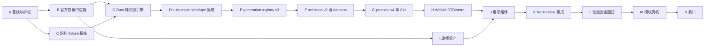

# NetHop 节点国家/地区元数据与 WebUI 改进 TDD 任务清单

> 状态：待实施
> 日期：2026-08-13
> 设计来源：`15-node-region-and-webui-improvement-design.md`
> 上位约束：`00-nethop-system-design.md`、`08-webui-design.md`、`10-subscription-selection-and-node-optimization-refactor-design.md`、`13-rust-node-benchmark-engine-design.md`
> 当前代码基线：control protocol v3、generation node registry v2、selection snapshot v1
> 目标代码基线：control protocol v4、generation node registry v3、selection snapshot v2
> 影响范围：官方数据快照、`nethop-subscription`、`nethop-core`、`nethopd`、`nethop-protocol`、`nethopctl`、WebUI、模块构建、许可证与 SBOM

## 1. 目的与完成边界

本文把 D15 转换为可逐项执行、可验证、可回滚定位的 TDD 开发任务。最终用户能力是：

1. Rust 从节点显示名称及跨订阅 aliases 中保守推导 ISO 3166-1 alpha-2 国家/地区代码；
2. 国家/地区标准身份来自固定版本官方数据，供应商别名和位置代码由 NetHop 人工审核；
3. 推导结果随 sealed generation 固化，经 typed IPC 交给 CLI、WebUI 和未来 Manager；
4. 节点页展示真实活动节点摘要、本地 SVG 旗帜、明确的 active/requested 状态和分档延迟；
5. 多订阅合并、稳定 node ID、fair pool、Rust benchmark、auto/manual selection、虚拟列表和安全边界不退化。

任务完成不表示提交或推送完成。本文不授权自动执行 `git commit`、`git push`、删除用户文件、下载收费数据或向真实订阅地址发送请求。

## 2. 当前事实与实施澄清

### 2.1 当前代码事实

- `nethop-subscription::ProxyNode` 保留 `display_name`；`DedupedNode` 保留 canonical node 和全部 aliases；
- fingerprint 只依赖连接语义，不包含显示名称，适合隔离展示元数据；
- `GenerationNodeRecord` 当前包含 stable ID、内部 tag、显示名、协议、source IDs 和 auto-candidate；
- `NodeListItem` 当前包含名称、协议、来源、延迟、alive、requested 和 active，缺少国家/地区；
- `nethop-protocol::PROTOCOL_VERSION` 和 WebUI bridge 当前均为 v3；
- WebUI `parseNode()` 使用严格字段集合，不能只改 daemon；
- `NodesView.vue` 当前内联两列节点卡片，已使用虚拟列表、全部测速和更多操作；
- D13/D14 已定义最多 64 个 auto candidates、4.5 秒 probe cutoff 和 4.9 秒 operation deadline；
- WebUI 构建已有 CSP、bundle metafile、许可证、CycloneDX SBOM 和模块 ZIP 校验链。

### 2.2 D15 必要的 typed active-terminal 补充

D15 要求区分真实节点、`direct`、`block` 和未解析状态，但当前 `active_node_id: Option<_>` 无法区分后三者。实施时直接把 selection snapshot 升为 v2：

```rust
enum ActiveTerminalSnapshot {
    Node { node_id: StableNodeId },
    Direct,
    Block,
    Unresolved { reason: SelectionDiagnosticCode },
}

struct NodeSelectionSnapshot {
    version: 2,
    intent: NodeSelectionIntent,
    active_terminal: ActiveTerminalSnapshot,
    changed_at: u64,
}
```

不保留 `active_node_id + degraded_reason` 双路径。WebUI 可以派生 `activeNodeId`，但 wire 只保留 typed union。该改动与 `display_territory_code` 一起进入 protocol v4，避免连续两次协议升级。

### 2.3 固定不变量

- `display_territory_code` 只表示展示推断，不表示真实出口国家；
- 结果只可能是受控 ISO alpha-2 或缺失；
- 禁止使用 server IP、域名、SNI、证书、端口或联网 GeoIP 推断；
- 国家/地区不能影响 fingerprint、dedupe、stable node ID、fair pool、测速或选优；
- 未知或强证据冲突返回 `None`；
- 地区未知不能成为过滤节点或拒绝订阅的理由；
- WebUI 禁止解析节点名称；
- 普通 build、test 和 Android 构建禁止联网更新数据；
- 真实订阅 fixture 必须去敏，不保存 URL、token、密码、UUID、key 或完整 outbound。

## 3. TDD 节点规则

每个任务严格执行：

```text
RED       添加因目标能力缺失而失败的最小测试
GREEN     只写让当前测试通过的最小生产代码
REFACTOR  消除当前节点引入的重复，保持窄接口和单一职责
VERIFY    运行当前测试、直接前驱测试和指定回归门禁
```

任务字段：

- `depends_on`：全部前驱完成后才能开始；
- `parallel_with`：前驱满足后可并行；
- `scope`：唯一交付边界；
- `RED/GREEN/REFACTOR/VERIFY`：必须保存的执行证据；
- `done`：客观完成条件。

约束：

1. RED 必须因能力缺失失败，不能因 fixture 路径、语法或环境错误失败；
2. 生成文件不能手工修改；必须通过生成器和 deterministic diff 测试更新；
3. 每个破坏性 schema/wire 变更先冻结旧 golden，再一次性切换所有消费者；
4. 同一阶段的重构不得改变尚未被测试描述的行为；
5. 真机测试不能替代 host/unit/browser 自动测试；
6. 任务执行时发现 D13/D14 基线未通过，应先恢复其门禁，不得在本功能中掩盖失败。

## 4. 测试分层与证据

| 层级 | 工具 | 负责范围 |
|---|---|---|
| 数据生成器单元 | PowerShell/Node 或 Rust 小工具测试 | 输入 schema、来源哈希、过滤聚合行、确定性输出 |
| Rust 单元 | `cargo test -p nethop-subscription` | code 值类型、tokenizer、Emoji、证据和冲突消解 |
| Rust property | 现有 `proptest` | 边界、任意 Unicode、误判、顺序无关、身份不变 |
| Rust crate 契约 | subscription/core/daemon/protocol/CLI tests | propagation、registry、wire、selection、benchmark 回归 |
| WebUI unit | Vitest Node | DTO、territory manifest、延迟 tier、view-model |
| WebUI browser | Vitest Browser Mode | 组件状态、虚拟列表、事件更新、资源降级 |
| WebUI E2E | Playwright Chrome Android | 页面工作流、viewport、主题、截图和布局 |
| 构建供应链 | PowerShell + npm report | 依赖锁、许可证、SBOM、CSP、bundle 和 ZIP |
| Android 真机 | ADB + 人工记录 | WebView 资源、真实 active node、测速切换和代理回归 |

建议证据目录：

```text
artifacts/tdd-territory/<task-id>/
  red.txt
  green.txt
  refactor.txt
  verify.txt
  manifest.json
```

`manifest.json` 至少记录 task ID、D15 章节、测试路径、命令、退出码、输入/输出 SHA-256、Git revision、Rust/Cargo/Node/npm 版本和 feature set。数据来源任务另记录 upstream URL、release/tag、抓取日期、许可证和原始文件 hash。

## 5. 需求追踪

| 需求域 | D15 来源 | 阶段 |
|---|---|---|
| before baseline 与不变量 | 3、13.1、13.6 | A |
| 官方身份/显示名供应链 | 5.2、7.1 | B |
| Rust 值类型和识别算法 | 5、6 | C |
| dedupe aliases 与真实格式 | 6.6、8.1-8.2 | D |
| generation registry | 8.3 | E |
| active terminal 与 daemon 快照 | 8.4、9.2 | F |
| protocol v4 与 CLI | 8.5-8.6 | G |
| WebUI DTO、store 与 view-model | 9.2-9.6 | H |
| 本地旗帜资产 | 9.7、11 | I |
| 节点展示组件 | 9.2-9.4、9.8 | J |
| NodesView 集成与测速 | 9.5-9.6 | K |
| 性能、安全和回归 | 10-13 | L |
| 模块与真机 | 14G、16 | M |
| 删除旧路径与文档收口 | 14、15、16 | N |

## 6. 依赖总图与推荐顺序



- A 的 Rust、WebUI、供应链基线可并行采集，A gate 串行收口；
- B 的来源 validator、CLDR parser 和生成输出测试可并行；
- C 必须在官方标准表和去敏识别 fixture 均稳定后开始；
- E 之后 F/G 必须串行，因为它们共同改变 selection 和 wire；
- H 与 I 在各自前驱满足后可并行；J 同时依赖两者；
- M 真机前必须完成 host、browser、bundle、license 和 ZIP 自动门禁。

## 7. 阶段 A：重构前基线与护栏

- [ ] **A001 - 冻结四种订阅格式的显示名称行为**
  - `depends_on`: none；`parallel_with`: A002,A003,A004,A005,A006
  - `scope`: Clash YAML、sing-box JSON、Surfboard INI、URI/base64 的 display name 和 accepted/rejected golden。
  - `RED`: baseline inventory 因缺少任一格式或 display name 断言失败。
  - `GREEN`: 只补测试和脱敏 fixture，不改 parser。
  - `REFACTOR/VERIFY`: 复用现有 fixture builder；运行 subscription parser contracts。
  - `done`: 四种格式均能证明名称原样归一化，敏感 canary 为零。

- [ ] **A002 - 冻结 dedupe、aliases、fingerprint 和 stable ID**
  - `depends_on`: none；`parallel_with`: A001,A003,A004,A005,A006
  - `scope`: 相同连接语义、不同名称和不同来源合并后的 aliases、source refs、fingerprint 与 node ID。
  - `RED`: 缺少 aliases 顺序或 identity 断言时 baseline validator 失败。
  - `GREEN`: 增加 before golden，不改 canonical bytes。
  - `REFACTOR/VERIFY`: 使用统一 node builder；运行 dedupe/filter/property 回归。
  - `done`: 后续可逐字节证明 territory 元数据不会改变节点身份。

- [ ] **A003 - 冻结 generation node registry v2**
  - `depends_on`: none；`parallel_with`: A001,A002,A004,A005,A006
  - `scope`: v2 schema、record 字段、排序、auto pool、digest、publish/load 和非法输入。
  - `RED`: fixture 未覆盖 digest 或 source IDs 时失败。
  - `GREEN`: 补齐 core golden 和 before manifest。
  - `REFACTOR/VERIFY`: 复用 registry fixture helper；运行 core/generation contracts。
  - `done`: v2 wire 和 digest 有冻结样本，供 v3 破坏性对比。

- [ ] **A004 - 冻结 protocol v3、selection v1 与 CLI 输出**
  - `depends_on`: none；`parallel_with`: A001,A002,A003,A005,A006
  - `scope`: hello、node.list、auto/manual selection、active/unresolved、JSON 和 human output。
  - `RED`: v3 inventory 未包含严格 node 字段或 selection 状态时失败。
  - `GREEN`: 只补 protocol/CLI golden。
  - `REFACTOR/VERIFY`: 统一 envelope builder；运行 protocol、CLI、UDS contracts。
  - `done`: v4 可以明确拒绝 v3，并证明 CLI 旧能力映射完整。

- [ ] **A005 - 冻结 D13/D14 benchmark 与选优行为**
  - `depends_on`: none；`parallel_with`: A001,A002,A003,A004,A006
  - `scope`: 64 candidate 上限、probe states、4.5/4.9 秒预算、manual 不切换、auto tolerance 和 generation fence。
  - `RED`: benchmark baseline 缺少任一终态或 intent 场景时失败。
  - `GREEN`: 补 evidence mapping，不改 benchmark production code。
  - `REFACTOR/VERIFY`: 复用 D14 gate；运行 node benchmark、operational control、worker contracts。
  - `done`: territory 变更无法掩盖或放宽 D14 SLA。

- [ ] **A006 - 冻结当前节点页与前端资源预算**
  - `depends_on`: none；`parallel_with`: A001,A002,A003,A004,A005
  - `scope`: 两列虚拟列表、来源分组、auto/manual、全部测速、更多操作、bundle、CSS 和截图基线。
  - `RED`: 缺 viewport/theme/large-list 或 bundle artifact 时失败。
  - `GREEN`: 补 Vitest/Playwright baseline 和构建报告，不改视图。
  - `REFACTOR/VERIFY`: 复用 MockHost 与现有 release-quality fixture。
  - `done`: 360x640、393x873、412x915、600x960 及大列表均有 before 证据。

- [ ] **A007 - 建立真实 YAML 去敏 fixture 生成器**
  - `depends_on`: A001,A002；`parallel_with`: A008
  - `scope`: 从 GLaDOS、魔戒与 fsllist 样本仅提取名称、格式类型、期望 territory 和信息节点标识。
  - `RED`: fixture 包含 server、port、username、password、UUID、URL、token、Reality public key 或 short ID 时 validator 失败。
  - `GREEN`: 实现测试侧最小去敏导出器和固定 manifest。
  - `REFACTOR/VERIFY`: 统一 canary 扫描；对原始样本只读。
  - `done`: fixture 可公开测试且与原始名称集合有 hash 关联，不含连接参数。

- [ ] **A008 - 建立 D16 evidence manifest validator**
  - `depends_on`: A003,A004,A005,A006；`parallel_with`: A007
  - `scope`: task、D15 章节、RED/GREEN/REFACTOR/VERIFY、hash、版本、secret 字段。
  - `RED`: 缺阶段或包含敏感键的 manifest 被错误接受。
  - `GREEN`: 实现 repository-only validator。
  - `REFACTOR/VERIFY`: 复用 D12/D14/WebUI evidence 字段规范。
  - `done`: 证据不完整或泄密时 gate 稳定失败。

- [ ] **A009 - 通过 D16 baseline gate**
  - `depends_on`: A001,A002,A003,A004,A005,A006,A007,A008；`parallel_with`: none
  - `scope`: 聚合 Rust、wire、WebUI、bundle、真实 fixture 和敏感扫描基线。
  - `RED`: 任一 before 证据缺失时 gate 失败。
  - `GREEN`: 只连接已有命令与 manifest。
  - `REFACTOR/VERIFY`: 输出机器可读总报告。
  - `done`: A gate 全绿，记录未修改生产代码。

## 8. 阶段 B：官方数据供应链与生成标准表

- [ ] **B001 - 冻结官方来源、版本和许可证 manifest schema**
  - `depends_on`: A009；`parallel_with`: B002,B003
  - `scope`: `source-versions.json` 的 URL、release/tag、日期、路径、SHA-256、license。
  - `RED`: 缺 hash、使用浮动 latest 或未知许可证仍被接受。
  - `GREEN`: 实现 schema validator 和有效/无效 fixture。
  - `REFACTOR/VERIFY`: URL 仅允许 D15 列出的 ISO/UN/Unicode 官方 host。
  - `done`: 数据来源可复核且不依赖构建时网络。

- [ ] **B002 - 固定 UN M49/ISO identity 输入快照**
  - `depends_on`: A009；`parallel_with`: B001,B003
  - `scope`: current country/area 行的 alpha-2、alpha-3；排除 global/region/sub-region 聚合行。
  - `RED`: 聚合代码或缺 alpha code 的行进入 identity 集合。
  - `GREEN`: 增加固定、可再分发的最小输入快照或由维护者提供的官方导出。
  - `REFACTOR/VERIFY`: 记录原始 hash；交叉核对 `CN/HK/TW/MO/JP/US/GB/TH`。
  - `done`: alpha-2/alpha-3 唯一，只有当前受控 country/area identity。

- [ ] **B003 - 固定 CLDR en 与 zh-Hans territory 输入**
  - `depends_on`: A009；`parallel_with`: B001,B002
  - `scope`: canonical/common English 与简体中文显示名，不导入洲和 containment 集合。
  - `RED`: 缺 locale、draft 不满足阈值或聚合 territory 被当成节点结果。
  - `GREEN`: 固定 CLDR release 输入与 Unicode-3.0 许可证。
  - `REFACTOR/VERIFY`: 只保留生成所需字段；校验 `China/中国` 等 canonical name。
  - `done`: 每个受控 alpha-2 有唯一 en/zh-Hans 名称或显式、可审核缺失诊断。

- [ ] **B004 - 定义 recognition 与 location 数据 schema**
  - `depends_on`: B001；`parallel_with`: B005
  - `scope`: `recognition.toml` 和 `locations.toml` 的严格字段、边界和 provenance。
  - `RED`: canonical/alpha code 重复进 alias、机场码非三字母、未知 territory 或重复 code 被接受。
  - `GREEN`: 实现 repository-only schema validator。
  - `REFACTOR/VERIFY`: `city_names`、`airport_codes`、`metropolitan_codes` 分离。
  - `done`: 人工词典不能污染标准表或引入任意供应商私有码。

- [ ] **B005 - 建立首版人工识别和位置表**
  - `depends_on`: B001；`parallel_with`: B004
  - `scope`: D15 首版 territory、中文/英文别名、UK、常见城市、机场和都市区代码。
  - `RED`: D15 中 `NRT/HND/TYO/HKG/HKT/LAX` 等记录缺失或互相冲突。
  - `GREEN`: 写最小人工表和每条来源说明。
  - `REFACTOR/VERIFY`: 删除 canonical/alpha 重复项；不导入全球机场数据库。
  - `done`: 每项都有正向、边界和误判 fixture。

- [ ] **B006 - 实现标准表生成器输入解析**
  - `depends_on`: B002,B003,B004；`parallel_with`: none
  - `scope`: 结构化解析 UN/CLDR/人工表，禁止 ad-hoc 文本替换。
  - `RED`: malformed、duplicate、unknown reference 或 hash 不符仍生成输出。
  - `GREEN`: 实现最小生成器 parser 和稳定诊断。
  - `REFACTOR/VERIFY`: 数据格式各自 adapter，核心 join 只接 typed records。
  - `done`: 错误输入 fail closed，无半生成文件。

- [ ] **B007 - 生成 Rust `TerritoryRecord` registry**
  - `depends_on`: B005,B006；`parallel_with`: B008
  - `scope`: alpha-2、alpha-3、English/Chinese canonical name 的只读静态表。
  - `RED`: 目标 Rust fixture 不存在或记录不一致。
  - `GREEN`: 从 typed inputs 生成 `generated/territory_registry.rs`。
  - `REFACTOR/VERIFY`: 固定排序与格式；禁止生成时间戳。
  - `done`: 全表唯一、可编译、两次生成字节相同。

- [ ] **B008 - 生成 WebUI territory manifest**
  - `depends_on`: B005,B006；`parallel_with`: B007
  - `scope`: WebUI 可接受 alpha-2、canonical 显示名和 flag asset coverage 的生成输入。
  - `RED`: 前端手写 allowlist 与 Rust 输出集合出现差异。
  - `GREEN`: 同一生成器输出稳定 TS/JSON manifest。
  - `REFACTOR/VERIFY`: manifest 不包含识别 aliases、城市或机场表。
  - `done`: Rust 和 WebUI 支持集合来自同一输入 hash。

- [ ] **B009 - 门禁生成确定性、来源和许可证**
  - `depends_on`: B007,B008；`parallel_with`: none
  - `scope`: clean regeneration、hash、Unicode-3.0、官方 provenance、普通 build 离线。
  - `RED`: 修改生成文件、删除许可证或引入联网 build hook 时失败。
  - `GREEN`: 实现 `territory-data-gate` 脚本。
  - `REFACTOR/VERIFY`: 在临时目录生成并比较，不覆盖工作区作为测试副作用。
  - `done`: B gate 全绿，生成产物可审计、可复现。

## 9. 阶段 C：Rust 纯国家/地区识别引擎

- [ ] **C001 - 定义 `DisplayTerritoryCode` 值类型**
  - `depends_on`: B009；`parallel_with`: C002,C003
  - `scope`: 两位大写 ASCII、受控 registry membership、serde 和无效输入。
  - `RED`: 小写、长度错误、聚合代码和未知代码被接受。
  - `GREEN`: 实现窄构造器、accessor、Display/serde。
  - `REFACTOR/VERIFY`: 不引入大型 enum 或运行时 HashMap。
  - `done`: 全 registry round-trip，非法代码 fail closed。

- [ ] **C002 - 定义 typed `TerritoryRecord` 查询**
  - `depends_on`: B009；`parallel_with`: C001,C003
  - `scope`: alpha-2、alpha-3、en、zh-Hans 的零分配查找。
  - `RED`: alpha-3 逆查或 canonical name 查找缺失。
  - `GREEN`: 在生成静态 slice 上实现最小 lookup。
  - `REFACTOR/VERIFY`: 不复制标准表，不增加 lazy global。
  - `done`: `JP/JPN/Japan/日本` 均指向同一 record。

- [ ] **C003 - 定义 typed recognition/location 静态表**
  - `depends_on`: B009；`parallel_with`: C001,C002
  - `scope`: 人工表的 typed Rust 投影和引用完整性。
  - `RED`: unknown territory、重复 alias 或 airport/metropolitan 冲突未被发现。
  - `GREEN`: 生成或编译期包含最小只读表。
  - `REFACTOR/VERIFY`: 标准 identity 与人工 aliases 保持不同类型。
  - `done`: 表间引用完整且不存在同级多 territory 冲突。

- [ ] **C004 - 实现无分配 ASCII/CJK token 边界扫描**
  - `depends_on`: C001,C002,C003；`parallel_with`: C005
  - `scope`: 字符串边界、空格、`-_ |/.()`、全角和中日韩标点。
  - `RED`: `STATUS/RUSSIA/SINGAPORE` 误匹配短 alpha token。
  - `GREEN`: 实现单遍 scanner，不使用 regex。
  - `REFACTOR/VERIFY`: table-driven delimiter tests 与任意 Unicode property。
  - `done`: 独立大写 token 命中，长 ASCII 单词不被切片误判。

- [ ] **C005 - 实现 Unicode 国旗 Emoji 解析**
  - `depends_on`: C001,C002,C003；`parallel_with`: C004
  - `scope`: 两个 Regional Indicator 到 alpha-2、非法/孤立/多旗帜。
  - `RED`: 孤立 indicator、unsupported pair 或冲突旗帜产生结果。
  - `GREEN`: 实现最小 code point 转换与 registry 校验。
  - `REFACTOR/VERIFY`: 不依赖 Emoji 字体或 Unicode 大型数据库。
  - `done`: E1 正向和失败矩阵通过。

- [ ] **C006 - 实现 E2 canonical 与人工名称证据**
  - `depends_on`: C004,C005；`parallel_with`: C007,C008,C009
  - `scope`: 中文确定性名称和英文单词/短语边界，不导入 CLDR 全部 variant。
  - `RED`: `日本/Hong Kong/South Korea` 缺失或 `Korea` 被武断映射。
  - `GREEN`: 扫描 canonical name 和人工审核 aliases。
  - `REFACTOR/VERIFY`: display record 与 recognition record 分工不交叉。
  - `done`: D15 名称样本和歧义反例通过。

- [ ] **C007 - 实现 E3 alpha-2/alpha-3/code alias**
  - `depends_on`: C004,C005；`parallel_with`: C006,C008,C009
  - `scope`: `JP/JPN/GB/GBR/UK` 等独立大写 token。
  - `RED`: 小写 token、长单词内片段或 `EU` 聚合代码被识别。
  - `GREEN`: 复用 scanner 和 typed registry lookup。
  - `REFACTOR/VERIFY`: `code_aliases` 只处理非标准人工别名。
  - `done`: 标准代码自动覆盖全 registry，输出始终 alpha-2。

- [ ] **C008 - 实现 E4 IATA 机场和都市区代码**
  - `depends_on`: C004,C005；`parallel_with`: C006,C007,C009
  - `scope`: 精简 location 表的三字母 token，包含 `HKT -> TH`。
  - `RED`: `SINGLE` 命中 `SIN`、`HKT` 命中 HK 或都市区码遗漏。
  - `GREEN`: 复用 token scanner 和 typed location lookup。
  - `REFACTOR/VERIFY`: airport/metropolitan 分类保留，识别优先级相同。
  - `done`: D15 机场/都市区矩阵与相近字符串反例通过。

- [ ] **C009 - 实现 E5 城市名称证据**
  - `depends_on`: C004,C005；`parallel_with`: C006,C007,C008
  - `scope`: 受控中英文城市全称，拒绝 `LA` 等歧义短码。
  - `RED`: `Tokyo/东京/Frankfurt/洛杉矶` 缺失或 `LA` 被接受。
  - `GREEN`: 扫描 `city_names`。
  - `REFACTOR/VERIFY`: 城市不回写 `TerritoryRecord`。
  - `done`: E5 正向与歧义矩阵通过。

- [ ] **C010 - 实现证据优先级与冲突消解**
  - `depends_on`: C006,C007,C008,C009；`parallel_with`: none
  - `scope`: E1-E5 聚合、同级冲突、强弱冲突和无证据。
  - `RED`: first-match-wins 导致 `日本-美国` 或 aliases 冲突被错误接受。
  - `GREEN`: 实现显式 evidence accumulator 和 deterministic resolve。
  - `REFACTOR/VERIFY`: 内部诊断只记录 evidence kind/code，不记录 endpoint。
  - `done`: `日本-US -> JP`、`日本-美国 -> None`、`香港HKT-A -> HK + weak conflict` 等冻结结果通过。

- [ ] **C011 - 实现多名称顺序无关推断 API**
  - `depends_on`: C010；`parallel_with`: C012,C013
  - `scope`: `infer_display_territory(names)` 对 canonical name 和 aliases 一次汇总。
  - `RED`: 调换 source/alias 顺序改变结果。
  - `GREEN`: 合并全部 evidence 后只 resolve 一次。
  - `REFACTOR/VERIFY`: 空输入、重复输入和 bounded input tests。
  - `done`: 结果对迭代顺序和重复 alias 不敏感。

- [ ] **C012 - 建立误判 property/fuzz 回归**
  - `depends_on`: C010；`parallel_with`: C011,C013
  - `scope`: 任意 Unicode、ASCII 单词包围、分隔符、case、冲突和 panic safety。
  - `RED`: 已知最小反例能触发误判或 panic。
  - `GREEN`: 修正 scanner/resolve 的最小边界。
  - `REFACTOR/VERIFY`: 保存 proptest regression，禁止 regex/联网依赖。
  - `done`: 固定 seed 和回归 corpus 全绿。

- [ ] **C013 - 建立 2,000 名称性能与分配门禁**
  - `depends_on`: C010；`parallel_with`: C011,C012
  - `scope`: 每项最多 128 bytes，host release p95 <=5ms，热函数无临时 String/regex。
  - `RED`: benchmark/evidence 缺失或阈值未执行。
  - `GREEN`: 添加受控 benchmark harness，不先优化生产代码。
  - `REFACTOR/VERIFY`: 只有证据超标才进行局部优化。
  - `done`: 时间、分配方法、机器摘要和结果 hash 均保存。

- [ ] **C014 - 通过 Rust 纯识别引擎 gate**
  - `depends_on`: C011,C012,C013；`parallel_with`: none
  - `scope`: 值类型、表、E1-E5、冲突、property、性能和依赖边界。
  - `RED`: 任一子证据缺失时失败。
  - `GREEN`: 聚合现有命令。
  - `REFACTOR/VERIFY`: `cargo tree` 证明未新增 runtime parser/GeoIP/regex。
  - `done`: C gate 全绿。

## 10. 阶段 D：订阅归一化、dedupe 与真实 fixture

- [ ] **D001 - 将 territory 元数据加入稳定 conversion node**
  - `depends_on`: C014；`parallel_with`: D002
  - `scope`: conversion 输出可携带 `Option<DisplayTerritoryCode>`，不进入连接语义。
  - `RED`: conversion fixture 无法表达已知/未知 territory。
  - `GREEN`: 增加最小字段/accessor。
  - `REFACTOR/VERIFY`: 字段不复制到协议 outbound JSON。
  - `done`: 已知和未知均可 round-trip，sing-box outbound 不出现自定义键。

- [ ] **D002 - 在 dedupe aliases 完成后计算一次**
  - `depends_on`: C014；`parallel_with`: D001
  - `scope`: canonical display name 与全部 aliases 共同推断。
  - `RED`: 后到 alias 补充或冲突不能改变推断结果。
  - `GREEN`: 在 stable conversion 冻结前调用纯 API。
  - `REFACTOR/VERIFY`: parser adapter 不分别实现规则。
  - `done`: 多来源补充/冲突样本符合 D15。

- [ ] **D003 - 回归四种格式共享同一识别链**
  - `depends_on`: D001,D002；`parallel_with`: D004,D005
  - `scope`: 相同显示名通过 Clash/sing-box/Surfboard/URI 得到相同代码。
  - `RED`: 任一格式结果不同或另有私有 mapping。
  - `GREEN`: 只修正统一 conversion 接入点。
  - `REFACTOR/VERIFY`: `rg` 门禁禁止 parser 文件引用 recognition table。
  - `done`: format-invariance contract 通过。

- [ ] **D004 - 证明 fingerprint、node ID 和 dedupe 不变**
  - `depends_on`: D001,D002；`parallel_with`: D003,D005
  - `scope`: before/after canonical bytes、fingerprint、stable ID、aliases/source refs 数量。
  - `RED`: 加字段后 identity golden 漂移。
  - `GREEN`: 从 identity 编码中排除展示字段。
  - `REFACTOR/VERIFY`: property 覆盖修改词典不改变 identity。
  - `done`: A002 全部 before bytes 保持。

- [ ] **D005 - 验证未知地区不影响过滤和 admission**
  - `depends_on`: D001,D002；`parallel_with`: D003,D004
  - `scope`: `Fast/Balancer` 和信息节点保持原 accepted/filtered 语义。
  - `RED`: `None` 被当成 invalid node 或默认国家。
  - `GREEN`: territory 作为非 admission 元数据传播。
  - `REFACTOR/VERIFY`: 过滤器无 territory 条件。
  - `done`: accepted/rejected/duplicate 数量与 A001/A002 一致。

- [ ] **D006 - 通过 GLaDOS 去敏 fixture**
  - `depends_on`: D003,D004,D005；`parallel_with`: D007,D008
  - `scope`: `US/TW/JP/SG` 正确，`Fast/Balancer` 未知。
  - `RED`: 任一期望缺失或额外误识别。
  - `GREEN`: 仅修正经审核的表或边界算法。
  - `REFACTOR/VERIFY`: 禁止加入 server 域名规则。
  - `done`: fixture 逐项匹配且无凭据。

- [ ] **D007 - 通过魔戒去敏 fixture**
  - `depends_on`: D003,D004,D005；`parallel_with`: D006,D008
  - `scope`: 42 个明确节点识别，2 个信息节点 territory 未知且不因此过滤。
  - `RED`: 任何明确名称错误、信息节点被赋旗帜或节点数变化。
  - `GREEN`: 最小扩充人工 alias/位置表。
  - `REFACTOR/VERIFY`: `香港HKT-A` 强弱冲突有显式测试。
  - `done`: fixture 期望和 parser 数量同时通过。

- [ ] **D008 - 通过 fsllist 去敏 fixture**
  - `depends_on`: D003,D004,D005；`parallel_with`: D006,D007
  - `scope`: 51 个节点按名称开头的独立 alpha-2 token 识别，覆盖 `GB/US/IN/JP/RO/HK/ID/NL/SG/FR`。
  - `RED`: 任一节点未知、误识别、代码与城市名称产生强证据冲突，或 accepted 数量偏离 51。
  - `GREEN`: 通过官方标准 registry 支持 `RO/ID`；不为已有强 alpha-2 的城市批量增加 location alias。
  - `REFACTOR/VERIFY`: fixture 只保留名称和期望 code；扫描 username/password/UUID/Reality key/server/port 为零。
  - `done`: 51/51 识别正确、前缀分布与脱敏 manifest 一致、无凭据。

- [ ] **D009 - 通过 subscription territory gate**
  - `depends_on`: D006,D007,D008；`parallel_with`: none
  - `scope`: format、dedupe、identity、unknown、三份真实 fixture 和 secret scan。
  - `RED`: 任一 mapping/identity 证据缺失时失败。
  - `GREEN`: 聚合测试。
  - `REFACTOR/VERIFY`: 运行 subscription 全 feature matrix。
  - `done`: D gate 全绿。

## 11. 阶段 E：generation node registry v3

- [ ] **E001 - 冻结 v3 registry 新 golden**
  - `depends_on`: D009；`parallel_with`: E002
  - `scope`: schema `nethop-generation-nodes-v3` 和 optional `display_territory_code`。
  - `RED`: v3 golden 无法被当前模型构造。
  - `GREEN`: 先写期望 fixture，不兼容读取 v2。
  - `REFACTOR/VERIFY`: 已知字段写 alpha-2，未知字段省略。
  - `done`: 新 wire 形态被测试冻结。

- [ ] **E002 - 扩展 `GenerationNodeRecord` 值约束**
  - `depends_on`: D009；`parallel_with`: E001
  - `scope`: optional typed territory 的构造、serde 和非法 code。
  - `RED`: 小写/未知 code 或任意 String 被接受。
  - `GREEN`: 使用 `DisplayTerritoryCode`，不在 core 重复解析名称。
  - `REFACTOR/VERIFY`: constructor 仍保持单一 validation path。
  - `done`: record 只能包含已验证 code 或 None。

- [ ] **E003 - 从 candidate build 传播 territory**
  - `depends_on`: E001,E002；`parallel_with`: E004,E005
  - `scope`: stable conversion -> generation record。
  - `RED`: build_candidate 丢失已识别 code。
  - `GREEN`: 增加单向字段映射。
  - `REFACTOR/VERIFY`: daemon 不重新调用名称推断。
  - `done`: single/merge candidate golden 均带正确字段。

- [ ] **E004 - 更新 registry digest 与 publish/load**
  - `depends_on`: E001,E002；`parallel_with`: E003,E005
  - `scope`: territory 纳入 registry bytes/digest，事务发布保持不变。
  - `RED`: 改变 territory 不改变 registry digest或 load 丢字段。
  - `GREEN`: 复用现有 serialization/digest path。
  - `REFACTOR/VERIFY`: fingerprint/node ID 仍不变。
  - `done`: sealed generation 元数据稳定可验证。

- [ ] **E005 - 明确拒绝 registry v2**
  - `depends_on`: E001,E002；`parallel_with`: E003,E004
  - `scope`: 开发期无兼容层，旧 registry 返回稳定 schema 错误。
  - `RED`: v2 被默认字段静默接受。
  - `GREEN`: 升级唯一 schema 常量并删除兼容默认。
  - `REFACTOR/VERIFY`: 新订阅/LKG 重新生成 generation 的路径有契约。
  - `done`: v2 fail closed，当前 runtime 发布失败时保持旧 generation。

- [ ] **E006 - 回归 auto pool、排序和来源注册表**
  - `depends_on`: E003,E004,E005；`parallel_with`: none
  - `scope`: record 顺序、auto pool 顺序、source IDs、terminal mapping 不变。
  - `RED`: territory 影响排序或候选集合。
  - `GREEN`: 排序键保持 stable ID。
  - `REFACTOR/VERIFY`: 对比 A003 和 D14 fair pool golden。
  - `done`: 除 schema/字段/digest 外行为无差异。

- [ ] **E007 - 通过 generation v3 gate**
  - `depends_on`: E006；`parallel_with`: none
  - `scope`: schema、传播、digest、发布、拒旧和 pool 回归。
  - `RED`: 任一证据缺失时失败。
  - `GREEN`: 聚合 core/daemon generation tests。
  - `REFACTOR/VERIFY`: `git diff` 无双 schema production path。
  - `done`: E gate 全绿。

## 12. 阶段 F：selection v2、daemon 快照与运行时一致性

- [ ] **F001 - 定义 typed `ActiveTerminalSnapshot`**
  - `depends_on`: E007；`parallel_with`: F002
  - `scope`: node/direct/block/unresolved 四态及不变量。
  - `RED`: 当前 optional ID 无法区分 direct/block/unresolved。
  - `GREEN`: 实现 tagged enum 和 bounded reason。
  - `REFACTOR/VERIFY`: 复用现有 `ActiveTerminal` 解析结果，不复制 core tag。
  - `done`: 四态 round-trip，node 必有 ID，unresolved 必有 reason。

- [ ] **F002 - 升级 `NodeSelectionSnapshot` 为 v2**
  - `depends_on`: E007；`parallel_with`: F001
  - `scope`: 用 `active_terminal` 替换 `active_node_id/degraded_reason`。
  - `RED`: v2 fixture 当前无法序列化，非法组合被接受。
  - `GREEN`: 破坏性替换模型和 getters。
  - `REFACTOR/VERIFY`: 删除 v1 production compatibility path。
  - `done`: intent/changed_at 保留，terminal 状态唯一。

- [ ] **F003 - 将 registry territory 加入 `NodeListItem`**
  - `depends_on`: F001,F002；`parallel_with`: F004
  - `scope`: `display_territory_code` optional field和构造校验。
  - `RED`: join snapshot 丢失 code 或重新解析名称。
  - `GREEN`: 只从当前 generation record 复制。
  - `REFACTOR/VERIFY`: unknown 省略，节点字段上限不放宽。
  - `done`: node DTO 与 sealed registry 一致。

- [ ] **F004 - 更新 active/requested join 语义**
  - `depends_on`: F001,F002；`parallel_with`: F003
  - `scope`: active terminal 四态、manual requested、auto 和节点 flags。
  - `RED`: direct/block 错误标记任意节点 active，requested pending 被当 active。
  - `GREEN`: 由 typed terminal 派生 `is_active`。
  - `REFACTOR/VERIFY`: 不回退 registry 第一项。
  - `done`: active 与 requested 可独立表达。

- [ ] **F005 - 保持 benchmark observation 不修改 territory**
  - `depends_on`: F003,F004；`parallel_with`: F006
  - `scope`: latency/alive 更新只改变观察字段。
  - `RED`: benchmark join 重建 node 时丢失 territory。
  - `GREEN`: `set_observation` 保持元数据。
  - `REFACTOR/VERIFY`: manual/auto 和 partial/timeout 矩阵。
  - `done`: D14 report 后 territory/来源/协议不变。

- [ ] **F006 - 保持 generation fence 与事件 query 模型**
  - `depends_on`: F003,F004；`parallel_with`: F005
  - `scope`: 旧 benchmark/selection 结果不污染新 generation；事件不复制 territory 大对象。
  - `RED`: superseded report 覆盖新节点或事件 payload 出现第二份完整 DTO。
  - `GREEN`: 复用 generation fence，事件只通知失效。
  - `REFACTOR/VERIFY`: node.list 是唯一事实查询。
  - `done`: generation 切换后一致加载新 registry。

- [ ] **F007 - 通过 daemon selection/territory gate**
  - `depends_on`: F005,F006；`parallel_with`: none
  - `scope`: 四态、node list、benchmark、events、generation fence。
  - `RED`: 任一状态或元数据证据缺失时失败。
  - `GREEN`: 聚合 daemon contracts。
  - `REFACTOR/VERIFY`: operational control、worker、event、selection 全量回归。
  - `done`: F gate 全绿。

## 13. 阶段 G：control protocol v4 与 CLI

- [ ] **G001 - 冻结 protocol v4 golden**
  - `depends_on`: F007；`parallel_with`: G002
  - `scope`: envelope v4、node territory、selection v2 四态和 hello 范围。
  - `RED`: 当前 v3 parser 拒绝目标 fixture。
  - `GREEN`: 先写 after golden，不修改旧 fixture。
  - `REFACTOR/VERIFY`: 字段命名固定 snake_case。
  - `done`: v4 wire 可逐字段审查。

- [ ] **G002 - 升级唯一 protocol 版本为 v4**
  - `depends_on`: F007；`parallel_with`: G001
  - `scope`: Rust protocol、daemon、nethopctl 和 WebUI bridge 版本常量。
  - `RED`: v4 hello 不兼容且 v3仍被接受。
  - `GREEN`: 一次性切换版本并拒绝其他版本。
  - `REFACTOR/VERIFY`: 删除 v3 production 分支。
  - `done`: 仅 v4 compatible，错误码稳定。

- [ ] **G003 - 定义 protocol node territory DTO**
  - `depends_on`: G001,G002；`parallel_with`: G004,G005
  - `scope`: known code 输出、unknown 省略、非法 code 不能构造。
  - `RED`: v4 node 丢字段或输出 null/空字符串。
  - `GREEN`: 复用 typed code serde。
  - `REFACTOR/VERIFY`: 不发送 canonical name、aliases、location evidence。
  - `done`: 单节点新增 JSON 有界。

- [ ] **G004 - 定义 selection v2 wire union**
  - `depends_on`: G001,G002；`parallel_with`: G003,G005
  - `scope`: node/direct/block/unresolved tagged JSON。
  - `RED`: 非法 kind/字段组合被接受。
  - `GREEN`: 严格 serde tagged enum。
  - `REFACTOR/VERIFY`: 删除 v1 active/degraded 双字段。
  - `done`: 四态 golden 和错误矩阵通过。

- [ ] **G005 - 更新 hello feature/operation 契约**
  - `depends_on`: G001,G002；`parallel_with`: G003,G004
  - `scope`: protocol range=4、territory metadata capability 和既有 operations。
  - `RED`: 新客户端不能确认该字段或 supported operation 回归。
  - `GREEN`: 增加稳定 feature key，不增加新 RPC。
  - `REFACTOR/VERIFY`: feature 只用于协商，不产生兼容 fallback。
  - `done`: hello golden 与 daemon 实际能力一致。

- [ ] **G006 - 更新 nethopctl JSON 输出**
  - `depends_on`: G003,G004,G005；`parallel_with`: G007
  - `scope`: `node list --json` 原样输出 territory 和 typed active terminal。
  - `RED`: CLI 丢字段或扁平化回旧 shape。
  - `GREEN`: 更新 DTO/serializer 消费链。
  - `REFACTOR/VERIFY`: 敏感字段继续缺失。
  - `done`: CLI/protocol golden 字节一致。

- [ ] **G007 - 保持 nethopctl human 输出简洁**
  - `depends_on`: G003,G004,G005；`parallel_with`: G006
  - `scope`: 不增加旗帜或宽表，只正确展示 active terminal 状态。
  - `RED`: direct/block/unresolved 被显示为无节点或任意节点。
  - `GREEN`: 更新窄文案投影。
  - `REFACTOR/VERIFY`: 终端宽度与旧命令快照。
  - `done`: human output 可读且不承担地区本地化。

- [ ] **G008 - 明确拒绝 v3 客户端和旧 selection wire**
  - `depends_on`: G006,G007；`parallel_with`: none
  - `scope`: hello、request、response fixture 的破坏性拒绝。
  - `RED`: v3 被默认字段或宽松 parser 接受。
  - `GREEN`: 收紧版本和严格字段门禁。
  - `REFACTOR/VERIFY`: 无双写/双读路径。
  - `done`: v3 fail closed，v4 全功能通过。

- [ ] **G009 - 通过 protocol/CLI gate**
  - `depends_on`: G008；`parallel_with`: none
  - `scope`: v4、node、selection、hello、CLI 和 UDS。
  - `RED`: 任一 golden/协商/操作回归失败。
  - `GREEN`: 聚合测试。
  - `REFACTOR/VERIFY`: protocol、CLI、daemon UDS 全量运行。
  - `done`: G gate 全绿。

## 14. 阶段 H：WebUI DTO、store 与纯 view-model

- [ ] **H001 - 将 WebUI control envelope 升级到 v4**
  - `depends_on`: G009；`parallel_with`: H002,H003
  - `scope`: bridge command、hello 和 envelope strict parser。
  - `RED`: v4 被拒绝或 v3 被接受。
  - `GREEN`: 一次性更新常量和 fixture。
  - `REFACTOR/VERIFY`: 删除 v3 client path。
  - `done`: WebUI 只与 protocol v4 交互。

- [ ] **H002 - 解析 `display_territory_code`**
  - `depends_on`: G009；`parallel_with`: H001,H003
  - `scope`: generated manifest allowlist、optional field 和 camelCase DTO。
  - `RED`: lowercase、unknown、长度错误被接受或 known code 丢失。
  - `GREEN`: `NodeDto.displayTerritoryCode?` 严格解析。
  - `REFACTOR/VERIFY`: 不在 TS 手写第二份 code 列表。
  - `done`: Rust/WebUI code 集合契约一致。

- [ ] **H003 - 解析 selection v2 typed terminal**
  - `depends_on`: G009；`parallel_with`: H001,H002
  - `scope`: node/direct/block/unresolved union 和 intent。
  - `RED`: 非法字段组合或 v1 shape 被接受。
  - `GREEN`: 实现严格 parser 与 TS discriminated union。
  - `REFACTOR/VERIFY`: `activeNodeId` 仅作为 node-kind computed projection。
  - `done`: 四态 consumer 测试通过。

- [ ] **H004 - 更新 runtime store 原子节点快照**
  - `depends_on`: H001,H002,H003；`parallel_with`: H005,H006
  - `scope`: nodes、selection、territory 一次替换，避免半帧状态。
  - `RED`: selection 先于 nodes 导致 current summary 回退错误。
  - `GREEN`: `loadNodeSnapshot` 原子提交。
  - `REFACTOR/VERIFY`: 事件只触发 query，不拼装字段。
  - `done`: 快照切换期间无伪 active node。

- [ ] **H005 - 定义纯延迟状态模型**
  - `depends_on`: H001,H002,H003；`parallel_with`: H004,H006
  - `scope`: good/medium/poor/unknown/measuring/timeout/unavailable/protocol_error。
  - `RED`: `119/120/249/250` 或失败状态映射错误。
  - `GREEN`: 实现纯函数和固定中文文案 key。
  - `REFACTOR/VERIFY`: 不从颜色反推业务状态。
  - `done`: 数字 tier 与终态正交、边界完整。

- [ ] **H006 - 定义 active node summary view-model**
  - `depends_on`: H001,H002,H003；`parallel_with`: H004,H005
  - `scope`: node/direct/block/unresolved/service stopped/syncing，多来源 `Primary +N`。
  - `RED`: node 缺失时回退列表第一项，direct/block 无法区分。
  - `GREEN`: 从 typed selection、node map、status、source map 纯投影。
  - `REFACTOR/VERIFY`: 无网络、DOM 或名称解析依赖。
  - `done`: 所有摘要状态有稳定 view-model。

- [ ] **H007 - 将 benchmark transient state 按 node ID 合并**
  - `depends_on`: H004,H005,H006；`parallel_with`: none
  - `scope`: running 只标记本轮 candidates，terminal 清除旧延迟并应用状态。
  - `RED`: 非 candidate 进入 measuring、timeout 复用旧 latency 或 manual 测速切 active。
  - `GREEN`: 复用 D14 operation store，批量一次提交。
  - `REFACTOR/VERIFY`: 页面卸载不取消 daemon operation。
  - `done`: auto/manual 和 partial/timeout consumer tests 通过。

- [ ] **H008 - 通过 WebUI model gate**
  - `depends_on`: H007；`parallel_with`: none
  - `scope`: v4、territory、selection、store、latency、summary、benchmark。
  - `RED`: 任一模型测试或旧 v3 fixture仍通过。
  - `GREEN`: 聚合 unit tests/typecheck。
  - `REFACTOR/VERIFY`: 无名称识别 regex/字典进入 WebUI。
  - `done`: H gate 全绿。

## 15. 阶段 I：本地旗帜资产与供应链

- [ ] **I001 - 固定 `country-flag-icons` 版本和许可证**
  - `depends_on`: B009；`parallel_with`: I002
  - `scope`: exact version、MIT provenance、lockfile、禁止 React/Vue 运行时入口。
  - `RED`: floating range、许可证缺失或 runtime component import 被允许。
  - `GREEN`: 加入构建期依赖/来源记录。
  - `REFACTOR/VERIFY`: dependency checker 与 license report 同步。
  - `done`: 来源、版本、hash 和许可证可审计。

- [ ] **I002 - 定义 flag extraction 生成器**
  - `depends_on`: B009；`parallel_with`: I001
  - `scope`: 按 generated territory manifest 提取 3:2 SVG 到本地静态资产。
  - `RED`: 缺资产、额外资产、路径穿越或非 SVG 输入被接受。
  - `GREEN`: 实现 deterministic extraction/copy script。
  - `REFACTOR/VERIFY`: 普通 WebUI build 不联网，不动态扫描 node_modules。
  - `done`: 两次输出文件名、内容和 manifest 相同。

- [ ] **I003 - 建立 Rust output 与 flag 资源全覆盖门禁**
  - `depends_on`: I001,I002；`parallel_with`: I004
  - `scope`: 每个可能输出的 alpha-2 恰有一个本地 SVG。
  - `RED`: 删除任一旗帜或新增无 registry 文件后仍通过。
  - `GREEN`: 实现 manifest coverage test。
  - `REFACTOR/VERIFY`: 文件名大小写规范唯一。
  - `done`: code/asset 双向集合相等。

- [ ] **I004 - 验证 SVG 安全与尺寸约束**
  - `depends_on`: I001,I002；`parallel_with`: I003
  - `scope`: 无 script、external href、foreignObject、网络 URL；3:2 viewBox/渲染稳定。
  - `RED`: 恶意 fixture 或外链 SVG 被接受。
  - `GREEN`: 实现构建期静态 validator。
  - `REFACTOR/VERIFY`: 不在浏览器运行 sanitizer。
  - `done`: 资产可在 CSP `img-src 'self' data:` 下离线加载。

- [ ] **I005 - 门禁旗帜体积与按需加载**
  - `depends_on`: I003,I004；`parallel_with`: I006
  - `scope`: ZIP 增量目标 <=100KiB，不 base64 内联全表，不进入首屏同步 JS。
  - `RED`: 所有 SVG 被打进 JS chunk 或预算未测量。
  - `GREEN`: 使用静态 URL/import manifest 和独立 assets。
  - `REFACTOR/VERIFY`: 记录 raw/gzip/ZIP 大小；超目标需给出证据评审，不能改 CDN。
  - `done`: bundle metafile 证明主 chunk 不含 SVG 内容全集。

- [ ] **I006 - 纳入 WebUI license/SBOM/release artifacts**
  - `depends_on`: I003,I004；`parallel_with`: I005
  - `scope`: `country-flag-icons` 与 Unicode 数据许可证进入现有报告和模块 licenses。
  - `RED`: 删除任一许可证后 release readiness 仍通过。
  - `GREEN`: 扩展 report/build copy/checksum 清单。
  - `REFACTOR/VERIFY`: 不重复生成冲突 license record。
  - `done`: SBOM、licenses JSON、ZIP listing 一致。

- [ ] **I007 - 通过 flag supply-chain gate**
  - `depends_on`: I005,I006；`parallel_with`: none
  - `scope`: pin、extraction、coverage、安全、体积、license、SBOM。
  - `RED`: 任一证据缺失时失败。
  - `GREEN`: 聚合脚本。
  - `REFACTOR/VERIFY`: clean offline build 重放。
  - `done`: I gate 全绿。

## 16. 阶段 J：节点展示组件

- [ ] **J001 - 实现 `TerritoryFlag` 组件**
  - `depends_on`: H008,I007；`parallel_with`: J002,J003
  - `scope`: strict alpha-2 -> local SVG；missing/load error -> stable neutral globe/empty policy。
  - `RED`: known code 不渲染、unknown 拼接任意路径或失败导致布局跳动。
  - `GREEN`: 使用 generated asset map 和固定 3:2 容器。
  - `REFACTOR/VERIFY`: 不解析 node name，不使用 Emoji/CDN/v-html。
  - `done`: browser component 状态和 asset error tests 通过。

- [ ] **J002 - 实现 `NodeCard` 组件**
  - `depends_on`: H008,I007；`parallel_with`: J001,J003
  - `scope`: 名称、协议、旗帜、延迟、active/requested pending、固定两列尺寸。
  - `RED`: active/requested 混淆、四位延迟或长名称改变卡片高度。
  - `GREEN`: 从 NodeDto/view-state 最小渲染。
  - `REFACTOR/VERIFY`: 删除 NodesView 对应内联 DOM/CSS 后再复用。
  - `done`: known/unknown/measuring/failure/active/pending 状态矩阵通过。

- [ ] **J003 - 实现 `ActiveNodeSummary` 组件**
  - `depends_on`: H008,I007；`parallel_with`: J001,J002
  - `scope`: flag、名称、协议、来源、延迟、模式与 non-node 状态。
  - `RED`: syncing 回退第一节点、direct/block/unresolved 互相混淆。
  - `GREEN`: 只消费 H006 view-model。
  - `REFACTOR/VERIFY`: 组件不查询 host/store，不自行恢复 source name。
  - `done`: 所有 view-model variant 有浏览器测试。

- [ ] **J004 - 冻结延迟视觉 token**
  - `depends_on`: J001,J002,J003；`parallel_with`: J005
  - `scope`: good/medium/poor/neutral 使用既有颜色系统，数字使用 tabular nums。
  - `RED`: 阈值颜色或失败文案与 H005 不一致。
  - `GREEN`: 增加窄 CSS token/data attribute 映射。
  - `REFACTOR/VERIFY`: 不通过 CSS 猜业务状态。
  - `done`: light/dark 下对比稳定，文本始终保留结果语义。

- [ ] **J005 - 固定组件尺寸与无布局跳动**
  - `depends_on`: J001,J002,J003；`parallel_with`: J004
  - `scope`: flag、spinner、`--`、`超时`、1-6 位数值不改变 grid row 高度。
  - `RED`: 状态切换引起 bounding box 变化超阈值。
  - `GREEN`: 固定 tracks/min-width/line-height 和 overflow。
  - `REFACTOR/VERIFY`: 360px viewport 两列无文本重叠。
  - `done`: browser geometry contract 通过。

- [ ] **J006 - 通过节点组件 gate**
  - `depends_on`: J004,J005；`parallel_with`: none
  - `scope`: flag、card、summary、tokens、geometry。
  - `RED`: 任一 component matrix/geometry 失败。
  - `GREEN`: 聚合 browser tests。
  - `REFACTOR/VERIFY`: 无重复 card CSS 和内联 SVG。
  - `done`: J gate 全绿。

## 17. 阶段 K：NodesView 集成与端到端交互

- [ ] **K001 - 将真实活动节点摘要接入节点页**
  - `depends_on`: J006；`parallel_with`: K002,K003
  - `scope`: 页面标题下方使用 `ActiveNodeSummary`，严格跟随 typed selection。
  - `RED`: active 为空时仍显示列表第一项。
  - `GREEN`: 接入 H006 view-model。
  - `REFACTOR/VERIFY`: 不重复概览页流量、开关或订阅更新控件。
  - `done`: node/direct/block/unresolved/stopped/syncing E2E 通过。

- [ ] **K002 - 用 `NodeCard` 替换内联卡片**
  - `depends_on`: J006；`parallel_with`: K001,K003
  - `scope`: 保留两列虚拟行、来源 heading、选择命令和 stable key。
  - `RED`: 替换后 click、source grouping、virtual scroll 或 selected state 回归。
  - `GREEN`: 最小组件接线。
  - `REFACTOR/VERIFY`: 删除被替代 template/CSS，禁止双实现。
  - `done`: 2,000 节点虚拟列表 contract 通过。

- [ ] **K003 - 接入全部测速瞬态和终态**
  - `depends_on`: J006；`parallel_with`: K001,K002
  - `scope`: 闪电按钮、ACK/running/report、候选 measuring、terminal outcome 和 active 更新。
  - `RED`: 全表进入 measuring、timeout 复用旧值或 auto 结果不更新摘要。
  - `GREEN`: 复用 H007/D14 operation flow。
  - `REFACTOR/VERIFY`: WebUI 不发逐节点并行请求，不自行选择最低值。
  - `done`: 4.9 秒 operation UI、manual/auto 矩阵通过。

- [ ] **K004 - 正确呈现 requested pending 与 active**
  - `depends_on`: K001,K002,K003；`parallel_with`: K005
  - `scope`: manual 请求确认前只显示 pending，ACK/快照后才改变 active 背景。
  - `RED`: 乐观点击立即把卡片当 active。
  - `GREEN`: requested/active 使用独立 data state。
  - `REFACTOR/VERIFY`: selector PUT 失败保持原 active。
  - `done`: 成功、失败、stale generation 交互通过。

- [ ] **K005 - 保持来源分组和多来源摘要**
  - `depends_on`: K001,K002,K003；`parallel_with`: K004
  - `scope`: 主来源 heading、`Primary +N`、完整来源只在受控详情/操作中展示。
  - `RED`: territory 被误作来源或多来源丢失。
  - `GREEN`: 复用 subscription snapshot source map。
  - `REFACTOR/VERIFY`: 不显示 source ID 或 URL。
  - `done`: single/merge/duplicate source UI contracts 通过。

- [ ] **K006 - 保持拉取刷新、更多操作和节点命令**
  - `depends_on`: K004,K005；`parallel_with`: K007
  - `scope`: refresh、sort、clear delay、export、exclude、select auto/manual。
  - `RED`: 页面重构导致任一既有命令失效。
  - `GREEN`: 连接现有 handlers，不新增重复 action state。
  - `REFACTOR/VERIFY`: D12/D14 consumer tests 全量运行。
  - `done`: 所有旧命令新布局下可用。

- [ ] **K007 - 完成节点页多 viewport 视觉回归**
  - `depends_on`: K004,K005；`parallel_with`: K006
  - `scope`: 360x640、393x873、412x915、600x960，light/dark、长名称、四位延迟、unknown flag。
  - `RED`: 缺截图或存在重叠、裁切、卡片高度漂移。
  - `GREEN`: 只修布局和 token，不改业务语义。
  - `REFACTOR/VERIFY`: Playwright screenshot + DOM bounding boxes。
  - `done`: 所有目标 viewport 无不连贯重叠。

- [ ] **K008 - 通过 NodesView gate**
  - `depends_on`: K006,K007；`parallel_with`: none
  - `scope`: summary、cards、benchmark、selection、sources、commands、virtual list、visuals。
  - `RED`: 任一 browser/E2E/visual 证据缺失时失败。
  - `GREEN`: 聚合 WebUI gate。
  - `REFACTOR/VERIFY`: typecheck、unit、browser、E2E、build。
  - `done`: K gate 全绿。

## 18. 阶段 L：安全、性能与系统回归

- [ ] **L001 - 门禁禁止 IP/域名/GeoIP/联网推断**
  - `depends_on`: K008；`parallel_with`: L002,L003,L004,L005,L006
  - `scope`: Rust/WebUI 生产路径无 GeoIP client、DNS lookup、server/SNI mapping 和远程 flag URL。
  - `RED`: 注入禁止调用/import 的 fixture 未被检测。
  - `GREEN`: 扩展静态安全 contract。
  - `REFACTOR/VERIFY`: allowlist 明确 official updater 只属于维护脚本。
  - `done`: runtime 无新增网络攻击面。

- [ ] **L002 - 门禁敏感信息与 HTML/SVG 注入**
  - `depends_on`: K008；`parallel_with`: L001,L003,L004,L005,L006
  - `scope`: URL/token/password/UUID/key、node name interpolation、SVG external content、path construction。
  - `RED`: canary 或恶意 SVG/name 未被阻断。
  - `GREEN`: 扩展现有 secret/security scanner。
  - `REFACTOR/VERIFY`: 不引入 runtime sanitizer 作为唯一防线。
  - `done`: Rust artifacts、WebUI dist 和 ZIP canary 为零。

- [ ] **L003 - 验证识别性能和零热路径影响**
  - `depends_on`: K008；`parallel_with`: L001,L002,L004,L005,L006
  - `scope`: 2,000x128 bytes p95 <=5ms，benchmark 5 秒 SLA 不变，daemon idle 不变。
  - `RED`: 缺 before/after 比较或阈值未执行。
  - `GREEN`: 连接 C013 与 D14 evidence。
  - `REFACTOR/VERIFY`: 识别只在 conversion 执行一次。
  - `done`: 时间、CPU、wakeup 证据通过。

- [ ] **L004 - 验证 JSON、bundle、CSS 与 flags 体积**
  - `depends_on`: K008；`parallel_with`: L001,L002,L003,L005,L006
  - `scope`: node JSON新增 <=32 bytes（字段存在）、同步 JS新增 <=8KiB gzip、flags ZIP目标 <=100KiB。
  - `RED`: 预算报告缺失或自动通过未知值。
  - `GREEN`: 扩展 bundle/size evidence。
  - `REFACTOR/VERIFY`: 超目标必须形成显式评审，不得改 CDN。
  - `done`: before/after 分项可解释。

- [ ] **L005 - 回归多订阅、generation、selection 与 benchmark**
  - `depends_on`: K008；`parallel_with`: L001,L002,L003,L004,L006
  - `scope`: D12/D14 single/merge、fair pool、LKG、rollback、auto/manual、5 秒 SLA。
  - `RED`: 任一旧 gate 被排除或放宽。
  - `GREEN`: 聚合现有回归矩阵。
  - `REFACTOR/VERIFY`: territory 不能参与候选排序或 tolerance。
  - `done`: A001-A006 before 行为除明确 wire/UI 替代外不退化。

- [ ] **L006 - 回归 WebUI 全站与 CSP**
  - `depends_on`: K008；`parallel_with`: L001,L002,L003,L004,L005
  - `scope`: overview/subscriptions/applications/settings/operations、导航、CSP、offline assets。
  - `RED`: 只运行节点页测试仍被视为完整 gate。
  - `GREEN`: 运行全量 release-quality matrix。
  - `REFACTOR/VERIFY`: 无外部 img/connect origin。
  - `done`: 全站 unit/browser/E2E/build/security 通过。

- [ ] **L007 - 通过完整 host release gate**
  - `depends_on`: L001,L002,L003,L004,L005,L006；`parallel_with`: none
  - `scope`: Rust workspace、生成器、protocol、CLI、daemon、WebUI、security、size、license。
  - `RED`: 任一阶段 manifest 缺失或不一致时失败。
  - `GREEN`: 生成总 release candidate evidence。
  - `REFACTOR/VERIFY`: clean build 与 `git diff --check`。
  - `done`: L gate 全绿。

## 19. 阶段 M：Android 模块与真机验收

- [ ] **M001 - 构建可复现 Android arm64 模块**
  - `depends_on`: L007；`parallel_with`: none
  - `scope`: Rust binaries、sing-box、WebUI、flags、licenses、manifest 和 checksums。
  - `RED`: 重复构建关键文件 hash 不一致或 ZIP 缺资产。
  - `GREEN`: 使用现有 module builder 生成产物。
  - `REFACTOR/VERIFY`: 不修改用户持久配置，不联网更新 territory 数据。
  - `done`: ZIP 结构、checksum 和 provenance 通过。

- [ ] **M002 - 验证模块许可证、SBOM 与离线 WebUI**
  - `depends_on`: M001；`parallel_with`: none
  - `scope`: Unicode-3.0、flags MIT、NetHop、sing-box 和 WebUI reports。
  - `RED`: 删除许可证/asset 后 module contract 仍通过。
  - `GREEN`: 收紧 required listing/checksum。
  - `REFACTOR/VERIFY`: 飞行模式/断网仍加载全部旗帜资源。
  - `done`: 模块供应链证据完整。

- [ ] **M003 - 真机验证真实 active terminal 摘要**
  - `depends_on`: M002；`parallel_with`: M004,M005,M006
  - `scope`: auto/manual、node/direct/block/unresolved/stopped，禁止 first-node fallback。
  - `RED`: 测试记录先复现旧摘要无法区分状态。
  - `GREEN`: 安装当前模块并执行受控场景。
  - `REFACTOR/VERIFY`: 保存脱敏 CLI JSON、WebUI截图和 generation ID。
  - `done`: 摘要与 daemon typed snapshot 一致。

- [ ] **M004 - 真机验证 territory 与旗帜覆盖**
  - `depends_on`: M002；`parallel_with`: M003,M005,M006
  - `scope`: GLaDOS/魔戒/fsllist 去敏名称等价样本、known/unknown、`RO/ID`、HKT/HKG 和资源加载。
  - `RED`: WebView 缺旗、乱码、错误 code 或 layout shift。
  - `GREEN`: 只修资产/渲染问题，不在前端加识别规则。
  - `REFACTOR/VERIFY`: 断网复测。
  - `done`: known 正确、unknown 中性、无 CDN 请求。

- [ ] **M005 - 真机验证全部测速和 auto/manual**
  - `depends_on`: M002；`parallel_with`: M003,M004,M006
  - `scope`: 测速状态、延迟颜色、auto 可切换、manual 不切换、5 秒 SLA。
  - `RED`: 本轮候选状态或摘要不同步。
  - `GREEN`: 复用 D14 真机脚本验证。
  - `REFACTOR/VERIFY`: territory 不改变候选和 target。
  - `done`: 三轮结果、elapsed、selection 与 UI 一致。

- [ ] **M006 - 真机回归 TPROXY/TUN 与常用站点**
  - `depends_on`: M002；`parallel_with`: M003,M004,M005
  - `scope`: Google/YouTube/Bilibili、TCP/UDP/DNS、服务启停、TUN/TPROXY 回滚。
  - `RED`: 数据面回归缺失时不能完成真机 gate。
  - `GREEN`: 执行现有受控 smoke，不改规则。
  - `REFACTOR/VERIFY`: 记录模块版本、设备和 capability，不记录订阅凭据。
  - `done`: territory/UI 改动不影响代理闭环。

- [ ] **M007 - 通过 Android 真机 gate**
  - `depends_on`: M003,M004,M005,M006；`parallel_with`: none
  - `scope`: module、licenses、offline UI、active summary、flags、benchmark、network。
  - `RED`: 任一证据缺失或设备状态不明确时失败。
  - `GREEN`: 聚合脱敏 device report。
  - `REFACTOR/VERIFY`: 再执行 module secret scan。
  - `done`: M gate 全绿。

## 20. 阶段 N：删除旧路径与最终收口

- [ ] **N001 - 删除 protocol v3 和 selection v1 生产路径**
  - `depends_on`: M007；`parallel_with`: N002,N003
  - `scope`: 旧版本常量、active_node_id/degraded_reason DTO、fixture adapter。
  - `RED`: static inventory 仍发现旧生产引用。
  - `GREEN`: 删除旧代码，保留 only-before fixture。
  - `REFACTOR/VERIFY`: protocol/CLI/WebUI 全量回归。
  - `done`: runtime 只有 v4/v2 selection。

- [ ] **N002 - 删除 NodesView 旧内联卡片与死 CSS**
  - `depends_on`: M007；`parallel_with`: N001,N003
  - `scope`: 已由 TerritoryFlag/NodeCard/ActiveNodeSummary 替代的 template/style/helper。
  - `RED`: static inventory 发现重复 card/latency/active 实现。
  - `GREEN`: 删除死路径。
  - `REFACTOR/VERIFY`: visual/bundle gate，避免遗留 CSS 增重。
  - `done`: 单一组件实现且 bundle 不增死代码。

- [ ] **N003 - 删除临时数据、下载缓存和敏感源副本**
  - `depends_on`: M007；`parallel_with`: N001,N002
  - `scope`: 只清理本任务明确创建、可再生且已核对路径的临时文件；保留官方固定快照和去敏 fixture。
  - `RED`: release inventory 包含临时下载、原始真实订阅或凭据。
  - `GREEN`: 更新 ignore/inventory；实际删除前按仓库安全规则单独确认。
  - `REFACTOR/VERIFY`: secret scan 和 clean regeneration。
  - `done`: 仓库/产物只保留必需、可审计输入。

- [ ] **N004 - 回写 D15 实施结果与偏差**
  - `depends_on`: N001,N002,N003；`parallel_with`: N005
  - `scope`: 实际 schema、协议、数据版本、体积、性能、IATA 精简集和测试结论。
  - `RED`: 文档 validator 发现设计与实现字段/版本不一致。
  - `GREEN`: 更新状态和实测数据，不篡改历史依据。
  - `REFACTOR/VERIFY`: 链接 D16 evidence manifest。
  - `done`: D15 从候选变为已验证实现说明。

- [ ] **N005 - 同步系统、WebUI、协议和未来能力文档**
  - `depends_on`: N001,N002,N003；`parallel_with`: N004
  - `scope`: D00、D08、D10、D11、D12、D14 中相关 node DTO/selection/version 描述。
  - `RED`: docs cross-reference gate 找到旧 v3/v1/region 字段作为当前契约。
  - `GREEN`: 最小同步当前事实。
  - `REFACTOR/VERIFY`: deferred GeoIP/gRPC 不误写为已实现。
  - `done`: 文档只有一个当前协议和领域命名。

- [ ] **N006 - 生成最终前后对比报告**
  - `depends_on`: N004,N005；`parallel_with`: none
  - `scope`: A baseline 对照、功能增量、旧功能回归、性能、体积、安全、license 和真机结果。
  - `RED`: 任一 D15 完成定义没有证据映射。
  - `GREEN`: 生成机器可读和人类可读报告。
  - `REFACTOR/VERIFY`: 所有引用 hash 可复核。
  - `done`: 13 项完成定义逐项有结论。

- [ ] **N007 - 通过最终完成门禁**
  - `depends_on`: N006；`parallel_with`: none
  - `scope`: A-N 所有 gate、workspace、WebUI、module、真机和文档一致性。
  - `RED`: 任一未完成任务、失败测试或缺失证据使 gate 失败。
  - `GREEN`: 只在全部条件满足后标记完成。
  - `REFACTOR/VERIFY`: clean regeneration、全量 release gate、`git diff --check`。
  - `done`: D15 功能完整实现且无已知未记录退化。

## 21. 推荐执行批次

按以下批次推进，每批只在 gate 全绿后进入下一批：

```text
批次 1：A001-A009                 基线和护栏
批次 2：B001-B009                 官方数据与生成链
批次 3：C001-C014                 Rust 纯识别引擎
批次 4：D001-D009                 subscription/dedupe
批次 5：E001-E007                 generation registry v3
批次 6：F001-F007 + G001-G009     selection v2、daemon、protocol v4、CLI
批次 7：H001-H008 + I001-I007     WebUI model 与 flags 供应链
批次 8：J001-J006 + K001-K008     组件和节点页
批次 9：L001-L007                 host 安全/性能/回归
批次 10：M001-M007                模块和真机
批次 11：N001-N007                删除旧路径和收口
```

不要先做 WebUI 假数据版本。前端 flag 和 summary 必须消费 protocol v4 的真实 typed 字段，否则会形成第二套临时契约并增加返工。

## 22. 完成定义

全部满足才可宣布完成：

1. 固定版本 UN M49/ISO 与 CLDR 可重复生成标准 `TerritoryRecord`；
2. 官方来源、SHA-256、许可证和生成器均可审计，普通 build 全程离线；
3. `TerritoryRecord`、`TerritoryRecognition`、`LocationRecord` 职责分离；
4. 三份真实去敏 fixture 中明确节点得到预期代码，fsllist 达到 51/51，未知/冲突保持未知；
5. WebUI 不解析节点名称，runtime 不使用 IP/域名/GeoIP 推断；
6. territory 不改变 fingerprint、stable node ID、dedupe、fair pool 或 benchmark；
7. generation registry v3 固化 optional `display_territory_code`；
8. selection v2 能区分 node/direct/block/unresolved，不回退列表第一项；
9. protocol v4、CLI、daemon 和 WebUI 严格契约一致，v3 被明确拒绝；
10. 节点页展示真实活动摘要、本地旗帜、active/requested pending 和延迟终态；
11. D13/D14 全部测速 5 秒 SLA、auto/manual 和 generation fence 不退化；
12. 两列虚拟列表、来源分组、排除、导出、排序和更多操作不退化；
13. flags 与 Unicode 数据许可证、SBOM、bundle、ZIP 和 checksum 完整；
14. 识别性能、JSON、JS、CSS、flags 和模块体积门禁有 before/after 证据；
15. Android WebView 离线加载旗帜，TPROXY/TUN 和真实代理闭环通过；
16. 旧 protocol/selection/UI 双路径已删除；
17. D00/D08/D10-D16 与实现保持一致；
18. workspace、WebUI、module、security、release 和真机 gate 全绿。

## 23. 常用验证命令

具体脚本名称在对应阶段 GREEN 时建立，推荐命令形态：

```powershell
cargo test -p nethop-subscription --all-features
cargo test -p nethop-core
cargo test -p nethop-protocol
cargo test -p nethopd --all-features
cargo test -p nethopctl
cargo test --workspace --all-features

powershell -ExecutionPolicy Bypass -File "scripts/territory-data-gate.ps1"
powershell -ExecutionPolicy Bypass -File "scripts/territory-engine-gate.ps1"
powershell -ExecutionPolicy Bypass -File "scripts/territory-generation-gate.ps1"
powershell -ExecutionPolicy Bypass -File "scripts/territory-protocol-gate.ps1"

Push-Location "webui"
npm run typecheck
npm run test:unit
npm run test:browser
npm run test:e2e
npm run gate
Pop-Location

powershell -ExecutionPolicy Bypass -File "scripts/node-territory-webui-gate.ps1"
powershell -ExecutionPolicy Bypass -File "scripts/module-contracts.ps1"
powershell -ExecutionPolicy Bypass -File "scripts/build-android-module.ps1"
```

命令必须从仓库根目录执行，路径使用双引号。实际 gate 脚本应复用现有 D12/D14/WebUI 脚本，不得复制大段测试编排。
