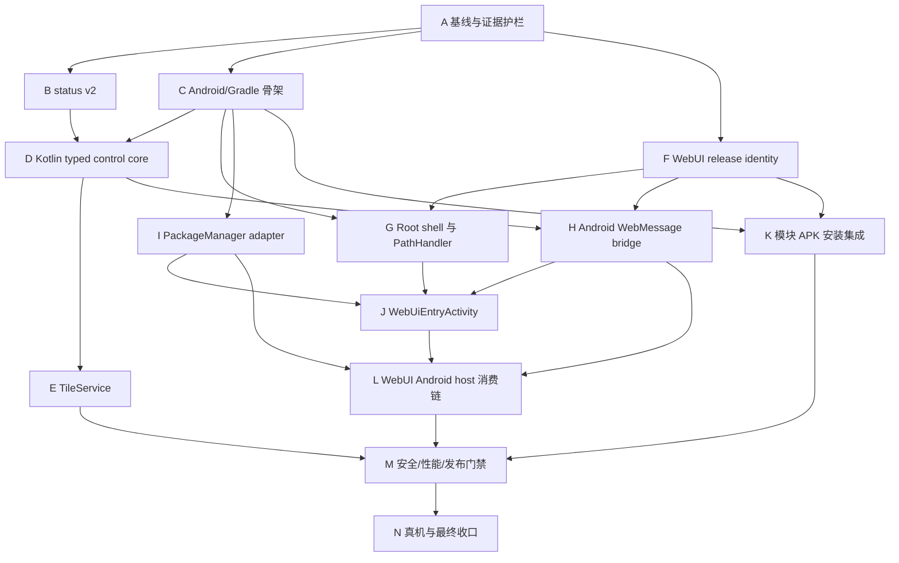

# NetHop 快捷设置磁贴 Companion APK TDD 测试开发任务清单

> 状态：实施中（核心 host、事件流回收、发布构建和应用组合根已完成；SystemUI 锁屏矩阵与正式签名待验收）
>
> 日期：2026-08-16
>
> 设计来源：[`17-quick-settings-tile-companion-design.md`](./17-quick-settings-tile-companion-design.md)
>
> 上位约束：[`00-nethop-system-design.md`](./00-nethop-system-design.md)、[`06-configuration-toml-refactor-design.md`](./06-configuration-toml-refactor-design.md)、[`08-webui-design.md`](./08-webui-design.md)
>
> 重构前基线：control protocol v5、`status.get` document schema v1、WebUI host `browser | kernelsu | apatch`、无 `companion/` Android 工程
>
> 目标基线：control protocol v5、`status.get` document schema v2、WebUI host 增加 `android`、可选安装的 Kotlin Companion APK
>
> 影响范围：`nethopd`、`nethop-protocol`、`nethopctl`、WebUI、Companion Android 工程、模块构建/安装器、发布清单、SBOM、许可证与真机验收

截至 2026-08-16 的验证事实：Companion JVM tests、Android instrumentation 3/3、WebUI unit/browser/E2E、Rust contracts、module/fake-Magisk/installer contracts、R8/lint/release APK 和完整 arm64 模块构建均通过。修复后的候选 ZIP 为 `NetHop-8cefc9fd6afcf3de4abfbf3592ace79254f23651-arm64.zip`，SHA-256 为 `76bb5125c0c1b17b26e03e65f19d7142dfddb0122242bbcd5a824a333a1505df`，大小为 19,221,822 bytes；Companion 模块增量为 444,218 bytes。该 ZIP 已传送至真机 `/sdcard/Download/NetHop-8cefc9f-companion-fix1-arm64.zip`，手机端 SHA-256 与本地一致。

新增真机证据（设备 `dc39c31d`，M2012K11AC/alioth，Root 模块已重启）：

- 模块保持 `running_tproxy`，`capture.active=true`，`candidate_count=65`，无 Companion 崩溃日志。
- `ACTION_QS_TILE_PREFERENCES` 打开固定 WebUI 后，稳定只存在一个 `nethopctl events --jsonl` session；返回关闭后 5 秒内事件进程回到 0。
- 重复打开/关闭循环的已采样结果为 `1→0、1→0、1→0`；额外延长采样确认 Activity resumed 时仍只有一个事件 session。
- Companion 进程退出后仅保留系统缓存进程，未发现 `nethopctl events`、Root event child 或额外 nethop shell 残留。
- `sysui_qs_tiles` 前后未变化，尚未执行磁贴添加、点按启停和锁屏测试。

未勾选项不是遗漏：Root Manager 安装 UI 的 10..0/Volume+/Volume-、SystemUI Tile、锁屏取消、模块内 WebRoot、TPROXY/TUN、100 次生命周期资源压力和正式 release key 必须由 N 阶段继续签署。当前 APK 使用本机 Android debug certificate，`publishable=false`，不得作为正式发布签名。

## 1. 目的与完成边界

本清单把 D17 的设计拆成可逐项执行、可失败、可复现的 TDD 节点。实现顺序按“事实发布者 -> typed 消费者 -> Android 系统入口 -> Root WebUI 宿主 -> 模块分发 -> 真机验收”展开，避免先做可见 UI，再倒逼后端补契约。

完成范围只有两个用户能力：

1. 点按 Android 快捷设置磁贴，通过现有 `nethopctl`/typed IPC 明确启动或停止 NetHop；
2. 长按磁贴，打开由 Companion 安全承载的模块唯一 WebUI。

以下内容不属于本清单：

- 独立原生 Manager、Launcher 首页、Compose 页面或第二套配置模型；
- APK 直接修改 TOML、iptables、模块 `disable` 文件或 Clash API；
- APK 内复制完整 WebUI、启动 localhost server 或缓存整套 WebUI；
- Tile 节点切换、订阅更新、测速、流量展示或后台轮询；
- Magisk WebUI 支持、未验证的 APatch 分支、Root Manager 私有 token 绕过；
- 旧 `status.get` schema v1 或旧 Android bridge 的兼容层。

项目尚未发布，允许一次性破坏性调整 `status.get` 文档 schema、WebUI host 判定和模块发布布局。破坏性调整必须通过 before/after 对比证明 CLI、WebUI、TPROXY、TUN 和“不安装 Companion”路径没有行为退化。

## 2. 当前事实与必要澄清

### 2.1 当前代码事实

- 仓库当前不存在 `companion/`；Android 工程、Gradle Wrapper、Manifest 和测试骨架均需新建。
- `crates/nethop-protocol/src/lib.rs` 当前 `PROTOCOL_VERSION = 5`，已有 `status.get`、`service.start`、`service.stop` 和 WebUI 所需 typed operations。
- `nethopd` 当前 `status.get` 返回 document schema v1，包含 runtime/capture，但没有 D17 要求的 `service.configured_enabled`、`effective_enabled`、`override` 和顶层 `diagnostic_code`。
- `webui/src/model/dto.ts` 对 status 字段使用严格 allowlist；当前不会接受 `service`。
- WebUI browser mock 把 status 写成 `schema_version: 3`，而 daemon 实际返回 v1。这是基线漂移，不是兼容需求；阶段 B 必须直接统一到 v2。
- `webui/src/bridge/host.ts` 当前 host kind 为 `browser | kernelsu | apatch`，现有 `HostAdapter`、typed operation builder、event child 和 Package adapter 应继续作为唯一前端业务契约。
- `scripts/build-android-module.ps1` 已为模块 `webroot`、license、build manifest 和 checksum 建立发布链；Companion 必须扩展该链，不能另建一套 ZIP 生成器。
- `module/customize.sh` 当前没有 Companion 安装询问、倒计时或 `pm install -r` 路径。

### 2.2 官方平台约束

Android 官方文档明确规定：

- `TileService` 不是常驻 Service；`onTileAdded()`/`onTileRemoved()` 甚至可能出现在某次 `onCreate()`/`onDestroy()` 窗口之外，不能依赖连续或严格嵌套的回调顺序。
- `onStartListening()`/`onStopListening()` 可能频繁发生；NetHop 只在开始监听时读取一次 snapshot，不建立轮询。
- Root 启停属于锁屏下不安全的写操作，必须使用系统解锁后执行语义；取消解锁不得产生 mutation。
- NetHop 不主动监听自身状态，因此使用普通 non-active tile；Manifest 不声明 `META_DATA_ACTIVE_TILE`。
- 长按入口通过 `ACTION_QS_TILE_PREFERENCES` Activity。该 Activity 因 intent-filter 必须明确 exported；任何应用也可能显式启动它，因此必须忽略外部 data、extras 和 nested Intent，只打开固定 NetHop WebUI。
- `WebViewAssetLoader.PathHandler.handle()` 在后台线程执行，并可能并发调用；共享会话状态必须同步，阻塞时间必须有界。
- PathHandler 返回 `null` 可能继续其他 handler 并最终回退网络；非法或不存在资源必须返回显式空 404，不能返回 `null`。
- Web native bridge 应优先使用 `WebViewCompat.addWebMessageListener`，只允许精确 HTTPS origin，并在回调再次校验 `sourceOrigin` 和 `isMainFrame`。禁止 `*` origin。

### 2.3 参考项目取舍

- 吸收 `refer/Surfing` 的 Tile 高频入口、操作完成后重查事实和后台执行方式；不吸收模块 disable 文件、inotify 或 Clash API 第二控制面。
- 吸收 `refer/NetProxy-Magisk` 的随模块携带 APK、音量键询问和 `pm install -r`；改为 10 秒无输入默认跳过，且 APK 失败不阻断模块。
- 吸收 `refer/KernelSU` 的 `WebViewAssetLoader -> SuFilePathHandler -> SuFileInputStream -> Root shell` 生命周期模式；NetHop 的路径和文件 allowlist 必须更窄。
- `refer/libsu-master` 证明 `SuFileInputStream` 使用 FIFO、后台 `cat` 和短生命周期线程/FD；测试必须验证资源回收，不能把“流式读取”误写成零复制。
- Companion 参考 YingLi-Player 的 Gradle/JDK/版本冻结和 fail-fast 纪律，但不复制 Compose、Room、Media3 或多 ABI 工程结构。

### 2.4 固定不变量

1. `nethopd` 仍是状态和 mutation 的唯一事实发布者。
2. APK 只运行固定 `nethopctl` operation，不接受任意 shell command、路径、URL 或 Intent。
3. Tile 的 start/stop 决策只依据新读取的 `configured_enabled`，不反转本地 `Tile.state`。
4. start/stop 成功或失败后都重查一次 status，并发布最终事实。
5. Companion 不声明 `INTERNET`，不含完整 WebUI，不启动本地 HTTP server。
6. 一个 `WebUiEntryActivity` 最多拥有一个 mount-master Root shell；每个资源请求不创建 shell。
7. fallback 页面不安装 Root bridge。
8. 模块未安装 Companion、用户跳过或 APK 安装失败时，模块行为保持原样。
9. 模块卸载不静默调用 `pm uninstall`。
10. 构建和运行时均不下载代码或 WebUI 资产。

## 3. TDD 节点规则

每个节点按以下状态推进：

```text
RED       添加因目标能力缺失而失败的最小测试
GREEN     只实现让该测试通过的最小生产代码
REFACTOR  消除本节点引入的重复，保持窄接口和单一职责
VERIFY    执行局部、阶段和 before/after 回归，保存机器可读证据
```

任务字段约定：

- `depends_on`：全部前驱完成后才能开始；
- `parallel_with`：前驱满足后可以并行；
- `scope`：预期触及的 1–3 个主要生产文件或一组同职责测试/fixture；
- `RED/GREEN/REFACTOR/VERIFY`：必须保存的执行证据；
- `done`：任务可以标记完成的唯一条件。

执行规则：

1. RED 必须因能力缺失失败，不能因路径、语法、SDK 或 fixture 错误失败。
2. 每个任务开始前记录相关测试的原始通过状态和命令。
3. GREEN 不得顺手实现后续阶段能力。
4. 测试不得依赖公网、真实订阅、真实 Root Manager token 或用户私有数据。
5. JVM 测试优先覆盖纯函数；Android framework 行为使用 instrumented/component 测试；Shell/ZIP 用仓库 PowerShell gate 和 fake installer harness。
6. 真实 Root、SystemUI、锁屏和 PackageManager 行为只能由真机矩阵最终签署，host mock 不能替代。
7. 任务完成后将命令、退出码、耗时、产物 hash 和失败诊断写入 `artifacts/companion/`，不得只保留终端截图。
8. 任一门禁失败先修复根因，不放宽阈值、不跳过测试、不增加兼容分支。

## 4. 测试分层与证据目录

| 层级 | 目标 | 主要工具 | 证据建议 |
|---|---|---|---|
| Rust unit/contract | status v2、服务 intent、protocol/CLI 回归 | `cargo test` | `artifacts/companion/backend/` |
| Kotlin JVM | DTO、映射、argv、路径、manifest、并发 reducer | JUnit、coroutines-test | `artifacts/companion/jvm/` |
| Android component | Tile、锁屏、Activity、WebView、PackageManager | AndroidX Test、Espresso、受控 doubles | `artifacts/companion/android/` |
| WebUI unit/browser | Android HostAdapter、bridge、事件、完整页面回归 | Vitest、Playwright | `artifacts/companion/webui/` |
| Shell/module | ZIP、checksum、倒计时、PackageManager 失败矩阵 | Pester/PowerShell、fake Magisk/KernelSU | `artifacts/companion/module/` |
| Supply chain | Gradle、dependency verification、SBOM、license、R8 | Gradle、repo gates | `artifacts/companion/supply-chain/` |
| Device | Root、SystemUI、TUN/TPROXY、资源残留、性能 | ADB、KernelSU 真机 | `artifacts/companion/device/` |

阶段证据的最小 manifest：

```json
{
  "schema_version": 1,
  "phase": "A",
  "git_commit": "<commit-or-dirty-tree-marker>",
  "commands": [],
  "results": [],
  "artifacts": [],
  "before_manifest_sha256": null,
  "after_manifest_sha256": null,
  "contains_sensitive_data": false
}
```

所有 JSON 证据必须稳定排序，不写绝对用户目录、订阅 URL、SSID/BSSID、节点凭据、Root 输出正文或签名 secret。

## 5. 需求追踪矩阵

| ID | 需求 | 主要阶段 | 核心验证 |
|---|---|---|---|
| R01 | status 发布 configured/effective intent | B | Rust contract + WebUI DTO |
| R02 | Tile 点按明确 start/stop | D、E | JVM mapper + component transaction |
| R03 | 锁屏取消不 mutation | E | Android component + 真机 |
| R04 | Tile 无轮询、无常驻 | E、M、N | lifecycle + process/wakeup |
| R05 | 长按打开固定 NetHop WebUI | J、N | Intent/Activity + 真机 |
| R06 | 模块唯一 WebUI、APK 不复制 bundle | F、J、M | APK inventory + manifest identity |
| R07 | 固定 Root path 和文件 allowlist | G | path/type/concurrency matrix |
| R08 | 精确 trusted origin 和 main frame bridge | H、J | origin/iframe/navigation tests |
| R09 | Android host 覆盖现有 WebUI 能力 | H、I、L | HostAdapter + full WebUI regression |
| R10 | 可选安装、10..0、超时跳过 | K | fake installer matrix |
| R11 | APK 失败不影响模块 | K、N | install failure + before/after |
| R12 | 签名、checksum、SBOM、dependency verification | C、F、K、M | supply-chain gates |
| R13 | 生命周期结束无 shell/FD/FIFO/child 残留 | G、H、J、M、N | resource counters + device audit |
| R14 | 不扩大权限与控制面 | C、D、J、M | Manifest/argv/bridge negative tests |
| R15 | CLI/WebUI/TPROXY/TUN 原行为不退化 | A、B、L、N | before/after matrix |

## 6. 依赖总图与推荐顺序



推荐实施批次：

1. 批次 1：A；
2. 批次 2：B、C、F；
3. 批次 3：D、G、I；
4. 批次 4：E、H、K；
5. 批次 5：J、L；
6. 批次 6：M；
7. 批次 7：N。

## 7. 阶段 A：重构前基线与证据护栏

- [x] **A001 冻结 daemon/protocol/CLI before 基线**
  - `depends_on`: none；`parallel_with`: A002,A003,A004,A005
  - `scope`: `crates/nethop-protocol/tests/`、`crates/nethopd/tests/`、`crates/nethopctl/tests/`、before fixture。
  - `RED`: inventory 缺 protocol v5、status schema v1、start/stop/status golden 任一项时失败。
  - `GREEN`: 只补 before fixture 和 evidence collector，不改生产响应。
  - `REFACTOR/VERIFY`: 复用现有 envelope/request builders；运行三 crate 相关 contracts。
  - `done`: before manifest 可独立证明当前控制面输入、输出和版本。

- [x] **A002 冻结 WebUI HostAdapter 与主要页面 before 基线**
  - `depends_on`: none；`parallel_with`: A001,A003,A004,A005
  - `scope`: `webui/tests/unit/`、`webui/tests/browser/`、`webui/tests/e2e/`。
  - `RED`: host kind、typed operation、event child、应用枚举或核心页面证据缺失时失败。
  - `GREEN`: 补 baseline tests/golden，不增加 Android host。
  - `REFACTOR/VERIFY`: 复用现有 MockHost；运行 Vitest 和代表性 Playwright viewport。
  - `done`: 不依赖 Companion 的 WebUI 行为有稳定 before 证据。

- [ ] **A003 冻结模块 ZIP 与安装器 before 基线**
  - `depends_on`: none；`parallel_with`: A001,A002,A004,A005
  - `scope`: `scripts/module-contracts.ps1`、`scripts/fake-magisk-smoke.ps1`、before ZIP inventory。
  - `RED`: 当前 ZIP allowlist、checksum、安装成功路径或无 APK 事实缺失时失败。
  - `GREEN`: 增加只读 inventory/golden，不改 `customize.sh`。
  - `REFACTOR/VERIFY`: 输出排序后的 entry/hash/permission manifest。
  - `done`: 能精确对比加入 Companion 前后的 ZIP 和安装行为。

- [x] **A004 建立 Companion evidence schema 与 secret gate**
  - `depends_on`: none；`parallel_with`: A001,A002,A003,A005
  - `scope`: `scripts/companion-evidence-contracts.ps1`、`tests/companion/fixtures/`。
  - `RED`: 缺 phase/command/result/hash 或包含 token、订阅 URL、SSID、签名值时仍通过。
  - `GREEN`: 实现最小 schema/secret validator。
  - `REFACTOR/VERIFY`: 复用仓库已有敏感信息扫描规则，避免第二套正则集合。
  - `done`: 有效/无效 fixture 均被稳定判定。

- [x] **A005 建立阶段总门禁入口**
  - `depends_on`: A001,A002,A003,A004；`parallel_with`: none
  - `scope`: `scripts/companion-phase-gate.ps1`、证据 manifest。
  - `RED`: 任一 before 证据缺失或 hash 漂移时失败。
  - `GREEN`: 只聚合现有测试命令，不复制测试逻辑。
  - `REFACTOR/VERIFY`: 输出机器可读 summary；失败保留首个稳定诊断码。
  - `done`: 阶段 A 可由单命令重复执行且无工作区写副作用。

## 8. 阶段 B：`status.get` service summary 契约

- [x] **B001 用 RED 冻结 status document schema v2**
  - `depends_on`: A005；`parallel_with`: B002
  - `scope`: `crates/nethopd/tests/worker_application_contracts.rs`、status v2 golden。
  - `RED`: 当前响应因缺 `service`、`diagnostic_code` 或 schema 仍为 v1 失败。
  - `GREEN`: 暂不改生产代码，只确认失败来自目标字段缺失。
  - `REFACTOR/VERIFY`: 覆盖 enabled/disabled、TPROXY/TUN、starting/stopping、degraded 和 scene override。
  - `done`: v2 期望值和敏感字段负面断言完整。

- [x] **B002 建立 configured/effective/override 纯映射测试**
  - `depends_on`: A005；`parallel_with`: B001
  - `scope`: `crates/nethopd/src/` 内窄 status projection、对应 unit tests。
  - `RED`: Wi-Fi scene 临时停用被错误映射为持久 disabled，或输出 SSID/BSSID。
  - `GREEN`: 从权威 config intent 与瞬态 override 投影最小脱敏 DTO。
  - `REFACTOR/VERIFY`: projection 不读完整 TOML、不复制 runtime transition 逻辑。
  - `done`: 同一输入始终产生稳定封闭值，日志无网络标识符。

- [x] **B003 发布 status schema v2**
  - `depends_on`: B001,B002；`parallel_with`: B004
  - `scope`: `crates/nethopd/src/worker_application.rs`、status contract tests。
  - `RED`: v2 golden 对当前 worker 失败。
  - `GREEN`: `status.get` 直接升级为 schema v2，加入 service summary 和稳定 diagnostic code。
  - `REFACTOR/VERIFY`: 删除 v1 兼容默认；control envelope protocol 保持 v5。
  - `done`: daemon 所有状态矩阵均通过，输出不包含完整 config 或自由错误文本。

- [x] **B004 更新 protocol/CLI golden 而不新增控制方法**
  - `depends_on`: B001,B002；`parallel_with`: B003
  - `scope`: `crates/nethop-protocol/tests/`、`crates/nethopctl/tests/`、v5 golden。
  - `RED`: CLI status 无法保真输出 v2 或 protocol inventory 误判版本。
  - `GREEN`: 更新结果 golden 和协商能力；不新增 `toggle` 方法。
  - `REFACTOR/VERIFY`: start/stop/status 原 argv、退出码和 envelope 回归全部通过。
  - `done`: protocol v5 + status document v2 的边界被明确测试。

- [x] **B005 更新 WebUI strict DTO 和 mock**
  - `depends_on`: B003,B004；`parallel_with`: none
  - `scope`: `webui/src/model/dto.ts`、`webui/src/bridge/context.ts`、对应 unit tests。
  - `RED`: v2 service summary 被 strict allowlist 拒绝，或 mock schema 3 漂移未被发现。
  - `GREEN`: 新增窄 `ServiceStatusDto`，mock 统一到 status schema v2。
  - `REFACTOR/VERIFY`: 未知字段、未知 override、错误类型和敏感自由文本 fail-closed。
  - `done`: WebUI 当前页面回归通过且 status schema 不再漂移。

- [x] **B006 status v2 阶段门禁**
  - `depends_on`: B003,B004,B005；`parallel_with`: none
  - `scope`: backend/WebUI evidence 聚合。
  - `RED`: 任一状态矩阵、CLI before/after 或 DTO 负面测试缺失时失败。
  - `GREEN`: 连接已有命令与 golden hash。
  - `REFACTOR/VERIFY`: 扫描 status 输出不存在 URL、SSID、BSSID、节点凭据。
  - `done`: R01、R15 后端部分有完整机器可读证据。

## 9. 阶段 C：Companion Android 工程与供应链骨架

- [x] **C001 创建可独立构建的最小 Android 工程**
  - `depends_on`: A005；`parallel_with`: C002,C003
  - `scope`: `companion/settings.gradle.kts`、根 `build.gradle.kts`、Gradle Wrapper。
  - `RED`: 仓库不存在 `companion/`，基线构建检查失败。
  - `GREEN`: 按 D17 固定 Gradle 9.5.0、AGP 9.3.1、JDK 21 和 built-in Kotlin 2.4.0。
  - `REFACTOR/VERIFY`: JDK/Gradle/旧 Kotlin Android plugin 不匹配时 fail-fast。
  - `done`: `assembleDebug` 和空 JVM test 可在固定工具链通过。

- [x] **C002 冻结 Version Catalog 与最小仓库边界**
  - `depends_on`: A005；`parallel_with`: C001,C003
  - `scope`: `companion/gradle/libs.versions.toml`、`settings.gradle.kts`、repository tests。
  - `RED`: dynamic/snapshot 版本、项目级仓库或 JitPack 通用 fallback 被接受。
  - `GREEN`: 精确锁定 D17 依赖；JitPack `exclusiveContent` 仅允许 libsu group。
  - `REFACTOR/VERIFY`: `FAIL_ON_PROJECT_REPOS`；无 Compose/Material/Room/Media3/Firebase。
  - `done`: repository/版本静态 gate 对有效和无效 fixture 均生效。

- [x] **C003 创建 framework-first app 模块与 Manifest 最小权限**
  - `depends_on`: A005；`parallel_with`: C001,C002
  - `scope`: `companion/app/build.gradle.kts`、`AndroidManifest.xml`、基础 resources。
  - `RED`: min/target/compile SDK、applicationId、权限或组件声明不满足 D17 时失败。
  - `GREEN`: min 33/target 36/compile 36；只声明 Tile、WebUI Activity 和 `QUERY_ALL_PACKAGES`。
  - `REFACTOR/VERIFY`: 明确拒绝 `INTERNET`、安装包、通知、位置、VPN、辅助功能等权限；不声明 launcher Activity。
  - `done`: merged Manifest 与 APK inventory 通过最小权限 gate。

- [x] **C004 冻结 dependency verification**
  - `depends_on`: C001,C002；`parallel_with`: C005
  - `scope`: `companion/gradle/verification-metadata.xml`、dependency verification tests。
  - `RED`: 修改 libsu AAR/POM/module metadata 或传递依赖后构建仍成功。
  - `GREEN`: 审核并固定 artifact 与 metadata SHA-256，默认 strict 模式。
  - `REFACTOR/VERIFY`: 验证 core/io/nio，拒绝 `libsu-service`；记录 checksum 来源。
  - `done`: tampered/missing/extra artifact 均 fail-closed。

- [x] **C005 建立 release、R8、lint 与签名输入骨架**
  - `depends_on`: C001,C003；`parallel_with`: C004
  - `scope`: `companion/app/build.gradle.kts`、`proguard-rules.pro`、build tests。
  - `RED`: release 未压缩、可调试、签名值硬编码或 warnings 未失败。
  - `GREEN`: R8/resource shrink、warnings-as-errors、lint abort、环境变量签名输入。
  - `REFACTOR/VERIFY`: 无 release key 时只能生成明确标记的不可发布产物。
  - `done`: debug/release 行为和发布签名门禁可重复验证。

- [x] **C006 Android 工程阶段门禁**
  - `depends_on`: C003,C004,C005；`parallel_with`: none
  - `scope`: `scripts/companion-android-gate.ps1`、Gradle reports。
  - `RED`: 工具链、依赖树、Manifest、verification 或 release 任一证据缺失时失败。
  - `GREEN`: 聚合固定 Gradle 命令和静态检查。
  - `REFACTOR/VERIFY`: 配置缓存二次构建通过，dependency tree 稳定排序保存。
  - `done`: 空业务 APK 的可复现构建和供应链边界成立。

## 10. 阶段 D：Kotlin typed control core

- [x] **D001 定义 strict Kotlin status/envelope DTO**
  - `depends_on`: B006,C006；`parallel_with`: D002,D003
  - `scope`: `StatusDecoder.kt`、DTO、JVM tests。
  - `RED`: 缺字段、未知字段、schema/version 错误、超大字符串或非法 enum 被接受。
  - `GREEN`: 使用 kotlinx.serialization 定义 status v2 窄 DTO 和有界 decode 前置检查。
  - `REFACTOR/VERIFY`: 不解析 human text，不复制 WebUI 的 TypeScript validator 代码。
  - `done`: 正常/边界/恶意 fixture 全部确定性通过或拒绝。

- [x] **D002 实现 `TileStateMapper` 纯函数**
  - `depends_on`: B006,C006；`parallel_with`: D001,D003
  - `scope`: `TileStateMapper.kt`、table-driven JVM tests。
  - `RED`: enabled/disabled、TUN/TPROXY、scene pause、transitional、degraded 和 unavailable 映射不完整。
  - `GREEN`: 实现 D17 状态表，不接触 Android Service 或 Root I/O。
  - `REFACTOR/VERIFY`: Wi-Fi scene 暂停仍为 ACTIVE，subtitle 表达有效状态。
  - `done`: 所有 daemon fact 组合都有唯一 tile state/action。

- [x] **D003 定义封闭 operation -> argv 映射**
  - `depends_on`: B006,C006；`parallel_with`: D001,D002
  - `scope`: `RootOperation.kt`、`RootCommandSpec.kt`、JVM property tests。
  - `RED`: 任意 command、任意 executable、换行、NUL 或 shell metachar 可进入 argv。
  - `GREEN`: 只允许 StatusGet、ServiceStart(wait)、ServiceStop(wait) 和 D08 已有 operation 集合。
  - `REFACTOR/VERIFY`: executable 固定绝对路径，超时/stdout/stderr 上限随 operation 定义。
  - `done`: 无公开 `exec(String)`/`runShell(String)` 接口。

- [x] **D004 实现有界 `RootCommandExecutor`**
  - `depends_on`: D001,D003；`parallel_with`: D005
  - `scope`: `RootCommandExecutor.kt`、process abstraction、JVM tests。
  - `RED`: 非零退出、stdout/stderr 超限、timeout、取消或销毁后 child 仍被当成功。
  - `GREEN`: 执行固定 argv、并发读双流、限制字节、超时终止 owned process。
  - `REFACTOR/VERIFY`: 不 kill daemon/core；错误只返回稳定 code 和截断诊断。
  - `done`: process fake 覆盖 stdout/stderr/exit/timeout/cancel 全矩阵。

- [x] **D005 实现操作序列与 stale-result reducer**
  - `depends_on`: D002,D003；`parallel_with`: D004
  - `scope`: `TileOperationCoordinator.kt`、coroutines-test。
  - `RED`: 较早 status refresh 能覆盖较新 click 结果，或重复 click 产生两次 mutation。
  - `GREEN`: 单调 sequence + 单写 busy + newer-wins reducer。
  - `REFACTOR/VERIFY`: 不使用 SharedPreferences 保存事实；进程重建只重查 status。
  - `done`: 可控调度器下所有交错顺序均确定性通过。

- [x] **D006 typed control 阶段门禁**
  - `depends_on`: D004,D005；`parallel_with`: none
  - `scope`: JVM test report、API surface scanner。
  - `RED`: decoder、mapper、argv、process、sequence 任一负面证据缺失时失败。
  - `GREEN`: 聚合测试和公开 API 检查。
  - `REFACTOR/VERIFY`: `rg` 证明无任意 shell API、无 TOML/Clash/iptables 字符串入口。
  - `done`: Android 组件只需消费窄 typed core。

## 11. 阶段 E：`NetHopTileService` 生命周期与点按事务

- [x] **E001 冻结 Manifest TileService 契约**
  - `depends_on`: C006,D006；`parallel_with`: E002
  - `scope`: `AndroidManifest.xml`、merged Manifest tests。
  - `RED`: 缺 BIND permission/QS action/toggleable metadata，或错误声明 active tile。
  - `GREEN`: 声明普通 toggleable TileService；不声明 `META_DATA_ACTIVE_TILE`。
  - `REFACTOR/VERIFY`: service exported/permission 组合符合系统绑定边界。
  - `done`: manifest gate 对错误组件声明 fail-closed。

- [ ] **E002 `onStartListening` 单次 snapshot**
  - `depends_on`: C006,D006；`parallel_with`: E001
  - `scope`: `NetHopTileService.kt`、component tests。
  - `RED`: 一次 listening window 产生轮询、Root I/O 在主线程或 stop 后继续发布。
  - `GREEN`: component-owned scope 后台读取一次 status，回主线程更新 Tile。
  - `REFACTOR/VERIFY`: stop/destroy 取消尚未开始的 refresh，不引入 timer。
  - `done`: 频繁 start/stop listening 下无轮询和 stale publish。

- [ ] **E003 实现锁屏安全点按事务**
  - `depends_on`: E001,E002；`parallel_with`: E004
  - `scope`: `NetHopTileService.kt`、unlock facade、component tests。
  - `RED`: locked click 直接 mutation、取消解锁仍写入、重复解锁 callback 重复执行。
  - `GREEN`: 使用 `unlockAndRun()`，只有一次成功回调进入 coordinator。
  - `REFACTOR/VERIFY`: 不申请设备管理/生物识别权限，不自绘密码界面。
  - `done`: locked/unlocked/cancelled/repeated callback 矩阵通过。

- [x] **E004 实现 read -> explicit start/stop -> final read**
  - `depends_on`: E001,E002；`parallel_with`: E003
  - `scope`: `TileOperationCoordinator.kt`、TileService integration tests。
  - `RED`: 使用旧 `qsTile.state` toggle、成功后不重查、失败后盲信 operation ACK。
  - `GREEN`: 根据新 status 的 `configured_enabled` 发明确 start/stop，随后重查。
  - `REFACTOR/VERIFY`: scene override 不反向 toggle；busy 期间 Tile unavailable。
  - `done`: 每次 click 最多一个 mutation，最终 Tile 来自最后 status。

- [ ] **E005 覆盖异常与回调乱序**
  - `depends_on`: E003,E004；`parallel_with`: E006
  - `scope`: Tile lifecycle/transaction tests。
  - `RED`: `onTileAdded/Removed` 位于 create/destroy 外、destroy during click、daemon unreachable 或 malformed status 导致崩溃/错误 mutation。
  - `GREEN`: 所有回调幂等，失去 owner 后只清理、不发布旧结果。
  - `REFACTOR/VERIFY`: state 映射统一走 `TileStateMapper`，不在 Service 重复分支。
  - `done`: 生命周期排列组合和失败矩阵无 crash、无残留 child。

- [x] **E006 Tile 文案、图标与 SystemUI 约束**
  - `depends_on`: E003,E004；`parallel_with`: E005
  - `scope`: vector drawable、strings、Tile rendering tests。
  - `RED`: 图标非 24dp 白色透明 VectorDrawable，或 label/subtitle 与 mapper 不一致。
  - `GREEN`: 加入单色 Tile 图标和稳定短文案。
  - `REFACTOR/VERIFY`: 不把节点、流量、订阅详情塞入 Tile。
  - `done`: API 33–36 状态属性在测试桩中一致。

- [ ] **E007 Tile 阶段门禁**
  - `depends_on`: E005,E006；`parallel_with`: none
  - `scope`: Android component report、lifecycle evidence。
  - `RED`: snapshot、锁屏、single mutation、final read、乱序任一证据缺失时失败。
  - `GREEN`: 聚合 instrumented/component tests。
  - `REFACTOR/VERIFY`: 检查无 timer、GlobalScope、cached pool、background service。
  - `done`: R02–R04 可在非 Root component harness 验证。

## 12. 阶段 F：唯一 WebUI 产物与 release identity

- [x] **F001 冻结现有 WebUI release manifest 输入输出**
  - `depends_on`: A005；`parallel_with`: F002
  - `scope`: `webui/scripts/generate-release-artifacts.mjs`、release fixture。
  - `RED`: 当前产物无法提供每个 path 的相对路径、bytes、SHA-256、MIME 和整体 digest。
  - `GREEN`: 先写目标 manifest schema/golden，不修改 APK。
  - `REFACTOR/VERIFY`: 路径稳定排序、无时间戳、无绝对路径。
  - `done`: 同一 webroot 两次生成 byte-identical manifest。

- [x] **F002 定义 Companion 所需最小 asset manifest**
  - `depends_on`: A005；`parallel_with`: F001
  - `scope`: manifest schema、validator tests。
  - `RED`: 重复/绝对/`.`/`..`/反斜杠路径、非法 MIME、错误 digest、超限 bytes 被接受。
  - `GREEN`: 定义路径、长度、digest、封闭 MIME 和整体 identity 的最小 schema。
  - `REFACTOR/VERIFY`: 不包含文件正文、订阅数据或构建机路径。
  - `done`: 有效/恶意 fixture 均稳定判定。

- [x] **F003 单一生成器同时发布模块与 APK identity**
  - `depends_on`: F001,F002；`parallel_with`: F004
  - `scope`: WebUI release generator、module staging、Companion generated resource。
  - `RED`: 模块 manifest 和 APK 预期 identity 可由不同输入生成而仍通过。
  - `GREEN`: 一次 production build 产出唯一 webroot 和供 APK 编译的只读 metadata。
  - `REFACTOR/VERIFY`: APK 只携带 metadata，不复制 JS/CSS/font/image 正文。
  - `done`: 同一 build ID 和整体 digest 在两个消费者中完全一致。

- [x] **F004 将 manifest identity 纳入 checksum/SBOM/provenance**
  - `depends_on`: F001,F002；`parallel_with`: F003
  - `scope`: release readiness scripts、build manifest/SBOM tests。
  - `RED`: 删除 identity、许可证或 provenance 后 release 仍通过。
  - `GREEN`: 将生成物纳入现有发布证据链。
  - `REFACTOR/VERIFY`: 复用当前 webui release readiness，不增加第二套 SBOM 生成器。
  - `done`: 每个新增 metadata artifact 可从 build manifest 追溯。

- [x] **F005 WebUI identity 阶段门禁**
  - `depends_on`: F003,F004；`parallel_with`: none
  - `scope`: reproducibility/APK inventory gate。
  - `RED`: APK 含完整 webroot、manifest 不一致或生成不稳定时失败。
  - `GREEN`: 聚合生成、比较和 inventory 检查。
  - `REFACTOR/VERIFY`: 在临时目录生成，不覆盖工作区作为测试副作用。
  - `done`: R06、R12 的资产身份部分有机器可读证据。

## 13. 阶段 G：Root shell、路径验证与资源流

- [ ] **G001 实现 Activity-owned `RootShellSession`**
  - `depends_on`: C006,F005；`parallel_with`: G002,G003
  - `scope`: `RootShellSession.kt`、libsu facade、JVM/component tests。
  - `RED`: mount-master 失败后普通 su/sh fallback 被接受，或使用 libsu global main shell。
  - `GREEN`: 明确 `su --mount-master`，检查 ROOT_SHELL、alive 和固定入口可读。
  - `REFACTOR/VERIFY`: 每个 session 一个 shell；所有 SuFile 显式 `setShell()`。
  - `done`: non-root/dead/unreadable/close timeout 全部 fail-closed。

- [x] **G002 实现单次 decode 的 path validator**
  - `depends_on`: C006,F005；`parallel_with`: G001,G003
  - `scope`: `WebRootPathValidator.kt`、table/property tests。
  - `RED`: NUL、反斜杠、绝对路径、空段、`.`、`..`、双重编码或 malformed percent 逃逸。
  - `GREEN`: decode 恰好一次，规范化为 manifest 相对路径并做 canonical-child 检查。
  - `REFACTOR/VERIFY`: 不使用字符串 prefix 代替 canonical 边界。
  - `done`: traversal corpus 和 property tests 无可达反例。

- [x] **G003 实现 manifest allowlist 与文件类型门禁**
  - `depends_on`: C006,F005；`parallel_with`: G001,G002
  - `scope`: `WebRootManifest.kt`、Root file metadata facade、tests。
  - `RED`: symlink、目录、FIFO、socket、device、未知路径或长度不符被允许。
  - `GREEN`: 只允许 manifest 内普通文件，MIME 只取 manifest。
  - `REFACTOR/VERIFY`: 不按扩展名猜可执行 MIME，不跟随 symlink。
  - `done`: 全文件类型矩阵和未知路径测试通过。

- [x] **G004 实现并发有界 `RootWebRootPathHandler`**
  - `depends_on`: G001,G002,G003；`parallel_with`: G005
  - `scope`: `RootWebRootPathHandler.kt`、stream registry、component tests。
  - `RED`: 并发 handle 竞态、每请求新 shell、非法路径返回 `null` 或越过 stream/bytes/request 上限。
  - `GREEN`: 共享 session、同步预算、SuFileInputStream 流式响应；所有拒绝显式 404。
  - `REFACTOR/VERIFY`: handler 阻塞区最小；不允许网络 fallback。
  - `done`: 并发压力下计数正确，无 deadlock、越界或 null response。

- [x] **G005 入口 manifest/digest 与错误页门禁**
  - `depends_on`: G001,G002,G003；`parallel_with`: G004
  - `scope`: session bootstrap、fallback asset、tests。
  - `RED`: module/APK manifest identity 不符或 index digest 错误时仍安装 bridge。
  - `GREEN`: 启动期核对整体 identity 和 index digest，失败仅返回无 bridge fallback。
  - `REFACTOR/VERIFY`: fallback 损坏时退到原生最小错误文本并结束 Activity。
  - `done`: partial load、version drift 和 corrupt index 全部 fail-closed。

- [ ] **G006 验证 stream/shell/FIFO/`cat` 生命周期**
  - `depends_on`: G004,G005；`parallel_with`: none
  - `scope`: libsu integration harness、resource counters。
  - `RED`: Activity/session close 后存在 open stream、shell、FIFO、后台 `cat` 或 worker 泄漏。
  - `GREEN`: 先拒绝新请求，再关闭 active streams，最后有界关闭 shell。
  - `REFACTOR/VERIFY`: 重复 close 幂等；异常路径使用同一 cleanup owner。
  - `done`: 反复 open/close 压力测试基线回零。

- [ ] **G007 Root WebRoot 阶段门禁**
  - `depends_on`: G006；`parallel_with`: none
  - `scope`: path/type/concurrency/resource evidence 聚合。
  - `RED`: 任一逃逸、显式 404、单 shell 或残留证据缺失时失败。
  - `GREEN`: 聚合 JVM/component/libsu harness。
  - `REFACTOR/VERIFY`: 扫描无 localhost、任意 Root path、global main shell。
  - `done`: R07、R13 Root 资源部分完成。

## 14. 阶段 H：Android WebMessage HostAdapter 与事件生命周期

- [x] **H001 冻结 Android bridge wire schema**
  - `depends_on`: D006,F005；`parallel_with`: H002
  - `scope`: bridge request/reply/event JSON schema、Kotlin tests。
  - `RED`: 未知 operation、字段、过长 payload、错误 request ID 或嵌套任意 command 被接受。
  - `GREEN`: 复用 D08 operation union，定义有界版本化 message envelope。
  - `REFACTOR/VERIFY`: 不创建第二套业务 operation 名称。
  - `done`: TypeScript/Kotlin golden byte/semantic 对齐。

- [x] **H002 建立精确 origin/main-frame gate**
  - `depends_on`: D006,F005；`parallel_with`: H001
  - `scope`: `TrustedWebOrigin.kt`、WebMessage listener tests。
  - `RED`: wildcard、HTTP、子域、端口漂移、iframe 或伪造 sourceOrigin 可调用 bridge。
  - `GREEN`: exact HTTPS local origin + `isMainFrame=true` 双重校验。
  - `REFACTOR/VERIFY`: 即使来源可信仍完整验证 payload。
  - `done`: origin/iframe/navigation adversarial matrix 全部拒绝。

- [x] **H003 实现 `run()` 与有界 reply**
  - `depends_on`: H001,H002；`parallel_with`: H004
  - `scope`: `AndroidWebUiBridge.kt`、RootCommandExecutor adapter、tests。
  - `RED`: 任意 executable/args、重复 reply、销毁后 reply 或超限输出通过。
  - `GREEN`: typed request -> fixed Root operation -> bounded `ExecResult`。
  - `REFACTOR/VERIFY`: 错误映射与 Tile 共用 executor contract，不共用生命周期实例。
  - `done`: WebUI command tests 与 Kotlin bridge golden 一致。

- [x] **H004 实现 `spawn()`/event child 生命周期**
  - `depends_on`: H001,H002；`parallel_with`: H003
  - `scope`: `EventProcess.kt`、bridge event adapter、tests。
  - `RED`: 任意 event kind、JSONL 超限、异常退出、terminate 后仍发事件或 child 残留。
  - `GREEN`: allowlisted kinds、有界行解析、单次 exit/error、owned process terminate。
  - `REFACTOR/VERIFY`: 复用 WebUI event-session 协议，不发明 Android 私有事件格式。
  - `done`: start/data/error/exit/terminate/destroy 全矩阵通过。

- [x] **H005 bridge detach 与 fallback 隔离**
  - `depends_on`: H003,H004；`parallel_with`: none
  - `scope`: bridge lifecycle owner、tests。
  - `RED`: fallback 页面或 Activity destroy 后 bridge 仍可执行 Root operation。
  - `GREEN`: trusted page 就绪前不装 bridge；导航/失败/destroy 时先 detach 再清 child。
  - `REFACTOR/VERIFY`: release WebView debugging 关闭，日志只保留稳定 code。
  - `done`: fallback、external navigation、destroy 后调用全部 fail-closed。

- [x] **H006 Android bridge 阶段门禁**
  - `depends_on`: H005；`parallel_with`: none
  - `scope`: wire/origin/event/lifecycle evidence。
  - `RED`: exact origin、main frame、fixed operation、event cleanup 任一证据缺失时失败。
  - `GREEN`: 聚合 tests 和 API scanner。
  - `REFACTOR/VERIFY`: 禁止 `addJavascriptInterface`、origin `*`、任意 Intent/URL API。
  - `done`: R08 与 Root operation bridge 部分完成。

## 15. 阶段 I：Android PackageManager 应用枚举

- [x] **I001 定义现有 `PackageInfo` 契约的 Kotlin 映射**
  - `depends_on`: C006；`parallel_with`: I002
  - `scope`: `PackageRecord.kt`、mapping JVM tests。
  - `RED`: packageName/label/version/uid/system 字段丢失，或可选指标被伪造为 0。
  - `GREEN`: 映射既有 HostAdapter DTO；不可用指标保持 absent。
  - `REFACTOR/VERIFY`: 不把 icon binary 放进 JSON DTO。
  - `done`: Kotlin/TypeScript golden 一致。

- [x] **I002 实现有界查询、过滤与批处理**
  - `depends_on`: C006；`parallel_with`: I001
  - `scope`: `AndroidPackageAdapter.kt`、PackageManager facade tests。
  - `RED`: 任意 package 列表、超大 batch、重复项、卸载竞态或 SecurityException 导致崩溃。
  - `GREEN`: user/system/all 封闭过滤，去重、有界 batch、逐项容错。
  - `REFACTOR/VERIFY`: 页面退出释放 icon/临时对象；不缓存全量应用事实。
  - `done`: 0/1/large/missing/concurrent package 矩阵通过。

- [x] **I003 可选排序指标保持能力缺失语义**
  - `depends_on`: I001,I002；`parallel_with`: I004
  - `scope`: package metadata provider、tests。
  - `RED`: 未授权 Usage Access 时强制请求权限、后台观察或填充虚假值。
  - `GREEN`: last update 取公开字段；storage/last used 仅能力可用时返回。
  - `REFACTOR/VERIFY`: 不引入 usage observer、辅助功能或常驻 service。
  - `done`: 权限有/无场景均满足 WebUI 排序降级。

- [x] **I004 `QUERY_ALL_PACKAGES` 使用边界测试**
  - `depends_on`: I001,I002；`parallel_with`: I003
  - `scope`: merged Manifest、privacy/log tests。
  - `RED`: 应用列表写日志、发送网络或在 Activity 外常驻缓存。
  - `GREEN`: 权限只服务当前本地 WebUI 会话。
  - `REFACTOR/VERIFY`: APK 无 INTERNET，日志 scanner 无 package 全量 dump。
  - `done`: R09 应用选择能力与 R14 权限边界成立。

- [x] **I005 PackageManager 阶段门禁**
  - `depends_on`: I003,I004；`parallel_with`: none
  - `scope`: JVM/component/Manifest evidence。
  - `RED`: DTO、batch、optional metric、privacy 任一证据缺失时失败。
  - `GREEN`: 聚合 tests。
  - `REFACTOR/VERIFY`: 依赖树无额外数据库/图片/usage SDK。
  - `done`: Android host 可完整支持现有应用页面。

## 16. 阶段 J：`WebUiEntryActivity` 安全宿主

- [x] **J001 冻结 `ACTION_QS_TILE_PREFERENCES` 与外部 Intent 边界**
  - `depends_on`: G007,H006,I005；`parallel_with`: J002
  - `scope`: `AndroidManifest.xml`、`WebUiEntryActivity.kt`、Intent tests。
  - `RED`: 长按 action 无法解析，或外部 data/extras/nested Intent 改变路径、operation、URL。
  - `GREEN`: exported Activity 只接受进入信号，忽略全部外部 payload，打开固定 WebUI。
  - `REFACTOR/VERIFY`: 外部显式启动不自动执行任何 Root mutation。
  - `done`: hostile Intent corpus 无法扩展能力。

- [x] **J002 建立 WebView hardened settings**
  - `depends_on`: G007,H006,I005；`parallel_with`: J001
  - `scope`: `WebUiEntryActivity.kt`、WebView factory、component tests。
  - `RED`: file/content access、mixed content、third-party cookie、debugging 或非本地导航可用。
  - `GREEN`: 仅启用 WebUI 必要能力，关闭开放文件/内容/混合访问和 release debugging。
  - `REFACTOR/VERIFY`: 使用 HTTPS local origin，不使用 `file://`。
  - `done`: settings/navigation policy 的正负矩阵通过。

- [ ] **J003 组装 shell -> asset loader -> bridge -> load 顺序**
  - `depends_on`: J001,J002；`parallel_with`: J004
  - `scope`: Activity lifecycle coordinator、component tests。
  - `RED`: shell/manifest/index 未验证就 load 或安装 bridge，资源失败后留下部分 trusted page。
  - `GREEN`: 后台建立验证 session，主线程按固定顺序安装 loader/bridge/load。
  - `REFACTOR/VERIFY`: 每个 Activity 恰好一个 shell；Root 授权只在用户主动打开后触发。
  - `done`: success/failure/cancel/destroy timing matrix 确定性通过。

- [ ] **J004 外部导航与 fallback 行为**
  - `depends_on`: J001,J002；`parallel_with`: J003
  - `scope`: WebViewClient/navigation/fallback tests。
  - `RED`: 非本地 origin 留在持有 bridge 的 WebView，或 fallback 能跳回 trusted bridge。
  - `GREEN`: 非本地导航默认拒绝；受允许外链离开 Root WebView 交给系统。
  - `REFACTOR/VERIFY`: fallback 永远无 bridge，无 INTERNET 时行为稳定。
  - `done`: redirect/popup/iframe/custom scheme/malformed URL 全矩阵通过。

- [ ] **J005 Activity 销毁顺序与资源归零**
  - `depends_on`: J003,J004；`parallel_with`: none
  - `scope`: Activity lifecycle owner、resource leak tests。
  - `RED`: rotate/back/finish/process teardown 后存在 event child、stream、WebView、shell、cat/FIFO。
  - `GREEN`: detach bridge -> terminate events -> close streams -> destroy WebView -> close shell。
  - `REFACTOR/VERIFY`: cleanup 幂等且有界；异常步骤不阻断后续 cleanup。
  - `done`: 重复 100 次 open/close 后所有计数回到 baseline。

- [ ] **J006 WebUI Activity 阶段门禁**
  - `depends_on`: J005；`parallel_with`: none
  - `scope`: Intent/WebView/bootstrap/navigation/cleanup evidence。
  - `RED`: 任一安全或资源证据缺失时失败。
  - `GREEN`: 聚合 Android component tests。
  - `REFACTOR/VERIFY`: APK fallback asset inventory 不包含业务 JS/Vue bundle。
  - `done`: R05–R08、R13 Activity 部分完成。

## 17. 阶段 K：模块 APK 打包与可选安装

- [x] **K001 将签名 APK 纳入唯一模块构建链**
  - `depends_on`: C006,F005；`parallel_with`: K002
  - `scope`: `scripts/build-android-module.ps1`、ZIP inventory、build manifest tests。
  - `RED`: APK 未进入 `companion/`、checksum、manifest、SBOM/license/provenance 或出现多次。
  - `GREEN`: 扩展现有 staging/allowlist，不创建第二个打包器。
  - `REFACTOR/VERIFY`: APK 是非 symlink 普通文件且 digest 唯一。
  - `done`: 发布 ZIP 可追溯到 Companion release artifact 和签名 identity。

- [x] **K002 先写安装选择状态机与 fake input RED tests**
  - `depends_on`: C006,F005；`parallel_with`: K001
  - `scope`: shell helper、fake getevent/clock/TTY harness。
  - `RED`: 音量加/减、其他键、key release、10 秒超时或读取失败行为不确定。
  - `GREEN`: 实现纯 shell 最小 choice state machine，超时默认 skip。
  - `REFACTOR/VERIFY`: 同一个 10 秒预算，不先等待再倒计时。
  - `done`: 所有输入序列和边界秒数有确定结果。

- [x] **K003 实现 10..0 倒计时与输出降级**
  - `depends_on`: K002；`parallel_with`: K004
  - `scope`: `module/customize.sh` countdown helper、output tests。
  - `RED`: 秒序列缺失/重复、总耗时超限、`
` 破坏 OUTFD 或非 TTY 无可读输出。
  - `GREEN`: TTY 优先 `\r` 原地刷新，非 TTY/ui_print 逐行降级。
  - `REFACTOR/VERIFY`: 清行/换行稳定，不输出未经封装的安装协议控制字符。
  - `done`: 10 到 0 与按键读取共用有界时钟并通过 fake-time test。

- [ ] **K004 实现首次 opt-in、同签名更新和失败非阻断**
  - `depends_on`: K001,K002；`parallel_with`: K003
  - `scope`: `module/customize.sh` install helper、fake `pm` tests。
  - `RED`: 未同意即安装、pm 失败中止模块、签名冲突自动卸载、成功后不验证包名/版本。
  - `GREEN`: 首次 Volume+ 才安装；已安装同签名 `pm install -r --user 0` 更新；失败只警告。
  - `REFACTOR/VERIFY`: PackageManager 输出有界脱敏；不打开商店或网络 URL。
  - `done`: missing pm/failure/conflict/downgrade/success/update 全矩阵通过。

- [x] **K005 实现 APK 清理和卸载非联动**
  - `depends_on`: K003,K004；`parallel_with`: K006
  - `scope`: customize/uninstall scripts、module contract tests。
  - `RED`: 安装/跳过/失败后展开模块仍保留 APK，或 uninstall 调用 `pm uninstall`。
  - `GREEN`: 所有分支清理展开目录 APK；模块卸载不卸载 Companion。
  - `REFACTOR/VERIFY`: 清理目标固定且已验证在模块目录内。
  - `done`: 生命周期矩阵无错误删除、无跨产品事务。

- [x] **K006 未安装 Companion 的模块 before/after 对比**
  - `depends_on`: K003,K004；`parallel_with`: K005
  - `scope`: fake Magisk/KernelSU smoke、before/after evidence。
  - `RED`: 选择 skip 后配置、daemon、WebUI、权限或 ZIP 安装结果与 before 不同。
  - `GREEN`: 修正安装器隔离边界，不更改业务 daemon 路径。
  - `REFACTOR/VERIFY`: APK 失败也执行相同模块主体断言。
  - `done`: R11、R15 的模块安装部分有对比证据。

- [ ] **K007 模块安装阶段门禁**
  - `depends_on`: K005,K006；`parallel_with`: none
  - `scope`: ZIP/install/update/cleanup evidence 聚合。
  - `RED`: opt-in、timeout skip、non-blocking、cleanup、no-uninstall 任一证据缺失时失败。
  - `GREEN`: 聚合 module contracts。
  - `REFACTOR/VERIFY`: 扫描安装脚本无联网下载、任意 APK 路径或自动卸载。
  - `done`: R10–R12 模块部分完成。

## 18. 阶段 L：WebUI Android host 消费链与完整回归

- [x] **L001 扩展 `HostKind` 和 host 检测为 `android`**
  - `depends_on`: H006,I005,J006；`parallel_with`: L002
  - `scope`: `webui/src/bridge/host.ts`、`context.ts`、unit tests。
  - `RED`: Android bridge 被误判 KernelSU/APatch/browser，或缺方法时仍 available。
  - `GREEN`: 增加封闭 `android` host kind 和能力检测。
  - `REFACTOR/VERIFY`: 不在页面写 `if (android)` 业务分支。
  - `done`: 四类 host 的 available/missing/unavailable 矩阵通过。

- [x] **L002 实现 TypeScript `android-host.ts`**
  - `depends_on`: H006,I005,J006；`parallel_with`: L001
  - `scope`: `webui/src/bridge/android-host.ts`、bridge tests。
  - `RED`: run/spawn/package/toast/edge-to-edge/exit 无法满足现有 HostAdapter。
  - `GREEN`: 将现有 typed operation 和 package API 映射到 Kotlin bridge。
  - `REFACTOR/VERIFY`: operation builder 仍是唯一 argv 语义来源，不复制 KernelSU host 业务逻辑。
  - `done`: HostAdapter 全方法的成功/失败/timeout/terminate 测试通过。

- [x] **L003 Android host 事件与页面 resync**
  - `depends_on`: L001,L002；`parallel_with`: L004
  - `scope`: event runtime/store tests、Android host fixture。
  - `RED`: event child 退出后页面卡死、重复 listener、destroy 后仍更新 store。
  - `GREEN`: 复用现有 event-session resync/teardown。
  - `REFACTOR/VERIFY`: 不增加 Android 私有 polling。
  - `done`: runtime/traffic/operation event 回归与 KSU host 一致。

- [x] **L004 Android PackageManager 驱动应用页面**
  - `depends_on`: L001,L002；`parallel_with`: L003
  - `scope`: package adapter/application view tests。
  - `RED`: Android host 下应用枚举、批量详情、搜索/排序/选择任一闭环失败。
  - `GREEN`: 只修 HostAdapter 消费接线，不改应用业务模型。
  - `REFACTOR/VERIFY`: optional metrics 缺失时稳定降级。
  - `done`: 现有应用页功能在 Android fixture 全部通过。

- [x] **L005 完整 WebUI 页面与操作回归**
  - `depends_on`: L003,L004；`parallel_with`: L006
  - `scope`: WebUI unit/browser/e2e suite、Android host fixtures。
  - `RED`: 概览、订阅、节点、应用、设置、运维任一页在 Android host 失败。
  - `GREEN`: 修复 host 层契约差异，不复制页面。
  - `REFACTOR/VERIFY`: service start/stop、节点测速/选择、订阅 mutation、config、events 均走既有 typed operations。
  - `done`: Android/KSU/browser mock 三宿主的共享页面回归通过。

- [x] **L006 APK 不含完整 WebUI 的集成证明**
  - `depends_on`: L003,L004；`parallel_with`: L005
  - `scope`: APK analyzer/inventory、module WebRoot integration test。
  - `RED`: APK 中出现生产 index、Vue chunks、完整 CSS/font/flag bundle 或模块 webroot 第二副本。
  - `GREEN`: 仅保留 bridge bootstrap metadata、release manifest 和无 bridge fallback。
  - `REFACTOR/VERIFY`: 页面正文始终由 Root PathHandler 从模块唯一 webroot 提供。
  - `done`: R06 有构建产物级证据。

- [x] **L007 WebUI Android host 阶段门禁**
  - `depends_on`: L005,L006；`parallel_with`: none
  - `scope`: WebUI test/release artifact evidence。
  - `RED`: host、events、packages、全页面、no-bundle 任一证据缺失时失败。
  - `GREEN`: 聚合现有 WebUI commands。
  - `REFACTOR/VERIFY`: D08/D09 release readiness 全部通过，不放宽 bundle/performance 阈值。
  - `done`: R09、R15 WebUI 部分完成。

## 19. 阶段 M：安全、供应链、体积与性能门禁

- [x] **M001 Manifest、Intent、bridge 与命令攻击面总审计**
  - `depends_on`: E007,K007,L007；`parallel_with`: M002,M003,M004
  - `scope`: release APK/Manifest/API scanner、安全 tests。
  - `RED`: INTERNET、未知 exported 组件、wildcard origin、addJavascriptInterface、任意 shell/path/Intent API 任一出现。
  - `GREEN`: 修正最小攻击面，不增加例外 allowlist。
  - `REFACTOR/VERIFY`: 外部 Activity Intent 不产生 mutation；fallback 无 bridge。
  - `done`: R08、R14 的 release artifact 审计通过。

- [x] **M002 Gradle/依赖/SBOM/license/provenance 总门禁**
  - `depends_on`: E007,K007,L007；`parallel_with`: M001,M003,M004
  - `scope`: dependency verification、SBOM、license、provenance reports。
  - `RED`: 未固定 artifact、JitPack 越界、libsu-service、缺许可证或篡改 metadata 仍发布。
  - `GREEN`: 补齐现有发布链缺口。
  - `REFACTOR/VERIFY`: checksum 只证明完整性，provenance 另记录审核来源和 revision。
  - `done`: release 依赖可离线复现且全部可追溯。

- [x] **M003 R8 与 APK/ZIP 体积门禁**
  - `depends_on`: E007,K007,L007；`parallel_with`: M001,M002,M004
  - `scope`: release APK analyzer、R8 mapping、size comparison。
  - `RED`: APK >2.5 MiB、ZIP 增量 >3 MiB、含完整 WebUI 或未使用依赖。
  - `GREEN`: 只按 size breakdown 删除未使用代码/资源，不提高阈值。
  - `REFACTOR/VERIFY`: 目标 <=1.5 MiB APK、<=2 MiB ZIP 增量；保存 before/after bytes。
  - `done`: 体积硬门禁和成因报告同时通过。

- [ ] **M004 线程、进程、FD、FIFO、RSS 与 wakeup host 压测**
  - `depends_on`: E007,K007,L007；`parallel_with`: M001,M002,M003
  - `scope`: Android benchmark harness、resource reports。
  - `RED`: 无 WebUI 时常驻进程/定时器、Tile 主线程 Root I/O、Activity 后资源不回零。
  - `GREEN`: 修正 lifecycle ownership 和有界并发。
  - `REFACTOR/VERIFY`: 记录 libsu shell 至少 3 worker thread 的真实贡献，不把它误判业务线程泄漏。
  - `done`: 稳态 0 process/0 timer/0 wakeup，Activity close 后回到 baseline。

- [ ] **M005 Tile 与 WebUI 性能分段测量**
  - `depends_on`: M001,M002,M003,M004；`parallel_with`: M006
  - `scope`: macro timing harness、performance manifest。
  - `RED`: 只有总耗时、无法区分 status、shell bootstrap、manifest、index、assets、interactive。
  - `GREEN`: 增加单调时间点和 p50/p95 汇总，不记录敏感内容。
  - `REFACTOR/VERIFY`: Tile status p95 <=500ms；click dispatch p95 <=250ms；WebUI 不放宽 D08。
  - `done`: 冷/热路径的主瓶颈可由证据定位。

- [ ] **M006 release 签名、版本与不兼容演练**
  - `depends_on`: M001,M002,M003,M004；`parallel_with`: M005
  - `scope`: signing/version tests、protocol/manifest mismatch fixture。
  - `RED`: unsigned/错签/降级/旧 protocol/旧 WebUI manifest 仍被当可用。
  - `GREEN`: 固定 versionCode/versionName/protocol min-max/manifest identity fail-closed。
  - `REFACTOR/VERIFY`: 不实现旧协议 fallback，不自动卸载签名冲突 APK。
  - `done`: 安装升级和 incompatibility 结果均有稳定诊断。

- [ ] **M007 Host release 总门禁**
  - `depends_on`: M005,M006；`parallel_with`: none
  - `scope`: `scripts/companion-release-gate.ps1`、release evidence index。
  - `RED`: 安全、供应链、体积、资源、性能、签名任一证据缺失或过期时失败。
  - `GREEN`: 聚合所有阶段 gate，不重复实现断言。
  - `REFACTOR/VERIFY`: clean checkout/固定缓存下复现 release；工作区 dirty 状态写入证据。
  - `done`: 只有可进入真机矩阵的候选 APK/模块 ZIP 被产出。

## 20. 阶段 N：KernelSU 真机矩阵与最终收口

- [ ] **N001 冻结设备、Root Manager 与安装前证据**
  - `depends_on`: M007；`parallel_with`: none
  - `scope`: device manifest、before process/rules/capture/status snapshots。
  - `RED`: 缺设备 API/ABI、KernelSU 版本、slot、包版本、模块 hash 或 before 网络事实。
  - `GREEN`: 只采集脱敏事实，不更改设备状态。
  - `REFACTOR/VERIFY`: 不记录订阅 URL、SSID/BSSID、节点凭据或 Android ID。
  - `done`: 真机结果可绑定到唯一 ZIP/APK hash。

- [ ] **N002 验证首次跳过与模块原行为**
  - `depends_on`: N001；`parallel_with`: none
  - `scope`: 手动刷入 + ADB evidence。
  - `RED`: 10 秒无输入不 skip、模块失败或配置/daemon/WebUI 行为偏离 before。
  - `GREEN`: 仅修安装器根因后重建重刷。
  - `REFACTOR/VERIFY`: 验证模块目录无 APK、Companion 包未安装。
  - `done`: “不安装 Companion”完整链路签署。

- [ ] **N003 验证 opt-in 安装、Tile 添加与启停**
  - `depends_on`: N002；`parallel_with`: none
  - `scope`: Volume+ 安装、SystemUI Tile、CLI/daemon/capture evidence。
  - `RED`: 包/签名/版本错误、Tile 不可添加、一次点击多 mutation 或最终状态不一致。
  - `GREEN`: 修复最小实现后重建覆盖安装。
  - `REFACTOR/VERIFY`: TPROXY/TUN 分别验证 ACTIVE；disabled 为 INACTIVE；异常为 UNAVAILABLE。
  - `done`: Tile、CLI、WebUI 对同一事实一致。

- [ ] **N004 验证锁屏、并发、Root 拒绝和故障恢复**
  - `depends_on`: N003；`parallel_with`: none
  - `scope`: 锁屏/重复点击/daemon unavailable/module missing scenarios。
  - `RED`: 取消解锁仍 mutation、重复点击并发写、故障时盲目 toggle 或 crash。
  - `GREEN`: 修根因并重跑完整正常链路。
  - `REFACTOR/VERIFY`: CLI timeout 只终止 owned child，daemon 自行恢复。
  - `done`: 所有失败矩阵行为与 D17 一致。

- [ ] **N005 验证长按 WebUI 与完整日常闭环**
  - `depends_on`: N004；`parallel_with`: none
  - `scope`: Activity/WebView/Android HostAdapter 真机流程。
  - `RED`: 长按未进入固定 WebUI、任一页面/operation/package list 失败或 external navigation 保留 bridge。
  - `GREEN`: 修 host/bridge/资源链根因，不复制页面或引入 localhost。
  - `REFACTOR/VERIFY`: 概览、订阅、节点、应用、设置、运维和事件流全回归。
  - `done`: Companion 承载的 WebUI 与 KernelSU 宿主共享同一业务能力。

- [ ] **N006 真机资源、性能与反复生命周期压力**
  - `depends_on`: N005；`parallel_with`: none
  - `scope`: 100 次 Tile/Activity 循环、proc/FD/RSS/wakeup/timing evidence。
  - `RED`: shell、cat、FIFO、nethopctl events、WebView process 或 FD 持续增长，性能越过硬门禁。
  - `GREEN`: 依据分段数据修复生命周期或资源请求，不先放宽预算。
  - `REFACTOR/VERIFY`: 冷/热 p50/p95，空闲至少观察一个合理窗口且 0 定时 wakeup。
  - `done`: 资源回零且性能满足 M 阶段阈值。

- [ ] **N007 验证模块/APK 更新、卸载与版本漂移**
  - `depends_on`: N006；`parallel_with`: none
  - `scope`: 同签名覆盖更新、签名冲突 fixture、模块卸载、manifest mismatch。
  - `RED`: 更新未同步、冲突自动卸载、模块卸载删除 APK 或旧 manifest 仍加载 Root WebUI。
  - `GREEN`: 修构建/安装/identity 根因。
  - `REFACTOR/VERIFY`: 模块缺失后 Tile/WebUI unavailable，但不重建模块目录。
  - `done`: 产品生命周期符合 D17 的独立卸载语义。

- [ ] **N008 before/after 总对比与完成签署**
  - `depends_on`: N007；`parallel_with`: none
  - `scope`: A/M/N evidence、最终 release readiness report。
  - `RED`: CLI、WebUI、TPROXY、TUN、未安装 APK 路径或新增功能任一证据不完整。
  - `GREEN`: 仅修复未满足项并从最早受影响阶段重跑。
  - `REFACTOR/VERIFY`: 对比 hash、行为、性能、权限、体积和资源；所有差异均有设计条目。
  - `done`: 第 23 节完成定义全部满足并由唯一候选产物签署。

## 21. 推荐提交批次

实现时建议按可独立回滚、可独立验证的职责分批；本清单不要求现在创建提交：

| 批次 | 内容 | 前置门禁 |
|---|---|---|
| 1 | A + B：before 证据与 status v2 | B006 |
| 2 | C + D：Android 骨架与 typed control core | D006 |
| 3 | E：Tile 最小纵切 | E007 |
| 4 | F + G：WebUI identity 与 Root 资源加载 | G007 |
| 5 | H + I + J：bridge、PackageManager、Activity | J006 |
| 6 | K：模块安装集成 | K007 |
| 7 | L：WebUI Android host | L007 |
| 8 | M：release gates | M007 |
| 9 | N：真机证据与最终收口 | N008 |

每批必须先有 RED commit/evidence，再有 GREEN/REFACTOR；不得把所有测试留到功能完成后一次补齐。是否实际提交和推送仍需用户明确授权。

## 22. 常用验证命令

以下命令是实施目标；在 `companion/` 尚未创建前，Android 命令预期不可运行。

```powershell
# 后端契约
cargo test -p nethop-protocol
cargo test -p nethopd --test worker_application_contracts
cargo test -p nethopctl --test cli_contracts

# Companion JVM / Android
& "companion/gradlew.bat" -p "companion" testDebugUnitTest
& "companion/gradlew.bat" -p "companion" connectedDebugAndroidTest
# 对禁止普通 ADB 安装但已授权 Root 测试的设备
pwsh -File "scripts/companion-android-test.ps1" -Serial <adb-serial>
& "companion/gradlew.bat" -p "companion" lintRelease assembleRelease
& "companion/gradlew.bat" -p "companion" dependencies --configuration releaseRuntimeClasspath

# WebUI
npm --prefix "webui" run test
npm --prefix "webui" run build
npm --prefix "webui" run test:e2e

# 模块与发布
pwsh -File "scripts/module-contracts.ps1"
pwsh -File "scripts/fake-magisk-smoke.ps1"
pwsh -File "scripts/companion-phase-gate.ps1"
pwsh -File "scripts/companion-release-gate.ps1"
```

真机命令必须由设备 evidence harness 统一包装并脱敏，不把临时诊断命令直接复制为发布流程。

## 23. 完成定义

同时满足以下条件才视为 D17 实施完成：

1. `status.get` document schema v2 稳定发布持久 intent、有效 intent、脱敏 override 和诊断码；control protocol 保持 v5 且没有 `toggle` 方法。
2. Tile 点按先读 intent，再发明确 start/stop，最后重读事实；重复点击最多一个 mutation。
3. Tile 回调乱序、Service 重建、锁屏取消、daemon 不可达和非法 JSON 均 fail-closed。
4. `onStartListening()` 每个监听窗口只读取一次 snapshot，无轮询、无常驻进程、无后台 timer。
5. 长按通过 `ACTION_QS_TILE_PREFERENCES` 打开固定 NetHop WebUI；外部 Intent 不能改变路径、URL、operation 或触发 mutation。
6. APK 只携带 release manifest metadata 和无 bridge fallback，不包含完整 WebUI。
7. Root WebRoot 只暴露固定模块根、manifest allowlist 和普通文件；非法资源显式 404，不回退网络。
8. bridge 仅对精确 HTTPS origin 的 main frame 可用；无 wildcard、无 `addJavascriptInterface`、fallback 无 bridge。
9. 每个 Activity 最多一个专用 mount-master Root shell；所有 SuFile 显式绑定；销毁后无 stream、shell、`cat`、FIFO 或 event child 残留。
10. Android HostAdapter 覆盖现有 WebUI typed run/spawn/package 能力，全部页面不增加 Android 私有业务分支。
11. 首次安装只在 Volume+ 明确同意后进行；10..0 倒计时与读取共用 10 秒预算；超时默认跳过。
12. APK 缺失、跳过、安装失败、签名冲突或版本不兼容均不破坏模块主体；模块卸载不卸载 APK。
13. APK 无 INTERNET、无后台定时器、无完整 WebUI、无任意 Root command/path/Intent API。
14. Gradle、AGP、Kotlin、SDK、libsu/WebKit 及传递依赖精确冻结；dependency verification、SBOM、license、provenance 和签名门禁通过。
15. APK <=2.5 MiB、模块 ZIP 增量 <=3 MiB；Tile 和 WebUI 性能不越过 D17/D08 硬门禁。
16. CLI、WebUI、TPROXY、TUN 和未安装 Companion 的模块 before/after 回归全部通过。
17. KernelSU API 33+ arm64 真机矩阵完成，并绑定到唯一 APK/ZIP hash。

## 24. 参考资料

本地设计与源码：

- `docs/17-quick-settings-tile-companion-design.md`
- `docs/08-webui-design.md`
- `refer/Surfing/`
- `refer/NetProxy-Magisk/src/module/customize.sh`
- `refer/KernelSU/manager/app/src/main/java/me/weishu/kernelsu/ui/webui/`
- `refer/KernelSU/manager/app/src/main/java/me/weishu/kernelsu/ui/navigation3/IntentDispatcher.kt`
- `refer/KernelSU/manager/app/src/main/java/me/weishu/kernelsu/ui/util/KsuCli.kt`
- `refer/KernelSU/userspace/ksud/src/su.rs`
- `refer/libsu-master/core/src/main/java/com/topjohnwu/superuser/`
- `refer/libsu-master/io/src/main/java/com/topjohnwu/superuser/`
- `D:/100_Projects/110_Daily/YingLi-Player/`

Android 官方资料：

- Quick Settings tiles：<https://developer.android.com/develop/ui/views/quicksettings-tiles>
- `TileService`：<https://developer.android.com/reference/android/service/quicksettings/TileService>
- 本地 Web 内容与 `WebViewAssetLoader`：<https://developer.android.com/develop/ui/views/layout/webapps/load-local-content>
- `WebViewAssetLoader.PathHandler`：<https://developer.android.com/reference/androidx/webkit/WebViewAssetLoader.PathHandler>
- WebView native bridge 风险：<https://developer.android.com/privacy-and-security/risks/insecure-webview-native-bridges>
- 推荐 WebMessage bridge：<https://developer.android.com/develop/ui/views/layout/webapps/native-api-access-jsbridge>
- Gradle repository content filtering：<https://docs.gradle.org/current/userguide/filtering_repository_content.html>
- Gradle dependency verification：<https://docs.gradle.org/current/userguide/dependency_verification.html>

## 25. 最终结论

最优实施路径不是先创建一个能亮起来的 Tile，也不是先把 WebUI 复制进 APK，而是先让 daemon 发布足够窄、足够稳定的 service fact，再让 Kotlin typed core、Tile 和 Android HostAdapter 依次消费。这样 Companion 只增加 Android 系统入口，不成为第二个控制面。

Root WebUI 宿主是本功能风险最高的部分。其完成标准不是“页面能打开”，而是固定根、manifest identity、精确 origin、main frame、显式 404、单 shell 和生命周期归零同时成立。安装器同理：可选 APK 必须真正可选，任何 Companion 失败都不能改变 NetHop 模块原有可用性。
