# NetHop WebUI 应用图标获取与展示 TDD 测试开发任务清单

> 状态：待实施
>
> 日期：2026-08-16
>
> 设计来源：[`19-webui-application-icon-acquisition-and-display-design.md`](./19-webui-application-icon-acquisition-and-display-design.md)
>
> 上位约束：[`00-nethop-system-design.md`](./00-nethop-system-design.md)、[`08-webui-design.md`](./08-webui-design.md)、[`17-quick-settings-tile-companion-design.md`](./17-quick-settings-tile-companion-design.md)、[`18-quick-settings-tile-companion-tdd-task-list.md`](./18-quick-settings-tile-companion-tdd-task-list.md)
>
> 重构前基线：control protocol v5、Companion `/package-icons/<package>`、WebUI `packageIconSource()`、无主题图标 provider
>
> 目标基线：control protocol v6、typed theme capability/batch、统一 Android package repository、WebUI `ApplicationIcon` 双模式展示
>
> 影响范围：`nethop-android`、`nethop-protocol`、`nethopd`、`nethopctl`、WebUI、Companion、KernelSU/APatch host bridge、模块构建、许可证、SBOM 与 Android 真机验收

## 1. 目的与完成边界

本文把 D19 转换为可逐项执行、可失败、可复现的 TDD 开发任务。最终只交付两个用户可见能力：

1. 设置页可选择“手机主题图标”或“应用自带图标”；
2. 应用页按所选模式显示图标，主题图标不可用时逐应用回退应用自带图标，最终失败显示稳定首字符占位。

实现必须同时满足：

- 主题图标只从已验证的 MIUI/HyperOS 固定 ZIP provider 有界读取；
- 应用自带图标继续由 Android Framework 或 Root Manager 提供；
- 图标只影响展示，不改变应用发现、UID 合并、分应用代理、搜索、排序、选中和配置保存；
- 应用列表首屏、滚动和策略 mutation 不等待图标；
- 构建与运行时均不下载图标，不增加远程图标服务或 Companion `INTERNET` 权限。

任务完成不表示提交或推送完成。本文不授权自动执行 `git commit`、`git push`、删除用户文件、修改手机主题、读取 Launcher 私有数据库或上传安装应用清单。

### 1.1 开发期破坏性重构原则

项目尚未正式发布，本清单不保留旧实现兼容性，并鼓励从根源消除重复路径：

1. control protocol 从 v5 一次性升级到 v6；不保留 v5 runtime decoder、双版本 hello 或旧命令分支；
2. 用 `AndroidPackageRepository` 取代 `AndroidPackageAdapter` 与 `PackageIconPathHandler` 各自重复查询 `PackageManager` 的结构；
3. 用 `ApplicationIcon`、`ThemeIconBatchLoader` 和 `originalPackageIconSource()` 取代 `ApplicationsView.vue` 内联 `` 与旧 `packageIconSource()`；
4. Companion 原始图标 URL 直接切换为 `/package-icons/original/<lastUpdateTimeMs>/<packageName>`；不保留旧 `/package-icons/<package>`；
5. WebUI、Companion、KernelSU/APatch bridge、CLI 和 daemon 必须在同一实施阶段全部切换到 v6；
6. 新路径通过 after 测试后立即删除旧生产代码、旧测试 fixture 和旧 allowlist，不留下 deprecated wrapper。

“不考虑兼容性”不等于不做回归。每项破坏性改动必须具备：

```text
before test  -> 冻结升级前仍需保持的用户行为
RED          -> 证明新能力尚不存在
GREEN        -> 实现新能力并一次性切换消费者
REFACTOR     -> 删除被替代旧路径
after test   -> 新能力通过且旧用户行为不退化
```

## 2. 当前代码事实与实施澄清

### 2.1 当前代码事实

- workspace Rust MSRV 为 1.86，control protocol 当前为 v5；
- `nethop-android` 尚无主题图标模块，也没有 ZIP、Deflate 或 LRU 依赖；
- `nethop-protocol::ControlMethod` 尚无 `webui.icon.capability.get` 和 `webui.icon.theme.batch`；
- `nethopd` 和 `nethopctl` 尚无主题图标 handler/CLI；
- Companion `AndroidPackageAdapter` 负责应用枚举和详情，但 `PackageIconPathHandler` 又按包名单独查询图标；
- Companion 原始图标 handler 已具备按需 PNG 编码、128 px 输出、256 KiB 单图上限和 2 MiB LRU；这些有效行为必须进入 before 测试；
- Companion 已声明 `QUERY_ALL_PACKAGES`，未声明 `INTERNET`；
- WebUI `ApplicationsView.vue` 已使用 `VirtualListViewport`，以 package name 为稳定 key；
- WebUI 当前在应用行内直接调用 `packageIconSource()`，加载失败后隐藏图片并保留首字符；
- WebUI UI preference allowlist 尚无 `application-icon-style`；
- KernelSU 当前 `ksu://icon/<package>` 表示 Manager 提供的应用自带图标，不等于手机主题图标；
- 当前真机 `/data/system/theme/icons` 是约 28 MiB ZIP，包含 2,053 个包名 PNG，但仅命中当前 568 个安装包中的 109 个。

### 2.2 v6 协议升级范围

v6 只增加只读图标方法及其严格 DTO：

```text
webui.icon.capability.get
webui.icon.theme.batch
```

同时更新：

- Rust `ControlMethod`、request params 和 response DTO；
- daemon method dispatch 与 hello methods；
- `nethopctl webui icon ...`；
- WebUI `OperationRequest` 与 command builder；
- Companion、KernelSU 和 APatch operation allowlist；
- WebUI、Companion 的 protocol 常量和测试 golden。

不改变代理配置 schema，不新增 mutation event，不要求 expected digest，也不把图标数据写入状态快照。

### 2.3 固定不变量

1. `nethopd` 是主题 provider capability 和 payload 的唯一事实发布者。
2. WebUI、CLI 和配置文件不能传入 Root 文件路径、ZIP entry、density 或输出路径。
3. Rust 只解析厂商主题 ZIP 中已经是 PNG 的条目，不解析 APK、`resources.arsc`、Adaptive Icon 或 Vector Drawable。
4. Android Framework 负责应用自带 Drawable 的解析和渲染。
5. 主题缺失、损坏、超限或请求失败只能影响对应图标，不能影响应用行和代理策略。
6. 主题 ZIP 不整包解压，不写临时图标目录，不执行 shell `unzip`。
7. WebUI 只保存 `theme|original` 枚举，不保存包名、Base64、data URL 或 provider revision。
8. 不读取 Launcher 数据库，不把 Launcher Activity 当作代理应用清单。
9. 不引入 Coil、Glide、Fresco、网络图标 API 或常驻监听服务。
10. package name、图标字节和 Root metadata 不进入遥测、普通日志或发布证据。

## 3. TDD 节点规则

每个任务严格执行：

```text
BASELINE  运行直接相关测试并保存升级前事实
RED       添加因目标能力缺失而失败的最小测试
GREEN     只实现让当前测试通过的最小生产代码
REFACTOR  删除重复和旧路径，保持窄接口与单一职责
VERIFY    运行局部测试、前驱回归和阶段门禁，保存机器可读证据
```

任务字段：

- `depends_on`：全部前驱完成后才能开始；
- `parallel_with`：前驱满足后可并行；
- `scope`：预期触及的主要生产和测试边界；
- `RED/GREEN/REFACTOR/VERIFY`：该节点必须保留的证据；
- `done`：允许勾选任务的唯一客观条件。

执行规则：

1. RED 必须因目标能力缺失失败，不能因 fixture、SDK、工具路径、语法或网络错误失败。
2. GREEN 不得提前实现后续阶段能力。
3. 破坏性切换必须在一个任务内同步更新所有直接消费者，不能把仓库留在不可构建状态。
4. 旧实现只允许在 before 基线阶段存在；after 测试通过后必须删除。
5. 测试 fixture 必须合成，不提交真机主题 ZIP、真实应用清单或用户包名集合。
6. host mock 不能替代 Android Framework、Root 文件权限、WebView 并发和主题切换真机测试。
7. 任一门禁失败先修复根因，不放宽大小、并发、时间或安全阈值。
8. 任务完成证据不得包含绝对用户目录、包名清单、Root 文件正文、订阅信息或签名 secret。

## 4. 测试分层与证据目录

| 层级 | 负责范围 | 主要工具 | 证据目录 |
|---|---|---|---|
| Rust unit | ZIP parser、PNG 验证、revision、LRU、provider 状态 | `cargo test -p nethop-android` | `artifacts/application-icons/rust-provider/` |
| Rust contract | protocol v6、daemon dispatch、CLI argv/JSON | `cargo test` | `artifacts/application-icons/backend/` |
| Kotlin JVM | repository、URL parser、cache key、bridge policy | JUnit | `artifacts/application-icons/companion-jvm/` |
| Android instrumentation | PackageManager Drawable、PNG、PathHandler 并发和生命周期 | AndroidX Test | `artifacts/application-icons/companion-device-test/` |
| WebUI unit | preference、DTO、command、batch loader、LRU | Vitest | `artifacts/application-icons/webui-unit/` |
| WebUI browser | `ApplicationIcon` 状态机、虚拟列表、设置切换和稳定布局 | Vitest Browser | `artifacts/application-icons/webui-browser/` |
| WebUI E2E | 完整应用页、设置页、主题、viewport、截图 | Playwright | `artifacts/application-icons/webui-e2e/` |
| 构建供应链 | lockfile、license、SBOM、CSP、bundle、APK、模块 ZIP | PowerShell、Gradle、npm | `artifacts/application-icons/release/` |
| Android 真机 | Root provider、真实主题切换、应用更新、500+ 滚动 | ADB + 人工验收 | `artifacts/application-icons/device/` |

每个任务建议生成：

```text
artifacts/application-icons/<task-id>/
  baseline.txt
  red.txt
  green.txt
  verify.txt
  manifest.json
```

`manifest.json` 至少记录：task ID、D19 章节、命令、退出码、耗时、测试数量、输入/输出 SHA-256、Git revision 或 dirty marker、Rust/Cargo/Node/npm/JDK/Android SDK 版本，以及 `contains_sensitive_data=false`。

## 5. 需求追踪矩阵

| ID | D19 需求 | 主要阶段 | 核心验证 |
|---|---|---|---|
| R01 | 双模式 UI preference | H、J | storage allowlist + Settings browser |
| R02 | MIUI/HyperOS 固定主题 provider | B、C | Rust parser/provider contracts |
| R03 | 主题逐应用回退原始图标 | I、J | component state machine |
| R04 | 应用自带图标覆盖无 Launcher Activity 应用 | G | PackageManager instrumentation |
| R05 | 原始图标 URL 按应用更新时间失效 | G、I | revision URL/404 tests |
| R06 | typed capability 与 batch 协议 | D、E | protocol/daemon/CLI contracts |
| R07 | bridge 精确 allowlist | F | WebUI/Kotlin/Root host negative tests |
| R08 | 虚拟列表只加载可见图标 | I、J | browser large-list test |
| R09 | 有界批量、并发与缓存 | C、I、K | limit/LRU/in-flight tests |
| R10 | 不阻塞主线程和应用列表 | G、I、K | worker/performance tests |
| R11 | 固定 Root 路径与 ZIP 安全 | B、C、K | path/symlink/Zip Slip matrix |
| R12 | 不联网、不泄露安装清单 | G、K、L | Manifest/CSP/log/release gates |
| R13 | 搜索、排序、选中、保存不退化 | A、J、M | before/after functional matrix |
| R14 | 主题切换与应用更新正确失效 | C、G、M | revision tests + device evidence |
| R15 | 依赖、许可证、SBOM 和体积受控 | L | supply-chain gate |

## 6. 依赖总图与最优实施顺序

```mermaid
flowchart TD
  A[A before 基线与证据护栏] --> B[B provider API 与合成 fixture]
  B --> C[C Rust 主题 ZIP provider]
  A --> D[D protocol v6 DTO]
  C --> E[E daemon 与 CLI]
  D --> E
  E --> F[F Host bridge allowlist]
  A --> G[G Companion 原始图标重构]
  D --> H[H WebUI preference 与 DTO]
  F --> I[I WebUI batch loader 与 ApplicationIcon]
  H --> I
  G --> I
  I --> J[J 设置页和应用页集成]
  J --> K[K 安全、并发与性能门禁]
  C --> K
  G --> K
  K --> L[L 供应链与发布构建]
  L --> M[M 真机与最终收口]
```



推荐批次：

1. 批次 1：A；
2. 批次 2：B、D、G；
3. 批次 3：C、H；
4. 批次 4：E；
5. 批次 5：F、I；
6. 批次 6：J；
7. 批次 7：K、L；
8. 批次 8：M。

## 7. 阶段 A：before 基线与证据护栏

- [ ] **A001 冻结 Rust protocol v5 和 WebUI 方法集**
  - `depends_on`: none；`parallel_with`: A002,A003,A004,A005
  - `scope`: `nethop-protocol`、`nethopd`、`nethopctl` 的 hello/method golden。
  - `RED`: baseline inventory 缺 protocol v5、现有 methods、1 MiB frame 或 64 KiB string 任一断言时失败。
  - `GREEN`: 只补 before golden 和证据收集，不增加图标方法。
  - `REFACTOR/VERIFY`: 复用现有 protocol fixture builder；运行三 crate 的 WebUI contracts。
  - `done`: 可逐字段证明升级前 wire 和 method set。

- [ ] **A002 冻结 Companion 原始图标行为**
  - `depends_on`: none；`parallel_with`: A001,A003,A004,A005
  - `scope`: `PackageIconPathHandlerContractTest`、Manifest 和 APK inventory。
  - `RED`: 未覆盖合法已安装包、非法路径、missing、128 px PNG、256 KiB、2 MiB LRU、close 后 404 时 baseline gate 失败。
  - `GREEN`: 只补测试 seam 和 before 证据，不重构生产类。
  - `REFACTOR/VERIFY`: 保持 `QUERY_ALL_PACKAGES` 且无 `INTERNET`；执行 instrumentation 编译与可用设备测试。
  - `done`: 旧 handler 的有效用户行为已冻结。

- [ ] **A003 冻结 WebUI 应用页行为**
  - `depends_on`: none；`parallel_with`: A001,A002,A004,A005
  - `scope`: 应用枚举、搜索、排序、selected-first、开关 mutation、虚拟列表和占位图标。
  - `RED`: before fixture 缺任一用户工作流、host kind 或 500 行虚拟列表证据时失败。
  - `GREEN`: 只增加 baseline unit/browser/E2E，不新增双模式设置。
  - `REFACTOR/VERIFY`: 固定 360x640、393x873、600x960 viewport 和明暗主题。
  - `done`: 图标重构后可直接对比旧功能是否退化。

- [ ] **A004 冻结模块、CSP、SBOM 和体积基线**
  - `depends_on`: none；`parallel_with`: A001,A002,A003,A005
  - `scope`: WebUI production bundle、Companion APK、arm64 module inventory。
  - `RED`: 缺 bundle size、APK size、模块 size、CSP `img-src`、依赖清单或许可证 hash 时失败。
  - `GREEN`: 增加只读 inventory，不改变构建输出。
  - `REFACTOR/VERIFY`: 输出稳定排序 JSON，禁止绝对路径和包名清单。
  - `done`: after 构建可量化新增依赖与图标功能增量。

- [ ] **A005 建立 D20 阶段证据总门禁**
  - `depends_on`: A001,A002,A003,A004；`parallel_with`: none
  - `scope`: `scripts/application-icon-phase-gate.ps1`、证据 schema 和 secret gate。
  - `RED`: 任一 baseline manifest 缺失、hash 漂移或含敏感 canary 时失败。
  - `GREEN`: 只聚合现有命令和 evidence validator，不复制测试逻辑。
  - `REFACTOR/VERIFY`: 失败输出首个稳定诊断码；门禁自身无网络和生产写入。
  - `done`: 阶段 A 可由单命令复现 before 状态。

## 8. 阶段 B：provider API 与合成 ZIP/PNG fixture

- [ ] **B001 定义窄 `ThemeIconProvider` 领域接口**
  - `depends_on`: A005；`parallel_with`: B002,B003
  - `scope`: `crates/nethop-android/src/theme_icons.rs` 的状态、capability、reason code、batch item 类型。
  - `RED`: provider trait、四种 capability 状态和五种 item 状态不存在时编译失败。
  - `GREEN`: 只实现值类型和接口，不访问文件。
  - `REFACTOR/VERIFY`: 类型使用严格 enum；不暴露路径、entry 或任意字符串错误。
  - `done`: public API 足以表达 D19 DTO，且没有文件系统细节泄漏。

- [ ] **B002 建立测试生成的 ZIP fixture builder**
  - `depends_on`: A005；`parallel_with`: B001,B003
  - `scope`: Stored/Deflate、重复 density、missing、损坏 central directory、加密/未知算法 fixture。
  - `RED`: fixture manifest 缺每种边界或输出不确定时失败。
  - `GREEN`: 在临时目录生成最小 ZIP，不提交真机 archive。
  - `REFACTOR/VERIFY`: 固定时间戳、顺序和内容；相同输入 SHA-256 相同。
  - `done`: parser 测试无需 Root、Android 或公网即可运行。

- [ ] **B003 建立合成 PNG fixture builder**
  - `depends_on`: A005；`parallel_with`: B001,B002
  - `scope`: 合法 RGBA、错误 signature、错误 IHDR、0/513 尺寸、APNG `acTL`、截断 chunk。
  - `RED`: 缺任一正反例时 fixture contract 失败。
  - `GREEN`: 生成最小有界 PNG bytes，不增加通用图片解码库。
  - `REFACTOR/VERIFY`: fixture 不含真实应用图标和外部版权资产。
  - `done`: PNG validator 的所有安全边界都有独立输入。

- [ ] **B004 冻结 package name 与 entry grammar**
  - `depends_on`: B001,B002；`parallel_with`: B005
  - `scope`: `^[A-Za-z0-9_.-]{1,256}$`、density allowlist、entry-to-package 索引规则。
  - `RED`: `/`、反斜线、`..`、百分号、NUL、控制字符、未知 density 或非 PNG 任一可命中时失败。
  - `GREEN`: 实现单一 validator，供 provider 和 protocol 复用。
  - `REFACTOR/VERIFY`: 不在 daemon、CLI、WebUI 重复不同正则语义。
  - `done`: 只有 D19 允许的 entry 可进入索引。

- [ ] **B005 建立生产固定路径与测试注入边界**
  - `depends_on`: B001；`parallel_with`: B004
  - `scope`: production constructor 固定 `/data/system/theme/icons`；测试 source 可注入临时文件。
  - `RED`: 生产 API 可传任意路径或 WebUI DTO 泄漏路径时失败。
  - `GREEN`: 文件源依赖只在 crate 内部注入，public production API 无路径参数。
  - `REFACTOR/VERIFY`: 非 Android host 报 `unsupported`；Android/Linux 路径缺失报 `unavailable`。
  - `done`: 可测试性不扩大生产读取权限。

## 9. 阶段 C：Rust 主题 ZIP provider

- [ ] **C001 引入最小 Rust 依赖并冻结 feature 集**
  - `depends_on`: B002,B003；`parallel_with`: C002
  - `scope`: `nethop-android/Cargo.toml`、`Cargo.lock`、dependency contract。
  - `RED`: `zip`/`lru` 版本、MSRV 或启用 feature 超出 D19 allowlist 时失败。
  - `GREEN`: 引入 `zip = 7.2.0`、Rust backend Deflate 和 `lru = 0.18.0` 所需最小 feature。
  - `REFACTOR/VERIFY`: `cargo tree -e features` 不含 AES、bzip2、deflate64、LZMA、PPMd、zstd、xz。
  - `done`: Rust 1.86 可构建，lockfile 和依赖证据稳定。

- [ ] **C002 实现 archive metadata 安全检查**
  - `depends_on`: B005；`parallel_with`: C001
  - `scope`: exists、regular file、non-symlink、`1..=64 MiB`、entry `<=10,000`。
  - `RED`: missing、目录、symlink、0 bytes、64 MiB+1 和 10,001 entries 未拒绝时失败。
  - `GREEN`: 只实现打开与 metadata/central-directory 验证。
  - `REFACTOR/VERIFY`: 全部失败映射稳定 reason code，不包含绝对路径。
  - `done`: 不安全 archive 在读取 entry 前终止。

- [ ] **C003 实现确定性 entry 索引和 density 选择**
  - `depends_on`: B004,C002；`parallel_with`: C004
  - `scope`: 包名索引、Stored/Deflate、重复包、density 优先级。
  - `RED`: 同包不同 entry 顺序导致结果不同，或未知算法/加密 entry 可读时失败。
  - `GREEN`: 建立有界索引并确定性选择最高允许 density。
  - `REFACTOR/VERIFY`: capability 调用不重复扫描整个 archive。
  - `done`: 同一 archive 的索引与选择不受 ZIP entry 顺序影响。

- [ ] **C004 实现 PNG 有界读取与验证**
  - `depends_on`: B003,C002；`parallel_with`: C003
  - `scope`: compressed/uncompressed size、实际读取长度、signature、IHDR、尺寸、APNG 拒绝。
  - `RED`: 48 KiB+1、zip bomb metadata、截断、非法 PNG、513 px 或 `acTL` 任一返回 found 时失败。
  - `GREEN`: 只读取目标 entry 到有界 buffer，成功返回不可变 PNG bytes。
  - `REFACTOR/VERIFY`: 禁止 `ZipArchive::extract()`、shell `unzip` 和磁盘写出。
  - `done`: 合法 Stored/Deflate 通过，所有恶意 fixture 被稳定拒绝。

- [ ] **C005 实现 revision 和 archive 重载**
  - `depends_on`: C003,C004；`parallel_with`: C006
  - `scope`: device/inode/size/mtime_ns 规范化摘要与 reload transaction。
  - `RED`: metadata 变化后仍返回旧索引或旧 bytes 时失败。
  - `GREEN`: 变化时关闭旧 archive、清索引/缓存并原子发布新 revision。
  - `REFACTOR/VERIFY`: revision 是 64 位小写 hex 摘要，不作为完整性证明。
  - `done`: archive 替换后不存在新旧数据混用。

- [ ] **C006 实现 positive/negative LRU 和 batch 限制**
  - `depends_on`: C003,C004；`parallel_with`: C005
  - `scope`: 32 项 PNG LRU、128 项 negative cache、12 package、384 KiB batch。
  - `RED`: 重复包重复读 ZIP、cache 超限、batch 13 或总量超限仍成功时失败。
  - `GREEN`: 实现去重保序、共享读取和有界淘汰。
  - `REFACTOR/VERIFY`: revision 变化清空两类 cache；最坏 PNG cache 不超过 1.5 MiB。
  - `done`: cache 和 batch 硬限制由单元测试量化证明。

- [ ] **C007 完成 provider 状态与错误矩阵**
  - `depends_on`: C005,C006；`parallel_with`: none
  - `scope`: supported/unavailable/unsupported/degraded 与 item status 映射。
  - `RED`: 任一内部 I/O/ZIP/PNG 错误冒泡为自由文本或 panic 时失败。
  - `GREEN`: 完成 provider facade 和稳定 reason code。
  - `REFACTOR/VERIFY`: 对 parser 入口执行 panic/property smoke；运行 `cargo test -p nethop-android`。
  - `done`: D19 失败矩阵在 Rust 层全部可复现。

## 10. 阶段 D：control protocol v6

- [ ] **D001 用 RED 冻结 v6 method 与严格 DTO**
  - `depends_on`: A005；`parallel_with`: D002
  - `scope`: capability、batch request/response、provider/status/item/reason enums。
  - `RED`: v5 parser 明确拒绝新方法；新增 v6 golden 因类型缺失失败。
  - `GREEN`: 增加严格 serde 类型、`deny_unknown_fields` 和 schema version 1。
  - `REFACTOR/VERIFY`: payload 只在 found 出现；路径、metadata、自由错误文本不可序列化。
  - `done`: D19 示例 JSON 能 round-trip，非法组合全部拒绝。

- [ ] **D002 升级 protocol 常量并删除 v5 runtime 路径**
  - `depends_on`: A005；`parallel_with`: D001
  - `scope`: Rust、WebUI、Companion protocol 常量与 hello golden。
  - `RED`: 任一运行时常量仍为 5 或存在 `5|6` 双版本接受测试时失败。
  - `GREEN`: 一次性切换到 v6。
  - `REFACTOR/VERIFY`: before v5 fixture 只保留为历史证据，不参与 runtime decode。
  - `done`: 仓库只有一个生产协议版本 6。

- [ ] **D003 实现 batch request 结构与输入限制**
  - `depends_on`: D001,D002；`parallel_with`: D004
  - `scope`: 1..=12 packages、同一 validator、去重保序、method 只读语义。
  - `RED`: 0、13、非法包名、unknown field、路径字段任一被接受时失败。
  - `GREEN`: 实现 request constructor 和 validation。
  - `REFACTOR/VERIFY`: 不复用 payload mutation handle，不要求 expected digest。
  - `done`: request wire 只能表达受控包名集合。

- [ ] **D004 冻结 frame/string/Base64 边界**
  - `depends_on`: D001,D002；`parallel_with`: D003
  - `scope`: 64 KiB 单字符串、1 MiB frame、found payload decoded <=48 KiB。
  - `RED`: 超限 Base64 或整帧越界未被 protocol gate 拒绝时失败。
  - `GREEN`: 把现有通用边界应用到新 DTO。
  - `REFACTOR/VERIFY`: 12 项最坏响应仍在 frame 上限内，超限返回稳定 protocol error。
  - `done`: payload 大小边界有精确正反例。

- [ ] **D005 完成 protocol v6 全量回归**
  - `depends_on`: D003,D004；`parallel_with`: none
  - `scope`: 所有现有 ControlMethod、events、config、node、payload contracts。
  - `RED`: 旧方法 golden 缺失或被图标 DTO 污染时 gate 失败。
  - `GREEN`: 更新仅与版本/method set 相关的 golden。
  - `REFACTOR/VERIFY`: `cargo test -p nethop-protocol` 无 skip。
  - `done`: 新方法增加，旧请求/响应语义除统一版本号外不变。

## 11. 阶段 E：daemon 与 CLI

- [ ] **E001 将 provider 注入 daemon 单一所有者**
  - `depends_on`: C007,D005；`parallel_with`: E002
  - `scope`: worker application/service 组合根与 provider 生命周期。
  - `RED`: 每次请求重新创建 provider 或多个 worker 各持一份 cache 时失败。
  - `GREEN`: daemon 启动时创建一个 provider，由只读 handler 串行/同步访问。
  - `REFACTOR/VERIFY`: provider 失败不阻止 daemon 启动和代理服务。
  - `done`: provider 生命周期、cache 和 reload 只有一个所有者。

- [ ] **E002 实现 daemon capability handler**
  - `depends_on`: C007,D005；`parallel_with`: E001
  - `scope`: `webui.icon.capability.get` dispatch 和响应 envelope。
  - `RED`: 新请求返回 unknown method。
  - `GREEN`: 返回严格 capability DTO。
  - `REFACTOR/VERIFY`: 无 archive 时仍返回成功 envelope + typed unavailable/unsupported，不泄漏路径。
  - `done`: capability 可在非 MIUI host 上确定性测试。

- [ ] **E003 实现 daemon batch handler**
  - `depends_on`: E001,E002；`parallel_with`: E004
  - `scope`: `webui.icon.theme.batch` dispatch、provider 调用和 Base64。
  - `RED`: 合法 fixture batch 无法返回 found/missing 顺序。
  - `GREEN`: 一次调用完成批量读取和编码。
  - `REFACTOR/VERIFY`: 不为每个包创建线程、进程或 archive；方法不产生 mutation event。
  - `done`: daemon contract 覆盖 found/missing/invalid/too_large/unavailable。

- [ ] **E004 实现 typed CLI 子命令**
  - `depends_on`: E002；`parallel_with`: E003
  - `scope`: `nethopctl webui icon capability --json` 和 `theme <package>... --json`。
  - `RED`: CLI parser 不识别新命令；任意 path/density 参数负例必须失败。
  - `GREEN`: CLI 只构造 v6 typed request 并输出 envelope。
  - `REFACTOR/VERIFY`: 不调用 `cat`/`unzip`，不接受 output file。
  - `done`: CLI argv 和 JSON golden 稳定，现有 CLI 行为通过。

- [ ] **E005 完成 daemon/CLI v6 回归与故障隔离**
  - `depends_on`: E003,E004；`parallel_with`: none
  - `scope`: daemon worker、UDS、hello、CLI、service start/stop、node/app operations。
  - `RED`: provider panic/错误能终止 worker 或影响代理状态时失败。
  - `GREEN`: 错误被映射到图标响应并保持 worker 可用。
  - `REFACTOR/VERIFY`: 运行 `nethopd`、`nethopctl` 全量测试，无 skip。
  - `done`: 图标 provider 故障与核心代理控制面隔离。

## 12. 阶段 F：WebUI 与 Android/Root Host allowlist

- [ ] **F001 扩展 WebUI typed `OperationRequest`**
  - `depends_on`: D005,E004；`parallel_with`: F002,F003
  - `scope`: operation union、command builder、mock result 和 timeout。
  - `RED`: 新 operation 无法构建精确 argv；非法 0/13/package/path 未拒绝。
  - `GREEN`: 增加 capability/batch 两个只读 operation。
  - `REFACTOR/VERIFY`: batch 一次命令传最多 12 包，默认 5 秒有界超时。
  - `done`: WebUI command golden 与 CLI 完全一致。

- [ ] **F002 扩展 Companion `BridgeCommandPolicy`**
  - `depends_on`: D005,E004；`parallel_with`: F001,F003
  - `scope`: operation ID、argv、spawn/mutation 分类和 Kotlin tests。
  - `RED`: 合法命令被拒绝，或 path/density/13 packages/额外 flag 被接受时失败。
  - `GREEN`: 精确加入两个只读规则。
  - `REFACTOR/VERIFY`: 不加入 mutatingOperations；参数总量继续受现有 1 MiB 限制。
  - `done`: Android bridge 只允许 D19 定义的两个命令形态。

- [ ] **F003 扩展 KernelSU/APatch host allowlist**
  - `depends_on`: D005,E004；`parallel_with`: F001,F002
  - `scope`: host adapter、command policy、mock/contract tests。
  - `RED`: 新命令不能运行；任意 shell/文件读取负例必须拒绝。
  - `GREEN`: 增加精确 typed operation，不开放通用 Root shell。
  - `REFACTOR/VERIFY`: APatch capability 不支持时只影响 original provider，不影响 theme daemon 方法。
  - `done`: 三种生产 host 对主题方法具有一致协议语义。

- [ ] **F004 完成 host bridge v6 全量回归**
  - `depends_on`: F001,F002,F003；`parallel_with`: none
  - `scope`: browser/android/kernelsu/apatch run/spawn/package/events tests。
  - `RED`: 任一旧 operation allowlist、事件 child 或 package adapter 未覆盖时 gate 失败。
  - `GREEN`: 更新 v6 golden 和 hello method list。
  - `REFACTOR/VERIFY`: WebUI unit + Companion JVM policy tests 全绿。
  - `done`: 新图标方法可用，旧 HostAdapter 功能正常。

## 13. 阶段 G：Companion 应用自带图标根治性重构

- [ ] **G001 建立统一 `AndroidPackageRepository` snapshot**
  - `depends_on`: A005；`parallel_with`: G002
  - `scope`: package list/info/ApplicationInfo map 的 Activity 会话级所有者。
  - `RED`: list/info/icon 分别查询 PackageManager 的 spy contract 失败。
  - `GREEN`: 一次 snapshot 建立 packageName -> PackageInfo/ApplicationInfo 映射。
  - `REFACTOR/VERIFY`: 替换 `AndroidPackageAdapter`，保持 MAX_PACKAGES/MAX_BATCH 和排序语义。
  - `done`: 应用枚举、详情和图标共享同一 snapshot。

- [ ] **G002 定义 original URL parser 与 revision key**
  - `depends_on`: A005；`parallel_with`: G001
  - `scope`: `/package-icons/original/<lastUpdateTimeMs>/<packageName>`。
  - `RED`: 旧 URL、负数/溢出 revision、query、fragment、编码斜线或非法包名仍可解析时失败。
  - `GREEN`: 实现单一纯 parser 和 cache key。
  - `REFACTOR/VERIFY`: URL 版本只用于缓存失效，不信任前端作为 package 事实。
  - `done`: URL grammar 有完整正反例。

- [ ] **G003 重构 Drawable 渲染器**
  - `depends_on`: G001,G002；`parallel_with`: G004
  - `scope`: `ApplicationInfo.loadIcon()`、128 px ARGB_8888、透明 PNG、256 KiB。
  - `RED`: BitmapDrawable、VectorDrawable、AdaptiveIconDrawable、默认图标任一不能输出合法 PNG 时失败。
  - `GREEN`: 使用 snapshot 中的 `ApplicationInfo`，在 PathHandler worker thread 绘制。
  - `REFACTOR/VERIFY`: finally 回收 Bitmap；不提前为全部应用 Bitmap 化。
  - `done`: Android Framework 资源类型由 instrumentation 覆盖。

- [ ] **G004 重构原始图标 LRU 与失效**
  - `depends_on`: G001,G002；`parallel_with`: G003
  - `scope`: `packageName + lastUpdateTimeMs + sizePx`、2 MiB byte LRU、close。
  - `RED`: 应用升级 revision 仍命中旧 bytes、LRU 超 2 MiB、close 后可加载时失败。
  - `GREEN`: 实现同步有界 cache 和生命周期清理。
  - `REFACTOR/VERIFY`: 同 key 并发请求不产生竞态或缓存损坏。
  - `done`: cache 命中、淘汰、revision、close 均有测试。

- [ ] **G005 一次性切换 Activity/PathHandler 并删除旧类**
  - `depends_on`: G003,G004；`parallel_with`: none
  - `scope`: `WebUiEntryActivity`、`TrustedWebOrigin`、repository/handler wiring。
  - `RED`: 新 URL 未注册，旧 `/package-icons/<package>` 仍返回 200。
  - `GREEN`: Activity 会话创建一个 repository 和新 handler。
  - `REFACTOR/VERIFY`: 删除旧 `AndroidPackageAdapter`、旧 handler 查询路径和旧 URL tests。
  - `done`: APK 只存在新 original provider，应用列表行为通过 before/after 对比。

- [ ] **G006 完成 Companion 权限、线程和生命周期回归**
  - `depends_on`: G005；`parallel_with`: none
  - `scope`: Manifest、PathHandler 并发、Activity close、PackageManager 异常。
  - `RED`: 主线程 I/O、返回 `null` 网络 fallback、handler 残留或新增 `INTERNET` 时失败。
  - `GREEN`: 非法/missing/closed 统一显式 404。
  - `REFACTOR/VERIFY`: JVM、instrumentation 编译和 Android test 全绿。
  - `done`: 原始图标链满足 D19 安全与性能边界。

## 14. 阶段 H：WebUI preference、DTO 与 capability

- [ ] **H001 增加严格 `application-icon-style` preference**
  - `depends_on`: D005；`parallel_with`: H002,H003
  - `scope`: `runtime/storage.ts`、`ApplicationIconStyle` 和 unit tests。
  - `RED`: 新 key 不在 allowlist；非法值未回退时失败。
  - `GREEN`: 只允许 `theme|original`，存储 key 为 `nethop.ui.application-icon-style`。
  - `REFACTOR/VERIFY`: localStorage 不保存其他图标状态。
  - `done`: preference 可响应式共享且损坏值确定性恢复。

- [ ] **H002 实现严格 capability/batch DTO parser**
  - `depends_on`: D005；`parallel_with`: H001,H003
  - `scope`: schema/version/status/provider/revision/items/Base64 allowlist。
  - `RED`: unknown field、非法 enum、重复 package、found 缺 payload、missing 带 payload 任一被接受时失败。
  - `GREEN`: 实现纯 parser，不创建图片对象。
  - `REFACTOR/VERIFY`: decoded PNG 再检查 signature 和 48 KiB。
  - `done`: WebUI 不信任 daemon JSON 或 Base64 声明。

- [ ] **H003 实现 capability store 与默认选择**
  - `depends_on`: D005；`parallel_with`: H001,H002
  - `scope`: supported/unavailable/unsupported/degraded、首次默认值和已保存值。
  - `RED`: supported 首次不选 theme、unsupported 仍有效选 theme、暂时 unavailable 覆盖用户保存值时失败。
  - `GREEN`: 分离 saved preference 与 effective style。
  - `REFACTOR/VERIFY`: capability 失败不阻塞设置页或应用页。
  - `done`: D19 默认值和恢复语义有纯状态测试。

- [ ] **H004 完成 WebUI v6 consumer 回归**
  - `depends_on`: H001,H002,H003,F004；`parallel_with`: none
  - `scope`: hello、operation、DTO、storage、host mock。
  - `RED`: v5 fixture 或旧 method set 仍被 runtime 接受时失败。
  - `GREEN`: 全部 consumer 使用 v6。
  - `REFACTOR/VERIFY`: unit suite 无 skip，旧业务 DTO 解析保持正常。
  - `done`: WebUI 已具备双模式状态和主题协议消费基础。

## 15. 阶段 I：ThemeIconBatchLoader 与 `ApplicationIcon`

- [ ] **I001 实现有界 `ThemeIconBatchLoader`**
  - `depends_on`: F004,H004；`parallel_with`: I002
  - `scope`: 16 ms 合并、12 包上限、最多 2 batch、去重保序。
  - `RED`: 同 microtask 重复请求产生多命令、13 包进入一批或并发超过 2 时失败。
  - `GREEN`: 实现 batch queue 和共享 Promise。
  - `REFACTOR/VERIFY`: 页面离开取消未发送 batch；已发送无消费者结果不写状态。
  - `done`: 批量与并发边界可用 fake timers 确定性验证。

- [ ] **I002 实现 WebUI theme LRU 与 revision 失效**
  - `depends_on`: H002,H003；`parallel_with`: I001
  - `scope`: 32 entries、found/missing、revision + package key。
  - `RED`: 第 33 项不淘汰、missing 重复请求、revision 变化仍命中旧数据时失败。
  - `GREEN`: 实现小型专用 LRU，不引入新 npm 依赖。
  - `REFACTOR/VERIFY`: data URL 只在内存存在，不写 storage。
  - `done`: positive/negative cache 和失效有单元测试。

- [ ] **I003 实现 `originalPackageIconSource()`**
  - `depends_on`: G006,H004；`parallel_with`: I004
  - `scope`: android/kernelsu/apatch/browser URL resolver。
  - `RED`: Android URL 缺 revision，非法 package 仍构造，或 unsupported APatch 假定 `ksu://` 时失败。
  - `GREEN`: Android 使用新 original URL；Root Manager 仅按 capability 使用 scheme。
  - `REFACTOR/VERIFY`: 删除旧 `packageIconSource()`。
  - `done`: resolver 无 I/O、无副作用，host 矩阵测试完整。

- [ ] **I004 实现 `ApplicationIcon.vue` 状态机**
  - `depends_on`: I001,I002；`parallel_with`: I003
  - `scope`: placeholder/theme_loading/theme_ready/original_loading/original_ready。
  - `RED`: theme missing/error 不回退、original error 留空、旧请求覆盖新 package/style 时失败。
  - `GREEN`: 实现单一职责组件和 request token。
  - `REFACTOR/VERIFY`: 不在组件内解析节点或应用业务状态；卸载后不提交异步结果。
  - `done`: 所有状态转换和回退路径由 browser test 覆盖。

- [ ] **I005 固定图标布局和渲染规则**
  - `depends_on`: I004；`parallel_with`: none
  - `scope`: 固定 icon box、`object-fit: contain`、透明背景、首字符占位。
  - `RED`: 加载前后行高、文本或 Switch 位置变化超过容差时失败。
  - `GREEN`: 复用现有应用行尺寸，不二次裁剪主题 PNG。
  - `REFACTOR/VERIFY`: 明暗主题、长应用名、360 px viewport 无重叠。
  - `done`: 截图和 DOM geometry contract 稳定。

## 16. 阶段 J：设置页和应用页集成

- [ ] **J001 在设置页增加应用图标选项**
  - `depends_on`: H004,I005；`parallel_with`: J002
  - `scope`: `SettingsView.vue`、现有 `OptionDropdown`、设置文案。
  - `RED`: 设置页找不到两个选项、非法状态未禁用或选择触发 config apply 时失败。
  - `GREEN`: 增加“手机主题图标/应用自带图标”，实时更新 UI preference。
  - `REFACTOR/VERIFY`: 不进入 config draft/schema/validate/apply，不显示业务保存消息。
  - `done`: 设置切换无需 daemon 重启和页面刷新。

- [ ] **J002 用 `ApplicationIcon` 替换应用行内联图标**
  - `depends_on`: I005；`parallel_with`: J001
  - `scope`: `ApplicationsView.vue` 和应用行 props。
  - `RED`: 应用页仍调用旧 resolver，或组件缺 package/label/lastUpdateTime 时失败。
  - `GREEN`: 每个 mounted row 使用新组件。
  - `REFACTOR/VERIFY`: 删除内联 `` 和重复首字符逻辑。
  - `done`: 应用页只有一个图标展示入口。

- [ ] **J003 验证虚拟滚动按可见范围加载**
  - `depends_on`: J002；`parallel_with`: J004
  - `scope`: 500/1,000 项列表、overscan、mount/unmount、batch 数。
  - `RED`: 首次渲染为全部应用发图标请求，或滚动后旧行继续消费结果时失败。
  - `GREEN`: 请求由组件挂载生命周期自然驱动。
  - `REFACTOR/VERIFY`: 不增加全量预热和后台扫描。
  - `done`: 请求数量与 mounted rows 有界相关，而非与总应用数相关。

- [ ] **J004 验证实时切换与逐应用回退**
  - `depends_on`: J001,J002；`parallel_with`: J003
  - `scope`: found/missing/invalid/timeout/original-error 混合列表。
  - `RED`: 单条 theme error 使整页失败、切换后需 reload 或旧图片串包时失败。
  - `GREEN`: 逐行回退并响应 preference。
  - `REFACTOR/VERIFY`: 来回切换 20 次 browser stress，无未处理 Promise。
  - `done`: 混合 provider 状态下页面始终可用。

- [ ] **J005 完成应用旧功能 after 回归**
  - `depends_on`: J003,J004；`parallel_with`: none
  - `scope`: 搜索、排序、selected-first、user/system/all、共享 UID、开关 mutation、自动保存。
  - `RED`: A003 任一 before 行为未映射到 after test 时 gate 失败。
  - `GREEN`: 只修复图标重构引起的回归。
  - `REFACTOR/VERIFY`: WebUI unit/browser/E2E 全绿，截图只接受预期图标变化。
  - `done`: 新功能增加且原有应用管理行为正常。

## 17. 阶段 K：安全、并发与性能门禁

- [ ] **K001 ZIP 安全攻击矩阵**
  - `depends_on`: C007,J005；`parallel_with`: K002,K003,K004
  - `scope`: Zip Slip、绝对路径、混合分隔符、symlink entry、zip bomb、CRC/截断、加密。
  - `RED`: 任一恶意 fixture 命中或产生磁盘文件时失败。
  - `GREEN`: 收紧 parser/validator，不增加通用 extract。
  - `REFACTOR/VERIFY`: 临时目录前后 inventory 相同。
  - `done`: provider 全流程无 archive 写出路径。

- [ ] **K002 协议与 bridge 滥用矩阵**
  - `depends_on`: F004,J005；`parallel_with`: K001,K003,K004
  - `scope`: 超长包名、控制字符、额外 argv、自由 path、重复/超量 packages、超限 Base64/frame。
  - `RED`: Rust/WebUI/Kotlin 三层任一放行非法输入时失败。
  - `GREEN`: 修复最靠近信任边界的 validator。
  - `REFACTOR/VERIFY`: 三层共享相同测试向量，生产实现保持各语言窄接口。
  - `done`: 前端不可借图标功能执行任意 Root 命令或读文件。

- [ ] **K003 并发、生命周期与串包压力**
  - `depends_on`: G006,I005,J005；`parallel_with`: K001,K002,K004
  - `scope`: 100 次 mount/unmount、快速滚动、20 次模式切换、Activity close、archive revision change。
  - `RED`: cache 竞态、陈旧写入、FD/stream/handler 残留或未处理异常时失败。
  - `GREEN`: 只修复所有权、取消或 token 边界。
  - `REFACTOR/VERIFY`: 不通过增加常驻线程或无限 cache 规避问题。
  - `done`: 资源计数回到基线，图标不串包。

- [ ] **K004 性能与内存预算**
  - `depends_on`: C007,G006,J005；`parallel_with`: K001,K002,K003
  - `scope`: D19 第 14 节全部硬门槛。
  - `RED`: 首屏等待图标、主线程同步 I/O、cache 超限、batch 超限或切换 p95 >700 ms 时失败。
  - `GREEN`: 优化共享请求、索引、cache 和可见项加载。
  - `REFACTOR/VERIFY`: 分别记录 capability、UDS、ZIP、Base64、decode、paint，不用单一总耗时掩盖瓶颈。
  - `done`: host/browser benchmark 达标，真机指标留待 M 阶段签署。

- [ ] **K005 隐私与日志门禁**
  - `depends_on`: K001,K002,K003,K004；`parallel_with`: none
  - `scope`: Rust/Kotlin/WebUI logs、evidence、localStorage、diagnostics。
  - `RED`: 包名清单、图标 Base64、Root 路径、inode/mtime 或 APK path 出现在持久证据时失败。
  - `GREEN`: 改为计数、耗时和稳定 reason code。
  - `REFACTOR/VERIFY`: mock/e2e 只用虚构包名。
  - `done`: secret/privacy scanner 全绿。

## 18. 阶段 L：供应链、构建与模块发布

- [ ] **L001 更新 Rust 许可证、SBOM 和依赖门禁**
  - `depends_on`: K005；`parallel_with`: L002,L003
  - `scope`: `zip`、`flate2`、`lru`、传递依赖、Cargo deny 和发布清单。
  - `RED`: 新依赖未进入 license/SBOM 或 feature 漂移时失败。
  - `GREEN`: 更新单一供应链生成链。
  - `REFACTOR/VERIFY`: 不手写重复依赖列表；`cargo deny` 和 lockfile 检查通过。
  - `done`: 每个新增 crate 有版本、许可证、来源和 feature 证据。

- [ ] **L002 更新 WebUI bundle/CSP 门禁**
  - `depends_on`: K005；`parallel_with`: L001,L003
  - `scope`: data PNG、无远程图片、bundle size、dependency/import checks。
  - `RED`: `img-src` 不允许受控 data PNG，或允许 `http:`/`blob:`/任意远程 origin 时失败。
  - `GREEN`: CSP 仅满足 D19 所需 `self`/`data:`。
  - `REFACTOR/VERIFY`: 无新增 npm runtime 依赖；WebUI gate 全绿。
  - `done`: production bundle 可显示主题图标且不扩大网络面。

- [ ] **L003 更新 Companion APK 与模块 contracts**
  - `depends_on`: K005；`parallel_with`: L001,L002
  - `scope`: Manifest、R8/lint、APK inventory、模块 checksum/build manifest。
  - `RED`: APK 新增 `INTERNET`、包含主题 ZIP/完整 WebUI、或模块缺新 license/SBOM 时失败。
  - `GREEN`: 扩展现有 build/release gate。
  - `REFACTOR/VERIFY`: Companion size <=2.5 MiB；模块增量必须记录并受现有预算约束。
  - `done`: release APK 和 arm64 module 静态门禁通过。

- [ ] **L004 建立 application-icon host release gate**
  - `depends_on`: L001,L002,L003；`parallel_with`: none
  - `scope`: Rust workspace、WebUI、Companion、module、supply-chain 聚合。
  - `RED`: 任一阶段证据缺失、测试 skip、diff-check 或 hash 失败时总门禁失败。
  - `GREEN`: 组合现有 gate，不复制底层测试。
  - `REFACTOR/VERIFY`: 输出机器可读 summary 和候选 ZIP/APK SHA-256。
  - `done`: 单命令证明 host 侧全部完成，不把它误写成真机完成。

## 19. 阶段 M：Android 真机与最终收口

- [ ] **M001 构建并核验候选模块**
  - `depends_on`: L004；`parallel_with`: none
  - `scope`: release APK、arm64 ZIP、checksums、build manifest。
  - `RED`: 本地与模块内 hash、ABI、签名或 protocol v6 不一致时失败。
  - `GREEN`: 只修复构建/打包问题。
  - `REFACTOR/VERIFY`: 保存产物名、大小和 SHA-256，不自动安装。
  - `done`: 候选产物可交给用户安装。

- [ ] **M002 安装后基础健康检查**
  - `depends_on`: M001；`parallel_with`: none
  - `scope`: daemon、Companion、WebUI、TPROXY/TUN、应用列表。
  - `RED`: protocol mismatch、daemon crash、应用列表空或代理基线退化时失败。
  - `GREEN`: 修复根因并重新构建候选。
  - `REFACTOR/VERIFY`: 记录前后状态，不包含应用清单正文。
  - `done`: 新模块启动正常，旧核心功能可用。

- [ ] **M003 验证主题 capability 与命中/缺失回退**
  - `depends_on`: M002；`parallel_with`: M004
  - `scope`: 当前 MIUI/HyperOS `/data/system/theme/icons`。
  - `RED`: capability 非 supported、命中图标与 archive 不一致、缺失包留空时失败。
  - `GREEN`: 修复 provider/bridge/UI 后重建重装。
  - `REFACTOR/VERIFY`: 只记录计数和虚构/哈希化测试标识，不导出完整包名列表。
  - `done`: 同屏同时存在 theme found 与 original fallback，显示正确。

- [ ] **M004 验证原始图标和无 Launcher Activity 应用**
  - `depends_on`: M002；`parallel_with`: M003
  - `scope`: original 模式、系统应用、后台/无 Launcher Activity 应用。
  - `RED`: 可代理应用因无桌面入口而无原始图标，或主题切换影响列表范围时失败。
  - `GREEN`: 修复 repository/handler，不改应用发现语义。
  - `REFACTOR/VERIFY`: 原始图标与系统 PackageManager 结果一致。
  - `done`: original 模式覆盖 NetHop 应用候选范围。

- [ ] **M005 验证主题与应用更新失效**
  - `depends_on`: M003,M004；`parallel_with`: M006
  - `scope`: 切换手机主题、替换 archive、升级一个测试应用、重开 WebUI。
  - `RED`: revision/lastUpdateTime 不变或仍显示旧图标时失败。
  - `GREEN`: 修复 metadata/repository/cache 失效。
  - `REFACTOR/VERIFY`: 不通过清应用数据或重启手机掩盖失效问题。
  - `done`: 两类图标都按各自 revision 自动刷新。

- [ ] **M006 验证 500+ 应用滚动和模式切换性能**
  - `depends_on`: M003,M004；`parallel_with`: M005
  - `scope`: 快速滚动、搜索、排序、20 次切换、内存/线程/FD。
  - `RED`: 主线程明显卡顿、切换 p95 >700 ms、图标串包、内存无界或后台继续全量加载时失败。
  - `GREEN`: 优化可见项、batch、cache 或取消边界。
  - `REFACTOR/VERIFY`: 保存分阶段耗时统计和资源峰值。
  - `done`: D19 真机性能门槛全部签署。

- [ ] **M007 验证应用管理与代理功能无回归**
  - `depends_on`: M005,M006；`parallel_with`: none
  - `scope`: user/system/all、搜索、排序、selected-first、共享 UID、开关、TPROXY/TUN、节点测速。
  - `RED`: A003/M002 任一 before 行为在新模块失效时失败。
  - `GREEN`: 只修复由本功能引入的回归。
  - `REFACTOR/VERIFY`: 图标失败场景下重复执行同一矩阵。
  - `done`: 新功能增加，所有既有用户功能正常。

- [ ] **M008 删除旧路径并完成最终文档签署**
  - `depends_on`: M007；`parallel_with`: none
  - `scope`: 旧 v5 runtime、旧 URL、旧 resolver、旧 Adapter、临时 fixture、D19/D20/实施报告。
  - `RED`: 仓库搜索命中旧生产路径或 task evidence 不完整时失败。
  - `GREEN`: 删除旧代码和无效测试，更新最终状态与产物 hash。
  - `REFACTOR/VERIFY`: 执行 L004 final gate 和文档链接/diff check。
  - `done`: 生产代码只有 v6 和新图标链，所有 checkbox 均有证据支持。

## 20. 阶段门禁命令

实际实施时优先复用仓库已有脚本；新增聚合脚本不得复制底层断言。建议门禁：

```powershell
# Rust provider
cargo test -p nethop-android

# Protocol / daemon / CLI
cargo test -p nethop-protocol
cargo test -p nethopd
cargo test -p nethopctl

# WebUI
npm --prefix "webui" run typecheck
npm --prefix "webui" run test:unit
npm --prefix "webui" run test:browser
npm --prefix "webui" run test:e2e
npm --prefix "webui" run gate

# Companion
& "companion/gradlew.bat" --no-configuration-cache -p "companion" testDebugUnitTest
pwsh -NoProfile -File "scripts/companion-android-test.ps1"
pwsh -NoProfile -File "scripts/companion-release-gate.ps1"

# Workspace / module / supply chain
cargo test --workspace
pwsh -NoProfile -File "scripts/module-contracts.ps1"
pwsh -NoProfile -File "scripts/application-icon-phase-gate.ps1"
```

若设备未连接，instrumentation 和 M 阶段必须明确标记 `not_run_device_unavailable`，不能写成通过；host 编译成功也不能替代真机结果。

## 21. 破坏性切换后的删除清单

最终仓库不得保留：

- protocol v5 runtime 常量、decoder 或 hello 范围；
- Companion `/package-icons/<package>` 旧 URL；
- `AndroidPackageAdapter` 与图标 handler 各自重复的 PackageManager 查询；
- WebUI `packageIconSource()`；
- `ApplicationsView.vue` 内联图标 ``、error hidden 和重复占位逻辑；
- 主题 ZIP shell `unzip`、整包解压或前端自由路径实现；
- 为旧 host/旧 DTO 添加的兼容判断；
- 测试中使用的真实主题 archive、真实应用列表和设备私有路径输出。

保留的 before fixture 只能位于测试/证据目录，用于证明升级前后旧功能正常，不得被生产代码读取。

## 22. 最终完成定义

以下条件全部满足才算 D20 完成：

1. protocol v6 是唯一生产协议版本，两个图标方法端到端可用；
2. Rust provider 只读固定主题 archive，ZIP/PNG/缓存/批量边界全部有测试；
3. 设置页提供双模式并实时生效，不进入代理配置 apply；
4. 主题模式逐应用回退，最终失败保持稳定首字符；
5. Companion 使用统一 repository 和带 `lastUpdateTimeMs` 的新 URL；
6. WebUI 使用 `ApplicationIcon` 和有界 batch loader，虚拟列表只加载 mounted rows；
7. 旧 resolver、旧 URL、旧 Adapter 和 protocol v5 runtime 已删除；
8. 图标功能不改变应用发现、共享 UID、搜索、排序、选中和策略 mutation；
9. Companion 无 `INTERNET`，WebUI 无网络 fallback，localStorage 无图标/包名数据；
10. Rust、protocol、daemon、CLI、WebUI、Companion、模块和供应链门禁全部通过；
11. MIUI/HyperOS 真机完成主题命中、缺失回退、原始模式、主题更新、应用更新和 500+ 列表验证；
12. before/after 证据证明新功能增加且旧功能正常；
13. 文档状态、实施报告、候选产物大小和 SHA-256 与实际结果一致；
14. 未经用户明确授权，不执行提交、推送或手机安装。
