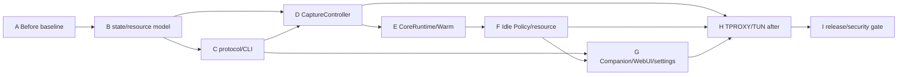

# NetHop Core Warm 与流量接管热切换 TDD 测试开发任务清单

> 状态：执行中（主机确定性阶段已落地；Android 真机阶段待设备证据）
>
> 日期：2026-08-24
>
> 设计依据：[`27-core-warm-capture-hot-switch-refactor-design.md`](./27-core-warm-capture-hot-switch-refactor-design.md)
>
> 调研依据：`refer/Surfing`、`refer/MagicNet-main`、`refer/NetProxy-Magisk-main`、`refer/sing-box-1.14.0-rc.1`
>
> 目标平台：Android arm64 Root 模块、KernelSU/APatch WebUI、可选 Companion APK
>
> 兼容策略：项目处于开发期，允许删除 `service.start/stop` 的旧 toggle 语义、旧状态字段和兼容 wrapper；不保留旧 wire 兼容层。用户行为、代理正确性、反泄漏和可恢复性必须通过 before/after 测试保持正常。

## 执行记录

截至当前工作树，已完成并验证：

- B001-B005：`nethop-core` 三轴生命周期、确定性 reducer、Idle Policy、资源聚合和恢复成本 DTO；
- C001-C004：`capture.*`、`core.*`、`resource.status` 严格 protocol/CLI 方法与参数校验；
- D001、D003、D005：TPROXY/TUN capture seam、幂等 attach/detach 入口、TUN route owner/generation 边界；
- E003 的停止顺序：核心停止路径复用 daemon 单写路径并先撤销 TPROXY 接管；
- F001：daemon-owned `IdlePolicyController` 及 WARM/IDLE/COLD 决策测试；
- G001、G003、G004：Companion bridge allowlist、WebUI 概览 capture 操作、设置页核心启停入口；
- Rust `nethop-core`、`nethop-protocol`、`nethopctl`、`nethopd` contract tests，Companion JVM tests，WebUI typecheck/unit tests均通过。

尚未宣称完成的任务：D002/D004 的真实 Android 网络 owner/数据面证据、E002/E004 的完整 warm supervisor 接管、F002-F006 的后台 scheduler/采样接线、G002 Quick Settings 真实 capture 入口、G005 polling coordinator，以及 H002-H006 Android 真机/Perfetto/FGS/资源长稳态和恢复成本证据。没有 Android 设备和最终模块构建时，不把这些任务伪装为完成。

## 1. 目标与边界

本清单把 D27 转换为可执行的 TDD 节点。最终目标：

1. sing-box 核心与流量接管生命周期分离；
2. TPROXY 模式支持核心常驻，概览开关只执行 `capture.enable/disable`；
3. 设置页独立控制核心服务启停，不与概览页 capture 开关混淆；
4. 引入 `ACTIVE/WARM/IDLE/COLD` 资源档位；
5. IDLE 只暂停 NetHop 可控的非必要工作，不伪造 sing-box suspend API；
6. 超过资源预算时由 daemon 执行 WARM -> IDLE -> COLD 降级；
7. 记录资源成本和恢复成本，使用 Android 真机证据决定 timeout 和预算；
8. TUN 模式变更继续使用安全 stop/start；TUN 已激活后的 enable/disable 仅切换受控 route attachment，不重启核心；
9. Rust daemon、protocol、CLI、Companion bridge、WebUI、Quick Settings 和测试 fixture 使用同一事实源；
10. 新功能增加后，原有 IPv4/IPv6、DNS、UID 策略、订阅、节点、配置 CAS、回滚、返回键和模块恢复行为正常。

### 1.1 不做的事情

- 不修改 sing-box 私有线程、内部 goroutine 或未定义 signal；
- 不通过 `gc_percent`、Go `memory_limit`、OOM killer 或 DNS cache 参数猜测式优化；
- 不把 Foreground Service 当作 CPU/RSS 优化手段；
- 不让 WebUI timer 直接停止核心；
- 不让 Kotlin/Companion 直接执行 iptables 或 ip route；
- 不在第一阶段实现 TUN `detach/attach`；
- 不用公网真机替代确定性 fake-core/fake-network 测试；
- 不因为新架构而保留第二套旧 toggle、第二套状态源或长期兼容 wrapper。

## 2. TDD 执行规则

每个任务严格遵循：

```text
BASELINE -> RED -> GREEN -> REFACTOR -> VERIFY -> EVIDENCE
```

| 阶段 | 要求 |
|---|---|
| BASELINE | 在当前代码上运行直接相关测试，保存命令、revision、退出码、耗时和行为摘要 |
| RED | 增加一个因目标行为缺失而失败的最小测试；失败原因必须是产品缺口 |
| GREEN | 只实现让当前测试通过的最小生产代码 |
| REFACTOR | 删除重复状态源、旧语义、临时分支和未使用接口 |
| VERIFY | 运行本任务、前驱任务、静态门禁和适用的真机测试 |
| EVIDENCE | 写入脱敏 manifest、测试输出、指标摘要和 before/after 对照 |

有效失败与无效失败：

- `PRODUCT_RED`：目标能力缺失，允许；
- `REGRESSION`：旧功能退化，阻止阶段收口；
- `SECURITY_GATE`：命令、路径、规则 owner、CAS 或敏感信息违反约束，立即阻止；
- `FIXTURE_ERROR`、`TOOLCHAIN_ERROR`、`NETWORK_ERROR`：不算有效 RED，先修复环境或 fixture。

每个任务只完成一个行为边界，不把生产实现、页面消费、真机验收和旧代码删除混成一个节点。

## 3. 测试分层与证据

| 层级 | 范围 | 命令/工具 | 证据目录 |
|---|---|---|---|
| Rust unit | 状态机、Idle Policy、预算统计、timeout、转换决策 | `cargo test -p nethop-core`、相邻 unit | `artifacts/core-warm-tdd/rust-unit/` |
| Rust protocol contract | 新方法、状态 DTO、事件、错误和严格字段 | `cargo test -p nethop-protocol --tests` | `artifacts/core-warm-tdd/protocol/` |
| nethopd contract | core/capture、NetworkController、generation、rollback、事件 | `cargo test -p nethopd --tests` | `artifacts/core-warm-tdd/nethopd/` |
| Android network contract | NetworkPlan、A/B 入口、apply/rollback、owner、IPv4/6 | `cargo test -p nethop-android --tests` | `artifacts/core-warm-tdd/android-network/` |
| CLI contract | `core.*`、`capture.*`、status、wait、JSON 脱敏 | `cargo test -p nethopctl --tests` | `artifacts/core-warm-tdd/cli/` |
| WebUI unit | service/capture/resource presentation、event reducer、operation lock | `npm run test:unit` | `artifacts/core-warm-tdd/webui-unit/` |
| WebUI browser | 概览开关、设置页核心配置、状态对账、隐藏页面 polling | `npm run test:browser` | `artifacts/core-warm-tdd/webui-browser/` |
| WebUI e2e | overview/settings、事件丢失、capture 失败、TUN 边界 | `npm run test:e2e` | `artifacts/core-warm-tdd/webui-e2e/` |
| Companion JVM | Bridge allowlist、状态 DTO、命令超时、Activity 重建 | Gradle JVM tests | `artifacts/core-warm-tdd/companion-jvm/` |
| Android instrumentation | WebView、Quick Settings、进程/Activity 重建、返回键 | Gradle connected tests | `artifacts/core-warm-tdd/companion-device/` |
| 真机数据面 | TPROXY 闭环、直连、IPv6、DNS、UID、网络切换 | ADB + 固定脚本 | `artifacts/core-warm-tdd/device/` |
| 资源长稳态 | 1/5/15/30/60 分钟 RSS/CPU/线程/FD/连接/wakeup | ADB/perfetto/procfs | `artifacts/core-warm-tdd/resource/` |
| 静态/构建 gate | imports、dependency、security、bundle、manifest、旧语义搜索 | `npm run gate`、workspace gates | `artifacts/core-warm-tdd/gates/` |

每个证据目录必须有：

```text
manifest.json
red.txt
green.txt
verify.txt
metrics.json
```

`manifest.json` 至少记录 task ID、设计章节、工作树 revision、命令、退出码、耗时、target、feature set、fixture digest 和 `contains_sensitive_data=false`。不得记录订阅 URL、token、API secret、设备 serial、完整包名列表、Root 路径或完整配置正文。

## 4. Before 基线冻结

### A001 - 当前 service toggle 行为基线

- `depends_on`: none；`parallel_with`: A002,A003,A004,A005。
- `scope`: 冻结 `OverviewView.toggle()` 当前同步行为、`service.start/stop --wait`、全量 overview refresh 和 operation banner。
- `RED`: 基线报告缺少点击到 accepted、点击到最终状态或刷新阶段时失败。
- `GREEN`: 只补 fake host/fixture 和耗时采集，不改生产行为。
- `VERIFY`: 运行 `npm run test:unit`、overview e2e、bridge tests。
- `done`: 形成 before 报告，至少包含 `click_to_accepted_ms`、`click_to_final_ms`、`webui_refresh_ms`。

### A002 - core/capture 现有状态基线

- `depends_on`: none；`parallel_with`: A001,A003,A004,A005。
- `scope`: 冻结 `RuntimeState`、`RunningTproxy`、`RunningTun`、`FailOpenDirect`、`Stopping` 及事件快照。
- `RED`: 未覆盖启动、停止、失败、回滚、TUN cleanup 的 before 序列时失败。
- `GREEN`: 绑定现有 `worker_application_contracts.rs`、`worker_activation_contracts.rs`、`worker_services_contracts.rs` fixture。
- `VERIFY`: `cargo test -p nethopd --tests`。
- `done`: before 状态快照可与 after 逐项对照。

### A003 - 网络接管和安全基线

- `depends_on`: none；`parallel_with`: A001,A002,A004,A005。
- `scope`: 冻结 TPROXY apply/rollback、TUN fallback、IPv4/IPv6、DNS、policy route、UID include/exclude 和 owner 清理。
- `RED`: 缺少任一网络快照或回滚步骤时失败。
- `GREEN`: 使用现有 fake `NetworkCommandBackend`、`RecordingBackend` 和 network contract fixture。
- `VERIFY`: `cargo test -p nethop-android --tests`、`cargo test -p nethopd --test worker_activation_contracts`。
- `done`: 形成无敏感值的 before network manifest。

### A004 - Android/Companion 基线

- `depends_on`: none；`parallel_with`: A001,A002,A003,A005。
- `scope`: 冻结 `BridgeCommandPolicy`、`RootCommandExecutor` 全局锁、WebView bridge、Quick Settings tile、Activity 重建和返回键。
- `RED`: bridge allowlist 或命令响应时序缺失时失败。
- `GREEN`: 只补 JVM/instrumentation fixture 和 manifest 摘要。
- `VERIFY`: Companion JVM tests、instrumentation compile；真机样本只作 before evidence。
- `done`: Android bridge before 行为可复现。

### A005 - 资源和恢复成本基线

- `depends_on`: A001,A002；`parallel_with`: A003,A004。
- `scope`: 记录当前启停路径的 core spawn、health、network apply、RSS、CPU、threads、FD、connections、wakeup 和恢复成本。
- `RED`: 报告缺少设备/ABI/构建/配置/网络条件时失败。
- `GREEN`: 建立采样脚本和脱敏资源 manifest，不修改业务代码。
- `VERIFY`: 同一 Android 设备执行 current path；Windows/浏览器数据不得冒充 Android 数据。
- `done`: before 报告包含 ACTIVE 对照和完整启动路径的 p50/p95。

### A006 - Before gate

- `depends_on`: A001-A005；`parallel_with`: none。
- `scope`: 聚合所有 before fixture、指标和安全 canary。
- `RED`: 任一 before 证据缺失、敏感字段或命令不可复现时失败。
- `GREEN`: 只实现 gate wiring 和 evidence validator。
- `VERIFY`: 单一命令运行 before 测试，不改生产代码。
- `done`: A006 通过后才允许删除旧 service toggle 语义。

## 5. 阶段 B：纯状态与资源策略模型

### B001 - Core/Capture/Resource 三轴状态

- `depends_on`: A006；`parallel_with`: B002,B003。
- `scope`: 定义 `core_state`、`capture_state`、`resource_state` 严格枚举和组合合法性。
- `RED`: 测试必须拒绝 `core_stopped + capture_enabled`、`core_starting + capture_enabled`、`core_failed + capture_enabled`。
- `GREEN`: 在 `nethop-core` 增加最小 typed model 和转换表。
- `REFACTOR`: 删除生产代码中的重复字符串和单一布尔推导。
- `VERIFY`: round-trip serde、非法组合、事件 DTO tests。
- `done`: 状态转换表可独立测试，不依赖 Android 或 WebUI。

### B002 - Active/Warm/Idle/Cold transition reducer

- `depends_on`: A006；`parallel_with`: B001,B003。
- `scope`: 实现 `COLD -> WARM -> ACTIVE -> WARM -> IDLE -> COLD` 和失败/恢复路径。
- `RED`: 无 pending operation、活动连接、capture intent 或恢复任务时才能进入 COLD；任一阻断条件存在都必须失败。
- `GREEN`: 实现纯 reducer 和 typed reason。
- `REFACTOR`: 状态转换原因使用枚举，不接受自由文案。
- `VERIFY`: property tests 覆盖重复事件、乱序事件、重复 transition 和 cancellation。
- `done`: reducer 对相同输入确定性输出。

### B003 - Idle Policy decision

- `depends_on`: A006；`parallel_with`: B001,B002。
- `scope`: 设计 `warm_timeout`、`cold_timeout`、active connections、pending operations、network recovery、user intent 和 resource pressure 的决策函数。
- `RED`: 预算超标、连续空闲或用户 demand 的边界测试先失败。
- `GREEN`: 使用 `DEFAULT_TEST_WARM_TIMEOUT`、`DEFAULT_TEST_COLD_TIMEOUT` 等测试默认常量，不把 5/30 分钟命名为产品默认。
- `REFACTOR`: 输入快照与决策结果分离，禁止读取全局时间或 WebUI 状态。
- `VERIFY`: fake clock、边界 duration、重启恢复 deadline、override 白名单测试。
- `done`: decision function 可在无 Android 环境下覆盖全部 Active/Warm/Idle/Cold 规则。

### B004 - Resource sample aggregation

- `depends_on`: A006；`parallel_with`: B001,B002,B003。
- `scope`: 定义 1 秒原始采样、baseline、median、p95、max、upper bound、连续超标窗口和指标脱敏格式。
- `RED`: 单点尖峰、p95 超标、连续 upper bound 超标的判定测试先失败。
- `GREEN`: 实现有界 sample buffer 和确定性聚合器。
- `REFACTOR`: 统一 CPU 时间、RSS、KiB/MiB、wakeup 和 duration 单位。
- `VERIFY`: 乱序/缺失样本、溢出、空窗口、低采样率和长稳态 fixture。
- `done`: 资源预算判断不依赖真实设备采样工具。

### B005 - Resume cost model

- `depends_on`: B001,B002；`parallel_with`: B004。
- `scope`: 定义 `resume_accepted_ms`、`resume_core_ready_ms`、`resume_capture_enabled_ms`、`resume_first_successful_tcp_ms`。
- `RED`: WARM/IDLE/COLD 三条恢复路径无法区分时失败。
- `GREEN`: 增加 typed timing model 和报告格式。
- `REFACTOR`: 与 before/after manifest 共用 monotonic timing schema。
- `VERIFY`: fake core/network 的恢复阶段缺失、重复、乱序测试。
- `done`: 可比较资源收益与恢复速度，不把进程存活当成 resume 成功。

## 6. 阶段 C：协议、事件和 CLI

### C001 - `capture.*` protocol contract

- `depends_on`: B001；`parallel_with`: C002,C003。
- `scope`: 新增 `capture.enable/disable/status` request/response，包含 expected generations、operation id、completed、core/capture/resource state。
- `RED`: 旧 `service.start/stop` toggle shape 被新 contract 测试拒绝；未知字段、错误 generation、非法 wait 被拒绝。
- `GREEN`: 更新 `nethop-protocol` typed enums/params/response。
- `REFACTOR`: 删除旧 toggle 专用结构和宽松 JSON fallback。
- `VERIFY`: `cargo test -p nethop-protocol --tests`。
- `done`: 新协议严格 serde、错误域稳定、无兼容 wrapper。

### C002 - `core.*` protocol contract

- `depends_on`: B001；`parallel_with`: C001,C003。
- `scope`: `core.start/stop/status` 和设置页核心服务配置操作。
- `RED`: 停止核心绕过 capture disable 或允许非法状态时失败。
- `GREEN`: 增加 typed request/response 和依赖关系断言。
- `REFACTOR`: 将 core lifecycle 与 capture lifecycle 的错误域拆开。
- `VERIFY`: protocol fixtures、旧 method negative search。
- `done`: `core.stop => capture.disable -> core.stop` 的协议语义固定。

### C003 - Resource event/status contract

- `depends_on`: B001,B003,B004,B005；`parallel_with`: C001,C002。
- `scope`: `resource_snapshot`、`resource_pressure`、core/capture operation event 和 status resync。
- `RED`: 事件缺 resource_state、metrics unit、generation 或 diagnostic code 时失败。
- `GREEN`: 增加严格 DTO 和 bounded payload。
- `REFACTOR`: event/status 使用同一 parser，删除重复 shape。
- `VERIFY`: duplicate、gap、event loss、status re-query fixture。
- `done`: WebUI/Companion 可只通过 status/event 对账，不依赖固定 sleep。

### C004 - CLI command/parser/build

- `depends_on`: C001,C002,C003；`parallel_with`: none。
- `scope`: nethopctl 生成 `capture.*`、`core.*`、status 参数和 JSON 输出。
- `RED`: 参数、timeout、错误码和敏感输出测试先失败。
- `GREEN`: 更新 parser/build/render 和 command timeout。
- `REFACTOR`: 删除旧 service toggle 的 WebUI-only 参数分支。
- `VERIFY`: `cargo test -p nethopctl --tests`、CLI negative tests。
- `done`: CLI 与 protocol 只有一套命令映射。

## 7. 阶段 D：TPROXY CaptureController

### D001 - CaptureController seam

- `depends_on`: B001,B002,C001；`parallel_with`: D002。
- `scope`: 在 `worker_activation.rs` 与 `nethop-android` 之间建立 `CaptureController` 抽象，不改变旧 activation 行为。
- `RED`: fake controller 无法表达 prepare/enable/disable/verify/rollback 时失败。
- `GREEN`: 最小 trait、prepared capture、receipt 和 typed errors。
- `REFACTOR`: `RuntimeAttachment::Tproxy` 只通过 controller 持有，不在 worker 拼接命令。
- `VERIFY`: 编译、fake controller contract、现有 activation regression。
- `done`: seam 不依赖 WebUI、Kotlin 或 shell。

### D002 - A/B capture plan and owner

- `depends_on`: D001；`parallel_with`: D003。
- `scope`: 为 `NH_OUT_ENTRY`、`NH_PRE_ENTRY` 和 A/B capture generation 建立 owner/generation metadata。
- `RED`: 规则重复、slot 错配、owner 不匹配清理被测试发现并失败。
- `GREEN`: 复用 `NetworkPlanner`、`PlanSlot`、`NetworkExecutor`、`ApplyReceipt`。
- `REFACTOR`: 固定入口替换优先于全链 flush；删除自由链名和自由路径。
- `VERIFY`: `android_network_contracts.rs`、`forwarding_contracts.rs`、owner negative tests。
- `done`: inactive slot 可准备，active entry 可原子切换，失败可恢复旧 slot。

### D003 - Enable/disable idempotency

- `depends_on`: D001,D002；`parallel_with`: D004。
- `scope`: `capture.enable`/`disable` 在 TPROXY 上的幂等、并发锁、重复操作和 cancellation。
- `RED`: 第二次 enable 生成重复规则或 disable 删除其他 owner 时失败。
- `GREEN`: 在 daemon mutation lock 中实现最小操作。
- `REFACTOR`: 统一 `ApplyReceipt` 生命周期和 rollback guard。
- `VERIFY`: fake backend 每一步失败、重复调用、并发调用、kill/restart fixture。
- `done`: enable/disable 不 spawn sing-box，且 verify 通过后才发布终态。

### D004 - TPROXY data-plane verification

- `depends_on`: D002,D003；`parallel_with`: D005。
- `scope`: verify IPv4/IPv6 rule order、policy route、DNS、UID、loopback/core bypass 和 owner snapshot。
- `RED`: 只检查命令返回 0 的假健康测试必须失败。
- `GREEN`: 使用 `NetworkHealthVerifier` 和 bounded snapshot。
- `REFACTOR`: 验证逻辑不读取 WebUI 或解析任意系统全表。
- `VERIFY`: existing forwarding/health contracts、fake snapshots、IPv6 degraded fixture。
- `done`: capture enabled/disabled 均有数据面证据。

### D005 - TUN first-phase boundary

- `depends_on`: D001；`parallel_with`: D002,D003。
- `scope`: 明确 `RuntimeAttachment::Tun` 不支持 detach/attach，拒绝非法 `capture.enable/disable` 热路径。
- `RED`: 测试先证明 TUN detach 被错误接受时失败。
- `GREEN`: 返回稳定 `capture_hot_switch_unsupported_tun`，回退受控 core lifecycle。
- `REFACTOR`: UI/CLI/daemon 使用同一 capability reason。
- `VERIFY`: TUN runner cleanup、fallback、protocol negative tests。
- `done`: TUN 不被伪装成 TPROXY 热切换。

## 8. 阶段 E：CoreRuntime 与 Warm 生命周期

### E001 - CoreRuntime/Attachment 拆分

- `depends_on`: B001,D001；`parallel_with`: E002。
- `scope`: 将 `ActiveRuntime` 拆为 `CoreRuntime`、`CaptureAttachment`、`CaptureOperation`。
- `RED`: core failure 与 capture failure 无法独立报告时失败。
- `GREEN`: 保持旧 activation 功能，新增对象所有权和状态快照。
- `REFACTOR`: stop 顺序固定为 `capture rollback -> core stop`。
- `VERIFY`: worker activation/rollback/fail-open/TUN cleanup regression。
- `done`: 核心进程可存活而 attachment 被撤销。

### E002 - Core warm startup

- `depends_on`: E001,D003,D004；`parallel_with`: E003。
- `scope`: 核心健康后预计算 TPROXY plan，按 `capture.enabled` 进入 ACTIVE 或 WARM。
- `RED`: capture disabled 仍启动核心后立即安装接管，或 capture enable 失败导致 core 被错误杀死时失败。
- `GREEN`: 增加 core_ready + capture_state/resource_state 发布。
- `REFACTOR`: 不在 core health 中隐式执行 capture apply。
- `VERIFY`: fake process、fake network、generation recovery、startup intent fixtures。
- `done`: core warm 与 capture enabled/disabled 分离。

### E003 - Core start/stop protocol integration

- `depends_on`: C002,E001；`parallel_with`: E004。
- `scope`: 设置页核心服务对应 `core.start/stop/status`，停止前自动 disable capture。
- `RED`: core stop 在 capture 未撤销时必须失败。
- `GREEN`: daemon 通过单写锁执行依赖顺序。
- `REFACTOR`: 删除 `service.start/stop` 对概览 toggle 的调用路径。
- `VERIFY`: `worker_application_contracts.rs`、CLI、protocol and failure rollback。
- `done`: 设置页核心生命周期与概览 capture 语义独立。

### E004 - Core crash and recovery

- `depends_on`: E002,E003；`parallel_with`: E005。
- `scope`: core crash、restart budget、capture intent 恢复和旧 generation 清理。
- `RED`: core crash 后遗留 capture 规则或 capture intent 错误恢复时失败。
- `GREEN`: 按已有 restart budget 将 core/capture/resource 状态发布为可诊断结果。
- `REFACTOR`: 不相信旧 PID、旧 TUN 名称或旧 owner marker。
- `VERIFY`: supervisor/worker recovery、resource snapshot、failure event tests。
- `done`: core/capture failure 可分别恢复或 fail-open。

## 9. 阶段 F：Idle Policy 与资源控制

### F001 - Daemon idle timer

- `depends_on`: B003,E002；`parallel_with`: F002,F003。
- `scope`: daemon 维护 warm/cold deadline，不依赖 WebUI timer。
- `RED`: fake clock 下 deadline、活动连接、pending operation、network recovery 和 user intent 边界先失败。
- `GREEN`: 增加单一 `IdlePolicyController`。
- `REFACTOR`: 重启恢复 deadline，避免多个 timer/线程。
- `VERIFY`: fake clock、restart、cancel、concurrent demand tests。
- `done`: timer 只产生 daemon decision，不直接改 iptables。

### F002 - Pause NetHop-owned background work

- `depends_on`: F001；`parallel_with`: F003,F004。
- `scope`: IDLE 停止 WebUI/Companion 高次 polling、订阅更新、rule-set 更新、节点测速和诊断调度。
- `RED`: IDLE 仍产生周期 root command、网络下载或后台测速时失败。
- `GREEN`: 各 scheduler 接受 resource policy/reason。
- `REFACTOR`: 调度器通过统一 policy gate，不在每个页面复制 idle 判断。
- `VERIFY`: scheduler、source update、node benchmark、WebUI visibility tests。
- `done`: IDLE 不制造可由 NetHop 控制的非必要工作。

### F003 - sing-box documented idle options

- `depends_on`: F001；`parallel_with`: F002,F004。
- `scope`: 对 URLTest `idle_timeout`、DNS cache capacity/cache file、连接 idle timeout 做配置 admission 和 fixture。
- `RED`: 不支持字段、错误单位、过小 cache、keepalive 误启用或 WARM/IDLE 语义不一致时失败。
- `GREEN`: 仅使用 sing-box 1.14.0-rc.1 已有公开字段，不修改内部状态。
- `REFACTOR`: 统一默认值、设备 capability 和 schema metadata。
- `VERIFY`: sing-box config check、mapping fixture、DNS/URLTest parser tests。
- `done`: 只用公开配置能力降低可控工作，不承诺暂停核心。

### F004 - Resource pressure decision

- `depends_on`: B004,F001；`parallel_with`: F002,F003。
- `scope`: 连续 p95/upper bound 超标导致 WARM->IDLE、IDLE->COLD，ACTIVE 超标发布 pressure 诊断。
- `RED`: 单点尖峰错误触发、连续超标不降级、设备 override 绕过安全条件时失败。
- `GREEN`: 接入 ResourceAggregator 和 IdlePolicyController。
- `REFACTOR`: override 只覆盖阈值/timeout，不覆盖 owner、rollback、状态合法性。
- `VERIFY`: synthetic samples、pressure event、override negative tests。
- `done`: 资源超标路径确定性、可诊断、可恢复。

### F005 - Resource snapshot and sampling

- `depends_on`: B004,F004；`parallel_with`: F006。
- `scope`: 输出 RSS、CPU time/utilization、threads、FD、connections、DNS entries、rule-set bytes、wakeup、network bytes。
- `RED`: 缺单位、缺 timestamp、单点覆盖窗口或敏感信息时失败。
- `GREEN`: bounded snapshot schema 和 Android sampler。
- `REFACTOR`: 统一 process identity、monotonic/wall clock 和采样窗口。
- `VERIFY`: fake procfs、overflow、missing sample、1 秒采样和脱敏 tests。
- `done`: resource_snapshot 可用于 before/after 和 p95 gate。

### F006 - Resource state event/status

- `depends_on`: F004,F005,C003；`parallel_with`: none。
- `scope`: `resource_state`、`resource_pressure`、budget summary 和降级原因发布。
- `RED`: 事件丢失、乱序、重复和 status re-query 无法收敛时失败。
- `GREEN`: 接入 event state machine 和 `resource.status`。
- `REFACTOR`: WebUI/Companion 不自行计算资源状态。
- `VERIFY`: event gap/resync、bounded payload、status consistency tests。
- `done`: resource state 是 daemon 事实源。

## 10. 阶段 G：CLI、Companion、WebUI 和设置页

### G001 - Companion bridge allowlist

- `depends_on`: C001,C002,C003；`parallel_with`: G002。
- `scope`: `BridgeCommandPolicy` 接受新 `core.*`、`capture.*`、status 命令和严格 args。
- `RED`: legacy toggle、自由 args、未知 resource field、超时和敏感输出测试失败。
- `GREEN`: 更新 Kotlin allowlist、RootOperation 和 response DTO。
- `REFACTOR`: 不增加第二套 capture controller。
- `VERIFY`: `BridgeCommandPolicyTest`、`RootOperationTest`、`RootCommandExecutorTest`。
- `done`: WebUI/Tile 只能通过 daemon command 改状态。

### G002 - Quick Settings shared operation

- `depends_on`: G001,E003；`parallel_with`: G003。
- `scope`: tile 与 WebUI 共享 `core.*`/`capture.*`，不直接执行网络规则。
- `RED`: tile 与 WebUI 并发时重复 apply 或状态覆盖必须失败。
- `GREEN`: 复用 daemon operation id/status。
- `REFACTOR`: 删除 tile 内本地推断和重复 retry。
- `VERIFY`: JVM tile coordinator、instrumentation、daemon single-writer tests。
- `done`: 两个入口共享同一事实源。

### G003 - Overview capture UX

- `depends_on`: C003,G001；`parallel_with`: G004。
- `scope`: 概览开关改用 capture operation，100ms 内反馈，事件/`capture.status` 对账，不全量阻塞 refresh。
- `RED`: 当前 `service.start/stop --wait + refresh()` 路径测试先失败。
- `GREEN`: 更新 OverviewView、service presentation、operation banner 和 event reducer。
- `REFACTOR`: 删除 service toggle fallback、固定 sleep 和重复状态派生。
- `VERIFY`: WebUI unit/browser/e2e、failure rollback、event loss、duplicate click tests。
- `done`: TPROXY enable/disable 不重复 spawn sing-box，TUN 显示受控重启。

### G004 - Settings core/resource controls

- `depends_on`: C002,C003,F006；`parallel_with`: G003。
- `scope`: 设置页增加核心服务、idle policy、warm/cold timeout、core/capture/resource 状态和停止核心确认。
- `RED`: 设置页可直接修改 service bool 但无法保证 capture 先撤销时失败。
- `GREEN`: 使用 `Field + Switch + InputNumber/OptionDropdown + Dialog` 消费 daemon schema/status。
- `REFACTOR`: 不让设置页 timer 停核心，不复制 overview capture operation。
- `VERIFY`: settings browser/e2e、CAS、core stop rollback、resource event loss tests。
- `done`: 设置页控制核心，概览页控制接管，职责和状态互不混淆。

### G005 - WebUI resource-aware polling

- `depends_on`: F002,F006,G003；`parallel_with`: G004。
- `scope`: ACTIVE 正常 metrics/traffic，WARM 降频，IDLE 停止高频 polling，COLD 不请求核心数据。
- `RED`: 页面隐藏、KeepAlive、Activity 重建或事件丢失导致 polling 泄漏时失败。
- `GREEN`: AppShell/runtime policy gate 和统一 polling coordinator。
- `REFACTOR`: 删除各页面自有 idle timer/重复 status query。
- `VERIFY`: browser fake clock、e2e network request count、visibility tests。
- `done`: WebUI 不阻止 capture 状态，也不制造 IDLE 后台活动。

## 11. 阶段 H：前后测试与真机验证

### H001 - After functional regression

- `depends_on`: G003,G004,G005；`parallel_with`: H002,H003。
- `scope`: 验证所有原有业务功能在新状态模型下保持正常。
- `RED`: before/after 对照中任一行为不一致时失败。
- `GREEN`: 只修复真实 regression，不新增兼容 wrapper。
- `REFACTOR`: 清除临时旧路径、旧 fixture 和重复 parser。
- `VERIFY`: Rust workspace tests、WebUI gate、Companion JVM/instrumentation compile。
- `done`: 功能 regression manifest 完整。

### H002 - TPROXY data-plane after

- `depends_on`: D004,E004,G003；`parallel_with`: H001,H003。
- `scope`: 真机验证 IPv4 TCP、UDP DNS/QUIC、IPv6、UID、DNS、核心 bypass、Wi-Fi/蜂窝和其他 VPN 冲突。
- `RED`: 规则 owner、policy route、DNS、IPv6 guard、packet result 或 operation timing 缺失时失败。
- `GREEN`: 修复数据面实现和诊断，不降低安全约束。
- `REFACTOR`: 删除设备专用临时脚本，统一固定脚本和证据 schema。
- `VERIFY`: 同一设备、ABI、sing-box 构建、配置、节点和网络条件的 paired before/after。
- `done`: capture enable/disable 不泄漏，重复切换稳定。

### H003 - TUN boundary after

- `depends_on`: D005,E004,G003；`parallel_with`: H001,H002。
- `scope`: 验证 TUN 仍走 stop/start，关闭顺序、设备回收、路由清理、IPv6 guard 和 UI 文案正确。
- `RED`: TUN 被错误地当作热切换或残留接口/路由时失败。
- `GREEN`: 只补边界实现和明确 diagnostic reason。
- `REFACTOR`: 删除 TUN fake hot-switch path。
- `VERIFY`: tun runner/network cleanup/instrumentation tests。
- `done`: TUN 不影响 TPROXY 热切换 gate，也不被错误宣传为瞬时恢复。

### H004 - Warm/Idle/Cold resource benchmark

- `depends_on`: F005,F006,H001；`parallel_with`: H002,H003。
- `scope`: 同一 Android 真机完成 ACTIVE/WARM/IDLE/COLD 1/5/15/30/60 分钟资源采样。
- `RED`: 缺 baseline、median、p95、max、upper bound、设备条件或敏感字段时失败。
- `GREEN`: 采集资源报告，不先调整 sing-box GC/OOM/DNS 参数。
- `REFACTOR`: 统一资源/电量/采样单位和进程归属。
- `VERIFY`: RSS、CPU、threads、FD、connections、DNS entries、rule-set bytes、wakeup、network bytes；报告 IDLE 相比 WARM 的下降。
- `done`: 资源预算和超标降级证据完成。

### H005 - Resume cost benchmark

- `depends_on`: B005,H004；`parallel_with`: H002,H003。
- `scope`: 测量 WARM->ACTIVE、IDLE->ACTIVE、COLD->ACTIVE。
- `RED`: 缺 `resume_accepted_ms`、`resume_core_ready_ms`、`resume_capture_enabled_ms` 或 first successful TCP 时失败。
- `GREEN`: 采集 paired before/after 数据，不改变状态机只为降低数字。
- `REFACTOR`: 报告同时呈现资源成本和恢复成本。
- `VERIFY`: 至少 WARM/IDLE/COLD 各 30 次，报告 median/p95/upper bound。
- `done`: timeout 与 resource budget 有数据依据。

### H006 - Android process/FGS lifecycle

- `depends_on`: G001,G002,H004；`parallel_with`: H005。
- `scope`: Android 目标版本验证屏幕熄灭、后台、Activity 重建、Companion 进程重建、tile 使用和 FGS 选择。
- `RED`: 进程重建后状态丢失、重复规则、通知/资源成本未记录时失败。
- `GREEN`: 只补 daemon status resync、Android lifecycle 适配和证据采集。
- `REFACTOR`: 不把 FGS 当作永久保活保证，不在 WebUI 复制生命周期逻辑。
- `VERIFY`: instrumentation + 真机 paired evidence。
- `done`: Android 进程边界和 daemon 状态事实源一致。

### H007 - Release-quality and security gate

- `depends_on`: H001-H006；`parallel_with`: none。
- `scope`: 聚合 Rust、CLI、Android、WebUI、真机、资源和敏感数据 gate。
- `RED`: 旧 method、旧 selector、自由命令、自由路径、未登记 rule、敏感输出、资源超标或恢复失败时 gate 失败。
- `GREEN`: 只补 gate wiring、静态搜索和 manifest validator。
- `REFACTOR`: 删除剩余旧 service toggle、旧 runtime bool、旧 fixture 和未使用依赖。
- `VERIFY`: `npm run gate`、workspace tests、Companion tests、paired device reports。
- `done`: H007 是 D28 唯一收口门，不通过不得删除旧路径。

## 12. 资源预算与恢复成本判定

### 12.1 采样规则

每个状态以 1 秒粒度记录原始样本，并在 1、5、15、30、60 分钟窗口计算：

```text
baseline
median
p95
max
upper_bound
```

必须区分：

```text
ACTIVE：真实 TCP/UDP/DNS 业务负载
WARM：capture disabled，无新业务流量
IDLE：idle policy 已应用，无 pending operation
COLD：核心停止、capture owner 已释放
```

### 12.2 指标

```text
core_rss_bytes
core_cpu_user_ms
core_cpu_system_ms
core_cpu_utilization
core_threads
core_open_fds
core_active_connections
core_dns_cache_entries
core_rule_set_bytes
core_wakeup_count
core_network_bytes
```

### 12.3 超标策略

```text
WARM p95/upper bound 超标
  -> 提前进入 IDLE

IDLE 仍超标或发生内存压力
  -> 提前进入 COLD

ACTIVE 超标
  -> 不得静默降级；发布 resource_pressure，保持 capture 安全并进入故障决策
```

设备级/构建级 override 只能覆盖预算阈值和 timeout，不能覆盖 owner、rollback、IPv6/DNS 防泄漏、状态合法性和 COLD 前撤销 capture 的顺序。

### 12.4 恢复成本

```text
resume_accepted_ms
resume_core_ready_ms
resume_capture_enabled_ms
resume_first_successful_tcp_ms
```

必须比较：

```text
WARM -> ACTIVE
IDLE -> ACTIVE
COLD -> ACTIVE
```

最终 timeout 选择遵循资源/速度权衡，不得在没有配对数据时把 5 分钟或 30 分钟固化为产品 SLA。

## 13. 依赖总图



允许并行：

- A001-A005 可在同一 before revision 并行采集，但 A006 串行收口；
- B001-B005 在 A006 后并行；
- C001-C003 可在 B 状态模型完成后并行；
- D002-D005 可在 D001 后按 fake backend 能力并行；
- F002-F005 可在 F001 后并行；
- G003/G004 可在 C003 通过后并行，但都必须消费 daemon 事实源；
- H002-H006 必须使用最终代码和相同设备条件，不能用 host 数字替代。

## 14. 完成定义

D28 全部完成必须满足：

1. A006 before gate 通过且敏感数据清零；
2. Core/Capture/Resource 三轴状态和合法转换有确定性测试；
3. TPROXY CaptureController 支持 prepare/enable/disable/verify/rollback/owner/generation；
4. `capture.enable/disable/status`、`core.start/stop/status`、事件和 CLI 严格契约通过；
5. 核心停止前必然撤销 capture，核心失败不会遗留 capture；
6. TPROXY 重复启用不重新 spawn sing-box，TUN 仍保持 stop/start 边界；
7. 设置页控制核心服务和 Idle Policy，概览页只控制 capture；
8. Quick Settings、Companion 和 WebUI 共用 daemon 单写操作；
9. IDLE 停止 NetHop 可控非必要工作，不伪造 sing-box suspend；
10. Android 真机完成 ACTIVE/WARM/IDLE/COLD 资源采样，包含 baseline/median/p95/max/upper bound；
11. WARM/IDLE/COLD 到 ACTIVE 的恢复成本有 paired before/after 证据；
12. WARM_IDLE_RSS、WARM_IDLE_CPU、threads、FD、connections、wakeup 有设备上限；
13. IDLE 相比 WARM 的资源下降达到登记目标，超标降级逻辑可恢复；
14. IPv4/IPv6/DNS/UID/TPROXY/配置 CAS/订阅/节点/返回键和模块恢复无回归；
15. `npm run gate`、Rust workspace、CLI、Companion、WebUI、真机数据面和资源 gate 全部通过；
16. 未经真机资源数据，不得将核心常驻标为默认完成能力；
17. 没有旧 toggle 兼容 wrapper、第二套网络控制器、自由 shell/path 或绕过 daemon 的规则修改路径。

任务完成不等于 Git 提交或推送完成；提交、推送、设备修改和生产环境操作必须由用户另行明确授权。
